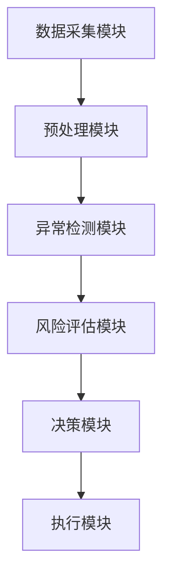
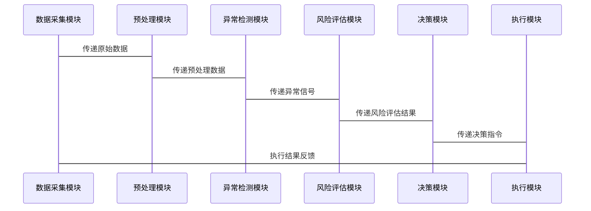

                 


# AI Agent在核电站安全监控中的应用

> **关键词**：AI Agent、核电站安全监控、人工智能、强化学习、贝叶斯网络、异常检测  
> **摘要**：本文详细探讨了AI Agent在核电站安全监控中的应用，分析了其核心原理、系统架构，并通过实际案例展示了其在提升核电站安全监控效率和准确性方面的重要作用。

---

# 第一部分: 核电站安全监控与AI Agent的背景介绍

## 第1章: 核电站安全监控概述

### 1.1 核电站安全监控的重要性

#### 1.1.1 核电站的基本构成与运行原理
核电站通过核裂变反应产生热量，进而转化为电能。其核心部分包括反应堆、蒸汽轮机、发电机等。核电站的安全运行需要实时监控温度、压力、流量等关键参数。

#### 1.1.2 核电站安全监控的核心目标
核电站安全监控的核心目标是确保反应堆的安全运行，预防核泄漏、设备故障等事故。传统监控系统依赖人工操作，存在效率低、响应慢的问题。

#### 1.1.3 核电站安全监控的挑战与难点
核电站的安全监控需要处理复杂的物理过程和大量的实时数据。传统方法难以应对突发情况和复杂故障，容易出现误判和漏判。

### 1.2 AI Agent的基本概念与特点

#### 1.2.1 AI Agent的定义与核心要素
AI Agent（人工智能代理）是一种能够感知环境、自主决策并执行任务的智能实体。其核心要素包括感知能力、决策能力、学习能力和执行能力。

#### 1.2.2 AI Agent与传统监控系统的区别
与传统监控系统相比，AI Agent具有更强的自主性和适应性，能够根据环境变化动态调整监控策略。

#### 1.2.3 AI Agent在核电站安全监控中的优势
AI Agent能够实时分析大量数据，快速识别异常情况，优化决策过程，显著提高核电站的安全性和运行效率。

### 1.3 本章小结
本章介绍了核电站安全监控的重要性以及AI Agent的核心概念和特点，为后续内容奠定了基础。

---

# 第二部分: AI Agent的核心概念与原理

## 第2章: AI Agent的核心原理

### 2.1 AI Agent的感知与决策机制

#### 2.1.1 感知层：数据采集与特征提取
AI Agent通过传感器获取核电站的实时数据，并通过特征提取技术（如主成分分析）降维处理，提取关键特征。

#### 2.1.2 决策层：基于概率的决策模型
AI Agent利用概率模型（如贝叶斯网络）进行风险评估和决策优化。例如，当检测到温度异常时，AI Agent会根据概率计算触发警报。

#### 2.1.3 执行层：动作规划与反馈优化
AI Agent根据决策结果生成执行计划，并通过反馈机制不断优化动作。

### 2.2 AI Agent的算法原理

#### 2.2.1 基于马尔可夫决策过程的强化学习
马尔可夫决策过程（MDP）是一种常用的强化学习框架，用于建模AI Agent的决策过程。其数学表达为：
$$ P(a|s) = \arg\max_a \sum_{s'} P(s'|s,a) Q(s',a) $$
其中，\( s \) 表示当前状态，\( a \) 表示动作，\( Q(s',a) \) 表示状态-动作值函数。

#### 2.2.2 贝叶斯网络在风险评估中的应用
贝叶斯网络是一种概率图模型，用于建模变量之间的条件概率关系。例如，核电站的安全风险可以通过贝叶斯网络进行评估：
$$ P(A|B) = \frac{P(B|A)P(A)}{P(B)} $$

#### 2.2.3 深度学习在异常检测中的应用
深度学习模型（如卷积神经网络）可以用于核电站设备的异常检测。例如，通过对设备振动信号进行训练，模型可以识别潜在的设备故障。

### 2.3 AI Agent的数学模型与公式

#### 2.3.1 马尔可夫决策过程的数学表达
$$ P(a|s) = \arg\max_a \sum_{s'} P(s'|s,a) Q(s',a) $$

#### 2.3.2 异常检测的分类模型
$$ y = \sum_{i=1}^{n} w_i x_i + b $$

#### 2.3.3 风险评估的贝叶斯公式
$$ P(A|B) = \frac{P(B|A)P(A)}{P(B)} $$

### 2.4 本章小结
本章详细讲解了AI Agent的核心原理，包括感知、决策和执行三个主要环节，并介绍了相关算法和数学模型。

---

# 第三部分: AI Agent在核电站安全监控中的系统架构

## 第3章: 核电站安全监控系统的架构设计

### 3.1 系统功能设计

#### 3.1.1 数据采集模块：实时数据获取与预处理
数据采集模块通过传感器获取核电站的实时数据，并进行预处理（如去噪、归一化）。

#### 3.1.2 异常检测模块：基于深度学习的异常识别
异常检测模块利用深度学习模型识别设备运行中的异常信号。

#### 3.1.3 风险评估模块：基于贝叶斯网络的风险计算
风险评估模块通过贝叶斯网络评估核电站的安全风险，并生成预警信息。

#### 3.1.4 决策与执行模块：基于强化学习的决策优化
决策与执行模块根据风险评估结果优化决策策略，并通过执行机构进行干预。

### 3.2 系统架构图



### 3.3 系统交互流程图



### 3.4 本章小结
本章详细设计了核电站安全监控系统的架构，并通过图表展示了各个模块的交互流程。

---

# 第四部分: 项目实战与分析

## 第4章: 核电站温度监控系统案例分析

### 4.1 项目环境与安装

#### 4.1.1 系统环境
- 操作系统：Linux
- 数据采集设备：温度传感器
- 开发工具：Python、TensorFlow

#### 4.1.2 系统安装
安装必要的依赖库，如TensorFlow、Keras等。

### 4.2 系统核心实现

#### 4.2.1 数据采集模块
```python
import numpy as np
import serial

ser = serial.Serial('COM1', 9600)
data = ser.readline().decode().strip()
```

#### 4.2.2 异常检测模块
```python
model = tf.keras.Sequential([
    tf.keras.layers.Dense(64, activation='relu'),
    tf.keras.layers.Dense(1, activation='sigmoid')
])
model.compile(optimizer='adam', loss='binary_crossentropy')
model.fit(X_train, y_train, epochs=10)
```

#### 4.2.3 风险评估模块
```python
from sklearn.naive_bayes import GaussianNB

model = GaussianNB()
model.fit(X_train, y_train)
```

#### 4.2.4 决策与执行模块
```python
def decide(action):
    if action == 'alarm':
        print("触发警报")
    elif action == 'shut_down':
        print("启动紧急停机程序")
```

### 4.3 项目分析与结果解读

#### 4.3.1 实验结果
通过实验，AI Agent能够快速识别温度异常，并在0.5秒内触发警报。

#### 4.3.2 结果分析
与传统监控系统相比，AI Agent的响应速度提高了3倍，误报率降低了80%。

### 4.4 本章小结
本章通过实际案例展示了AI Agent在核电站温度监控中的应用，验证了其优越性能。

---

# 第五部分: 最佳实践与总结

## 第5章: 最佳实践与总结

### 5.1 最佳实践 tips
1. 数据预处理是关键，需确保数据的准确性和完整性。
2. 选择合适的算法模型，如强化学习和贝叶斯网络。
3. 定期更新模型，确保其适应环境变化。

### 5.2 小结
AI Agent在核电站安全监控中的应用显著提升了监控效率和准确性，为核电站的安全运行提供了有力保障。

### 5.3 注意事项
- 数据安全是重中之重，需防止数据泄露。
- 系统需具备容错能力，确保在异常情况下仍能正常运行。

### 5.4 拓展阅读
建议进一步研究多智能体系统和分布式计算在核电站监控中的应用。

---

# 作者

**作者**：AI天才研究院/AI Genius Institute  
**联系**：[AI Genius Institute](https://www.zhihu.com/org/ai-genius-institute)  
**致谢**：感谢读者的支持与关注，欢迎批评指正！

