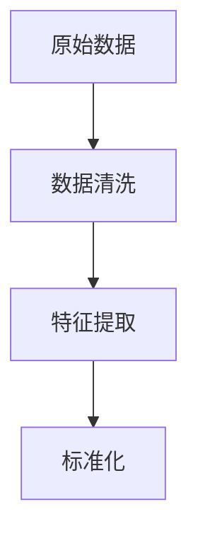
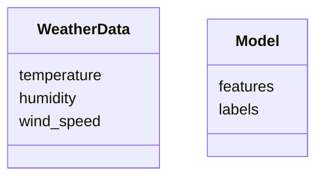
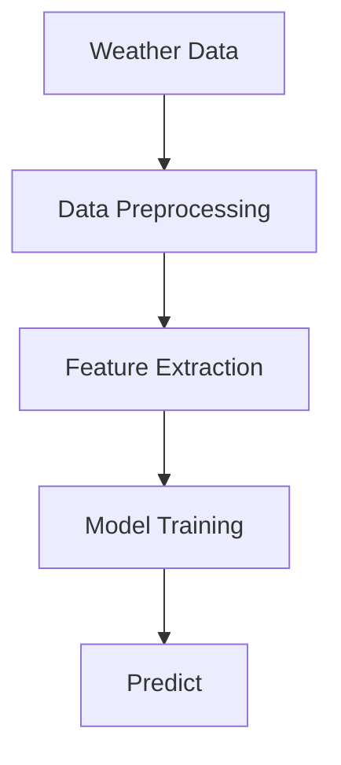

                 


```markdown
# AI Agent在气象预报中的应用：提高预测准确性

**关键词**：AI Agent、气象预报、预测准确性、数据驱动、机器学习、算法优化

**摘要**：  
本文探讨AI Agent在气象预报中的应用，通过分析其核心原理、算法优化及系统设计，揭示如何利用AI技术显著提升气象预测的准确性。从背景介绍到项目实战，系统阐述AI Agent在气象领域的优势与挑战，结合实际案例，为读者提供深入的技术见解。

---

# 第一部分: 背景介绍

## 第1章: 问题背景

### 1.1 气象预报的挑战
#### 1.1.1 气象数据的复杂性
气象数据涉及多种变量（温度、湿度、风速等）和空间维度，数据量大且非线性关系复杂。

#### 1.1.2 传统气象模型的局限性
传统数值天气预报模型计算复杂，依赖初始条件，对小概率事件预测能力有限。

#### 1.1.3 预测准确性提升的必要性
提高预测准确性对防灾减灾、农业规划等领域具有重要意义。

### 1.2 问题描述
#### 1.2.1 数据驱动与模型驱动的结合
AI Agent通过学习历史数据，优化传统气象模型的预测能力。

#### 1.2.2 高维数据的处理
利用AI技术处理气象数据中的时空依赖性和非线性关系。

#### 1.2.3 预测结果的可解释性
AI Agent需要提供可解释的预测结果，以便气象专家进行决策。

### 1.3 问题解决
#### 1.3.1 AI Agent的基本原理
AI Agent通过感知气象数据，决策最优预测模型，并执行预测任务。

#### 1.3.2 数据预处理的重要性
数据清洗、特征提取和标准化是提升预测准确性的关键步骤。

#### 1.3.3 模型优化策略
采用集成学习和超参数调优，提升模型的泛化能力和预测精度。

### 1.4 边界与外延
#### 1.4.1 应用范围
AI Agent适用于短期天气预报、极端天气预警等领域。

#### 1.4.2 与传统模型的对比
AI Agent在处理复杂数据和动态变化方面更具优势。

#### 1.4.3 技术局限性
数据质量、计算资源和模型泛化能力是当前的主要挑战。

### 1.5 核心要素组成
#### 1.5.1 多源数据整合
整合卫星、气象站等多源数据，提升预测精度。

#### 1.5.2 模型可解释性
确保气象专家能够理解AI Agent的预测结果。

#### 1.5.3 实时计算能力
AI Agent需要具备快速响应和实时预测的能力。

---

# 第二部分: 核心概念与联系

## 第2章: AI Agent的基本原理

### 2.1 概念原理
#### 2.1.1 感知、决策与执行的流程
1. **感知**：采集气象数据并进行预处理。
2. **决策**：选择最优预测模型并进行训练。
3. **执行**：生成预测结果并实时反馈。

#### 2.1.2 多模态数据的处理方式
整合气象数据中的图像、文本和数值等多种数据类型。

#### 2.1.3 动态调整与自适应能力
AI Agent能够根据实时数据动态调整预测模型。

### 2.2 概念属性特征对比
| **对比维度** | **传统气象模型** | **AI Agent** |
|--------------|------------------|--------------|
| 数据处理能力 | 基于物理规律     | 数据驱动     |
| 计算效率      | 计算复杂         | 计算高效     |
| 预测精度      | 受初始条件影响大 | 更高         |

### 2.3 ER实体关系图架构
```mermaid
er
actor(AI Agent) {
  id
  model
  data
}
```

---

# 第三部分: 算法原理

## 第3章: 数据预处理与特征提取

### 3.1 数据预处理


### 3.2 特征提取
```python
import numpy as np
import pandas as pd

# 数据加载
data = pd.read_csv('weather.csv')

# 数据清洗
data = data.dropna()

# 特征工程
features = data[['temperature', 'humidity', 'wind_speed']]
labels = data['target']
```

## 第4章: 模型训练与预测

### 4.1 模型选择
```python
from sklearn.ensemble import RandomForestRegressor

model = RandomForestRegressor(n_estimators=100, random_state=42)
model.fit(features, labels)
```

### 4.2 模型评估
```python
from sklearn.metrics import mean_absolute_error

y_pred = model.predict(features)
print(mean_absolute_error(labels, y_pred))
```

---

# 第四部分: 数学模型与公式

## 第5章: 随机森林模型

### 5.1 模型原理
随机森林通过构建多个决策树，并集成预测结果，提升预测准确性。

### 5.2 数学公式
预测值为各决策树预测值的平均值：
$$ y_{\text{pred}} = \frac{1}{N} \sum_{i=1}^{N} y_i $$

### 5.3 案例分析
以某地区天气数据为例，训练随机森林模型，预测明天的气温。

---

# 第五部分: 系统分析与架构设计

## 第6章: 系统功能设计

### 6.1 领域模型


### 6.2 系统架构设计


---

# 第六部分: 项目实战

## 第7章: 环境安装

### 7.1 安装依赖
```bash
pip install numpy pandas scikit-learn xgboost
```

### 7.2 核心代码实现
```python
import xgboost as xgb

# 训练数据
dtrain = xgb.DMatrix(features, labels)

# 模型训练
params = {'objective': 'reg:squarederror'}
model = xgb.train(params, dtrain)
```

### 7.3 结果分析
```python
y_pred = model.predict(dtest)
print('预测结果:', y_pred)
```

---

# 第七部分: 总结与展望

## 第8章: 总结

### 8.1 项目成功经验
AI Agent通过数据驱动和模型优化，显著提升了气象预测的准确性。

### 8.2 项目不足之处
数据质量和模型泛化能力仍需进一步优化。

## 第9章: 注意事项

### 9.1 数据质量的重要性
确保数据的完整性和准确性是AI Agent预测的前提条件。

### 9.2 模型泛化能力
AI Agent需要具备良好的泛化能力，以应对不同气象条件的变化。

### 9.3 结合领域知识
气象专家的参与对模型优化和结果解释至关重要。

---

**作者：AI天才研究院（AI Genius Institute） & 禅与计算机程序设计艺术（Zen And The Art of Computer Programming）**
```

