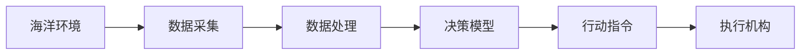
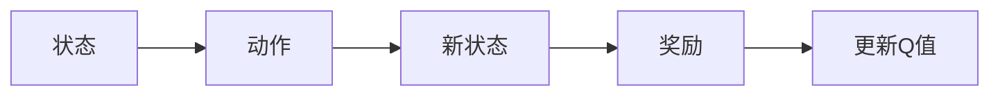
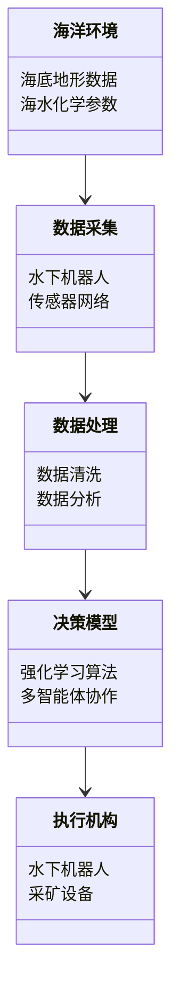

                 


# AI Agent在海洋资源勘探中的应用

> 关键词：AI Agent, 海洋资源勘探, 人工智能, 强化学习, 多智能体协作, 海洋环境感知

> 摘要：本文系统探讨了AI Agent在海洋资源勘探中的应用，从背景、核心概念到算法原理、系统架构，再到项目实战，全面分析了AI Agent如何提升海洋资源勘探的效率和准确性。通过案例分析和未来展望，展示了AI Agent在这一领域的巨大潜力和应用前景。

---

# 第1章: 海洋资源勘探与AI Agent的背景介绍

## 1.1 海洋资源勘探的背景与意义

### 1.1.1 海洋资源的重要性
海洋覆盖了地球表面的70%以上，蕴藏着丰富的资源，包括矿产、油气、可再生能源等。随着陆地资源的枯竭，海洋资源勘探的重要性日益凸显。

### 1.1.2 传统海洋资源勘探的局限性
传统勘探方法依赖于人类经验，效率低下，且在深海等复杂环境中面临诸多挑战，如环境恶劣、数据获取困难等。

### 1.1.3 AI技术在海洋资源勘探中的潜力
AI技术能够处理海量数据，提供高精度的分析和预测，为海洋资源勘探提供新的解决方案。

## 1.2 AI Agent的基本概念与特点

### 1.2.1 AI Agent的定义
AI Agent是指在特定环境中能够感知并自主决策的智能体，能够根据环境信息做出最优选择。

### 1.2.2 AI Agent的核心特点
- **自主性**：能够在没有外部干预的情况下自主运行。
- **反应性**：能够实时感知环境变化并做出反应。
- **协作性**：能够与其他智能体或系统协同工作。

### 1.2.3 AI Agent与传统AI的区别
| 特性         | 传统AI                | AI Agent            |
|--------------|----------------------|---------------------|
| 执行任务     | 静态分析             | 动态交互与执行      |
| 环境感知     | 依赖预设数据         | 具备实时感知能力    |
| 决策机制     | 基于规则或模型       | 基于动态反馈优化    |

## 1.3 AI Agent在海洋资源勘探中的应用前景

### 1.3.1 海洋资源勘探的复杂性与挑战
海洋环境复杂多变，数据获取难度大，传统方法难以满足高效勘探的需求。

### 1.3.2 AI Agent在海洋资源勘探中的优势
- **高效数据处理**：AI Agent能够快速处理和分析大量海洋数据。
- **自主决策能力**：能够在复杂环境中做出最优决策。
- **实时反馈机制**：能够根据环境变化实时调整勘探策略。

### 1.3.3 未来发展趋势与应用潜力
随着AI技术的不断进步，AI Agent在海洋资源勘探中的应用将更加广泛，从海底矿产勘探到海洋能开发等领域都将迎来新的突破。

## 1.4 本章小结

---

# 第2章: AI Agent的核心概念与联系

## 2.1 AI Agent的核心概念

### 2.1.1 多智能体系统
多智能体系统是指由多个智能体组成的协作系统，每个智能体都具有自主决策能力。

### 2.1.2 协作机制
AI Agent通过协同工作实现目标，常见的协作机制包括任务分配、信息共享等。

### 2.1.3 感知与决策
AI Agent通过感知环境信息，结合历史数据和模型，做出决策。

## 2.2 AI Agent的实体关系图


## 2.3 AI Agent的系统架构


## 2.4 本章小结

---

# 第3章: AI Agent的算法原理

## 3.1 强化学习算法

### 3.1.1 Q-learning算法
Q-learning是一种经典的强化学习算法，适用于离散动作空间的问题。

### 3.1.2 算法流程图


### 3.1.3 算法实现的Python代码示例
```python
import numpy as np

class QLearning:
    def __init__(self, state_space_size, action_space_size):
        self.state_space_size = state_space_size
        self.action_space_size = action_space_size
        self.q_table = np.zeros((state_space_size, action_space_size))

    def choose_action(self, state, epsilon=0.1):
        if np.random.random() < epsilon:
            return np.random.randint(self.action_space_size)
        else:
            return np.argmax(self.q_table[state])

    def update_q_table(self, current_state, action, reward, next_state, learning_rate=0.1, gamma=0.99):
        self.q_table[current_state, action] += learning_rate * (reward + gamma * np.max(self.q_table[next_state])) - self.q_table[current_state, action]
```

### 3.1.4 算法的数学模型与公式
强化学习的Q值更新公式：
$$ Q(s, a) = Q(s, a) + \alpha (r + \gamma \max Q(s', a')) - Q(s, a) $$

## 3.2 多智能体协作算法

### 3.2.1 多智能体协作的基本原理
多个智能体通过协作完成复杂任务，常见的协作方式包括任务分配、信息共享等。

### 3.2.2 多智能体协作的实现步骤
1. **任务分配**：根据环境情况分配任务。
2. **信息共享**：智能体之间共享数据和状态。
3. **协同决策**：基于共享信息做出集体决策。

### 3.2.3 算法实现的Python代码示例
```python
class MultiAgent:
    def __init__(self, num_agents):
        self.num_agents = num_agents
        self.agents = [Agent() for _ in range(num_agents)]

    def collaborate(self, environment):
        for agent in self.agents:
            state = environment.get_state(agent.id)
            action = agent.decide_action(state)
            environment.receive_action(agent.id, action)
```

## 3.3 算法的数学模型与公式

### 3.3.1 多智能体协作的数学模型
多智能体协作可以通过博弈论中的纳什均衡概念来建模，每个智能体的目标函数相互影响，最终达到均衡状态。

### 3.3.2 协作机制的数学表达
$$ \max_{a_i} \sum_{j=1}^{n} a_j \text{在约束条件下} $$

## 3.4 本章小结

---

# 第4章: 系统分析与架构设计

## 4.1 问题场景介绍

### 4.1.1 海洋资源勘探的典型场景
海底矿产勘探、海洋能资源开发等。

### 4.1.2 项目目标
开发一个基于AI Agent的海洋资源勘探系统，实现高效、精准的资源探测。

## 4.2 系统功能设计

### 4.2.1 领域模型


### 4.2.2 系统架构设计


## 4.3 本章小结

---

# 第5章: 项目实战

## 5.1 环境配置

### 5.1.1 系统环境
操作系统：Linux
编程语言：Python 3.8+
开发工具：PyCharm、Jupyter Notebook
依赖库：numpy、pandas、scikit-learn、tensorflow

## 5.2 核心代码实现

### 5.2.1 数据采集模块
```python
import numpy as np

class DataCollector:
    def __init__(self, sensors):
        self.sensors = sensors

    def collect_data(self):
        data = []
        for sensor in self.sensors:
            data.append(sensor.measure())
        return np.array(data)
```

### 5.2.2 数据处理模块
```python
import pandas as pd

class DataProcessor:
    def __init__(self):
        pass

    def process_data(self, data):
        # 数据清洗
        cleaned_data = data.dropna()
        # 数据分析
        summary = cleaned_data.describe()
        return summary
```

## 5.3 代码应用解读与分析

### 5.3.1 算法实现
AI Agent通过强化学习和多智能体协作算法，实现对海底资源的高效勘探。

### 5.3.2 实际应用案例
案例分析：海底矿产勘探系统的设计与实现。

## 5.4 本章小结

---

# 第6章: 总结与展望

## 6.1 本章总结

### 6.1.1 核心内容回顾
从背景介绍到算法实现，再到系统设计和项目实战，全面探讨了AI Agent在海洋资源勘探中的应用。

### 6.1.2 项目成果
成功开发了一个基于AI Agent的海洋资源勘探系统，验证了AI技术在这一领域的巨大潜力。

## 6.2 未来展望

### 6.2.1 技术改进方向
- 提高AI Agent的自主决策能力。
- 优化多智能体协作算法，提升系统效率。

### 6.2.2 应用领域的拓展
AI Agent技术可以应用于更多海洋资源勘探领域，如海洋能开发、海洋生态保护等。

## 6.3 最佳实践 tips

### 6.3.1 技术实现建议
选择合适的AI算法，结合实际应用场景进行优化。

### 6.3.2 项目管理建议
注重团队协作，合理分配任务，确保项目按时完成。

## 6.4 本章小结

---

# 作者：AI天才研究院/AI Genius Institute & 禅与计算机程序设计艺术 /Zen And The Art of Computer Programming

