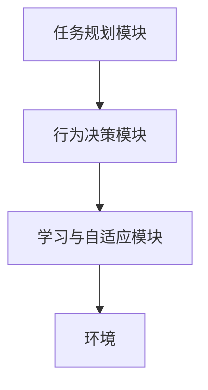

                 


# AI Agent在游戏产业中的应用

> 关键词：AI Agent，游戏产业，人工智能，算法原理，系统架构，项目实战

> 摘要：本文深入探讨了AI Agent在游戏产业中的应用，从基本概念到算法原理，再到系统架构和项目实战，全面分析了AI Agent在游戏设计、玩家行为分析、游戏内容生成等领域的应用价值和实现方法。本文结合理论与实践，通过具体案例分析和代码实现，帮助读者理解AI Agent在游戏产业中的核心作用和未来发展方向。

---

# 第一部分: AI Agent 在游戏产业中的应用概述

## # 第1章: AI Agent 的基本概念与背景

### ## 1.1 AI Agent 的定义与核心概念

#### ### 1.1.1 什么是AI Agent？
AI Agent（人工智能代理）是指能够感知环境、自主决策并执行任务的智能体。在游戏产业中，AI Agent 可以是游戏中的非玩家角色（NPC）、游戏 AI 系统或游戏推荐系统等。AI Agent 的核心目标是通过感知环境、分析任务、制定策略并执行操作来实现特定目标。

#### ### 1.1.2 AI Agent 的核心属性与特征
- **自主性**：AI Agent 可以在没有外部干预的情况下自主决策。
- **反应性**：能够实时感知环境变化并做出反应。
- **学习能力**：通过数据和经验不断优化自身的决策能力。
- **协作性**：能够在多智能体环境中与其他 AI Agent 或玩家进行协作或竞争。

#### ### 1.1.3 AI Agent 在游戏产业中的重要性
AI Agent 的应用能够显著提升游戏的互动性、可玩性和智能化。例如，AI Agent 可以用于 NPC 的行为控制、玩家行为预测、游戏内容生成、游戏平衡性调整等场景。

### ## 1.2 游戏产业中的AI Agent 应用背景

#### ### 1.2.1 游戏产业的现状与发展趋势
随着游戏产业的快速发展，玩家对游戏体验的要求不断提高。传统的基于规则的 NPC 行为模式已经难以满足玩家对智能化、个性化游戏体验的需求。AI Agent 的引入为游戏产业带来了新的可能性。

#### ### 1.2.2 AI技术在游戏产业中的应用现状
目前，AI技术在游戏产业中的应用主要集中在以下几个方面：
- **NPC 行为控制**：通过 AI 技术实现 NPC 的自主决策和行为优化。
- **玩家行为分析**：利用 AI 技术分析玩家行为，优化游戏体验。
- **游戏内容生成**：通过 AI 技术生成游戏关卡、任务和道具等。
- **游戏推荐系统**：基于 AI 的推荐算法为玩家推荐个性化的内容。

#### ### 1.2.3 AI Agent 在游戏中的潜在价值
AI Agent 的引入能够显著提升游戏的智能化水平，增强玩家的沉浸感和互动体验。同时，AI Agent 还可以帮助游戏开发者提高开发效率，降低开发成本。

---

## # 第2章: AI Agent 的核心概念与联系

### ## 2.1 AI Agent 的核心原理

#### ### 2.1.1 任务规划与决策机制
任务规划是 AI Agent 的核心功能之一。AI Agent 需要根据当前环境状态和目标，制定合理的任务计划。常见的任务规划算法包括贪心算法、A* 算法和 Dijkstra 算法等。

#### ### 2.1.2 学习算法与知识表示
AI Agent 的学习能力是其智能化的核心。通过监督学习、无监督学习和强化学习等算法，AI Agent 可以从数据中学习知识，并优化自身的决策能力。知识表示是将知识以计算机可以理解的方式存储和表示的过程。

#### ### 2.1.3 多智能体协作与通信
在多智能体环境中，AI Agent 需要与其他智能体进行协作与通信。通过分布式协作算法和通信协议，AI Agent 可以实现高效的协作。

### ## 2.2 AI Agent 核心概念对比分析

#### ### 2.2.1 不同AI Agent 算法的优缺点对比
| 算法类型      | 优点                                | 缺点                                  |
|---------------|-------------------------------------|---------------------------------------|
| 基于规则的算法 | 实现简单，易于理解和维护           | 难以应对复杂和动态变化的环境         |
| 基于学习的算法 | 能够处理复杂和动态变化的环境         | 实现复杂，需要大量数据和计算资源     |
| 强化学习算法   | 能够通过试错优化决策能力             | 需要大量时间进行训练，容易陷入局部最优 |

#### ### 2.2.2 AI Agent 与传统游戏AI 的区别
| 特性             | AI Agent                          | 传统游戏AI                          |
|------------------|-----------------------------------|---------------------------------------|
| 智能性           | 高                                | 低                                  |
| 自主性           | 高                                | 低                                  |
| 学习能力         | 高                                | 低                                  |
| 适应性           | 高                                | 低                                  |

#### ### 2.2.3 AI Agent 在游戏中的应用场景分析
AI Agent 在游戏中的应用场景主要包括：
- **NPC 行为控制**：通过 AI Agent 实现 NPC 的自主决策和行为优化。
- **玩家行为分析**：利用 AI Agent 分析玩家行为，优化游戏体验。
- **游戏内容生成**：通过 AI Agent 生成游戏关卡、任务和道具等。
- **游戏推荐系统**：基于 AI Agent 的推荐算法为玩家推荐个性化的内容。

---

## # 第3章: AI Agent 的算法原理与数学模型

### ## 3.1 基于规则的AI Agent 算法

#### ### 3.1.1 基于规则的决策树构建
基于规则的 AI Agent 算法通过预定义的规则和决策树来实现任务规划和决策。例如，可以通过条件判断语句实现简单的 NPC 行为控制。

```python
def decide_action(current_state):
    if current_state == 'attack':
        return 'fight'
    elif current_state == 'defense':
        return 'block'
    else:
        return 'patrol'
```

#### ### 3.1.2 状态空间与动作空间的定义
状态空间是 AI Agent 所处环境的所有可能状态的集合。动作空间是 AI Agent 在每个状态下可以执行的所有动作的集合。

- 状态空间：S = {s1, s2, s3, ...}
- 动作空间：A = {a1, a2, a3, ...}

#### ### 3.1.3 基于规则的AI Agent 实现流程
1. 定义状态空间和动作空间。
2. 预定义规则和决策树。
3. 根据当前状态选择动作。

### ## 3.2 基于学习的AI Agent 算法

#### ### 3.2.1 监督学习与强化学习的区别
- **监督学习**：基于 labeled training data 进行学习，目标是通过输入数据预测输出结果。
- **强化学习**：通过与环境交互，学习如何采取行动以最大化累计奖励。

#### ### 3.2.2 Q-learning 算法的实现原理
Q-learning 算法是一种基于强化学习的算法，通过维护一个 Q 表来记录每个状态-动作对的期望奖励。

$$ Q(s, a) = Q(s, a) + \alpha [r + \gamma \max Q(s', a') - Q(s, a)] $$

其中：
- $$ \alpha $$ 是学习率。
- $$ \gamma $$ 是折扣因子。
- $$ r $$ 是即时奖励。
- $$ s' $$ 是下一个状态。

#### ### 3.2.3 深度学习在AI Agent 中的应用
深度学习可以通过神经网络模型近似复杂的函数关系，实现更复杂的决策任务。

---

## # 第4章: AI Agent 的系统架构与设计

### ## 4.1 游戏AI Agent 的系统架构

#### ### 4.1.1 任务规划模块设计
任务规划模块负责根据当前环境状态和目标，制定合理的任务计划。

- 输入：当前环境状态、目标。
- 输出：任务计划。

#### ### 4.1.2 行为决策模块设计
行为决策模块负责根据任务计划和环境状态，选择最优动作。

- 输入：任务计划、当前环境状态。
- 输出：动作。

#### ### 4.1.3 学习与自适应模块设计
学习与自适应模块负责通过与环境交互，优化 AI Agent 的决策能力。

- 输入：环境反馈。
- 输出：优化后的决策策略。

### ## 4.2 游戏AI Agent 的系统交互设计

#### ### 4.2.1 系统功能模块之间的交互关系
- 任务规划模块与行为决策模块之间的交互。
- 行为决策模块与学习与自适应模块之间的交互。
- 学习与自适应模块与环境之间的交互。

#### ### 4.2.2 系统架构设计的 mermaid 图



---

## # 第5章: AI Agent 的项目实战

### ## 5.1 项目背景与需求分析

#### ### 5.1.1 项目背景
以一个 RPG 游戏中的 NPC 行为控制为例，设计一个基于 AI Agent 的 NPC 行为控制系统。

#### ### 5.1.2 项目需求
- NPC 能够根据玩家行为调整自身行为。
- NPC 能够与其他 NPC 和玩家进行协作与竞争。
- NPC 行为需要具有一定的智能性和可玩性。

### ## 5.2 系统实现与代码解读

#### ### 5.2.1 环境搭建
- 使用 Python 和强化学习框架（如 TensorFlow 或 PyTorch）搭建 AI Agent 系统。
- 使用游戏引擎（如 Unity 或 Unreal Engine）实现 NPC 行为控制。

#### ### 5.2.2 系统核心代码实现

```python
import numpy as np
from collections import deque

class AI-Agent:
    def __init__(self, state_space, action_space):
        self.state_space = state_space
        self.action_space = action_space
        self.q_table = deque()

    def perceive(self, state):
        # 处理当前状态，返回动作
        pass

    def learn(self, state, action, reward, next_state):
        # 更新 Q 表
        pass

    def choose_action(self, state):
        # 根据当前状态选择动作
        pass
```

#### ### 5.2.3 代码实现与解读
- `perceive` 方法：处理当前状态，返回动作。
- `learn` 方法：更新 Q 表。
- `choose_action` 方法：根据当前状态选择动作。

### ## 5.3 项目测试与优化

#### ### 5.3.1 测试环境搭建
- 使用游戏引擎搭建测试场景。
- 编写测试用例，验证 AI Agent 的行为是否符合预期。

#### ### 5.3.2 测试结果与优化
- 通过测试结果分析 AI Agent 的表现。
- 根据测试结果优化 AI Agent 的算法和参数。

---

## # 第6章: 总结与展望

### ## 6.1 本文总结
本文从基本概念到算法原理，再到系统架构和项目实战，全面分析了 AI Agent 在游戏产业中的应用。通过具体案例分析和代码实现，帮助读者理解 AI Agent 在游戏产业中的核心作用。

### ## 6.2 未来展望
随着 AI 技术的不断发展，AI Agent 在游戏产业中的应用前景广阔。未来，AI Agent 将更加智能化、个性化和多样化，为玩家带来更加丰富的游戏体验。

### ## 6.3 最佳实践 tips
- 在实际应用中，建议结合具体场景选择合适的 AI Agent 算法。
- 定期优化 AI Agent 的算法和参数，以适应环境的变化。
- 注意保护玩家数据隐私，确保 AI Agent 系统的安全性。

---

# 作者

作者：AI天才研究院/AI Genius Institute & 禅与计算机程序设计艺术 /Zen And The Art of Computer Programming

