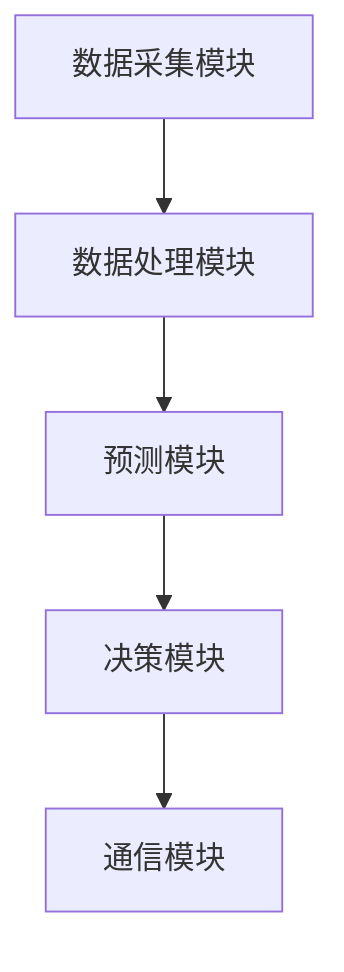

                 


# AI Agent在灾害预防与应急响应中的作用

---

## 关键词：
- AI Agent
- 灾害预防
- 应急响应
- 人工智能
- 多智能体系统
- 灾害风险管理

---

## 摘要：
本文探讨了AI Agent在灾害预防与应急响应中的应用及其重要作用。通过分析AI Agent的核心原理、算法、系统架构及实际案例，详细阐述了AI Agent如何通过智能决策、数据驱动分析和实时响应提升灾害预防和应急响应的效率与效果。文章还结合了最佳实践和未来趋势，为读者提供全面的技术洞察。

---

## 第一部分: AI Agent与灾害预防概述

### 第1章: AI Agent的基本概念与应用

#### 1.1 AI Agent的定义与特点
- **定义**：AI Agent（人工智能代理）是一种能够感知环境、自主决策并执行任务的智能系统。
- **特点**：
  - 智能性：基于数据和模型进行决策。
  - 自主性：无需人工干预，自主完成任务。
  - 反应性：实时感知环境变化并做出反应。
  - 学习能力：通过经验优化决策策略。

#### 1.2 灾害预防的背景与挑战
- **灾害种类**：地震、洪水、火灾、台风等。
- **传统方法的局限性**：
  - 数据分散，难以实时分析。
  - 人工判断的延迟和误差。
  - 预测模型的准确性不足。

#### 1.3 AI Agent在灾害预防中的作用
- **实时监测**：通过传感器数据实时感知环境变化。
- **智能预测**：利用机器学习模型预测灾害风险。
- **决策支持**：为人类提供优化的应对策略。

---

## 第二部分: AI Agent的核心原理与技术

### 第2章: AI Agent的核心原理

#### 2.1 多智能体系统（Multi-Agent System）
- **定义**：由多个智能体组成的协作系统。
- **特点**：
  - 分布式计算：每个智能体负责特定任务。
  - 协作性：智能体之间通过通信协作完成复杂任务。
  - 可扩展性：系统可扩展以应对更大规模的灾害。

#### 2.2 知识表示与推理
- **知识表示**：将灾害相关知识表示为符号、规则或概率模型。
- **推理机制**：通过逻辑推理或概率推断得出结论。
- **应用**：分析灾害数据，推断潜在风险。

#### 2.3 行为决策与规划
- **决策算法**：基于当前状态和目标选择最优行动。
- **规划技术**：生成行动计划并执行。

---

## 第三部分: AI Agent在灾害预防中的算法原理

### 第3章: 灾害风险评估算法

#### 3.1 基于机器学习的灾害预测模型
- **算法选择**：随机森林、支持向量机（SVM）。
- **流程**：
  1. 数据收集：历史灾害数据、气象数据、地理信息。
  2. 数据预处理：清洗、特征提取。
  3. 模型训练：训练机器学习模型。
  4. 模型评估：验证准确率、召回率。
- **案例**：利用随机森林预测地震风险。

#### 3.2 基于时间序列分析的灾害预测
- **算法选择**：ARIMA、LSTM。
- **流程**：
  1. 数据收集：时间序列数据。
  2. 数据预处理：平稳化、差分。
  3. 模型训练：训练时间序列模型。
  4. 预测与校验：预测未来灾害概率。
- **案例**：利用LSTM预测洪水概率。

---

## 第四部分: 系统分析与架构设计

### 第4章: 系统架构设计

#### 4.1 项目场景介绍
- **目标**：构建一个基于AI Agent的灾害预防系统。
- **用户需求**：
  - 实时监测：快速捕捉灾害前兆。
  - 智能预警：提前通知相关部门和公众。
  - 应急决策：辅助制定最优应对方案。

#### 4.2 系统功能设计
- **功能模块**：
  - 数据采集模块：收集灾害相关数据。
  - 数据处理模块：清洗、转换数据。
  - 预测模块：运行机器学习模型进行预测。
  - 决策模块：生成应对策略。
  - 通信模块：与其他智能体或系统交互。

#### 4.3 系统架构图


#### 4.4 系统接口设计
- **输入接口**：传感器数据接口。
- **输出接口**：预警通知接口。
- **交互接口**：用户操作界面。

---

## 第五部分: 项目实战

### 第5章: 灾害预防系统实战

#### 5.1 环境安装
- **工具**：Python、TensorFlow、Scikit-learn。
- **步骤**：
  1. 安装Python。
  2. 安装所需的机器学习库。
  3. 配置开发环境（如Jupyter Notebook）。

#### 5.2 核心代码实现
- **数据预处理代码**：
  ```python
  import pandas as pd
  # 读取数据
  data = pd.read_csv('disaster_data.csv')
  # 数据清洗
  data.dropna(inplace=True)
  # 特征提取
  features = data[['temperature', 'humidity', 'pressure']]
  ```

- **机器学习模型实现**：
  ```python
  from sklearn.ensemble import RandomForestClassifier
  # 训练模型
  model = RandomForestClassifier()
  model.fit(features, data['risk_level'])
  ```

#### 5.3 案例分析
- **案例**：预测某地区地震风险。
- **结果**：模型预测地震概率为85%，建议立即疏散人员。

---

## 第六部分: 最佳实践与未来趋势

### 第6章: 最佳实践与总结

#### 6.1 最佳实践
- **数据质量**：确保数据的准确性和完整性。
- **模型优化**：定期更新模型，避免过时。
- **系统维护**：定期检查系统，确保正常运行。

#### 6.2 小结
- AI Agent在灾害预防与应急响应中的应用前景广阔。
- 通过智能决策和实时响应，显著提升灾害应对能力。

#### 6.3 未来趋势
- **智能化**：AI Agent将更加智能化，具备更强的学习和决策能力。
- **协同化**：多智能体协同将更加广泛，提升整体效率。
- **普及化**：AI Agent技术将逐步普及，成为灾害预防的标准工具。

---

## 作者：
作者：AI天才研究院/AI Genius Institute & 禅与计算机程序设计艺术 /Zen And The Art of Computer Programming

