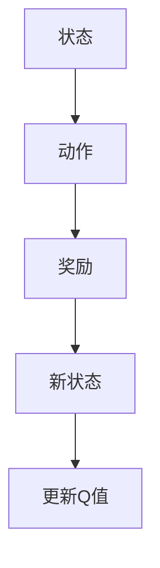
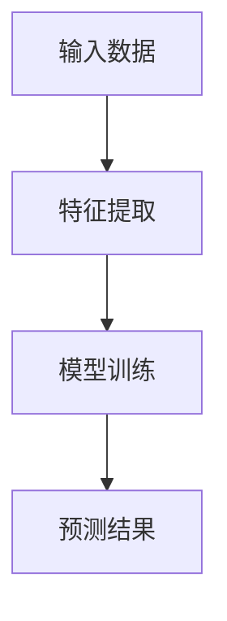
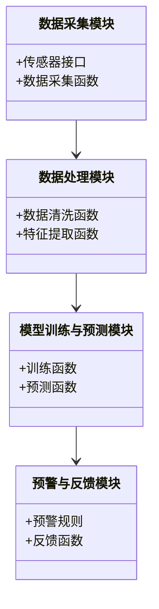

                 


# AI Agent在环境监测与预警中的实践

## 关键词：AI Agent，环境监测，环境预警，强化学习，监督学习，系统架构

## 摘要：  
本文探讨了AI Agent在环境监测与预警中的实践应用，从背景、原理到算法实现，再到系统架构设计和项目实战，详细分析了AI Agent如何通过智能化手段提升环境监测的效率与准确性。通过强化学习和监督学习等算法，结合实时数据处理和预警系统，构建了一个高效可靠的环境监测与预警系统。本文还提供了具体的代码实现和案例分析，帮助读者全面理解AI Agent在环境监测中的核心作用和技术实现。

---

# 第1章: 环境监测与预警的背景与挑战

## 1.1 环境监测与预警的重要性  
环境监测是保护生态环境、预防环境污染的重要手段。随着工业化进程的加快，环境问题日益严重，传统的环境监测方法依赖人工采集和分析数据，效率低下且容易出错。AI Agent的引入，通过智能化的感知、决策和执行能力，大大提升了环境监测的效率和准确性。

## 1.2 AI Agent的基本概念与特点  
AI Agent是一种能够感知环境、自主决策并执行任务的智能体。它具有以下特点：  
1. **自主性**：能够独立完成任务，无需人工干预。  
2. **反应性**：能够实时感知环境变化并做出反应。  
3. **学习能力**：通过机器学习算法不断优化自身行为。  
4. **协作性**：能够与其他AI Agent或系统协同工作。  

## 1.3 本章小结  
本章介绍了环境监测与预警的重要性，以及AI Agent的基本概念和特点，为后续内容奠定了基础。

---

# 第2章: AI Agent的核心概念与原理

## 2.1 环境监测中的AI Agent系统架构  
AI Agent在环境监测中的系统架构通常包括以下模块：  
1. **数据采集模块**：通过传感器等设备采集环境数据。  
2. **数据处理模块**：对采集的数据进行清洗、预处理和特征提取。  
3. **模型训练与预测模块**：基于机器学习算法对数据进行建模和预测。  
4. **预警与反馈模块**：根据预测结果生成预警信息并反馈到系统中。  

## 2.2 AI Agent的核心要素与组成  
AI Agent的核心要素包括感知、决策和执行三个模块：  
- **感知模块**：通过传感器或数据接口获取环境数据。  
- **决策模块**：基于感知数据和预设规则，生成决策指令。  
- **执行模块**：根据决策指令执行相应操作，如发送预警信息或调整设备参数。  

## 2.3 本章小结  
本章详细介绍了AI Agent在环境监测中的系统架构和核心要素，为后续的算法实现和系统设计提供了理论支持。

---

# 第3章: AI Agent的算法原理与数学模型

## 3.1 强化学习算法  
### 3.1.1 强化学习的基本原理  
强化学习是一种通过试错机制来优化决策的算法。AI Agent通过与环境的交互，不断尝试不同的动作，最终找到最优策略。  

### 3.1.2 Q-learning算法的数学模型  
Q-learning算法的数学公式如下：  
$$ Q(s, a) = r + \gamma \max_{a'} Q(s', a') $$  
其中，$s$表示当前状态，$a$表示动作，$r$表示奖励，$\gamma$表示折扣因子，$s'$表示下一个状态。  

### 3.1.3 算法的实现步骤与流程图  


## 3.2 监督学习算法  
### 3.2.1 监督学习的基本原理  
监督学习是一种基于 labeled 数据的机器学习方法。AI Agent通过学习带标签的数据，预测未来状态。  

### 3.2.2 线性回归模型的数学公式  
线性回归模型的数学公式如下：  
$$ y = \theta^T x + \epsilon $$  
其中，$y$表示输出，$\theta$表示参数，$x$表示输入，$\epsilon$表示误差项。  

### 3.2.3 算法的实现步骤与流程图  


## 3.3 本章小结  
本章详细讲解了强化学习和监督学习的算法原理和数学模型，并通过流程图展示了实现步骤。

---

# 第4章: AI Agent的系统架构设计

## 4.1 问题场景介绍  
假设我们正在设计一个空气质量监测系统，AI Agent需要实时采集空气质量和气象数据，预测未来空气质量，并在预测结果超过阈值时发送预警信息。

## 4.2 系统功能设计  
系统的功能模块包括：  
1. 数据采集模块：通过传感器采集空气质量数据。  
2. 数据处理模块：对数据进行清洗和特征提取。  
3. 模型训练与预测模块：基于历史数据训练模型并预测未来空气质量。  
4. 预警与反馈模块：根据预测结果生成预警信息并反馈到系统中。  

## 4.3 系统架构设计  


## 4.4 系统接口设计  
系统接口包括：  
1. 数据采集模块与传感器的接口。  
2. 数据处理模块与模型训练模块的接口。  
3. 预警模块与用户或设备的接口。  

## 4.5 本章小结  
本章详细介绍了AI Agent的系统架构设计，包括功能模块、类图和接口设计。

---

# 第5章: 项目实战——空气质量监测与预警系统

## 5.1 环境搭建  
首先，安装所需的Python库：  
```bash
pip install numpy pandas scikit-learn matplotlib
```

## 5.2 数据采集与预处理  
假设我们已经采集了空气质量数据，包括PM2.5、PM10、温度、湿度等。数据预处理步骤如下：  
1. 数据清洗：处理缺失值和异常值。  
2. 特征提取：提取有用特征，如PM2.5、PM10、温度等。  

## 5.3 模型训练与预测  
基于历史数据训练线性回归模型：  
```python
from sklearn.linear_model import LinearRegression

# 数据准备
X = df[['PM2.5', 'PM10', '温度']]
y = df['空气质量指数']

# 模型训练
model = LinearRegression()
model.fit(X, y)

# 模型预测
new_data = [[25, 35, 28]]
predicted_aqi = model.predict(new_data)
print(predicted_aqi)
```

## 5.4 预警系统实现  
根据预测结果生成预警信息：  
```python
def generate_alert(predicted_aqi):
    if predicted_aqi > 100:
        return "空气质量预警：未来24小时空气质量指数将超过100，请做好防护措施。"
    else:
        return "空气质量正常。"

predicted_aqi = model.predict(new_data)
alert = generate_alert(predicted_aqi)
print(alert)
```

## 5.5 本章小结  
本章通过一个空气质量监测与预警系统的案例，详细讲解了AI Agent的项目实现过程，包括环境搭建、数据处理、模型训练和预警系统实现。

---

# 第6章: 总结与展望

## 6.1 项目总结  
本文详细探讨了AI Agent在环境监测与预警中的实践应用，通过强化学习和监督学习等算法，结合实时数据处理和预警系统，构建了一个高效可靠的环境监测与预警系统。

## 6.2 优缺点分析  
- **优点**：AI Agent能够显著提高环境监测的效率和准确性，减少人工干预。  
- **缺点**：算法复杂度较高，需要大量的计算资源和数据支持。  

## 6.3 改进建议  
未来可以进一步优化算法，引入深度学习等技术，提升系统的预测精度和响应速度。  

## 6.4 未来展望  
随着人工智能技术的不断发展，AI Agent在环境监测与预警中的应用将更加广泛和深入，为环境保护和人类健康做出更大的贡献。

---

# 作者：AI天才研究院 & 禅与计算机程序设计艺术  

---

感谢您的阅读！如果对本文内容感兴趣，欢迎留言交流或关注我们的公众号获取更多技术干货！

