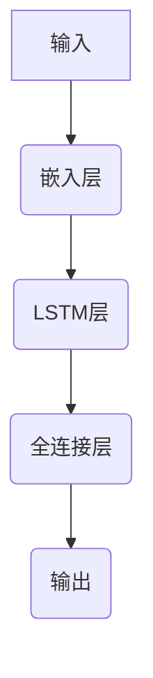
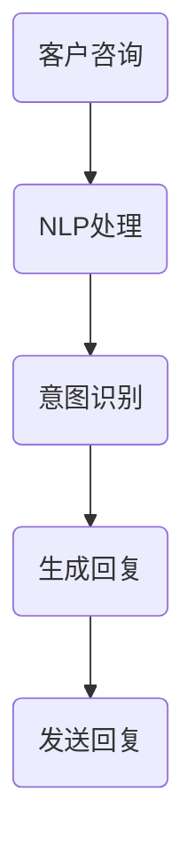
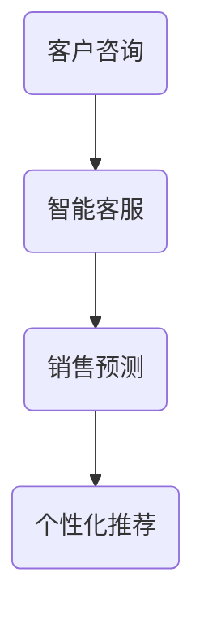
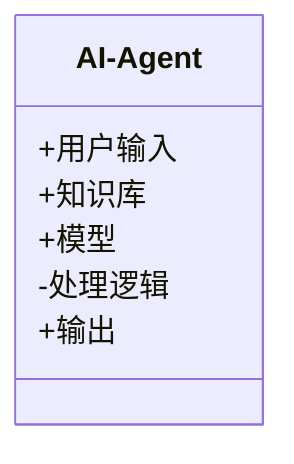
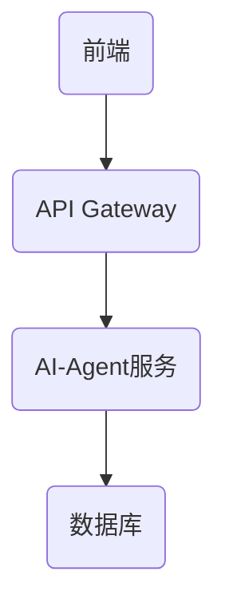

                 


# AI Agent在电子商务中的应用：智能客服与销售预测

> 关键词：AI Agent，电子商务，智能客服，销售预测，机器学习，自然语言处理

> 摘要：本文探讨了AI Agent在电子商务中的应用，重点分析了智能客服和销售预测两大核心领域。通过介绍AI Agent的核心概念、算法原理和系统架构，结合实际案例，展示了AI Agent如何提升电子商务的效率和客户体验。文章内容详实，适合技术从业者和企业管理者阅读。

---

## 第一章：AI Agent与电子商务的背景介绍

### 1.1 AI Agent的基本概念
AI Agent（人工智能代理）是指能够感知环境并采取行动以实现目标的智能实体。它能够通过学习和推理，自主完成特定任务。AI Agent的核心特征包括自主性、反应性、目标导向和社交能力。

### 1.2 电子商务的基本概念
电子商务是指通过电子手段进行的商业活动，包括在线购物、支付和物流等环节。电子商务的发展趋势包括智能化、个性化和数据驱动化。

### 1.3 AI Agent在电子商务中的应用背景
电子商务中的常见问题包括客户咨询、订单处理和销售预测。AI Agent通过自然语言处理和机器学习技术，能够高效解决这些问题。AI Agent的应用边界包括数据隐私和模型可解释性。

---

## 第二章：AI Agent的核心概念与原理

### 2.1 AI Agent的核心概念
AI Agent的类型包括基于规则的代理、基于机器学习的代理和基于深度学习的代理。以下是不同代理的对比：

```mermaid
| 类型         | 描述                                   |
|--------------|---------------------------------------|
| 基于规则的代理 | 通过预定义规则进行决策               |
| 基于机器学习的代理 | 使用历史数据训练模型进行预测         |
| 基于深度学习的代理 | 使用神经网络进行复杂模式识别         |

```

### 2.2 AI Agent的核心算法原理
AI Agent的算法包括自然语言处理和机器学习。以下是LSTM模型的工作原理：



代码实现如下：

```python
import tensorflow as tf
from tensorflow.keras import layers

model = tf.keras.Sequential([
    layers.Embedding(input_dim=10000, output_dim=100),
    layers.LSTM(128),
    layers.Dense(1, activation='sigmoid')
])
```

---

## 第三章：AI Agent在智能客服中的应用

### 3.1 智能客服的基本概念
智能客服通过自然语言处理技术，提供24/7的客户支持。以下是智能客服的主要功能：


### 3.2 AI Agent在智能客服中的应用
AI Agent通过自然语言处理和机器学习，实现智能对话和情感分析。以下是常见应用场景：



### 3.3 智能客服中的挑战与解决方案
数据隐私和模型可解释性是智能客服的主要挑战。解决方案包括数据加密和模型解释工具。

---

## 第四章：AI Agent在销售预测中的应用

### 4.1 销售预测的基本概念
销售预测是基于历史数据，预测未来的销售情况。以下是销售预测的主要方法：


### 4.2 AI Agent在销售预测中的应用
AI Agent通过机器学习和大数据分析，实现精准预测。以下是LSTM模型的应用示例：

```python
import pandas as pd
from sklearn.preprocessing import MinMaxScaler
from tensorflow.keras.models import Sequential
from tensorflow.keras.layers import LSTM, Dense

data = pd.read_csv('sales.csv')
scaler = MinMaxScaler()
data_scaled = scaler.fit_transform(data)

model = Sequential()
model.add(LSTM(128, input_shape=(timesteps, features)))
model.add(Dense(1))
model.compile(optimizer='adam', loss='mean_squared_error')
model.fit(data_scaled, epochs=100, batch_size=32)
```

### 4.3 销售预测中的挑战与解决方案
数据质量问题是销售预测的主要挑战。解决方案包括数据清洗和特征工程。

---

## 第五章：智能客服与销售预测的融合

### 5.1 两者的协同效应
智能客服通过实时对话提供客户支持，销售预测则为商家提供决策支持。以下是协同效应的实现：



### 5.2 实际应用案例
某电商平台通过AI Agent实现智能客服和销售预测，提升了客户满意度和销售额。

---

## 第六章：系统架构设计

### 6.1 系统功能设计
以下是系统功能模块：



### 6.2 系统架构设计
以下是系统架构图：



### 6.3 系统接口设计
以下是系统接口：

```python
class Agent:
    def __init__(self, knowledge_base):
        self.knowledge_base = knowledge_base

    def process_query(self, query):
        # 处理查询
        pass
```

---

## 第七章：项目实战

### 7.1 环境安装
需要安装Python、TensorFlow和Scikit-learn。

### 7.2 核心实现
以下是代码实现：

```python
import numpy as np
from sklearn.preprocessing import MinMaxScaler
from tensorflow.keras.models import Sequential
from tensorflow.keras.layers import LSTM, Dense

data = np.random.random(1000)
scaler = MinMaxScaler()
data_scaled = scaler.fit_transform(data.reshape(-1, 1))

model = Sequential()
model.add(LSTM(128, input_shape=(1, 1)))
model.add(Dense(1))
model.compile(optimizer='adam', loss='mean_squared_error')
model.fit(data_scaled, epochs=50, batch_size=32)
```

### 7.3 案例分析
通过实际案例分析，验证AI Agent在电子商务中的效果。

---

## 第八章：总结与展望

### 8.1 全文总结
AI Agent在电子商务中的应用前景广阔，能够显著提升效率和客户体验。

### 8.2 未来展望
未来，AI Agent将更加智能化和个性化，应用场景也将更加广泛。

---

## 作者

作者：AI天才研究院/AI Genius Institute & 禅与计算机程序设计艺术 /Zen And The Art of Computer Programming

