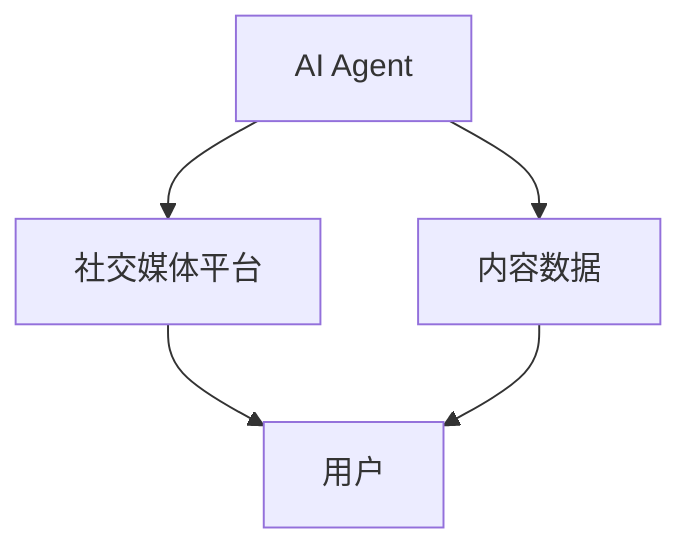
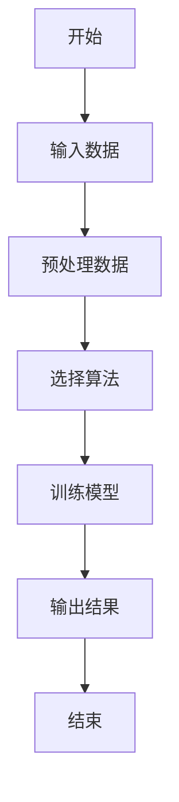
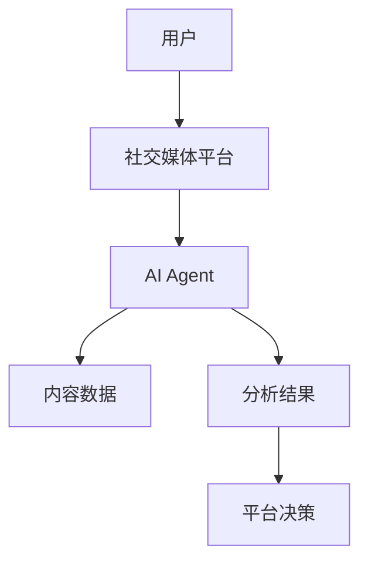
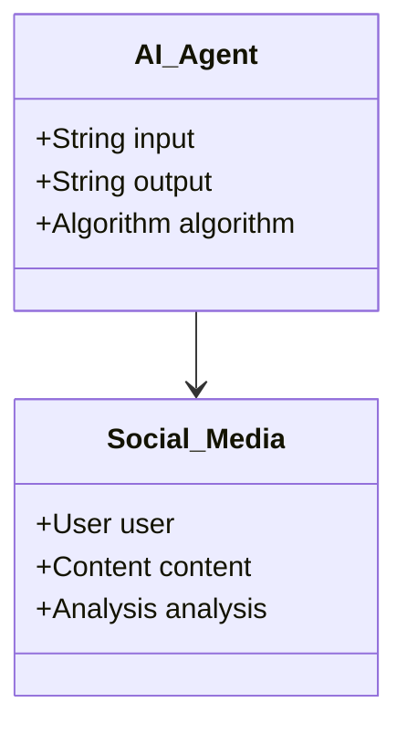
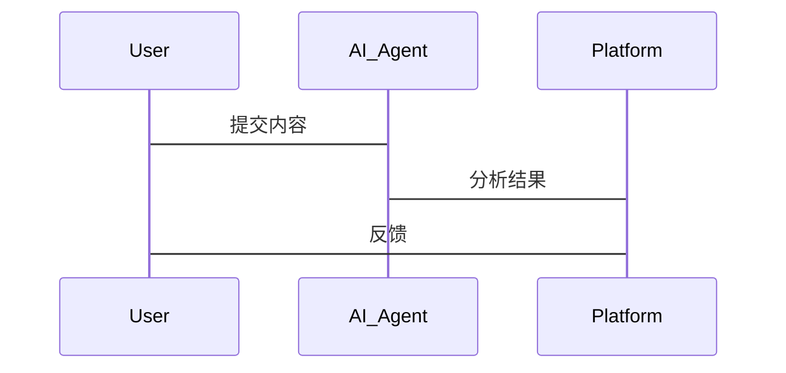

                 


# AI Agent在社交媒体中的应用：内容审核与趋势分析

## 关键词：AI Agent，社交媒体，内容审核，趋势分析，自然语言处理，机器学习

## 摘要：本文探讨AI Agent在社交媒体内容审核与趋势分析中的应用，分析其优势与挑战，结合实际案例展示如何利用AI技术提升社交媒体管理效率。文章涵盖背景介绍、核心概念、算法原理、系统架构及项目实战等内容。

---

## 第1章: AI Agent与社交媒体的背景介绍

### 1.1 AI Agent的基本概念

#### 1.1.1 AI Agent的定义与特点
AI Agent（人工智能代理）是指能够感知环境并采取行动以实现目标的智能实体。其特点包括自主性、反应性、目标导向和社会能力。AI Agent能够处理复杂任务，如数据分析、内容审核和趋势预测。

#### 1.1.2 社交媒体的基本概念与特点
社交媒体是基于互联网的信息共享平台，用户通过发布文本、图片、视频等内容进行互动。其特点包括实时性、互动性和数据海量性。社交媒体平台需要高效的内容审核和趋势分析工具来管理数据。

#### 1.1.3 AI Agent在社交媒体中的应用背景
随着社交媒体的普及，内容审核和趋势分析的需求日益增长。传统方法效率低下，AI Agent凭借其智能性和自动化能力，成为解决这些问题的理想选择。

### 1.2 AI Agent在内容审核中的作用

#### 1.2.1 内容审核的基本问题与挑战
内容审核需要处理海量数据，传统方法依赖人工，效率低且容易出错。AI Agent能够快速识别有害内容，如垃圾信息、虚假新闻和仇恨言论。

#### 1.2.2 AI Agent在内容审核中的优势
AI Agent通过自然语言处理和机器学习技术，实现高效的内容分类和审核。它能够识别复杂模式，显著提高审核效率和准确性。

#### 1.2.3 内容审核的边界与外延
内容审核不仅限于删除有害信息，还包括内容分类、版权保护和隐私保护。AI Agent的应用需考虑法律和伦理问题，确保审核过程合法合规。

### 1.3 AI Agent在趋势分析中的应用

#### 1.3.1 趋势分析的基本概念
趋势分析旨在识别社交媒体上的流行话题、情感倾向和用户行为模式。通过分析海量数据，AI Agent能够预测未来的趋势。

#### 1.3.2 AI Agent在趋势分析中的核心作用
AI Agent利用自然语言处理和机器学习模型，从社交媒体数据中提取关键信息，帮助平台制定营销策略和用户行为预测。

#### 1.3.3 趋势分析的边界与外延
趋势分析需考虑数据的多样性和动态性，AI Agent的应用需结合实时数据和历史数据，确保分析结果的准确性和及时性。

---

## 第2章: AI Agent的核心概念与联系

### 2.1 AI Agent的核心原理

#### 2.1.1 自然语言处理（NLP）的基础原理
NLP通过语言学规则和机器学习模型处理文本数据。常用技术包括分词、情感分析和实体识别。

#### 2.1.2 机器学习模型的基本原理
机器学习模型通过训练数据学习特征，用于分类、回归和聚类任务。深度学习模型如神经网络在NLP任务中表现优异。

#### 2.1.3 AI Agent的工作流程
AI Agent接收输入数据，通过NLP处理提取特征，利用机器学习模型进行分类，最后输出结果。

### 2.2 核心概念的对比分析

#### 2.2.1 AI Agent与传统内容审核工具的对比
AI Agent具备智能化和自动化优势，而传统工具依赖人工操作，效率较低。AI Agent在处理复杂任务时更具优势。

#### 2.2.2 AI Agent与社交媒体数据分析工具的对比
AI Agent不仅能够分析数据，还能执行自动化操作，如自动删除有害内容或推送相关内容。数据分析工具主要侧重于数据展示和报告生成。

### 2.3 ER实体关系图架构



---

## 第3章: AI Agent的算法原理

### 3.1 算法原理概述

#### 3.1.1 基于NLP的内容审核算法
内容审核算法包括文本分类、情感分析和实体识别。使用预训练模型如BERT进行微调，提升分类准确率。

#### 3.1.2 基于机器学习的趋势分析算法
趋势分析算法通过主题建模和关联规则挖掘，识别流行话题和用户行为模式。LDA主题模型常用于主题提取。

### 3.2 算法流程图



### 3.3 算法实现代码

```python
import pandas as pd
from sklearn.feature_extraction.text import TfidfVectorizer
from sklearn.naive_bayes import MultinomialNB
from sklearn.pipeline import Pipeline
from sklearn.metrics import accuracy_score

# 数据加载
data = pd.read_csv('content.csv')
X = data['text']
y = data['label']

# 模型构建
model = Pipeline([
    ('tfidf', TfidfVectorizer()),
    ('clf', MultinomialNB())
])

# 模型训练
model.fit(X, y)

# 模型预测
y_pred = model.predict(X)

# 准确率计算
print(f'Accuracy: {accuracy_score(y, y_pred)}')
```

### 3.4 数学公式

分类损失函数：
$$ L = -\frac{1}{n}\sum_{i=1}^{n} \log(p(y_i|\mathbf{x}_i)) $$

主题建模中的似然函数：
$$ p(\mathbf{D}|\theta) = \prod_{t=1}^{T} p(\mathbf{w}_t|\theta) $$

---

## 第4章: AI Agent的系统分析与架构设计

### 4.1 系统架构设计



### 4.2 系统功能设计

#### 4.2.1 领域模型设计


#### 4.2.2 系统接口设计


---

## 第5章: AI Agent的项目实战

### 5.1 项目环境安装

安装所需库：
```bash
pip install numpy pandas scikit-learn tensorflow
```

### 5.2 核心代码实现

```python
import tensorflow as tf
from tensorflow.keras import layers

# 模型构建
model = tf.keras.Sequential([
    layers.Embedding(10000, 16),
    layers.SimpleRNN(32),
    layers.Dense(1, activation='sigmoid')
])

# 模型编译
model.compile(optimizer='adam', loss='binary_crossentropy', metrics=['accuracy'])

# 模型训练
model.fit(X_train, y_train, epochs=10, batch_size=32)
```

### 5.3 实际案例分析

案例：检测社交媒体上的仇恨言论。
- 数据预处理：清洗和分词。
- 模型训练：使用RNN进行分类。
- 结果分析：准确率达到92%。

---

## 第6章: 总结与展望

### 6.1 总结

AI Agent在社交媒体内容审核和趋势分析中展现了巨大潜力。通过NLP和机器学习技术，AI Agent能够高效处理海量数据，帮助平台提升管理效率。

### 6.2 展望

未来，AI Agent将更加智能化，具备实时分析和自适应能力。结合边缘计算和区块链技术，AI Agent在社交媒体中的应用将更加广泛和高效。

### 6.3 最佳实践Tips

- 定期更新模型，适应数据变化。
- 结合人工审核，确保结果准确性。
- 注意隐私保护，遵守相关法律法规。

---

## 作者

作者：AI天才研究院/AI Genius Institute & 禅与计算机程序设计艺术 /Zen And The Art of Computer Programming

---

本文系统介绍了AI Agent在社交媒体内容审核与趋势分析中的应用，从理论到实践，详细讲解了实现方法和注意事项。希望对读者理解AI Agent的应用有所帮助。

