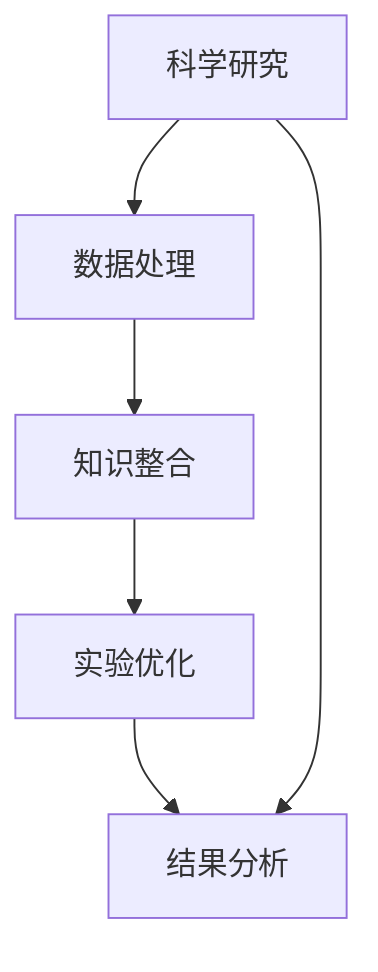
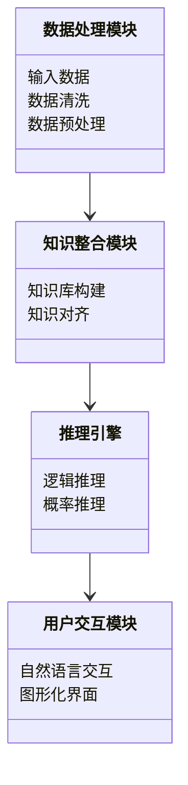
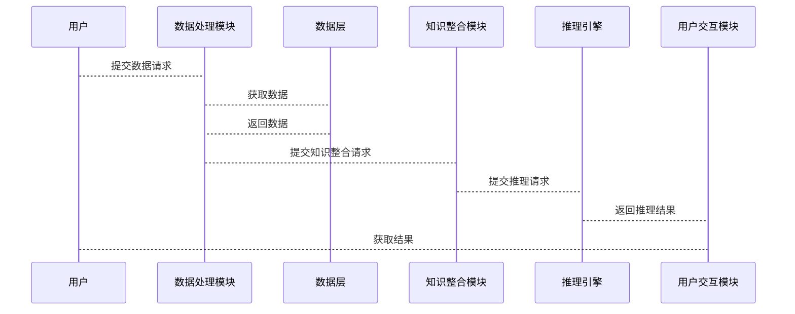

                 


# AI Agent在科学研究辅助中的应用

## 关键词：
AI Agent，科学研究，数据分析，知识整合，实验优化，生成式AI，多模态数据

## 摘要：
AI Agent作为一种智能化工具，正在逐步改变科学研究的方式。通过整合多模态数据、知识表示与推理、以及生成式AI模型，AI Agent能够显著提高科研效率，优化实验设计，并加速科学发现。本文将深入探讨AI Agent在科学研究中的应用背景、核心概念、算法原理、系统架构以及实际案例，为研究人员提供理论与实践的双重指导。

---

## 第一部分: AI Agent的基本概念与背景

### 第1章: AI Agent的基本概念与背景

#### 1.1 AI Agent的定义与核心概念
- 1.1.1 AI Agent的定义
  - AI Agent是一种具备自主决策能力的智能实体，能够根据输入的指令和环境信息，执行复杂的任务并提供解决方案。
  - 核心属性：自主性、反应性、目标导向、知识驱动。
  - AI Agent与传统AI的区别：AI Agent具备更强的交互性和适应性，能够动态调整行为以应对复杂环境。

- 1.1.2 AI Agent的核心概念
  - 知识表示：通过符号逻辑或概率模型表示领域知识。
  - 推理机制：基于知识库进行逻辑推理或概率推理。
  - 交互能力：通过自然语言处理或图形界面与用户交互。
  - 学习能力：通过机器学习不断优化自身性能。

- 1.1.3 AI Agent在科学研究中的应用背景
  - 数据爆炸时代：科学研究面临海量数据的处理挑战。
  - 知识碎片化：多学科交叉研究需要整合分散的知识资源。
  - 高效需求：科研人员需要快速获取信息、优化实验设计。

#### 1.2 AI Agent在科学研究中的应用
- 1.2.1 数据分析与可视化
  - AI Agent能够处理复杂的数据集，生成直观的可视化结果。
  - 例如：生物医学领域的基因数据分析与可视化。
- 1.2.2 知识整合与推理
  - AI Agent能够整合多个领域的知识，支持科学假设的验证。
  - 例如：化学领域的分子结构预测与性质推导。
- 1.2.3 实验设计与优化
  - AI Agent能够根据历史数据和理论模型，优化实验方案。
  - 例如：材料科学中的材料合成参数优化。

#### 1.3 科学研究辅助中的问题描述
- 数据处理的复杂性：数据来源多样，格式复杂，需要高效处理工具。
- 知识整合的需求：科学研究通常涉及多个领域，需要跨学科的知识整合。
- 实验优化的挑战：实验设计需要考虑多种变量，优化过程耗时且复杂。

#### 1.4 AI Agent在科学研究中的应用范围
- 数据分析与可视化：AI Agent能够快速处理数据并生成可视化结果。
- 知识库构建与推理：AI Agent能够整合知识库并进行推理。
- 实验设计与优化：AI Agent能够辅助设计实验方案并优化参数。

---

## 第二部分: AI Agent的核心概念与原理

### 第2章: AI Agent的核心概念与联系

#### 2.1 AI Agent的核心原理
- 知识表示与推理：AI Agent通过符号逻辑或概率模型表示知识，并进行逻辑推理。
- 数据驱动与模型推理：AI Agent结合数据驱动的模型和符号推理，提供更准确的结果。
- 多模态数据处理能力：AI Agent能够处理文本、图像、语音等多种数据类型。

#### 2.2 AI Agent与相关技术的对比
- AI Agent与传统专家系统：
  - 传统专家系统基于规则推理，AI Agent结合了数据驱动和符号推理。
- AI Agent与大语言模型：
  - 大语言模型擅长自然语言处理，AI Agent具备更强的知识整合和推理能力。
- AI Agent与强化学习：
  - 强化学习注重策略优化，AI Agent具备更广泛的应用场景。

#### 2.3 实体关系图与概念架构


---

## 第三部分: AI Agent的算法原理

### 第3章: AI Agent的算法原理

#### 3.1 生成式AI模型
- 大语言模型（如GPT系列）：
  - 基于Transformer架构，通过自注意力机制生成文本。
  - 训练目标函数：$$ \text{loss} = -\sum_{i=1}^{n} \log p(x_i) $$
  - 损失函数：交叉熵损失函数 $$ \text{CE} = -\frac{1}{N}\sum_{i=1}^{N} \log p(y_i|x_i) $$

- 视觉模型（如Vision Transformer）：
  - 处理图像数据，提取视觉特征。
  - 使用卷积层和全连接层进行特征提取。

- 多模态模型：
  - 综合处理文本、图像、语音等多种数据类型。
  - 使用跨模态注意力机制进行信息整合。

#### 3.2 推理机制
- 符号逻辑推理：
  - 基于知识库中的逻辑规则进行推理。
  - 例如：在化学领域，推理分子结构的性质。

- 概率推理：
  - 使用贝叶斯网络进行概率推理。
  - 例如：在医学领域，推理疾病诊断的概率。

#### 3.3 知识表示与整合
- 知识图谱构建：
  - 使用图嵌入技术（如TransE、TransH）构建知识图谱。
  - 知识图谱表示：$$ e头 \rightarrow 关系 \rightarrow e尾 $$

- 知识整合：
  - 使用对齐算法（如Racconi、AlignN3）整合多个知识库。
  - 对齐算法：通过计算实体的相似性进行对齐。

---

## 第四部分: AI Agent的系统分析与架构设计

### 第4章: AI Agent的系统架构

#### 4.1 系统功能设计
- 功能模块：
  - 数据处理模块：负责数据的输入、清洗和预处理。
  - 知识整合模块：整合多模态数据并构建知识图谱。
  - 推理引擎：基于知识图谱进行逻辑推理或概率推理。
  - 用户交互模块：提供自然语言交互界面。

- 领域模型：


#### 4.2 系统架构设计
- 分层架构：
  - 数据层：存储原始数据和知识库。
  - 服务层：提供数据处理、知识整合和推理服务。
  - 表示层：提供用户交互界面。

- 架构图：


#### 4.3 系统接口设计
- API接口：
  - 数据接口：提供数据输入和输出的接口。
  - 推理接口：提供逻辑推理和概率推理的API。
  - 交互接口：提供自然语言交互的API。

#### 4.4 系统交互流程
- 交互序列图：


---

## 第五部分: AI Agent的项目实战

### 第5章: 项目实战

#### 5.1 项目环境配置
- 系统环境：Python 3.8及以上版本。
- 依赖库：numpy、pandas、tensorflow、pytorch、transformers。

#### 5.2 项目核心实现
- 数据处理模块实现：
  ```python
  import numpy as np
  def data_preprocess(data):
      # 数据清洗和预处理逻辑
      return processed_data
  ```

- 知识整合模块实现：
  ```python
  import networkx as nx
  def build_knowledge_graph(knowledge):
      graph = nx.Graph()
      # 添加节点和边
      return graph
  ```

- 推理引擎实现：
  ```python
  import torch
  class ReasoningEngine:
      def __init__(self, knowledge_graph):
          self.knowledge_graph = knowledge_graph
      def logical_reasoning(self, query):
          # 基于知识图谱的逻辑推理
          return result
  ```

#### 5.3 实际案例分析
- 案例1：生物医学领域的基因数据分析。
  - 数据输入：基因序列数据。
  - 数据处理：清洗和预处理基因数据。
  - 知识整合：构建基因知识图谱。
  - 推理结果：预测基因功能。

- 案例2：化学领域的分子结构预测。
  - 数据输入：分子结构数据。
  - 数据处理：预处理分子数据。
  - 知识整合：构建化学知识图谱。
  - 推理结果：预测分子性质。

#### 5.4 项目小结
- 项目总结：AI Agent在科学研究中的应用前景广阔。
- 成功经验：多模态数据处理和知识整合是关键。
- 改进方向：优化推理引擎的效率和准确性。

---

## 第六部分: 最佳实践与总结

### 第6章: 最佳实践与总结

#### 6.1 最佳实践
- 数据处理：确保数据的准确性和完整性。
- 知识整合：选择合适的知识表示方法。
- 推理优化：结合符号逻辑和概率推理。

#### 6.2 小结
- AI Agent在科学研究中的应用潜力巨大。
- 通过多模态数据处理和知识整合，AI Agent能够显著提高科研效率。
- 未来的发展方向包括优化推理引擎和扩展应用场景。

#### 6.3 注意事项
- 数据隐私：科学研究中需要保护数据隐私。
- 知识准确性：确保知识库的准确性和权威性。
- 系统稳定性：确保系统的稳定性和可靠性。

#### 6.4 拓展阅读
- 推荐阅读相关领域的最新论文和书籍。
- 关注AI Agent在其他领域的应用案例。

---

## 作者：AI天才研究院/AI Genius Institute & 禅与计算机程序设计艺术 /Zen And The Art of Computer Programming

---

以上是《AI Agent在科学研究辅助中的应用》的目录大纲，涵盖了AI Agent的核心概念、算法原理、系统架构、项目实战以及最佳实践等内容，帮助研究人员和开发者更好地理解和应用AI Agent技术。

