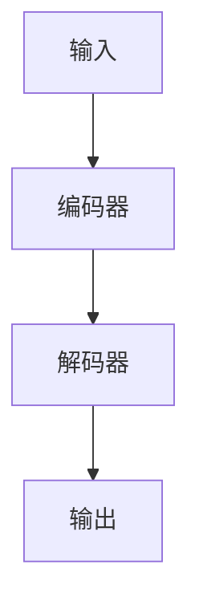
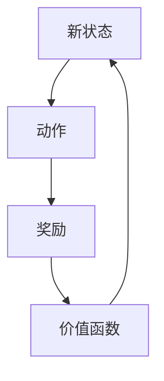

                 


# AI Agent在科研领域的应用：加速科学发现

> 关键词：AI Agent，科研，科学发现，人工智能，知识图谱，数据处理，自动化

> 摘要：本文深入探讨了AI Agent在科研领域的应用，分析其如何通过自动化数据处理、智能化知识发现和优化研究过程，加速科学发现。文章从AI Agent的核心概念、算法原理、系统设计到实际项目案例，全面阐述了其在科研中的作用和价值。

---

## 第一部分: AI Agent在科研领域的应用概述

---

### 第1章: AI Agent与科研的背景介绍

#### 1.1 AI Agent的基本概念
AI Agent（人工智能代理）是一种能够感知环境、自主决策并执行任务的智能实体。它通过数据驱动和知识表示，能够实现从数据处理到知识发现的自动化流程。AI Agent的核心特点包括自主性、反应性、目标导向和学习能力。

#### 1.2 AI Agent在科研中的问题背景
传统科研方法依赖人工数据处理和专家经验，存在效率低、知识发现缓慢的问题。AI Agent通过自动化数据处理和智能化知识推理，解决了这些问题。

#### 1.3 AI Agent如何解决问题
AI Agent通过自动化数据处理、智能化知识发现和优化研究过程，显著提高了科研效率。

---

### 第2章: AI Agent的核心概念与联系

#### 2.1 AI Agent的核心概念原理
AI Agent通过知识表示、数据驱动和自动化决策，实现科学研究的智能化。

#### 2.2 核心概念属性特征对比表格
| 特性 | AI Agent | 传统科研方法 |
|------|----------|--------------|
| 数据处理 | 自动化 | 手动化       |
| 知识推理 | 智能化 | 依赖专家经验 |
| 决策执行 | 自动化 | 依赖人工干预 |

#### 2.3 ER实体关系图架构
```mermaid
er
actor(AI Agent, 研究者, 数据源)
rectangle(知识库, 数据库, 模型)
关联(AI Agent -->> 知识库, 数据源 -->> 数据库, 研究者 -->> 数据库)
```

---

## 第3章: AI Agent的算法原理讲解

### 3.1 AI Agent的生成模型
#### 3.1.1 Transformer模型

公式：
$$\text{生成概率} = \frac{1}{\sqrt{N}} \cdot \text{注意力权重}$$

### 3.2 AI Agent的强化学习机制


---

## 第4章: AI Agent的系统分析与架构设计

### 4.1 项目背景与目标
AI Agent系统旨在通过自动化数据处理和知识发现，加速科研过程。

### 4.2 系统功能设计
- 数据采集与预处理
- 知识表示与推理
- 自动化决策与执行

### 4.3 系统架构设计


---

## 第5章: 项目实战

### 5.1 环境安装与配置
安装Python、TensorFlow和Keras等依赖库。

### 5.2 核心代码实现
```python
class AI-Agent:
    def __init__(self):
        self.model = load_model()
        self.knowledge_base = KnowledgeBase()

    def process_data(self, data):
        # 数据预处理
        pass

    def infer(self, query):
        # 知识推理
        pass
```

### 5.3 案例分析与解读
通过具体案例，展示AI Agent在科研中的应用效果。

---

## 第6章: 最佳实践与小结

### 6.1 注意事项
AI Agent的应用需结合具体场景，避免过度依赖技术。

### 6.2 未来展望
AI Agent将在更多科研领域发挥重要作用，推动科学发现的加速。

---

## 作者：AI天才研究院 & 禅与计算机程序设计艺术

---

希望这篇文章能够为读者提供深入的见解，展示AI Agent在科研领域的巨大潜力和实际应用价值。

