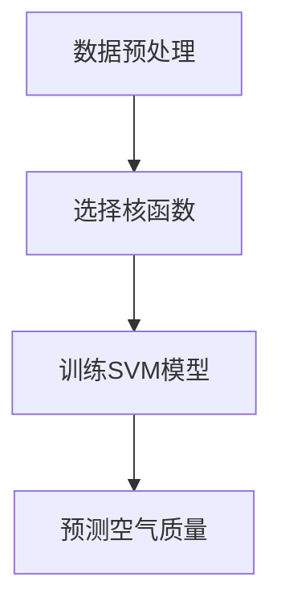

                 


# AI Agent在空气质量预测中的应用

> 关键词：AI Agent，空气质量预测，机器学习，环境监测，智能系统

> 摘要：本文深入探讨了AI Agent在空气质量预测中的应用，从基本概念到算法原理，从系统架构到项目实战，全面分析了AI Agent如何通过智能数据处理和模型优化提升空气质量预测的精度和实时性。通过详细的技术分析和实际案例，展示了AI Agent在环境监测领域的巨大潜力和实际价值。

---

# 第1章 空气质量预测的背景与挑战

## 1.1 空气质量预测的重要性
### 1.1.1 空气质量对人类健康的影响
空气质量直接影响人们的健康，尤其是对呼吸系统的影响。通过预测空气质量，可以提前采取防护措施，减少健康风险。

### 1.1.2 环境保护与可持续发展的需求
空气质量是环境质量的重要指标之一。通过预测和监控空气质量，可以帮助政府制定有效的环境保护政策，推动可持续发展。

### 1.1.3 空气质量预测的经济价值
空气质量预测对于工业生产、农业活动、交通运输等领域都有重要的经济价值。通过预测，可以优化生产流程，减少污染排放，降低经济损失。

## 1.2 空气质量预测的现状与挑战
### 1.2.1 当前空气质量预测的主要方法
目前，空气质量预测主要依赖于气象模型、化学传输模型和机器学习模型。这些方法各有优缺点，且存在一定的局限性。

### 1.2.2 数据获取与处理的难点
空气质量预测需要大量的实时数据，包括气象数据、污染源排放数据等。数据的获取、清洗和预处理是空气质量预测的关键步骤，也是最大的挑战之一。

### 1.2.3 模型精度与实时性的平衡
空气质量预测需要在精度和实时性之间找到平衡点。高精度的模型通常计算复杂，实时性可能不足；而实时性强的模型精度可能较低。

## 1.3 AI Agent的基本概念与特点
### 1.3.1 AI Agent的定义与分类
AI Agent（智能体）是指能够感知环境并采取行动以实现目标的实体。根据智能体的智能水平，可以分为反应式智能体、基于模型的智能体、实用智能体等。

### 1.3.2 AI Agent的核心技术
AI Agent的核心技术包括感知技术、推理技术、决策技术、学习技术等。这些技术共同构成了AI Agent的能力基础。

### 1.3.3 AI Agent在环境监测中的优势
AI Agent具有实时性、自主性、适应性等优势，在环境监测领域具有广泛的应用潜力。

---

# 第2章 AI Agent与空气质量预测的结合

## 2.1 空气质量预测的核心要素
### 2.1.1 污染物浓度的时空分布
空气质量具有明显的时空分布特征。通过分析污染物浓度的变化趋势，可以更好地预测未来的空气质量。

### 2.1.2 气象条件的影响
气象条件（如风速、温度、湿度等）对空气质量有重要影响。通过结合气象数据，可以提高空气质量预测的准确性。

### 2.1.3 污染源排放的动态变化
污染源的排放量和排放位置会随时间发生变化。通过实时监测污染源排放数据，可以更准确地预测空气质量。

## 2.2 AI Agent在空气质量预测中的角色
### 2.2.1 数据采集与预处理
AI Agent可以通过多种传感器实时采集空气质量数据，并对数据进行清洗和预处理，确保数据的准确性和可用性。

### 2.2.2 模型训练与优化
AI Agent可以通过机器学习算法对空气质量数据进行建模，优化模型参数，提高预测精度。

### 2.2.3 实时预测与决策支持
AI Agent可以实时预测未来空气质量，并为相关部门提供决策支持，帮助制定有效的应对措施。

## 2.3 空气质量预测的系统架构
### 2.3.1 数据流与信息处理流程
空气质量预测系统需要处理大量的数据流，包括传感器数据、气象数据、污染源数据等。数据流的处理流程包括数据采集、数据清洗、数据存储、数据分析等。

### 2.3.2 系统模块划分与功能描述
空气质量预测系统可以划分为数据采集模块、数据处理模块、模型训练模块、实时预测模块和决策支持模块。每个模块都有其特定的功能和职责。

### 2.3.3 系统的可扩展性与灵活性
为了适应不同的需求，空气质量预测系统需要具有良好的可扩展性和灵活性。通过模块化设计和插件机制，可以方便地扩展系统功能。

---

# 第3章 AI Agent的核心概念与原理

## 3.1 AI Agent的核心原理
### 3.1.1 智能体的行为决策机制
AI Agent的行为决策机制包括感知、推理、决策和执行四个步骤。通过感知环境，AI Agent可以做出合理的决策，并通过执行机构将决策转化为具体行动。

### 3.1.2 知识表示与推理方法
知识表示是AI Agent理解和处理信息的基础。常用的表示方法包括逻辑表示、语义网络表示等。推理方法包括逻辑推理、概率推理等。

### 3.1.3 学习与自适应能力
AI Agent具有学习能力，可以通过监督学习、无监督学习、强化学习等方法不断优化自身的模型和策略。

## 3.2 空气质量预测模型的构建
### 3.2.1 数据特征的提取与选择
空气质量预测模型的性能依赖于数据特征的选择。通过特征提取和选择，可以去除冗余信息，提高模型的预测精度。

### 3.2.2 模型训练与验证
模型训练是空气质量预测的核心步骤。通过训练数据，模型可以学习到空气质量变化的规律和特征。模型验证是通过测试数据评估模型的性能。

### 3.2.3 模型的评估与优化
模型评估是通过评估指标（如均方误差、平均绝对误差等）对模型的性能进行评估。模型优化是通过调整模型参数和算法改进来提高模型的预测精度。

## 3.3 AI Agent与空气质量预测的协同工作
### 3.3.1 数据流的协同处理
AI Agent可以通过协同工作，实现数据的高效采集、处理和分析。通过多智能体协作，可以提高系统的整体性能。

### 3.3.2 模型的动态调整与优化
AI Agent可以根据实时数据动态调整模型参数，优化模型性能。通过在线学习和自适应算法，模型可以更好地适应环境变化。

---

# 第4章 算法原理与实现

## 4.1 支持向量机（SVM）算法
### 4.1.1 算法原理
支持向量机是一种监督学习算法，主要用于分类和回归问题。SVM通过构建超平面将数据点分为不同的类别。

### 4.1.2 算法流程图


### 4.1.3 算法实现代码
```python
import numpy as np
from sklearn.svm import SVC

# 数据预处理
X = ...  # 特征矩阵
y = ...  # 标签向量

# 训练SVM模型
model = SVC(kernel='rb

