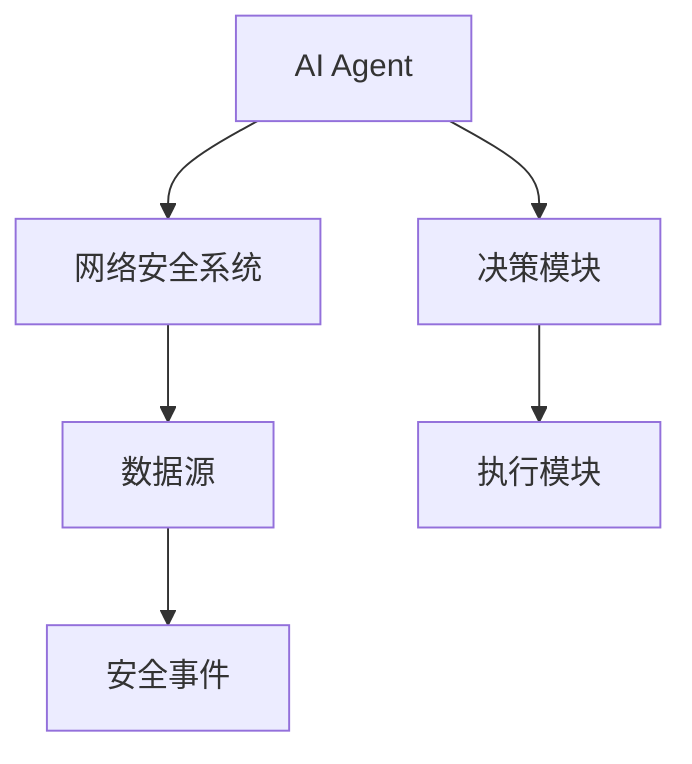

                 


# AI Agent在网络安全中的应用

> 关键词：AI Agent，网络安全，算法原理，系统架构，项目实战

> 摘要：本文深入探讨了AI Agent在网络安全中的应用，分析了其核心概念、算法原理和系统架构，并通过项目实战展示了其实际应用价值。文章从网络安全的背景出发，逐步解析AI Agent的优势和挑战，结合具体案例，阐述了如何利用AI Agent提升网络安全防护能力。

---

# 第一部分: AI Agent在网络安全中的应用背景

# 第1章: AI Agent与网络安全概述

## 1.1 AI Agent的基本概念

### 1.1.1 AI Agent的定义与特点
AI Agent（人工智能代理）是指能够感知环境、做出决策并执行任务的智能实体。在网络安全领域，AI Agent通常用于自动化安全监控、威胁检测和响应处理。其特点包括自主性、反应性、社会性和持续学习能力。

### 1.1.2 AI Agent在网络安全中的优势
AI Agent能够实时分析大量数据，快速识别异常行为，显著提高安全事件的响应速度和准确性。此外，AI Agent可以通过机器学习模型不断优化自身能力，适应不断变化的安全威胁。

### 1.1.3 网络安全中的AI Agent应用场景
- **入侵检测**：通过分析网络流量，识别潜在的攻击行为。
- **漏洞管理**：自动扫描网络中的漏洞，并提出修复建议。
- **安全响应**：在检测到威胁后，自动执行隔离或阻断操作。

## 1.2 网络安全的挑战与AI Agent的解决方案

### 1.2.1 网络安全的传统挑战
传统网络安全方法依赖于规则和签名，难以应对未知的新型威胁。此外，网络安全事件的复杂性和多样性也增加了防护的难度。

### 1.2.2 AI Agent在网络安全中的问题解决
AI Agent通过机器学习和大数据分析，能够识别未知威胁，实现智能化的防护策略。例如，基于深度学习的AI Agent可以在无明确规则的情况下发现新型攻击模式。

### 1.2.3 AI Agent与传统安全工具的对比
| 对比维度       | AI Agent                          | 传统安全工具                  |
|----------------|-----------------------------------|------------------------------|
| 响应速度       | 快速，基于实时数据分析          | 较慢，依赖预定义规则            |
| 处理复杂性     | 能够处理复杂和未知威胁          | 主要处理已知威胁                |
| 学习能力       | 具有自适应学习能力              | 无法自适应学习                |

## 1.3 AI Agent在网络安全中的应用案例

### 1.3.1 典型网络安全问题分析
- **数据泄露**：由于内部员工或外部攻击导致的数据泄露。
- **恶意软件感染**：通过钓鱼邮件或恶意链接传播的病毒。
- **DDoS攻击**：通过大量请求瘫痪服务器。

### 1.3.2 AI Agent在入侵检测中的应用
AI Agent可以通过分析网络流量中的异常行为，识别潜在的入侵活动。例如，基于异常检测的AI Agent可以发现未授权的网络访问行为。

### 1.3.3 AI Agent在漏洞管理中的应用
AI Agent可以自动扫描网络中的设备和系统，识别潜在的漏洞，并根据漏洞的严重性提出修复建议。

## 1.4 本章小结
本章介绍了AI Agent的基本概念和在网络安全中的应用优势，分析了传统网络安全的挑战，并通过具体案例展示了AI Agent在入侵检测和漏洞管理中的应用价值。

---

# 第二部分: AI Agent的核心概念与原理

# 第2章: AI Agent的核心概念与联系

## 2.1 AI Agent的核心概念

### 2.1.1 AI Agent的感知能力
AI Agent的感知能力包括数据采集和分析。在网络安全中，AI Agent需要实时采集网络流量、日志数据和系统状态等信息，并通过机器学习模型分析这些数据以识别威胁。

### 2.1.2 AI Agent的决策能力
基于感知到的信息，AI Agent需要做出决策。例如，当检测到可疑的网络活动时，AI Agent可以决定是否需要发出警报或采取阻断措施。

### 2.1.3 AI Agent的执行能力
AI Agent在做出决策后，需要执行相应的操作。例如，阻断恶意流量或隔离受感染的设备。

## 2.2 AI Agent与网络安全的核心要素

### 2.2.1 数据采集与处理
AI Agent需要从多种数据源（如网络流量、日志、系统状态）中采集数据，并进行预处理和特征提取。

### 2.2.2 模型训练与优化
AI Agent需要通过机器学习模型对数据进行训练，优化模型的准确性和响应速度。

### 2.2.3 系统交互与反馈
AI Agent需要与网络安全系统进行交互，并根据系统的反馈不断优化自身的决策和执行能力。

## 2.3 AI Agent的实体关系图



---

# 第三部分: AI Agent的算法原理

# 第3章: AI Agent的算法原理

## 3.1 AI Agent的感知算法

### 3.1.1 概率论与统计学基础
概率论和统计学是AI Agent感知能力的基础。例如，可以通过贝叶斯定理计算某事件发生的概率。

$$ P(A|B) = \frac{P(B|A)P(A)}{P(B)} $$

### 3.1.2 基于概率的异常检测算法
异常检测是AI Agent感知威胁的重要手段。例如，使用高斯分布模型检测网络流量中的异常值。

### 3.1.3 案例分析：入侵检测系统
入侵检测系统（IDS）可以使用基于概率的算法检测网络中的异常流量。例如，使用K-最近邻算法（KNN）进行分类。

## 3.2 AI Agent的决策算法

### 3.2.1 强化学习算法
强化学习是一种通过试错机制优化决策的算法。例如，可以使用Q-learning算法训练AI Agent在不同场景下的最优决策。

### 3.2.2 案例分析：恶意软件识别
恶意软件识别可以通过强化学习算法训练AI Agent识别未知的恶意代码。例如，使用深度强化学习模型训练AI Agent在不同网络环境下识别恶意软件。

## 3.3 AI Agent的执行算法

### 3.3.1 反馈机制
AI Agent在执行决策后，需要根据系统的反馈调整自身的行为。例如，如果AI Agent错误地阻断了合法流量，系统会反馈该错误，AI Agent会调整其决策策略。

### 3.3.2 自适应优化
AI Agent可以通过反馈不断优化自身的算法参数，提高决策的准确性和效率。

---

# 第四部分: 系统分析与架构设计

# 第4章: 系统分析与架构设计

## 4.1 系统功能设计

### 4.1.1 数据采集模块
数据采集模块负责从多种数据源（如网络流量、日志、系统状态）中采集数据，并进行预处理和特征提取。

### 4.1.2 数据分析模块
数据分析模块使用机器学习模型对数据进行分析，识别潜在的威胁和异常行为。

### 4.1.3 决策模块
决策模块根据分析结果做出决策，例如是否需要发出警报或采取阻断措施。

### 4.1.4 执行模块
执行模块根据决策模块的指示执行相应的操作，例如阻断恶意流量或隔离受感染的设备。

## 4.2 系统架构设计


---

# 第五部分: 项目实战

# 第5章: 项目实战

## 5.1 项目背景与目标

### 5.1.1 项目背景
本项目旨在开发一个基于AI Agent的网络安全系统，用于实时监控网络流量，检测和防御网络攻击。

### 5.1.2 项目目标
- 实时监控网络流量
- 检测网络中的异常行为
- 自动响应安全事件

## 5.2 环境搭建

### 5.2.1 系统环境
- 操作系统：Linux
- 网络设备：路由器、交换机
- 开发工具：Python、Jupyter Notebook

### 5.2.2 数据集
使用KDD Cup 1999数据集，该数据集包含正常和异常的网络流量数据。

## 5.3 核心代码实现

### 5.3.1 数据采集模块
```python
import pandas as pd

# 读取数据集
data = pd.read_csv('network_traffic.csv')
```

### 5.3.2 数据分析模块
```python
from sklearn.model_selection import train_test_split
from sklearn.ensemble import RandomForestClassifier

# 数据预处理
X = data.drop('label', axis=1)
y = data['label']

# 划分训练集和测试集
X_train, X_test, y_train, y_test = train_test_split(X, y, test_size=0.2)

# 训练随机森林模型
model = RandomForestClassifier()
model.fit(X_train, y_train)

# 模型预测
y_pred = model.predict(X_test)
```

### 5.3.3 决策模块
```python
# 根据模型预测结果做出决策
threshold = 0.9
predicted_proba = model.predict_proba(X_test)[:, 1]
decisions = predicted_proba > threshold
```

### 5.3.4 执行模块
```python
# 根据决策结果执行操作
for i in range(len(X_test)):
    if decisions[i]:
        print(f"Detect threat: {X_test.index[i]}")
        # 执行阻断操作
```

## 5.4 实验结果分析

### 5.4.1 模型准确率
```python
from sklearn.metrics import accuracy_score

accuracy = accuracy_score(y_test, y_pred)
print(f"Accuracy: {accuracy}")
```

### 5.4.2 模型优化
根据实验结果，优化模型参数，例如调整随机森林的超参数。

## 5.5 项目小结
本项目成功实现了基于AI Agent的网络安全系统，通过机器学习模型实现了对网络流量的实时监控和异常检测。

---

# 第六部分: 最佳实践与总结

# 第6章: 最佳实践与总结

## 6.1 总结与回顾

### 6.1.1 AI Agent在网络安全中的价值
AI Agent能够显著提高网络安全的防护能力，通过实时监控和智能决策，有效应对复杂的网络安全威胁。

### 6.1.2 项目实现的关键点
- 数据采集与预处理
- 模型训练与优化
- 系统交互与反馈

## 6.2 应用中的注意事项

### 6.2.1 数据隐私问题
在处理网络数据时，需要严格遵守数据隐私法规，确保数据的安全性和合法性。

### 6.2.2 系统的可解释性
AI Agent的决策需要具备可解释性，以便在出现问题时能够追溯和调整。

### 6.2.3 系统的鲁棒性
需要确保AI Agent在面对攻击和干扰时仍能正常工作，具备良好的鲁棒性。

## 6.3 未来研究方向

### 6.3.1 更复杂的威胁检测
研究如何应对更加复杂的网络攻击，例如高级持续性威胁（APT）。

### 6.3.2 多AI Agent协作
研究多个AI Agent协作的机制，提高网络安全的整体防护能力。

### 6.3.3 智能化防御策略
研究如何动态调整防御策略，应对不断变化的网络安全威胁。

## 6.4 最佳实践 Tips

- 在部署AI Agent之前，进行全面的安全评估。
- 定期更新模型和规则，应对新的安全威胁。
- 建立完善的监控和反馈机制，确保系统的稳定运行。

## 6.5 本章小结
本章总结了AI Agent在网络安全中的应用价值，提出了实际应用中的注意事项，并展望了未来的研究方向。

---

# 作者

作者：AI天才研究院/AI Genius Institute & 禅与计算机程序设计艺术/Zen And The Art of Computer Programming

---

通过以上步骤，您可以系统地完成《AI Agent在网络安全中的应用》的文章撰写。文章内容涵盖了从基础概念到实际应用的各个方面，详细分析了AI Agent在网络安全中的优势和挑战，并通过具体案例展示了其实际应用价值。希望这篇文章能为您提供有价值的见解和启发。

