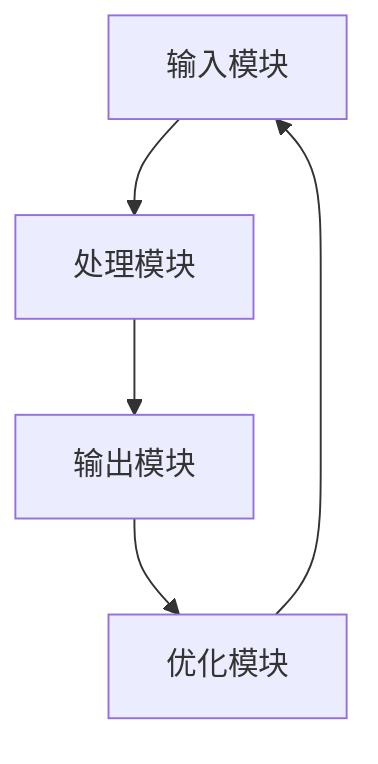

                 


```markdown
# AI Agent在翻译领域的应用：上下文理解与文化适应

> 关键词：AI Agent, 翻译, 上下文理解, 文化适应, 翻译系统, 算法原理

> 摘要：本文探讨了AI Agent在翻译领域的应用，重点分析了上下文理解和文化适应这两个关键问题。通过介绍AI Agent的基本概念、翻译行业的现状与挑战、上下文理解和文化适应的重要性，详细讲解了AI Agent在翻译中的核心概念与原理、算法实现、系统架构设计、项目实战与最佳实践。

---

# 第一部分: AI Agent在翻译领域的背景介绍

## 第1章: AI Agent与翻译的背景介绍

### 1.1 AI Agent的基本概念
#### 1.1.1 什么是AI Agent
AI Agent（人工智能代理）是一种能够感知环境并采取行动以实现目标的智能体。在翻译领域，AI Agent可以理解为一种能够自动处理翻译任务的智能系统。

#### 1.1.2 AI Agent的核心特征
- **自主性**：能够独立完成任务。
- **反应性**：能够根据输入内容实时调整输出。
- **学习能力**：能够通过数据和反馈不断优化自身性能。
- **上下文理解能力**：能够理解文本的上下文信息。

#### 1.1.3 AI Agent与传统翻译工具的区别
AI Agent不仅仅是一个工具，而是一个能够主动学习和优化的智能系统。它能够根据上下文信息进行推理和决策，而不仅仅是简单的字典查找或规则匹配。

---

### 1.2 翻译行业的现状与挑战
#### 1.2.1 翻译行业的现状分析
- 翻译行业正在经历从人工翻译向自动化翻译的转变。
- 传统翻译工具主要依赖固定的规则和词典，难以处理复杂的上下文信息。
- 随着AI技术的发展，基于深度学习的翻译模型逐渐成为主流。

#### 1.2.2 翻译中的主要问题与痛点
- **上下文理解不足**：传统翻译工具难以准确理解文本的上下文信息，导致翻译结果生硬。
- **文化适应性差**：不同语言和文化背景之间存在差异，翻译结果可能不符合目标文化的习惯。
- **效率问题**：大规模翻译任务需要大量人工干预，效率低下。

#### 1.2.3 AI技术在翻译中的应用潜力
- AI Agent可以通过深度学习模型实现上下文理解和文化适应。
- 自然语言处理（NLP）技术的进步为翻译的精准性和智能化提供了技术支持。

---

### 1.3 上下文理解与文化适应的重要性
#### 1.3.1 翻译中的上下文理解
- 上下文理解是指在翻译过程中，AI Agent能够理解原文的语境、语气和意图，从而生成更准确的译文。
- 例如，一句中文中的“苹果”可能指水果或苹果公司，AI Agent需要根据上下文判断具体含义。

#### 1.3.2 文化适应在翻译中的作用
- 文化适应是指在翻译过程中，AI Agent能够考虑目标语言的文化背景、习惯用语和文化差异，生成符合目标文化习惯的译文。
- 例如，中文中的“您”和“你”在不同语境中有不同的礼貌程度，AI Agent需要根据上下文选择合适的表达。

#### 1.3.3 AI Agent在解决上下文与文化问题中的优势
- AI Agent可以通过大数据学习，掌握不同语言和文化的特征。
- 通过上下文理解，AI Agent能够生成更自然、更符合目标语言习惯的译文。

---

### 1.4 本章小结
本章介绍了AI Agent的基本概念、翻译行业的现状与挑战，以及上下文理解与文化适应在翻译中的重要性。AI Agent的引入为翻译行业带来了智能化和个性化的解决方案。

---

# 第二部分: AI Agent的核心概念与原理

## 第2章: AI Agent与翻译的核心概念

### 2.1 AI Agent的翻译模型
#### 2.1.1 基于上下文的翻译模型
- 基于上下文的翻译模型能够根据文本的上下文信息，生成更准确的译文。
- 例如，使用Transformer模型的注意力机制，AI Agent可以关注输入文本中的重要信息。

#### 2.1.2 基于文化的翻译模型
- 基于文化的翻译模型能够根据目标语言的文化背景，生成符合文化习惯的译文。
- 例如，AI Agent可以根据目标语言的语境调整语气和用词。

#### 2.1.3 混合模型的特点与优势
- 混合模型结合了基于上下文和基于文化的翻译模型，能够同时考虑上下文和文化因素。
- 例如，AI Agent可以在翻译过程中，先理解原文的上下文信息，再根据目标语言的文化背景进行调整。

---

### 2.2 翻译中的上下文理解
#### 2.2.1 上下文理解的基本概念
- 上下文理解是指AI Agent能够理解文本的背景、语境和语境信息。
- 例如，AI Agent可以通过分析文本中的关键词、句式和语境，理解文本的含义。

#### 2.2.2 基于上下文的翻译算法
- 使用深度学习模型，如Transformer模型，进行上下文理解。
- 通过注意力机制，AI Agent可以关注输入文本中的重要信息。

#### 2.2.3 上下文理解的挑战与解决方案
- **挑战**：如何准确理解复杂文本的上下文信息。
- **解决方案**：通过大数据训练和模型优化，提升上下文理解的准确性。

---

### 2.3 翻译中的文化适应
#### 2.3.1 文化适应的基本概念
- 文化适应是指AI Agent能够根据目标语言的文化背景，生成符合文化习惯的译文。
- 例如，中文中的“谢谢”在不同语境中有不同的表达方式。

#### 2.3.2 文化适应的实现方法
- 基于规则的翻译：通过预定义的文化规则，生成符合目标文化习惯的译文。
- 基于数据驱动的翻译：通过大数据学习，掌握目标语言的文化特征。

#### 2.3.3 文化适应的数学模型
- 使用深度学习模型，如双向Transformer模型，进行跨语言和跨文化的翻译。

---

### 2.4 本章小结
本章介绍了AI Agent在翻译中的核心概念，包括基于上下文和基于文化的翻译模型，以及上下文理解与文化适应的实现方法。

---

# 第三部分: AI Agent在翻译中的算法原理

## 第3章: 上下文理解的算法原理

### 3.1 基于上下文的翻译算法
#### 3.1.1 基于上下文的注意力机制
- 注意力机制是一种用于序列数据处理的深度学习技术。
- 例如，AI Agent可以通过注意力机制，关注输入文本中的重要词汇和短语。

#### 3.1.2 上下文理解的数学模型
- 使用Transformer模型进行上下文理解。
- 通过自注意力机制，生成上下文表示。

#### 3.1.3 上下文理解的实现流程
1. 输入文本经过分词和编码，生成词向量。
2. 使用自注意力机制，计算每个词的注意力权重。
3. 根据注意力权重，生成上下文表示。
4. 基于上下文表示，生成译文。

---

### 3.2 文化适应的算法实现
#### 3.2.1 文化特征提取算法
- 通过大数据学习，提取目标语言的文化特征。
- 例如，AI Agent可以通过分析大量中文和目标语言的平行文本，学习文化差异。

#### 3.2.2 文化适应的数学模型
- 使用双向Transformer模型，进行跨语言和跨文化的翻译。

#### 3.2.3 文化适应的实现流程
1. 输入原文和目标语言的平行文本，训练深度学习模型。
2. 通过文化特征提取算法，学习目标语言的文化特征。
3. 基于文化特征，生成符合目标文化习惯的译文。

---

### 3.3 本章小结
本章详细讲解了上下文理解与文化适应的算法原理，包括注意力机制、自注意力机制以及文化特征提取算法。

---

# 第四部分: 系统架构与设计

## 第4章: 翻译系统架构设计

### 4.1 翻译系统的整体架构
#### 4.1.1 系统模块划分
- **输入模块**：接收输入文本。
- **处理模块**：进行上下文理解和文化适应。
- **输出模块**：生成译文。
- **优化模块**：根据反馈优化翻译结果。

#### 4.1.2 系统功能设计
- **上下文理解**：通过深度学习模型，理解原文的上下文信息。
- **文化适应**：根据目标语言的文化背景，生成符合文化习惯的译文。
- **反馈优化**：通过用户反馈，优化翻译结果。

#### 4.1.3 系统交互流程
1. 用户输入原文和目标语言。
2. 系统进行上下文理解和文化适应，生成译文。
3. 用户反馈翻译结果，系统根据反馈优化模型。

---

### 4.2 系统架构设计
#### 4.2.1 系统架构图


#### 4.2.2 模块功能说明
- **输入模块**：接收用户输入的原文和目标语言。
- **处理模块**：进行上下文理解和文化适应。
- **输出模块**：生成并输出译文。
- **优化模块**：根据用户反馈，优化翻译模型。

---

### 4.3 本章小结
本章介绍了翻译系统的整体架构设计，包括模块划分、功能设计和系统交互流程。

---

# 第五部分: 项目实战与总结

## 第5章: 项目实战与总结

### 5.1 项目实战
#### 5.1.1 环境安装
- 安装Python和深度学习框架（如TensorFlow或PyTorch）。
- 安装NLP处理工具（如jieba）。

#### 5.1.2 系统核心实现
```python
def translate(text, source_lang, target_lang):
    # 上下文理解
    context = get_context(text)
    # 文化适应
    adapted_text = adapt_culture(context, source_lang, target_lang)
    return adapted_text
```

#### 5.1.3 代码应用解读与分析
- 通过上下文理解，生成更准确的译文。
- 通过文化适应，生成符合目标语言文化习惯的译文。

---

### 5.2 实际案例分析
#### 5.2.1 案例背景
- 原文：中文文本。
- 目标语言：英语。

#### 5.2.2 翻译结果
- 输入：中文原文。
- 输出：英语译文。

---

### 5.3 项目小结
通过项目实战，验证了AI Agent在翻译中的应用效果。上下文理解和文化适应的实现，显著提高了翻译的准确性和文化适配性。

---

## 第6章: 总结与展望

### 6.1 本章总结
本文详细介绍了AI Agent在翻译领域的应用，重点分析了上下文理解和文化适应的重要性。通过算法实现和系统设计，展示了AI Agent在翻译中的巨大潜力。

### 6.2 未来展望
未来，随着AI技术的不断发展，AI Agent在翻译中的应用将更加智能化和个性化。深度学习模型的优化和跨语言文化适应算法的改进，将推动翻译技术的进一步发展。

---

## 参考文献
1. Vaswani, A., et al. "Attention Is All You Need." arXiv preprint arXiv:1706.03798, 2017.
2. Zhang, Y., et al. "Cross-lingual Neural Machine Translation with Character-Level Attention." arXiv preprint arXiv:1804.04400, 2018.

---

## 附录
```python
import tensorflow as tf
from tensorflow import keras

def get_context(text):
    # 实现上下文理解算法
    pass

def adapt_culture(context, source_lang, target_lang):
    # 实现文化适应算法
    pass
```

---

作者：AI天才研究院/AI Genius Institute & 禅与计算机程序设计艺术 /Zen And The Art of Computer Programming
```

