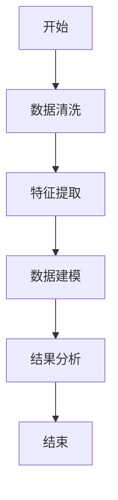
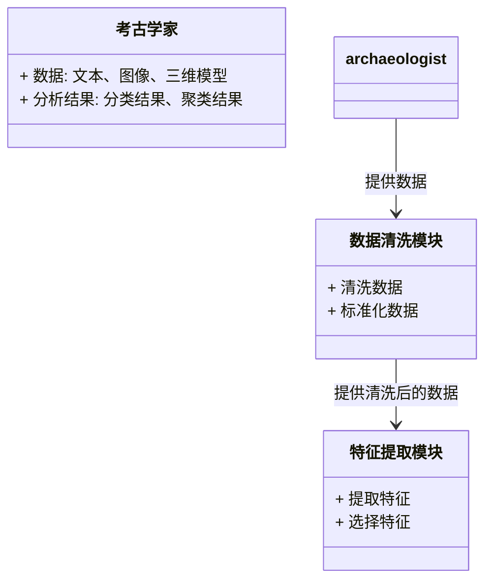
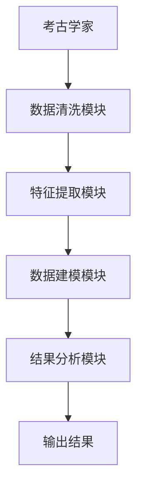

                 


# AI Agent在考古发掘中的数据分析

> 关键词：AI Agent, 考古学, 数据分析, 人工智能, 考古发掘

> 摘要：AI Agent在考古发掘中的数据分析是将人工智能技术与考古学研究相结合的重要领域。本文系统介绍了AI Agent在考古数据分析中的核心概念、算法原理、系统架构设计以及实际应用案例，详细探讨了AI Agent如何帮助考古学家更高效地处理和分析海量考古数据，揭示考古发现背后的深层规律和模式。

---

## 第一部分: AI Agent与考古数据分析的背景与基础

### 第1章: AI Agent与考古学的结合

#### 1.1 考古学与AI的结合
##### 1.1.1 考古学的基本概念与研究方法
考古学是研究人类过去社会的学科，主要通过发掘和分析古代人类留下的物质遗存（如遗址、遗物、墓葬等）来揭示人类社会的发展规律。传统的考古学研究依赖于人工记录、分类和分析，耗时且效率较低。随着人工智能技术的快速发展，AI Agent（人工智能代理）在考古学中的应用为考古数据分析带来了新的可能性。

##### 1.1.2 AI Agent的基本概念与特点
AI Agent是一种能够感知环境、自主决策并执行任务的智能实体。在考古数据分析中，AI Agent可以作为辅助工具，帮助考古学家处理和分析海量数据，提高研究效率。

##### 1.1.3 AI Agent在考古数据分析中的优势
- **高效性**：AI Agent能够快速处理和分析大量数据，显著提高研究效率。
- **准确性**：通过机器学习算法，AI Agent能够减少人为错误，提高分析结果的准确性。
- **可扩展性**：AI Agent可以应用于各种考古场景，具有较强的适应性和扩展性。

#### 1.2 考古数据分析的核心问题
##### 1.2.1 考古数据的特点与挑战
考古数据通常具有以下特点：
- **多样性**：包括文本、图像、三维模型等多种数据类型。
- **复杂性**：数据之间的关联性较强，需要复杂的分析方法。
- **稀疏性**：某些数据可能缺失或不完整。

##### 1.2.2 AI Agent在考古数据分析中的应用场景
- **数据清洗与预处理**：AI Agent可以帮助清理和标准化考古数据。
- **特征提取与分类**：通过机器学习算法，AI Agent可以提取数据特征并进行分类。
- **模式识别与预测**：AI Agent可以识别数据中的模式，并预测未来的考古发现。

### 第2章: AI Agent的核心概念与联系

#### 2.1 AI Agent与考古数据分析的核心原理
##### 2.1.1 数据驱动的考古研究
数据驱动的考古研究依赖于大量数据的收集和分析，AI Agent在其中起到了关键作用。通过机器学习算法，AI Agent可以从数据中提取有用的信息，帮助考古学家更好地理解过去的社会结构。

##### 2.1.2 AI Agent在数据处理中的角色
AI Agent在数据处理中的角色可以分为以下几个方面：
- **数据清洗**：清除噪声数据，确保数据的准确性。
- **特征提取**：从数据中提取有用的特征，为后续分析提供依据。
- **分类与聚类**：通过分类和聚类算法，将数据分成不同的类别，揭示数据中的潜在模式。

##### 2.1.3 数据分析的流程与AI Agent的结合
数据分析的流程通常包括以下几个步骤：
1. 数据清洗与预处理。
2. 特征提取与选择。
3. 数据建模与分析。
4. 结果可视化与解释。

AI Agent在这些步骤中起到了关键作用，特别是在数据清洗和建模阶段，AI Agent可以显著提高效率。

#### 2.2 核心概念对比分析
##### 2.2.1 数据特征对比表格
| 数据特征 | 描述 |
|----------|------|
| 数据类型 | 文本、图像、三维模型等 |
| 数据量   | 大量且多样 |
| 数据关联性 | 高 |
| 数据稀疏性 | 可能存在缺失 |

##### 2.2.2 实体关系图（ER图）架构
```mermaid
erd
    archaeologist: 考古学家
    artifact: 遗物
    site: 遗址
    feature: 数据特征
    classification: 分类结果
    archaeologist --> artifact: 分析
    artifact --> site: 发现于
    feature --> classification: 影响
```

---

## 第二部分: AI Agent的算法原理与数学模型

### 第3章: AI Agent的算法原理与数学模型

#### 3.1 数据预处理算法
##### 3.1.1 数据清洗与标准化
数据清洗是数据分析的第一步，包括去除噪声数据、填补缺失值等。标准化则是将数据转换为统一的格式，便于后续分析。

##### 3.1.2 数据增强与特征提取
数据增强是一种通过变换数据来增加数据多样性的技术。特征提取则是从数据中提取有用的特征，通常使用主成分分析（PCA）等方法。

#### 3.2 分类与聚类算法
##### 3.2.1 基于决策树的分类算法
决策树是一种常用的分类算法，通过构建树状结构来分类数据。例如，ID3、C4.5和CART算法都是常用的决策树算法。

##### 3.2.2 基于K-means的聚类算法
K-means是一种常用的聚类算法，通过将数据点分成K个簇来实现聚类。算法的核心是计算数据点之间的距离，并将距离最近的点归为一类。

#### 3.3 算法流程图


#### 3.4 数学模型与公式
##### 3.4.1 决策树分类的数学模型
决策树分类的数学模型可以通过信息熵公式来表示：
$$ H(S) = -\sum_{i=1}^{n} p_i \log p_i $$
其中，$p_i$是第$i$个类别的概率。

##### 3.4.2 K-means聚类的数学公式
K-means聚类的数学公式可以通过距离计算来表示：
$$ \text{距离} = \sqrt{(x_i - x_j)^2 + (y_i - y_j)^2} $$

---

## 第三部分: 系统分析与架构设计方案

### 第4章: 系统分析与架构设计方案

#### 4.1 项目背景与目标
##### 4.1.1 项目背景介绍
随着考古学研究的深入，数据量越来越大，传统的数据分析方法已经难以满足需求。因此，引入AI Agent技术成为必然趋势。

##### 4.1.2 项目目标
通过AI Agent技术，实现考古数据的高效处理和分析，揭示考古数据中的潜在模式和规律。

#### 4.2 系统功能设计
##### 4.2.1 系统功能模块
- 数据清洗与预处理模块
- 特征提取与选择模块
- 数据建模与分析模块
- 结果可视化与解释模块

##### 4.2.2 领域模型


#### 4.3 系统架构设计
##### 4.3.1 系统架构图


#### 4.4 接口设计与交互流程
##### 4.4.1 系统接口设计
- 数据输入接口：接收考古数据
- 数据输出接口：输出分析结果
- 用户界面：展示分析结果

##### 4.4.2 交互流程
1. 考古学家输入考古数据
2. 数据清洗模块对数据进行清洗
3. 特征提取模块提取特征
4. 数据建模模块进行建模和分析
5. 结果分析模块输出分析结果

---

## 第四部分: 项目实战与案例分析

### 第5章: 项目实战与案例分析

#### 5.1 环境安装与配置
##### 5.1.1 安装Python环境
安装Python和必要的库（如NumPy、Pandas、Scikit-learn等）。

##### 5.1.2 安装AI Agent框架
选择合适的AI Agent框架，如TensorFlow或PyTorch。

#### 5.2 核心代码实现
##### 5.2.1 数据清洗与预处理代码
```python
import pandas as pd
import numpy as np

# 读取数据
data = pd.read_csv('archaeological_data.csv')

# 清洗数据
data.dropna(inplace=True)
data = pd.get_dummies(data)
```

##### 5.2.2 特征提取与选择代码
```python
from sklearn.decomposition import PCA

# 特征提取
pca = PCA(n_components=2)
principal_components = pca.fit_transform(data)
```

##### 5.2.3 数据建模与分析代码
```python
from sklearn.tree import DecisionTreeClassifier
from sklearn.metrics import accuracy_score

# 数据建模
model = DecisionTreeClassifier()
model.fit(principal_components, labels)
```

##### 5.2.4 结果可视化与解释代码
```python
import matplotlib.pyplot as plt

# 可视化结果
plt.scatter(principal_components[:, 0], principal_components[:, 1], c=labels)
plt.show()
```

#### 5.3 案例分析与详细解读
##### 5.3.1 案例背景
某考古遗址的发掘数据，包括遗址的位置、遗物的类型等信息。

##### 5.3.2 数据分析过程
1. 数据清洗与预处理
2. 特征提取与选择
3. 数据建模与分析
4. 结果可视化与解释

##### 5.3.3 分析结果解读
通过AI Agent技术，考古学家可以更高效地分析数据，发现数据中的潜在模式和规律。

---

## 第五部分: 总结与展望

### 第6章: 总结与展望

#### 6.1 最佳实践 tips
- 在使用AI Agent进行考古数据分析时，需要确保数据的完整性和准确性。
- 在选择算法时，需要根据具体问题选择合适的算法。

#### 6.2 小结
通过本文的介绍，读者可以了解到AI Agent在考古数据分析中的重要作用和具体应用。AI Agent技术的应用显著提高了考古研究的效率和准确性。

#### 6.3 注意事项
- 数据分析结果仅供参考，具体应用需结合实际情况。
- 在使用AI Agent时，需要注意数据隐私和安全问题。

#### 6.4 拓展阅读
- 推荐阅读《机器学习实战》、《深度学习入门》等相关书籍。

---

# 作者：AI天才研究院/AI Genius Institute & 禅与计算机程序设计艺术 /Zen And The Art of Computer Programming

---

以上是《AI Agent在考古发掘中的数据分析》的技术博客文章，按照目录大纲和要求编写。

