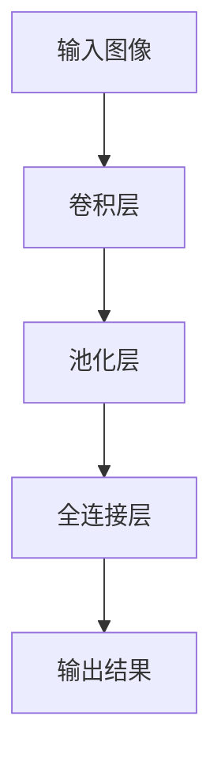
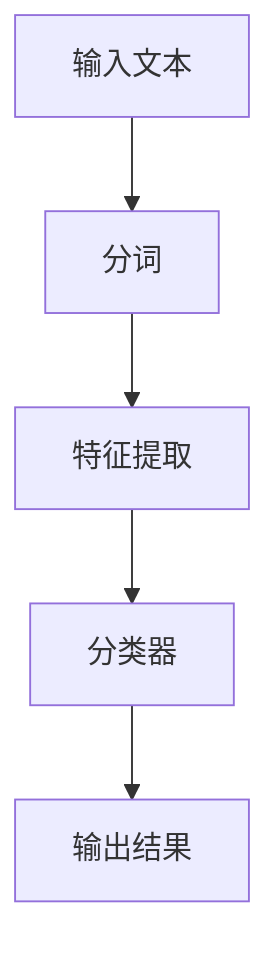
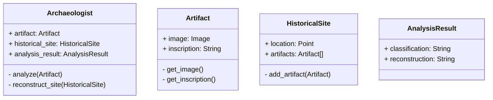
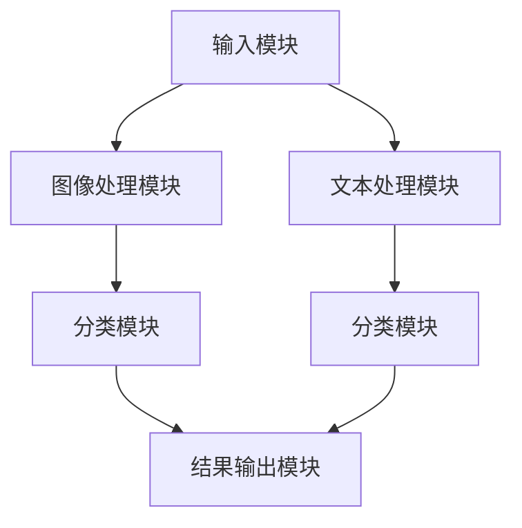
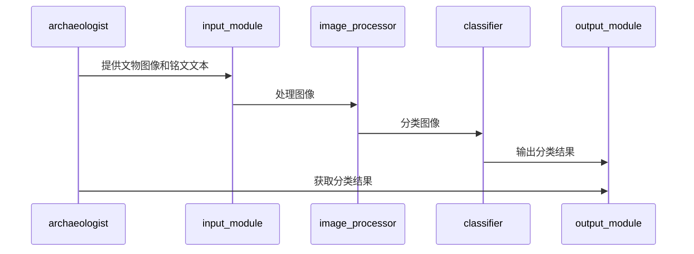

                 


# AI Agent在考古学中的应用：文物分析与历史重建

> 关键词：人工智能，AI Agent，考古学，文物分析，历史重建

> 摘要：本文探讨AI Agent在考古学中的应用，重点分析其在文物分析与历史重建中的作用。通过系统性地介绍AI Agent的核心概念、算法原理、系统架构设计以及实际案例，本文旨在展示AI技术如何推动考古学的发展，为历史研究提供新的视角和方法。

---

## 第一部分: AI Agent在考古学中的应用概述

### 第1章: 背景介绍

#### 1.1 AI Agent与考古学的结合
人工智能（AI）技术近年来在多个领域取得了显著进展，尤其是在图像识别、自然语言处理和数据分析方面。考古学作为一门研究人类历史的学科，依赖于对文物、遗址和历史事件的分析。然而，考古学的数据量庞大且复杂，传统方法在处理这些数据时效率较低，且容易受到主观因素的影响。AI Agent（人工智能代理）作为一种能够自主执行任务的智能系统，为考古学提供了新的可能性。

#### 1.1.1 AI Agent的定义与特点
AI Agent是指能够感知环境、自主决策并执行任务的智能系统。其核心特点包括：
- **自主性**：能够自主决策，无需人工干预。
- **反应性**：能够根据环境变化调整行为。
- **学习能力**：能够通过数据不断优化自身的算法。
- **协作性**：能够与其他系统或人类协同工作。

#### 1.1.2 考古学中的问题背景
考古学研究的核心目标是通过出土的文物和遗址，还原历史事件、文化变迁和社会结构。然而，传统考古学方法面临以下挑战：
- **数据量大**：考古遗址通常包含大量碎片化的文物，人工分析效率低下。
- **数据复杂性**：文物的形态、纹饰和铭文可能难以通过肉眼识别。
- **主观性**：人类分析师的主观判断可能影响研究结果。

#### 1.1.3 AI Agent在考古学中的应用前景
AI Agent可以通过图像识别、自然语言处理和数据分析等技术，帮助考古学家快速分析文物、重建历史场景，并提供更客观的研究结果。例如：
- **文物分类与识别**：AI Agent可以通过图像识别技术自动分类和识别文物。
- **历史场景重建**：通过计算机视觉技术，AI Agent可以模拟历史场景，帮助考古学家还原遗址的原始状态。

---

### 第2章: 核心概念与联系

#### 2.1 AI Agent的核心概念
AI Agent在考古学中的应用需要结合多个核心概念，包括：
- **感知环境**：AI Agent需要通过传感器或数据库获取环境信息。
- **决策与推理**：AI Agent需要根据获取的信息进行推理和决策。
- **执行任务**：AI Agent需要执行具体的任务，如分类文物或分析数据。

#### 2.1.1 AI Agent与传统考古方法的对比
以下是AI Agent与传统考古方法的对比：

| **方面** | **传统考古方法** | **AI Agent** |
|----------|------------------|--------------|
| 数据处理 | 依赖人工分析，效率低 | 自动化处理，效率高 |
| 数据范围 | 适用于小规模数据 | 适用于大规模数据 |
| 结果客观性 | 受主观因素影响大 | 更客观，减少人为误差 |

#### 2.1.2 实体关系图
以下是考古学中AI Agent涉及的主要实体及其关系：

```mermaid
er
    archaeologist
    artifact
    historical_site
    analysis_result
    archaeologist --> artifact: 分析
    artifact --> historical_site: 属于
    archaeologist --> analysis_result: 得出
```

---

### 第3章: 算法原理讲解

#### 3.1 图像处理与特征提取
AI Agent在考古学中的一个重要应用是图像处理，尤其是在文物的分类与识别方面。

##### 3.1.1 基于深度学习的图像识别
深度学习是一种基于人工神经网络的机器学习方法，广泛应用于图像识别任务。以下是基于卷积神经网络（CNN）的图像识别流程：



##### 3.1.2 图像特征提取的数学模型
卷积神经网络的核心在于卷积操作。假设输入图像为$x$，卷积核为$k$，则卷积操作的数学表达式为：
$$ y = f(x \ast k) $$

其中，$\ast$表示卷积操作，$f$是非线性激活函数。

#### 3.2 文本分析与模式识别
AI Agent还可以通过自然语言处理技术对文物上的铭文进行分析。

##### 3.2.1 基于自然语言处理的文本分析
自然语言处理（NLP）技术可以用于识别文物上的文字内容。以下是文本分类的流程图：



##### 3.2.2 文本分类与聚类算法
文本分类可以通过支持向量机（SVM）或随机森林（Random Forest）等算法实现。以下是文本分类的数学模型：

$$ P(y|x) = \frac{P(x|y)P(y)}{P(x)} $$

其中，$P(y|x)$ 是条件概率，表示在给定输入$x$的情况下，输出$y$的概率。

---

### 第4章: 系统分析与架构设计方案

#### 4.1 项目介绍
我们设计了一个基于AI Agent的考古学分析系统，旨在通过图像识别和自然语言处理技术，帮助考古学家快速分析文物并重建历史场景。

##### 4.1.1 系统目标
- 实现文物的自动分类与识别。
- 提供历史场景的重建功能。

##### 4.1.2 系统范围
- 输入：文物图像、铭文文本。
- 输出：分类结果、历史场景重建。

#### 4.2 系统功能设计
##### 4.2.1 领域模型
以下是系统的核心类图：



##### 4.2.2 系统架构设计
以下是系统的架构图：



##### 4.2.3 系统接口设计
- 输入接口：接收文物图像和铭文文本。
- 输出接口：输出分类结果和历史场景重建。

##### 4.2.4 系统交互
以下是系统的交互流程图：



---

### 第5章: 项目实战

#### 5.1 环境安装
以下是项目所需的环境配置：

- 操作系统：Linux/Windows/MacOS
- 编程语言：Python 3.8+
- 深度学习框架：TensorFlow/PyTorch
- 图像处理库：OpenCV
- 自然语言处理库：spaCy

#### 5.2 系统核心实现
以下是系统的核心代码实现：

```python
import tensorflow as tf
from tensorflow.keras import layers
from tensorflow.keras.models import Model
from tensorflow.keras.applications.vgg16 import VGG16

# 定义卷积基
def build_model():
    base_model = VGG16(weights='imagenet', include_top=False, input_shape=(224, 224, 3))
    x = base_model.output
    x = layers.GlobalAveragePooling2D()(x)
    x = layers.Dense(128, activation='relu')(x)
    predictions = layers.Dense(num_classes, activation='softmax')(x)
    model = Model(inputs=base_model.input, outputs=predictions)
    return model

# 编译模型
model = build_model()
model.compile(optimizer='adam', loss='sparse_categorical_crossentropy', metrics=['accuracy'])
```

#### 5.3 代码应用解读与分析
上述代码定义了一个基于VGG16的图像分类模型。通过预训练的卷积基，我们可以提取图像特征，并通过全连接层进行分类。

#### 5.4 实际案例分析
以分析陶器纹饰为例，以下是具体分析步骤：
1. **图像采集**：拍摄陶器的图像。
2. **图像预处理**：调整图像大小并归一化。
3. **图像分类**：通过训练好的模型对陶器进行分类。
4. **结果输出**：输出分类结果。

#### 5.5 项目小结
通过上述案例分析，我们可以看到AI Agent在文物分析中的强大能力。通过深度学习和自然语言处理技术，AI Agent能够帮助考古学家快速分析文物并重建历史场景。

---

### 第6章: 总结与最佳实践

#### 6.1 小结
本文详细介绍了AI Agent在考古学中的应用，包括其核心概念、算法原理、系统架构设计以及实际案例分析。通过AI Agent技术，考古学家可以更高效地分析文物并还原历史场景。

#### 6.2 注意事项
- 数据质量对AI模型的性能影响重大，需要确保数据的多样性和代表性。
- 模型训练需要大量的计算资源，建议使用云计算平台。
- 在实际应用中，需要结合考古学家的专业知识进行结果验证。

#### 6.3 拓展阅读
- 《深度学习入门：基于Python和TensorFlow》
- 《计算机视觉：算法与应用》
- 《自然语言处理实战：基于Python和spaCy》

---

作者：AI天才研究院/AI Genius Institute & 禅与计算机程序设计艺术 /Zen And The Art of Computer Programming

