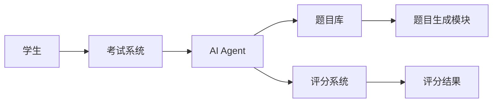
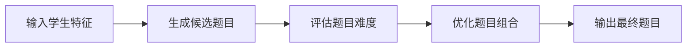
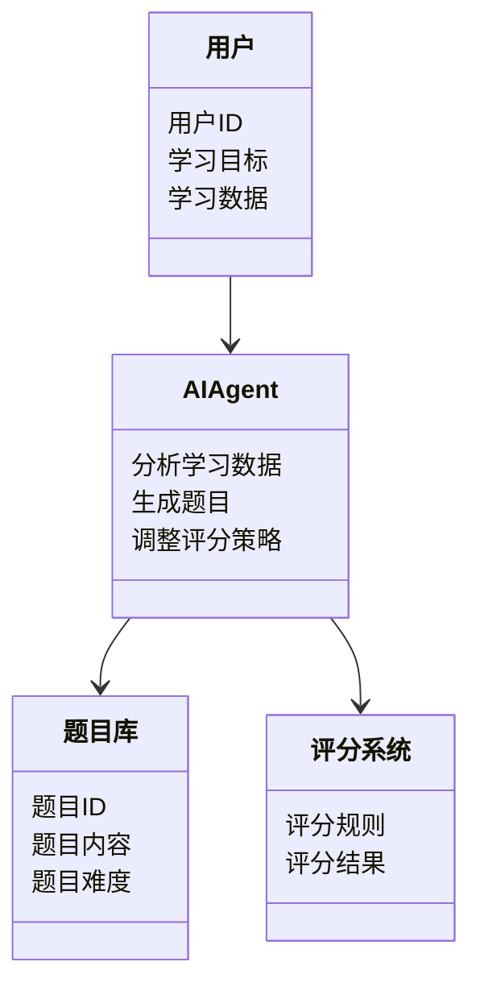
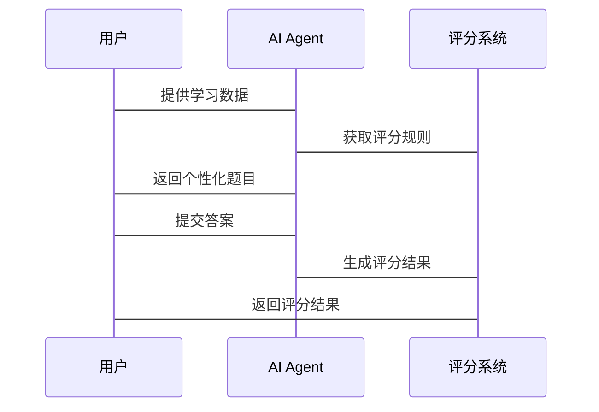

                 

<think>
好的，我将按照您的要求逐步撰写这篇文章。为了确保文章的完整性和专业性，我将从以下几个步骤入手：

1. **确定文章结构**：基于您提供的目录大纲，确认每个章节的具体内容和深度。
2. **撰写每个章节**：从背景介绍、核心概念、算法原理到系统架构设计、项目实战和总结，逐步展开。
3. **加入详细内容**：每个部分将包括必要的背景知识、技术细节、图表解释和实际案例分析，确保内容丰富且易于理解。
4. **检查与优化**：在完成初稿后，我会仔细检查逻辑是否清晰，内容是否完整，图表是否准确，确保最终文章符合您的要求。

让我们开始吧！

---

# AI Agent在考试系统中的应用：自适应题目生成与评分

> **关键词**：AI Agent, 自适应考试系统, 个性化学习, 智能评分, 深度学习  
> **摘要**：本文详细探讨了AI Agent在考试系统中的应用，重点介绍了自适应题目生成与评分的核心原理、算法实现及系统架构。通过对比传统考试系统，分析了AI Agent的优势，并结合实际案例，展示了如何利用深度学习技术实现个性化学习体验。

---

# 第一部分: AI Agent在考试系统中的应用概述

---

# 第1章: AI Agent与考试系统概述

## 1.1 AI Agent的基本概念

### 1.1.1 AI Agent的定义
AI Agent（人工智能代理）是指能够感知环境、执行任务并做出决策的智能体。在考试系统中，AI Agent可以用于自适应题目生成和智能评分，从而为用户提供个性化的学习体验。

### 1.1.2 AI Agent的核心特征
- **自主性**：能够在没有人工干预的情况下独立运行。
- **反应性**：能够根据环境变化实时调整行为。
- **学习能力**：通过数据不断优化自身的决策模型。

### 1.1.3 AI Agent在教育领域的应用潜力
AI Agent可以通过分析学生的学习行为和能力，动态调整考试内容，从而实现个性化教学。

---

## 1.2 考试系统的发展历程

### 1.2.1 传统考试系统的局限性
传统考试系统通常基于固定题库，无法根据学生的能力动态调整题目难度，导致学习效果不理想。

### 1.2.2 智能化考试系统的兴起
随着人工智能技术的发展，智能化考试系统逐渐兴起，能够根据学生的学习情况实时调整考试内容。

### 1.2.3 自适应考试系统的概念
自适应考试系统是一种基于AI技术的考试系统，能够根据学生的能力和表现动态调整题目难度和内容。

---

## 1.3 AI Agent在考试系统中的应用背景

### 1.3.1 教育技术的革新需求
传统考试系统无法满足个性化学习的需求，教育技术的革新迫在眉睫。

### 1.3.2 数据驱动的个性化学习
通过收集和分析学生的学习数据，AI Agent可以为每个学生提供个性化的学习建议和考试内容。

### 1.3.3 自适应学习的理论基础
自适应学习基于学习科学理论，强调根据学生的学习状态动态调整教学内容和策略。

---

## 1.4 本章小结
本章介绍了AI Agent的基本概念、考试系统的发展历程以及自适应考试系统的应用背景，为后续章节的深入探讨奠定了基础。

---

# 第二部分: AI Agent的核心概念与原理

---

# 第2章: AI Agent的核心概念与联系

## 2.1 AI Agent的核心原理

### 2.1.1 问题背景与目标分析
AI Agent在考试系统中的目标是通过分析学生的能力和需求，生成适合的题目并进行智能评分。

### 2.1.2 AI Agent的决策机制
AI Agent通过收集学生的学习数据，利用机器学习模型进行分析，生成适合的题目并实时调整考试策略。

### 2.1.3 自适应算法的实现原理
自适应算法通过不断迭代优化，根据学生的表现调整题目难度和内容，确保学习效果最大化。

---

## 2.2 核心概念对比分析

### 2.2.1 AI Agent与传统考试系统对比
| 特性               | 传统考试系统               | AI Agent驱动的考试系统       |
|--------------------|----------------------------|------------------------------|
| 题目生成           | 固定题库                   | 动态生成                     |
| 评分方式           | 人工评分或固定规则         | 智能评分                     |
| 个性化支持         | 较差                      | 优秀                        |

### 2.2.2 自适应题目生成与评分的差异
自适应题目生成根据学生的能力动态调整题目难度，而评分系统则根据学生的表现实时调整评分标准。

### 2.2.3 用户需求与系统响应的关联
用户的需求（如学习目标、能力水平）直接影响AI Agent生成的题目和评分策略。

---

## 2.3 实体关系与架构分析



---

## 2.4 本章小结
本章详细分析了AI Agent的核心概念及其在考试系统中的应用原理，通过对比传统考试系统，突出了AI Agent的优势。

---

# 第三部分: 自适应题目生成与评分的算法原理

---

# 第3章: 自适应题目生成算法

## 3.1 生成模型的原理

### 3.1.1 基于AI Agent的生成流程
AI Agent首先收集学生的学习数据，分析其能力水平，然后利用深度学习模型生成适合的题目。

### 3.1.2 深度学习模型的训练过程
1. 数据预处理：收集学生的学习数据，包括历史成绩、答题时间、错误率等。
2. 模型训练：利用神经网络模型（如LSTM或Transformer）训练生成模型。
3. 模型优化：通过反向传播算法不断优化模型参数，提升生成题目的准确性和相关性。

### 3.1.3 模型的评估与优化
通过验证集评估生成模型的性能，使用准确率、召回率等指标进行优化。

---

## 3.2 算法实现与流程图



---

## 3.3 数学模型与公式

### 3.3.1 题目难度计算公式
$$难度 = \frac{用户能力}{题目复杂度}$$

### 3.3.2 用户能力评估公式
$$能力 = \sum_{i=1}^{n} (题目难度_i \times 用户表现_i)$$

---

## 3.4 本章小结
本章详细讲解了自适应题目生成的算法原理，包括生成模型的训练过程、流程图和数学公式，为后续章节的系统实现奠定了基础。

---

# 第四部分: 系统架构设计与实现

---

# 第4章: 系统架构设计与实现

## 4.1 系统功能设计

### 4.1.1 领域模型设计


---

## 4.2 系统架构设计

### 4.2.1 系统架构图


---

## 4.3 系统接口设计

### 4.3.1 用户接口
- 输入：用户ID、学习目标
- 输出：个性化题目列表、评分结果

### 4.3.2 AI Agent接口
- 输入：用户数据、题目生成请求
- 输出：生成题目、评分规则

---

## 4.4 系统交互流程

### 4.4.1 交互流程图


---

## 4.5 本章小结
本章详细设计了系统的架构和接口，并通过流程图展示了系统的交互过程，为后续的项目实现提供了指导。

---

# 第五部分: 项目实战

---

# 第5章: 项目实战与分析

## 5.1 项目环境配置

### 5.1.1 开发工具
- Python 3.8+
- TensorFlow 2.0+
- Jupyter Notebook

### 5.1.2 数据集
- 学生学习数据：包括历史成绩、答题时间、错误率等。

---

## 5.2 核心代码实现

### 5.2.1 AI Agent实现

```python
class AI-Agent:
    def __init__(self, model):
        self.model = model

    def analyze_student(self, student_data):
        # 分析学生数据，生成学习报告
        pass

    def generate_questions(self, student_report):
        # 根据学习报告生成题目
        pass

    def adjust_scoring(self, questions, student_response):
        # 根据学生回答调整评分策略
        pass
```

### 5.2.2 评分系统实现

```python
class Scoring-System:
    def __init__(self, scoring_rules):
        self.scoring_rules = scoring_rules

    def score_question(self, question, response):
        # 根据评分规则生成评分结果
        pass

    def update_rules(self, feedback):
        # 根据反馈更新评分规则
        pass
```

---

## 5.3 代码解读与分析

### 5.3.1 AI Agent代码解读
- `analyze_student`方法：分析学生的学习数据，生成学习报告。
- `generate_questions`方法：根据学习报告生成适合的题目。
- `adjust_scoring`方法：根据学生回答调整评分策略。

### 5.3.2 评分系统代码解读
- `score_question`方法：根据评分规则生成评分结果。
- `update_rules`方法：根据反馈更新评分规则。

---

## 5.4 实际案例分析

### 5.4.1 案例背景
假设一个学生在数学考试中表现不佳，AI Agent根据其学习数据生成针对性的题目，并实时调整评分策略。

### 5.4.2 案例分析
1. AI Agent分析学生的数学能力，发现其在代数部分存在薄弱环节。
2. 根据分析结果，生成多道代数题目，并实时调整题目难度。
3. 学生完成题目后，AI Agent根据回答生成评分结果，并提供针对性的学习建议。

---

## 5.5 本章小结
本章通过实际案例展示了AI Agent在考试系统中的应用，详细解读了核心代码并分析了系统的实现过程。

---

# 第六部分: 总结与展望

---

# 第6章: 总结与展望

## 6.1 最佳实践 Tips
- 定期更新题库，保持题目的多样性。
- 根据学生反馈优化评分规则，提升系统性能。
- 结合多种AI技术（如NLP、计算机视觉）进一步提升系统能力。

---

## 6.2 小结
本文详细探讨了AI Agent在考试系统中的应用，从核心概念到算法实现，再到系统架构设计，全面分析了自适应题目生成与评分的实现过程。

---

## 6.3 注意事项
- 确保数据安全，保护学生隐私。
- 定期维护系统，确保其稳定运行。
- 根据实际需求调整系统参数，提升用户体验。

---

## 6.4 拓展阅读
- 《深度学习与自适应教育系统》
- 《AI技术在教育领域的创新应用》

---

# 作者：AI天才研究院/AI Genius Institute & 禅与计算机程序设计艺术 /Zen And The Art of Computer Programming

---

感谢您的耐心阅读！如果对本文有任何疑问或建议，请随时与我们联系。

