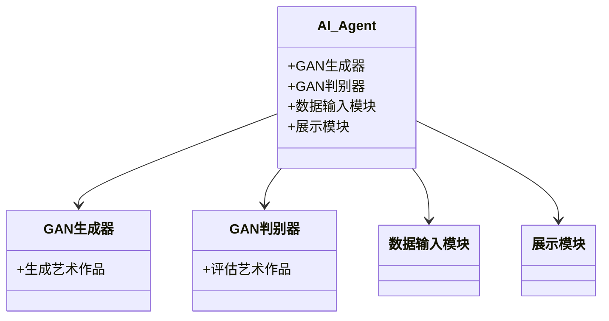
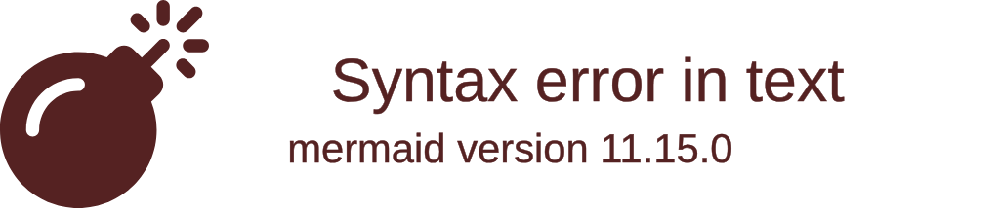
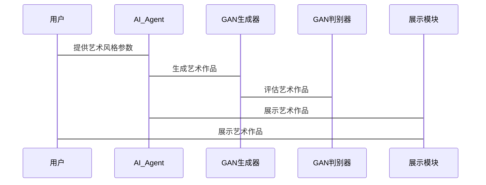

                 


# AI Agent在艺术创作中的应用：新形式探索

> 关键词：AI Agent，艺术创作，生成对抗网络，变体自编码器，艺术市场

> 摘要：本文探讨了AI Agent在艺术创作中的应用，分析了其如何通过生成对抗网络和变体自编码器等技术实现艺术创作的数字化转型，以及在艺术市场和法律层面的影响。

---

## 第一部分: AI Agent在艺术创作中的背景与概念

### 第1章: AI Agent与艺术创作的背景

#### 1.1 AI Agent的基本概念
##### 1.1.1 什么是AI Agent
AI Agent（人工智能代理）是指能够感知环境并采取行动以实现目标的智能系统。在艺术创作中，AI Agent可以作为工具或主体，辅助或独立完成艺术作品的创作。

##### 1.1.2 AI Agent的核心特征
- **自主性**：AI Agent能够自主决策，无需外部干预。
- **反应性**：能够根据环境输入实时调整创作过程。
- **学习能力**：通过数据和反馈不断优化创作结果。

##### 1.1.3 AI Agent与传统艺术创作的区别
传统艺术创作主要依赖人类的直觉和经验，而AI Agent则是基于数据和算法进行创作，能够快速生成大量作品，但缺乏人类的情感和主观性。

#### 1.2 艺术创作的数字化转型
##### 1.2.1 数字化艺术的兴起
随着数字技术的发展，越来越多的艺术作品开始采用数字形式创作和展示。数字化艺术不仅包括数字绘画、数字音乐，还包括虚拟现实艺术等新兴形式。

##### 1.2.2 AI技术对艺术创作的影响
AI技术的引入使得艺术创作更加高效和多样化。AI Agent能够通过学习海量的艺术作品，模仿不同风格的艺术家，甚至创造出全新的艺术风格。

##### 1.2.3 新形式艺术创作的定义与特点
新形式艺术创作是指利用AI技术生成的艺术作品，具有以下特点：
- **自动化**：AI Agent可以自动完成从灵感到成品的创作过程。
- **多样性**：能够生成多种风格和形式的艺术作品。
- **互动性**：部分AI生成的艺术作品具有与观众互动的功能。

---

### 第2章: AI Agent在艺术创作中的应用背景

#### 2.1 艺术创作的现状与挑战
##### 2.1.1 传统艺术创作的局限性
传统艺术创作依赖于艺术家的个人能力和经验，创作效率较低，且难以快速适应市场需求。

##### 2.1.2 数字化艺术创作的机遇与挑战
数字化艺术创作提供了更多的工具和可能性，但也面临技术复杂性和创意独特性的挑战。

##### 2.1.3 AI技术如何解决艺术创作中的问题
AI技术可以通过自动化和智能化的方式，解决传统艺术创作中的效率和多样性问题，同时降低创作门槛。

#### 2.2 AI Agent在艺术创作中的应用前景
##### 2.2.1 新形式艺术创作的潜力
AI Agent能够生成传统艺术无法实现的复杂图案和抽象风格，为艺术创作带来新的可能性。

##### 2.2.2 AI Agent在艺术市场中的角色
AI Agent可以作为艺术创作工具，帮助艺术家快速生成作品，也可以作为独立的艺术主体，直接参与艺术市场。

##### 2.2.3 艺术创作与AI技术结合的未来趋势
随着AI技术的不断进步，艺术创作将更加依赖于AI Agent，同时人类艺术家与AI Agent的协作也将成为主流模式。

---

## 第二部分: AI Agent的核心概念与技术原理

### 第3章: AI Agent的核心概念与原理

#### 3.1 AI Agent的定义与分类
##### 3.1.1 AI Agent的定义
AI Agent是一种能够感知环境并采取行动以实现目标的智能系统，广泛应用于各个领域，包括艺术创作。

##### 3.1.2 基于规则的AI Agent
基于规则的AI Agent通过预定义的规则和逻辑进行创作，适用于简单的艺术形式，如几何图案生成。

##### 3.1.3 基于学习的AI Agent
基于学习的AI Agent通过机器学习算法（如深度学习）从海量数据中学习艺术风格和创作技巧。

##### 3.1.4 基于生成模型的AI Agent
基于生成模型的AI Agent（如GAN和VAE）能够生成高质量的艺术作品，适用于复杂艺术形式的创作。

#### 3.2 AI Agent的创作机制
##### 3.2.1 基于规则的创作过程
基于规则的AI Agent通过预定义的规则生成艺术作品，例如通过算法生成抽象画作的线条和颜色。

##### 3.2.2 基于学习的创作过程
基于学习的AI Agent通过训练模型生成艺术作品，例如通过GAN生成逼真的人物画像。

##### 3.2.3 基于生成模型的创作过程
基于生成模型的AI Agent（如GAN和VAE）通过生成对抗网络或变体自编码器生成艺术作品，适用于复杂艺术形式的创作。

#### 3.3 AI Agent与人类艺术家的协作
##### 3.3.1 人类与AI Agent的协作模式
人类艺术家可以与AI Agent协作，利用AI Agent生成灵感或辅助完成部分创作过程。

##### 3.3.2 AI Agent作为创作工具的角色
AI Agent可以作为创作工具，帮助艺术家快速生成大量艺术作品，降低创作成本和时间。

##### 3.3.3 AI Agent作为创作主体的可能性
虽然目前AI Agent更多作为辅助工具，但未来有可能发展成为独立的创作主体，独立生成艺术作品。

---

## 第三部分: AI Agent在艺术创作中的技术实现

### 第4章: AI Agent的算法原理与实现

#### 4.1 基于生成对抗网络（GAN）的AI Agent
##### 4.1.1 GAN的基本原理
GAN由生成器和判别器组成，生成器通过生成样本欺骗判别器，判别器通过区分真实样本和生成样本进行训练。

##### 4.1.2 GAN在艺术创作中的应用
GAN可以用于生成图像、音乐等艺术作品，例如生成抽象画作或音乐旋律。

##### 4.1.3 GAN的优缺点
- **优点**：生成质量高，适用于复杂艺术形式的创作。
- **缺点**：训练过程复杂，需要大量计算资源。

##### 4.1.4 GAN的数学模型
生成器和判别器的损失函数分别为：
$$ \mathcal{L}_G = -\mathbb{E}_{z}[\log(D(G(z)))] $$
$$ \mathcal{L}_D = -\mathbb{E}_{x}[\log(D(x))] - \mathbb{E}_{z}[\log(1 - D(G(z)))] $$

#### 4.2 基于变体自编码器（VAE）的AI Agent
##### 4.2.1 VAE的基本原理
VAE通过编码器将输入数据编码为隐变量，再通过解码器生成数据，适用于生成模型的训练。

##### 4.2.2 VAE在艺术创作中的应用
VAE可以用于生成图像、音乐等艺术作品，例如生成风格化的图片或音乐。

##### 4.2.3 VAE的优缺点
- **优点**：生成过程更加稳定，适用于简单艺术形式的创作。
- **缺点**：生成质量相对较低，适用于简单艺术形式的创作。

##### 4.2.4 VAE的数学模型
编码器和解码器的损失函数分别为：
$$ \mathcal{L} = \mathbb{E}_{x}[\mathbb{E}_{z| x}[ \log p(x|z) ]] + \text{KL}(q(z|x) || p(z)) $$

#### 4.3 基于强化学习的AI Agent
##### 4.3.1 强化学习的基本原理
强化学习通过奖励机制训练智能体在环境中采取行动以实现目标。

##### 4.3.2 强化学习在艺术创作中的应用
强化学习可以用于生成艺术作品，例如通过奖励机制训练AI Agent生成符合人类审美的艺术作品。

##### 4.3.3 强化学习的数学模型
奖励函数和策略梯度分别为：
$$ R(s, a) $$
$$ \nabla \theta \left( \sum_{t} \gamma^t R(s_t, a_t) \right) $$

---

## 第四部分: AI Agent的艺术创作系统设计与实现

### 第5章: 系统架构设计与实现

#### 5.1 问题场景介绍
本文将设计一个基于GAN的AI Agent艺术创作系统，用于生成抽象画作。

#### 5.2 系统功能设计
##### 5.2.1 功能模块
- 数据输入模块：接收用户输入的艺术风格参数。
- 生成器模块：通过GAN生成艺术作品。
- 判别器模块：对生成的艺术作品进行评估。
- 展示模块：将生成的艺术作品展示给用户。

##### 5.2.2 领域模型（Mermaid类图）


#### 5.3 系统架构设计（Mermaid架构图）


#### 5.4 系统接口设计
- 用户界面：接收用户输入的艺术风格参数，展示生成的艺术作品。
- API接口：提供生成艺术作品的API调用。

#### 5.5 系统交互设计（Mermaid序列图）


---

## 第五部分: 项目实战

### 第6章: 项目实战

#### 6.1 环境安装
- 安装Python和必要的库（如TensorFlow、Keras等）。
- 安装艺术创作所需的工具和库。

#### 6.2 系统核心实现源代码
##### 6.2.1 GAN生成器代码
```python
import tensorflow as tf
from tensorflow.keras import layers

def build_generator():
    model = tf.keras.Sequential()
    model.add(layers.Dense(256, activation='relu', input_shape=(100,)))
    model.add(layers.BatchNormalization())
    model.add(layers.Dense(512, activation='relu'))
    model.add(layers.BatchNormalization())
    model.add(layers.Dense(784, activation='sigmoid'))
    return model
```

##### 6.2.2 GAN判别器代码
```python
def build_discriminator():
    model = tf.keras.Sequential()
    model.add(layers.Dense(256, activation='relu', input_shape=(784,)))
    model.add(layers.BatchNormalization())
    model.add(layers.Dense(512, activation='relu'))
    model.add(layers.BatchNormalization())
    model.add(layers.Dense(1, activation='sigmoid'))
    return model
```

#### 6.3 代码应用解读与分析
通过上述代码，可以实现一个简单的GAN模型，用于生成艺术作品。生成器和判别器通过交替训练，逐步优化生成作品的质量。

#### 6.4 实际案例分析和详细讲解剖析
以生成抽象画作为例，通过训练GAN模型，生成符合用户指定风格的抽象画作。用户可以调整艺术风格参数，生成不同风格的艺术作品。

#### 6.5 项目小结
通过本项目，我们可以看到AI Agent在艺术创作中的巨大潜力。通过不断优化算法和模型，未来AI Agent将能够生成更加复杂和多样化的艺术作品。

---

## 第六部分: 总结与展望

### 第7章: 总结与展望

#### 7.1 最佳实践 tips
- 在使用AI Agent进行艺术创作时，建议结合人类艺术家的创意和AI Agent的技术优势，实现人机协作。
- 定期更新模型和算法，以适应艺术市场的需求和变化。

#### 7.2 小结
本文探讨了AI Agent在艺术创作中的应用，分析了其如何通过生成对抗网络和变体自编码器等技术实现艺术创作的数字化转型，以及在艺术市场和法律层面的影响。

#### 7.3 注意事项
- 在使用AI Agent进行艺术创作时，需注意版权和法律问题。
- 需谨慎处理艺术创作的原创性和独特性。

#### 7.4 拓展阅读
- 《生成对抗网络：GAN的原理与实现》
- 《AI与艺术：新形式的探索与实践》
- 《艺术市场与AI技术的结合》

---

## 作者：AI天才研究院/AI Genius Institute & 禅与计算机程序设计艺术 /Zen And The Art of Computer Programming

