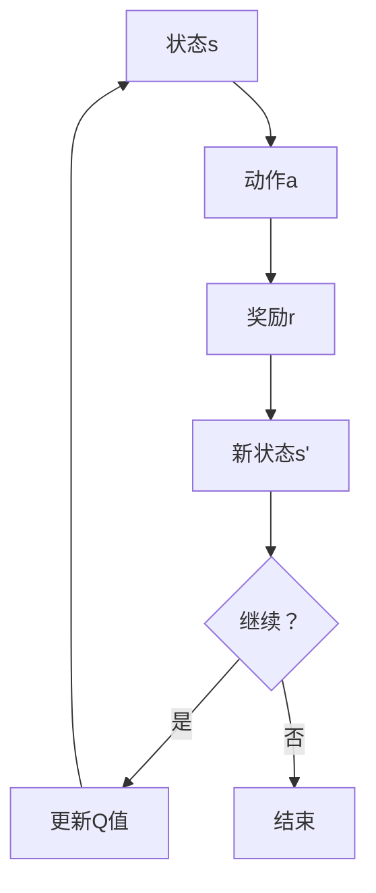
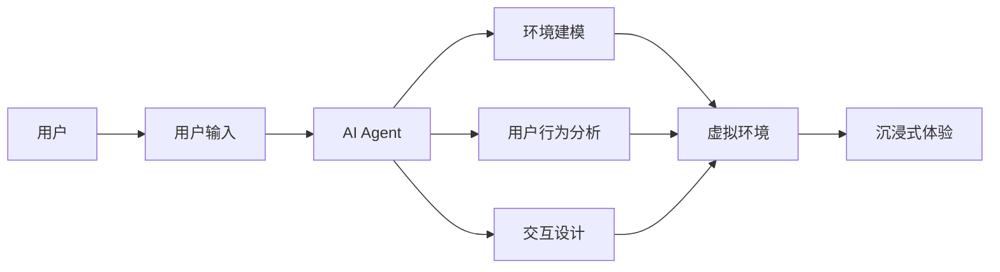
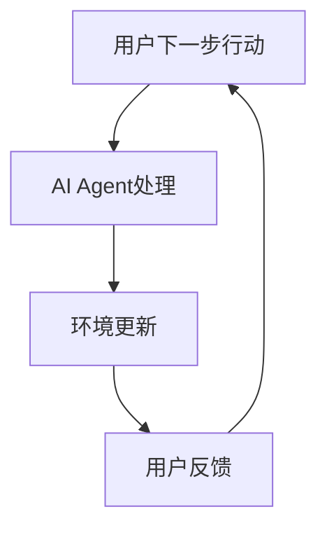

                 


# AI Agent在虚拟现实中的应用：沉浸式体验增强

---

> **关键词**：AI Agent, 虚拟现实, 沉浸式体验, 强化学习, 决策树, 系统架构设计, 应用案例分析

---

> **摘要**：  
> 本文深入探讨了AI Agent在虚拟现实（VR）中的应用，重点分析了如何通过AI技术增强沉浸式体验。文章从AI Agent的基本概念出发，结合虚拟现实的特性，详细讲解了AI Agent在感知、决策和行动模块中的核心算法，包括强化学习和决策树的实现。同时，文章通过系统架构设计和实际案例分析，展示了AI Agent如何在VR中实现智能化交互，从而提升用户体验。最后，本文总结了当前技术的优缺点，并提出了未来的发展方向。

---

# 第1章: AI Agent与虚拟现实的结合基础

## 1.1 AI Agent的基本概念

### 1.1.1 AI Agent的定义与核心特征
- AI Agent的定义：AI Agent是一种智能体，能够感知环境、自主决策并执行行动以实现目标。
- 核心特征：
  - 自主性：无需外部干预，自主完成任务。
  - 反应性：能够实时感知环境并做出反应。
  - 学习能力：通过经验优化行为策略。

### 1.1.2 虚拟现实的基本概念与技术
- VR的定义：通过计算机生成的虚拟环境，提供沉浸式的视觉、听觉和触觉体验。
- 关键技术：
  - 3D图形渲染
  - 实时交互
  - 虚拟物体生成

### 1.1.3 AI Agent在虚拟现实中的应用背景
- 背景：随着VR技术的快速发展，AI Agent为用户提供更智能化、个性化的交互体验。
- 核心问题：如何利用AI技术提升VR中的沉浸式体验。

---

## 1.2 AI Agent与虚拟现实的结合方式

### 1.2.1 AI Agent在虚拟现实中的角色定位
- 系统设计者：设计VR环境中的智能行为规则。
- 交互参与者：作为用户助手或虚拟角色与用户互动。
- 智能优化器：优化VR环境中的资源分配和用户体验。

### 1.2.2 虚拟现实中的AI Agent分类
- 分类依据：
  - 智能水平：简单规则驱动、基于机器学习驱动。
  - 应用场景：游戏、教育、医疗等。
- 典型案例：
  - 游戏中的NPC（非玩家角色）：基于规则或强化学习实现智能行为。
  - 教育中的虚拟助手：通过语音交互帮助学生解决问题。

### 1.2.3 AI Agent与虚拟现实结合的核心优势
- 提供个性化体验：根据用户行为调整虚拟环境。
- 实现实时交互：通过AI技术快速响应用户输入。
- 优化系统性能：通过AI算法优化渲染和资源分配。

---

# 第2章: AI Agent在虚拟现实中的核心概念

## 2.1 AI Agent的感知与决策机制

### 2.1.1 感知模块的核心原理
- 感知模块的作用：通过传感器或API获取VR环境中的实时数据。
- 数据处理：将原始数据转换为有意义的信息，如位置、动作等。

### 2.1.2 决策模块的算法选择
- 常用算法：
  - 强化学习：适用于复杂决策任务。
  - 决策树：适用于规则明确的任务。
- 选择算法的依据：任务复杂度、数据量、实时性要求。

### 2.1.3 行动模块的实现方式
- 行动模块的作用：根据决策结果执行具体操作，如移动物体、播放声音等。
- 实现方式：
  - 调用VR引擎API（如Unity或Unreal Engine）。
  - 控制物理引擎实现物体运动。

---

## 2.2 虚拟现实中的沉浸式体验增强

### 2.2.1 沉浸式体验的定义与特征
- 定义：通过技术手段让用户完全沉浸在虚拟环境中，忘记现实世界的存在。
- 特征：
  - 高度实时性：用户动作与虚拟环境同步。
  - 高度交互性：用户可以与虚拟环境中的元素互动。
  - 高度沉浸感：用户感觉身临其境。

### 2.2.2 AI Agent在沉浸式体验中的作用
- 提供个性化服务：根据用户偏好调整虚拟环境。
- 实现实时互动：通过AI技术实现自然的用户交互。
- 提供动态内容：根据用户行为生成动态内容，如动态生成故事情节。

### 2.2.3 沉浸式体验增强的关键技术
- AI技术：强化学习、自然语言处理、计算机视觉。
- VR技术：3D图形渲染、实时渲染、物理模拟。

---

# 第3章: AI Agent的核心算法与数学模型

## 3.1 强化学习算法在AI Agent中的应用

### 3.1.1 强化学习的基本原理
- 强化学习的定义：通过试错机制，智能体在环境中学习如何采取行动以最大化累积奖励。
- 核心要素：
  - 状态（State）：智能体所处的环境情况。
  - 动作（Action）：智能体采取的行为。
  - 奖励（Reward）：智能体行为的价值评估。
  - 策略（Policy）：智能体选择动作的概率分布。
  - 价值函数（Value Function）：评估状态或动作的价值。

### 3.1.2 Q-learning算法的数学模型
- Q-learning算法公式：
$$ Q(s, a) = r + \gamma \max_{a'} Q(s', a') $$
- 参数解释：
  - $Q(s, a)$：状态s下采取动作a的Q值。
  - $r$：当前动作获得的奖励。
  - $\gamma$：折扣因子，取值范围为[0,1]。

### 3.1.3 算法流程图（使用 Mermaid）



---

## 3.2 决策树算法的实现

### 3.2.1 决策树的基本原理
- 决策树的定义：一种树状结构，用于表示可能的决策路径。
- 核心算法：
  - ID3：基于信息增益的决策树构建。
  - C4.5：基于信息增益率的决策树构建。

### 3.2.2 决策树的构建过程
- 数据准备：收集并预处理数据。
- 特征选择：选择对目标变量影响最大的特征。
- 树的生成：递归地划分数据集，直到满足停止条件。
- 树的剪枝：防止过拟合，提高泛化能力。

### 3.2.3 决策树的优缺点分析
- 优点：
  - 易于理解和解释。
  - 适合处理分类问题。
- 缺点：
  - 对噪声数据敏感。
  - 适合小规模数据集。

---

## 3.3 算法实现示例（Python代码）

```python
import numpy as np
from sklearn.tree import DecisionTreeClassifier

# 示例数据
X = np.array([[2, 3], [5, 4], [3, 6], [7, 8], [1, 2], [9, 1], [4, 7], [6, 2]])
y = np.array([0, 1, 0, 1, 0, 1, 0, 1])

# 创建决策树分类器
clf = DecisionTreeClassifier()

# 训练模型
clf.fit(X, y)

# 预测新数据
new_data = np.array([[4, 5]])
print("预测结果:", clf.predict(new_data))
```

---

# 第4章: 虚拟现实中的系统架构设计

## 4.1 系统功能模块设计

### 4.1.1 用户行为分析模块
- 功能：分析用户的交互行为，如点击、移动、语音指令等。
- 实现方式：通过传感器数据采集用户输入，并通过AI算法分析用户意图。

### 4.1.2 环境建模模块
- 功能：构建虚拟环境的3D模型，并实时更新环境状态。
- 实现方式：使用3D建模工具生成模型，并通过API接口与AI Agent交互。

### 4.1.3 交互设计模块
- 功能：设计用户与虚拟环境的交互方式，如手势识别、语音交互等。
- 实现方式：结合计算机视觉和自然语言处理技术，实现多模态交互。

---

## 4.2 系统架构图（使用 Mermaid）



---

## 4.3 系统交互流程图（使用 Mermaid）



---

## 4.4 系统接口设计

- 输入接口：接收用户输入，如语音、手势等。
- 输出接口：输出AI Agent的决策结果，如移动物体、播放声音等。
- API接口：与其他系统模块（如3D引擎）进行交互。

---

# 第5章: 项目实战

## 5.1 环境安装与配置

### 5.1.1 安装Python环境
- 使用Anaconda或PyCharm安装Python 3.x。

### 5.1.2 安装相关库
- 使用pip安装必要的库：
  ```
  pip install numpy
  pip install scikit-learn
  pip install matplotlib
  ```

---

## 5.2 核心代码实现

### 5.2.1 强化学习实现（Q-learning）
```python
import numpy as np

class QLearning:
    def __init__(self, state_space, action_space):
        self.q_table = np.zeros(state_space + action_space)
        self.gamma = 0.9

    def choose_action(self, state):
        return np.argmax(self.q_table[state])

    def update_q(self, state, action, reward, next_state):
        self.q_table[state + action] = reward + self.gamma * np.max(self.q_table[next_state])
```

### 5.2.2 决策树实现（ID3算法）
```python
from sklearn.tree import DecisionTreeClassifier

class ID3:
    def __init__(self):
        self clf = DecisionTreeClassifier()

    def train(self, X, y):
        self clf.fit(X, y)

    def predict(self, X):
        return self.clf.predict(X)
```

---

## 5.3 应用案例分析

### 5.3.1 游戏中的AI Agent应用
- 案例描述：在VR游戏中，AI Agent作为NPC与玩家互动。
- 实现细节：
  - 使用强化学习实现NPC的智能行为。
  - 使用决策树实现NPC的决策逻辑。

### 5.3.2 教育中的AI Agent应用
- 案例描述：在虚拟教室中，AI Agent作为虚拟助教帮助学生学习。
- 实现细节：
  - 使用自然语言处理实现语音交互。
  - 使用强化学习优化助教的行为策略。

---

## 5.4 项目小结

- 成果展示：通过代码实现AI Agent在VR中的应用。
- 经验总结：强化学习和决策树在不同场景中的适用性。
- 注意事项：算法选择、数据预处理、系统优化。

---

# 第6章: 最佳实践与未来展望

## 6.1 最佳实践

### 6.1.1 算法选择建议
- 根据任务需求选择合适的算法。
- 对比不同算法的优缺点。

### 6.1.2 系统优化建议
- 使用分布式计算优化系统性能。
- 通过缓存技术减少重复计算。

## 6.2 小结

- 本文总结了AI Agent在虚拟现实中的应用，重点分析了算法原理和系统架构设计。
- 强调了AI技术在沉浸式体验中的重要性。

## 6.3 注意事项

- 算法实现时要注意数据预处理。
- 系统设计时要注意实时性和稳定性。

## 6.4 拓展阅读

- 推荐书籍：《强化学习：算法与应用》、《虚拟现实技术与应用》。
- 推荐论文：关于强化学习在VR中的最新研究。

---

# 结语

AI Agent在虚拟现实中的应用前景广阔，随着技术的不断进步，沉浸式体验将更加智能化和个性化。未来，随着5G、AI和区块链等技术的融合，AI Agent在虚拟现实中的应用将更加丰富和多样化。

---

# 作者：AI天才研究院/AI Genius Institute & 禅与计算机程序设计艺术/Zen And The Art of Computer Programming

