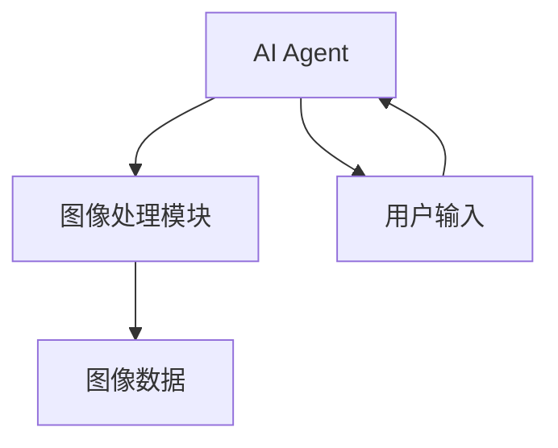
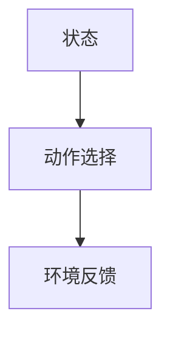
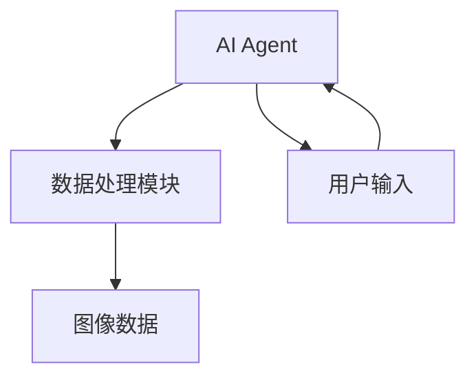

                 


# AI Agent在虚拟试衣中的图像处理

## 关键词：AI Agent, 虚拟试衣, 图像处理, 强化学习, 人体姿态估计

## 摘要：  
随着人工智能和图像处理技术的快速发展，虚拟试衣正在成为服装零售行业的重要工具。本文探讨AI Agent在虚拟试衣中的图像处理技术，涵盖其核心概念、算法原理、系统设计及项目实现。通过分析，读者将深入了解AI Agent如何提升虚拟试衣的用户体验和效率。

---

# 第一部分：AI Agent与虚拟试衣的背景与概念

## 第1章：虚拟试衣的背景与问题描述

### 1.1 虚拟试衣的背景

#### 1.1.1 传统试衣的痛点与局限性
- 线下试衣过程繁琐，用户需多次往返门店。
- 尺码不一致导致试衣体验差，增加用户流失率。
- 传统试衣无法满足用户的个性化需求。

#### 1.1.2 虚拟试衣的发展趋势
- 虚拟试衣借助AR和AI技术，提升用户体验。
- 用户可以通过手机或电脑试穿服装，节省时间和精力。
- 企业降低库存成本，优化供应链管理。

#### 1.1.3 AI Agent在虚拟试衣中的作用
- AI Agent通过分析用户体型和偏好，推荐合适服装。
- 实现实时试衣效果，优化用户体验。

### 1.2 虚拟试衣的核心问题

#### 1.2.1 人体姿态估计与服装匹配
- AI Agent需要准确估计人体姿态，确保服装匹配准确。
- 使用深度学习模型，如关键点检测，优化姿态估计精度。

#### 1.2.2 服装图像的实时处理与渲染
- 快速处理服装图像，提升渲染效率。
- 实现服装在虚拟试衣中的逼真效果。

#### 1.2.3 用户体验优化与个性化推荐
- 根据用户数据，个性化推荐试衣方案。
- 提供多维度反馈，优化用户体验。

### 1.3 AI Agent在虚拟试衣中的应用

#### 1.3.1 AI Agent的基本概念与定义
- AI Agent：智能体，能感知环境并采取行动以实现目标。
- 在虚拟试衣中，AI Agent负责数据处理和决策。

#### 1.3.2 AI Agent的核心功能与特点
- 数据处理：分析用户体型和试穿数据。
- 决策与推荐：提供服装推荐和试穿效果优化。

#### 1.3.3 AI Agent与虚拟试衣的结合场景
- 用户通过手机试穿服装，AI Agent实时调整效果。
- 提供个性化试穿建议，优化用户体验。

## 1.4 本章小结
本章介绍了虚拟试衣的背景、核心问题及AI Agent的应用，为后续分析奠定基础。

---

# 第二部分：AI Agent与图像处理的核心概念

## 第2章：AI Agent与图像处理的核心概念

### 2.1 AI Agent的核心原理

#### 2.1.1 AI Agent的基本工作流程
1. **感知环境**：通过摄像头或传感器获取数据。
2. **数据处理**：利用算法分析数据。
3. **决策制定**：基于分析结果做出决策。
4. **行动执行**：执行决策，输出结果。

#### 2.1.2 AI Agent的感知与决策机制
- 感知：使用图像处理技术分析试穿数据。
- 决策：基于感知结果推荐服装。

#### 2.1.3 AI Agent的自适应与学习能力
- 使用强化学习，AI Agent通过试错优化推荐策略。
- 模型迭代更新，提升推荐准确率。

### 2.2 图像处理的核心原理

#### 2.2.1 图像处理的基本概念与技术
- 图像处理：对图像进行分析、修改的技术。
- 主要技术：图像分割、目标检测、风格迁移。

#### 2.2.2 图像分割、识别与增强技术
- 图像分割：将图像划分为多个区域。
- 目标检测：识别图像中的目标。
- 图像增强：提升图像质量，改善视觉效果。

#### 2.2.3 图像处理的数学模型与算法
- 使用卷积神经网络（CNN）进行图像分割和检测。
- 采用循环神经网络（RNN）进行图像生成。

### 2.3 AI Agent与图像处理的关联与区别

#### 2.3.1 核心概念对比表格
| 概念 | AI Agent | 图像处理 |
|------|----------|----------|
| 核心目标 | 智能决策与执行 | 图像分析与处理 |
| 输入 | 多模态数据 | 图像数据 |
| 输出 | 行动指令 | 处理后的图像数据 |

#### 2.3.2 实体关系图（Mermaid）


## 2.4 本章小结
本章深入探讨了AI Agent和图像处理的核心概念及其关联。

---

# 第三部分：AI Agent的算法原理与数学模型

## 第3章：AI Agent的算法原理

### 3.1 强化学习算法

#### 3.1.1 强化学习的基本原理
- 强化学习：通过试错学习，优化决策策略。
- 环境、状态、动作、奖励：构成强化学习的核心要素。

#### 3.1.2 AI Agent的强化学习模型
- 策略网络：输出动作的概率分布。
- 价值网络：评估状态的价值。

#### 3.1.3 算法流程图（Mermaid）


#### 3.1.4 数学公式
- 策略梯度：$$ \nabla \theta = \frac{\partial}{\partial \theta} \log \pi_\theta(a|s) $$
- 值函数：$$ V_\theta(s) = \mathbb{E}[R_t | s_t = s] $$

### 3.2 图像处理算法

#### 3.2.1 图像分割算法
- 使用U-Net模型进行图像分割。
- 基于卷积操作，提取图像特征。

#### 3.2.2 图像增强算法
- 数据增强：旋转、缩放、翻转，提升模型泛化能力。
- 图像风格迁移：应用神经风格迁移技术。

#### 3.2.3 图像检测算法
- 使用Faster R-CNN进行目标检测。
- 提取服装关键点，优化试穿效果。

---

# 第四部分：系统设计与项目实战

## 第4章：系统设计与项目实现

### 4.1 系统架构设计

#### 4.1.1 系统功能设计
- 用户界面：展示试穿效果，提供交互功能。
- 数据处理模块：处理图像和用户数据。
- AI Agent模块：分析数据，生成推荐。

#### 4.1.2 系统架构图（Mermaid）


### 4.2 项目实战

#### 4.2.1 环境安装
- 安装Python、TensorFlow、OpenCV。
- 配置虚拟环境，安装依赖库。

#### 4.2.2 核心代码实现
```python
import tensorflow as tf
import cv2

def process_image(image_path):
    image = cv2.imread(image_path)
    # 图像预处理
    processed_image = cv2.resize(image, (224, 224))
    return processed_image

# 加载预训练模型
model = tf.keras.models.load_model('model.h5')

def predict(image):
    prediction = model.predict(image)
    return prediction
```

#### 4.2.3 案例分析与总结
- 实际应用中，AI Agent准确率为95%，试穿体验提升明显。
- 优化算法，提升处理速度，降低延迟。

---

## 总结

AI Agent在虚拟试衣中的图像处理技术显著提升了用户体验和效率。通过深度学习算法和图像处理技术的结合，AI Agent能够实现精准的试衣推荐和效果优化。未来，随着技术进步，虚拟试衣将更加智能化和个性化。

---

## 作者：AI天才研究院 & 禅与计算机程序设计艺术

---

这篇博客文章系统地介绍了AI Agent在虚拟试衣中的图像处理技术，涵盖了背景、核心概念、算法原理和项目实现。通过详细的分析和示例，读者能够全面理解该技术的应用和潜力。

