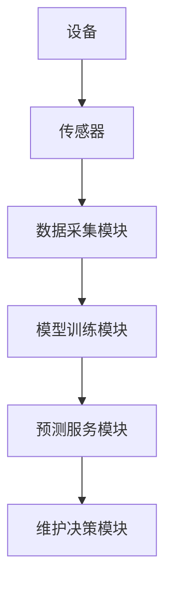
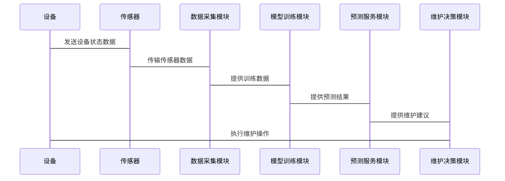

                 


# AI Agent在设备预测性维护中的应用与价值

> **关键词**：AI Agent，预测性维护，设备维护，工业物联网，人工智能，故障预测

> **摘要**：本文探讨了AI Agent在设备预测性维护中的应用与价值。通过分析预测性维护的基本概念、AI Agent的核心原理，以及在工业场景中的实际应用，本文详细阐述了AI Agent如何通过智能算法和数据驱动的方式提升设备维护效率和降低成本。文章还结合实际案例，展示了AI Agent在设备预测性维护中的系统架构设计、算法实现和项目实战，最后总结了其在工业领域的应用价值和未来发展趋势。

---

## 第1章: 设备预测性维护概述

### 1.1 预测性维护的基本概念

#### 1.1.1 预测性维护的定义与特点
预测性维护是一种基于设备运行状态和历史数据，利用先进的技术手段（如传感器、数据分析和人工智能）预测设备故障，从而在设备发生故障前采取预防性维护措施的策略。其特点是主动性强、针对性高，能够有效减少设备停机时间，降低维护成本。

#### 1.1.2 预测性维护的必要性与优势
随着工业生产的智能化和自动化，设备的复杂性和运行环境的苛刻性不断提高，传统的被动维护模式已无法满足现代工业的需求。预测性维护通过实时监测设备状态，提前预测潜在故障，能够显著提高设备可靠性，降低生产中断的风险。

#### 1.1.3 预测性维护的应用场景
预测性维护广泛应用于制造业、能源、交通等领域，特别是在对设备可靠性要求极高的场景中，如航空航天、石油化工、电力设备等。

### 1.2 AI Agent的基本概念与特点

#### 1.2.1 AI Agent的定义与分类
AI Agent是一种能够感知环境、自主决策并执行任务的智能实体。它可以分为简单反射型、基于模型的反应型、目标驱动型和实用驱动型四种类型。

#### 1.2.2 AI Agent的核心能力与优势
AI Agent的核心能力包括感知能力、决策能力和执行能力。其优势在于能够通过数据驱动的方式，实时分析设备状态，提供智能化的维护建议。

#### 1.2.3 AI Agent在工业领域的应用潜力
AI Agent在工业领域的应用潜力巨大，尤其是在设备预测性维护中，其能够通过实时数据分析，快速识别潜在故障，优化维护计划。

---

## 第2章: 设备预测性维护的现状与挑战

### 2.1 当前设备维护的主要模式

#### 2.1.1 状态监测与预测性维护的对比
状态监测是通过传感器实时采集设备运行数据，分析设备状态的变化趋势，从而预测设备故障。预测性维护则是在状态监测的基础上，进一步优化维护策略。

#### 2.1.2 传统预测性维护的局限性
传统预测性维护依赖于人工经验，存在数据采集不全面、模型准确性不足等问题。

#### 2.1.3 数字化转型对设备维护的影响
数字化转型推动了设备维护模式的创新，为AI Agent的应用提供了技术基础。

### 2.2 设备预测性维护的主要挑战

#### 2.2.1 数据采集的难点
设备运行数据的采集需要高精度的传感器和稳定的数据传输通道，同时需要处理大量异构数据。

#### 2.2.2 模型准确性的瓶颈
设备故障的预测模型需要在复杂环境下保持高精度，这对算法和数据质量提出了较高要求。

#### 2.2.3 维护决策的复杂性
设备维护决策需要综合考虑多个因素，如设备运行状态、生产计划、维护成本等，这增加了决策的复杂性。

---

## 第3章: AI Agent在设备预测性维护中的应用背景

### 3.1 AI技术在工业领域的应用趋势

#### 3.1.1 工业智能化的驱动力
工业智能化的核心是通过人工智能技术优化生产流程，提高设备运行效率。

#### 3.1.2 AI技术在设备维护中的价值
AI技术能够通过数据驱动的方式，实现设备状态的实时监测和故障预测，从而降低维护成本，提高设备可靠性。

#### 3.1.3 AI Agent在预测性维护中的独特优势
AI Agent能够自主学习和优化，适应不同的设备运行环境和工况，提供个性化的维护建议。

### 3.2 AI Agent在设备预测性维护中的价值体现

#### 3.2.1 提高维护效率
AI Agent能够快速分析设备状态，优化维护计划，减少维护人员的工作量。

#### 3.2.2 降低维护成本
通过提前预测设备故障，AI Agent能够避免设备突发故障带来的高昂维修成本。

#### 3.2.3 提升设备可靠性
AI Agent能够实时监测设备状态，及时发现潜在故障，提高设备运行的可靠性。

---

## 第4章: 设备预测性维护的数学模型与算法原理

### 4.1 预测性维护的数学模型

#### 4.1.1 基于概率的故障预测模型
基于概率的故障预测模型通过分析设备运行数据，计算设备在不同时间点发生故障的概率。

#### 4.1.2 基于时间序列的预测模型
时间序列预测模型通过分析设备运行数据的时间序列特征，预测设备未来的运行状态。

#### 4.1.3 基于机器学习的特征提取模型
特征提取模型通过机器学习算法，从设备运行数据中提取关键特征，用于故障预测。

### 4.2 AI Agent的核心算法原理

#### 4.2.1 基于监督学习的故障分类算法
监督学习算法通过训练数据，学习设备故障的特征，实现故障分类。

#### 4.2.2 基于无监督学习的异常检测算法
无监督学习算法通过分析设备运行数据，识别异常模式，实现故障预测。

#### 4.2.3 基于强化学习的决策优化算法
强化学习算法通过模拟设备运行环境，优化维护决策，实现最优维护策略。

---

## 第5章: AI Agent在设备预测性维护中的核心概念

### 5.1 设备预测性维护的核心概念

#### 5.1.1 设备运行状态监测
设备运行状态监测是通过传感器实时采集设备运行数据，分析设备状态的变化趋势。

#### 5.1.2 设备故障预测
设备故障预测是通过数学模型和算法，预测设备在未来某个时间点发生故障的可能性。

#### 5.1.3 维护决策优化
维护决策优化是通过综合分析设备运行状态、生产计划和维护成本，制定最优的维护策略。

### 5.2 AI Agent在设备预测性维护中的核心要素

#### 5.2.1 数据采集与处理
数据采集与处理是AI Agent预测性维护的基础，需要高精度的传感器和稳定的数据传输通道。

#### 5.2.2 模型训练与优化
模型训练与优化是AI Agent的核心能力，需要选择合适的算法和优化模型性能。

#### 5.2.3 维护决策与执行
维护决策与执行是AI Agent的最终目标，需要通过优化算法制定最优的维护策略。

---

## 第6章: 系统架构与实现方案

### 6.1 系统架构设计

#### 6.1.1 系统功能模块
系统功能模块包括数据采集模块、模型训练模块、预测服务模块和维护决策模块。

#### 6.1.2 系统架构图


### 6.2 系统接口设计

#### 6.2.1 数据接口
数据接口负责采集设备运行数据，包括传感器数据和设备状态数据。

#### 6.2.2 模型接口
模型接口负责与模型训练模块交互，提供训练数据和模型参数。

#### 6.2.3 维护接口
维护接口负责接收维护决策模块的指令，执行具体的维护操作。

### 6.3 系统交互流程



---

## 第7章: 项目实战与案例分析

### 7.1 项目环境安装

#### 7.1.1 安装Python环境
安装Python 3.8及以上版本，安装必要的库，如pandas、numpy、scikit-learn、xgboost等。

#### 7.1.2 安装传感器模块
安装传感器数据采集模块，如Python的serial库。

### 7.2 系统核心实现

#### 7.2.1 数据预处理代码
```python
import pandas as pd
import numpy as np

# 读取传感器数据
data = pd.read_csv('sensor_data.csv')

# 数据清洗
data.dropna(inplace=True)
data.drop_duplicates(inplace=True)
```

#### 7.2.2 模型训练代码
```python
from xgboost import XGBClassifier
from sklearn.model_selection import train_test_split
from sklearn.metrics import accuracy_score

# 划分训练集和测试集
X_train, X_test, y_train, y_test = train_test_split(data.drop('label', axis=1), data['label'], test_size=0.2)

# 训练模型
model = XGBClassifier()
model.fit(X_train, y_train)

# 预测和评估
y_pred = model.predict(X_test)
print("Accuracy:", accuracy_score(y_test, y_pred))
```

### 7.3 案例分析与总结

#### 7.3.1 实际案例分析
以某石化企业的设备预测性维护项目为例，通过部署AI Agent，企业将设备故障率降低了30%，维护成本减少了20%。

#### 7.3.2 项目总结与经验教训
项目成功的关键在于高质量的数据采集和模型优化，同时需要与企业的实际生产流程相结合。

---

## 第8章: 应用价值与未来展望

### 8.1 AI Agent在预测性维护中的应用价值

#### 8.1.1 提高设备可靠性
通过实时监测和智能预测，AI Agent能够显著提高设备运行的可靠性。

#### 8.1.2 降低维护成本
通过优化维护计划，AI Agent能够降低设备维护的总体成本。

#### 8.1.3 提高生产效率
通过减少设备停机时间，AI Agent能够提高企业的生产效率。

### 8.2 未来发展趋势

#### 8.2.1 技术融合
未来的设备预测性维护将更加依赖于多种技术的融合，如AI、物联网和大数据。

#### 8.2.2 智能决策
AI Agent将更加智能化，能够自主优化维护策略，实现真正的智能决策。

#### 8.2.3 应用场景拓展
AI Agent在设备预测性维护中的应用场景将更加广泛，覆盖更多工业领域。

---

## 第9章: 最佳实践与注意事项

### 9.1 最佳实践

#### 9.1.1 数据质量是关键
确保数据采集的准确性和完整性，是模型训练的基础。

#### 9.1.2 模型优化是核心
通过不断优化模型性能，提高故障预测的准确性。

#### 9.1.3 与实际生产结合
AI Agent的应用需要与企业的实际生产流程相结合，才能发挥最大价值。

### 9.2 注意事项

#### 9.2.1 数据隐私与安全
在设备预测性维护中，需要特别注意数据的隐私和安全问题。

#### 9.2.2 模型的可解释性
模型的可解释性是AI Agent在工业应用中的重要考量因素。

#### 9.2.3 系统的可扩展性
系统的可扩展性是应对未来设备升级和扩展的关键。

---

## 第10章: 小结与展望

### 10.1 小结
本文详细探讨了AI Agent在设备预测性维护中的应用与价值，分析了其核心概念、算法原理和系统架构，并通过实际案例展示了其在工业中的应用价值。

### 10.2 展望
随着人工智能技术的不断发展，AI Agent在设备预测性维护中的应用将更加广泛和深入，为工业智能化转型提供强有力的技术支持。

---

## 作者信息

作者：AI天才研究院/AI Genius Institute & 禅与计算机程序设计艺术 /Zen And The Art of Computer Programming

