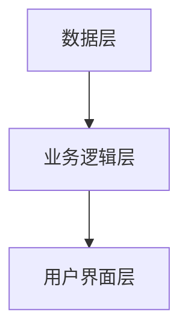
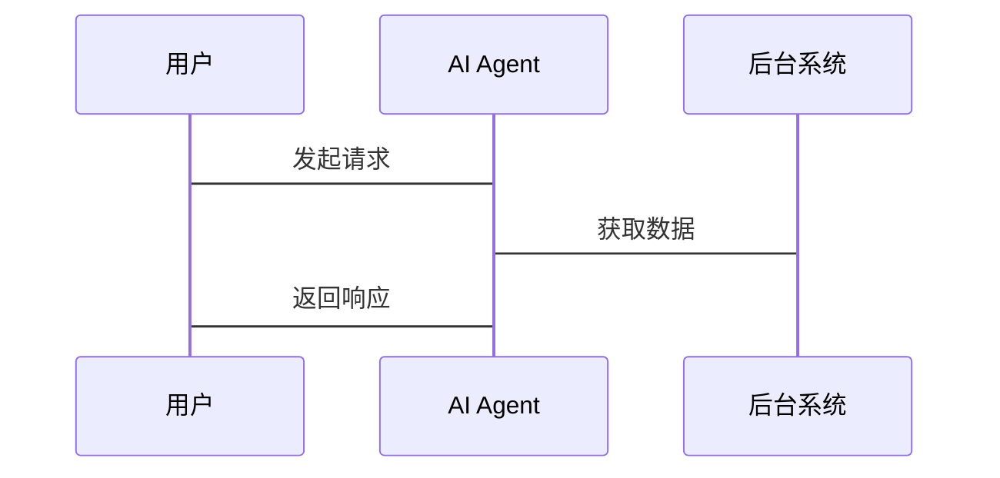

                 


# AI Agent在金融行业的创新应用

## 关键词：AI Agent, 人工智能, 金融行业, 创新应用, 机器学习, 智能投顾, 风险管理

## 摘要：  
AI Agent（人工智能代理）作为一项革命性的技术，正在金融行业掀起一场深刻的变革。通过智能投顾、风险管理、信用评估和高频交易等领域的应用，AI Agent不仅提高了金融业务的效率，还为金融机构带来了显著的成本节约和用户体验提升。本文将深入探讨AI Agent的核心概念、技术原理、系统架构设计以及在金融行业中的创新应用，并通过实际案例分析和项目实战，展示如何在金融领域高效部署和优化AI Agent系统。

---

# 第1章: AI Agent的基本概念与背景介绍

## 1.1 AI Agent的定义与特点

### 1.1.1 AI Agent的定义  
AI Agent是一种能够感知环境、自主决策并执行任务的智能实体。它通过数据输入、分析和推理，能够理解用户需求并提供定制化的服务。  

### 1.1.2 AI Agent的核心特点  
- **智能性**：能够理解和处理复杂信息。  
- **自主性**：无需人工干预，自动执行任务。  
- **交互性**：支持多轮对话，提供实时反馈。  
- **适应性**：根据环境变化动态调整策略。  

### 1.1.3 AI Agent与传统金融技术的对比  

| 技术特点       | AI Agent                     | 传统金融技术               |
|----------------|------------------------------|-----------------------------|
| 决策方式       | 基于机器学习模型             | 依赖人工规则或经验           |
| 处理速度       | 高效，实时响应               | 较慢，依赖人工操作           |
| 个性化能力     | 强大，支持定制化服务         | 较弱，服务标准化程度高       |
| 成本           | 降低，自动化减少人力成本     | 较高，依赖人工服务           |

---

## 1.2 AI Agent在金融行业中的应用背景

### 1.2.1 金融行业数字化转型的现状  
随着数字化转型的推进，金融机构逐渐从传统的人工服务模式向智能化服务模式转变。AI Agent作为智能服务的核心技术，正在成为金融机构数字化转型的重要驱动力。  

### 1.2.2 AI Agent在金融行业中的潜在价值  
- 提高服务效率：通过自动化处理减少人工干预。  
- 降低成本：降低人力投入，优化运营成本。  
- 提升用户体验：提供个性化、实时化的服务体验。  

### 1.2.3 当前AI Agent在金融行业的应用现状  
AI Agent在智能投顾、风险管理、信用评估等领域已得到广泛应用。例如，智能投顾平台通过AI Agent为用户提供个性化的投资建议，显著提升了用户体验和投资效率。  

---

## 1.3 AI Agent的技术基础

### 1.3.1 人工智能的基本概念  
人工智能（AI）是模拟人类智能的计算机系统，涵盖学习、推理、感知和决策等能力。  

### 1.3.2 机器学习与深度学习的简介  
- **机器学习**：通过数据训练模型，使其具备预测和分类能力。  
- **深度学习**：基于神经网络的机器学习方法，能够处理复杂的数据模式。  

### 1.3.3 自然语言处理与对话系统  
自然语言处理（NLP）技术使AI Agent能够理解并生成人类语言，支持多轮对话和上下文理解。  

---

## 1.4 本章小结  
本章介绍了AI Agent的基本概念、特点以及在金融行业中的应用背景，为后续章节的深入分析奠定了基础。

---

# 第2章: AI Agent的核心概念与工作原理

## 2.1 AI Agent的核心概念

### 2.1.1 知识图谱与领域模型  
知识图谱是AI Agent理解领域知识的基础，通过构建领域模型，AI Agent能够更好地理解和处理金融领域的特定问题。  

### 2.1.2 多轮对话与上下文理解  
AI Agent需要通过多轮对话理解用户的意图，并根据上下文调整交互策略。  

### 2.1.3 智能决策与策略优化  
AI Agent通过智能决策算法生成最优策略，并通过策略优化提升决策的准确性和效率。  

---

## 2.2 AI Agent的工作原理

### 2.2.1 感知层：数据采集与处理  
AI Agent通过传感器、API等渠道采集数据，并进行清洗、转换和存储。  

### 2.2.2 理解层：意图识别与语义分析  
AI Agent利用NLP技术识别用户意图，并通过语义分析提取关键信息。  

### 2.2.3 决策层：策略生成与执行  
AI Agent基于感知和理解结果，生成决策策略并执行操作。  

---

## 2.3 AI Agent与传统金融系统的对比

### 2.3.1 传统金融系统的局限性  
- **效率低**：依赖人工操作，处理速度慢。  
- **成本高**：需要大量人力资源。  
- **个性化弱**：难以满足用户的个性化需求。  

### 2.3.2 AI Agent的优势与创新点  
- **高效性**：自动化处理提升效率。  
- **低成本**：减少人力投入，降低运营成本。  
- **个性化**：支持定制化服务，提升用户体验。  

---

## 2.4 本章小结  
本章详细探讨了AI Agent的核心概念和工作原理，并对比了传统金融系统与AI Agent在功能和性能上的差异。

---

# 第3章: AI Agent在金融行业中的技术实现

## 3.1 强化学习在AI Agent中的应用

### 3.1.1 强化学习的基本原理  
强化学习是一种通过试错机制优化决策策略的算法。  

### 3.1.2 强化学习的数学模型  
强化学习的核心是**Q-learning算法**，其数学模型如下：  
$$ Q(s, a) = r + \gamma \max_{a'} Q(s', a') $$  
其中，\( s \) 是状态，\( a \) 是动作，\( r \) 是奖励，\( \gamma \) 是折扣因子。  

### 3.1.3 强化学习在金融交易中的应用  
AI Agent可以通过强化学习算法优化交易策略，实现高频交易和资产配置优化。  

---

## 3.2 监督学习与生成模型在AI Agent中的应用

### 3.2.1 监督学习的基本原理  
监督学习通过标记数据训练模型，使其能够预测新的数据。  

### 3.2.2 生成模型（如GAN）的应用  
生成对抗网络（GAN）可以用于生成合成数据，帮助AI Agent进行训练和测试。  

### 3.2.3 监督学习在信用评估中的应用  
AI Agent可以通过监督学习模型分析客户的信用状况，评估贷款风险。  

---

## 3.3 本章小结  
本章介绍了强化学习、监督学习和生成模型在AI Agent中的应用，重点分析了这些算法在金融交易和信用评估中的具体实现。

---

# 第4章: AI Agent在金融行业中的创新应用

## 4.1 智能投顾的应用与案例分析

### 4.1.1 智能投顾的核心功能  
智能投顾通过分析用户的风险偏好和财务状况，提供个性化的投资建议。  

### 4.1.2 实际案例分析  
某智能投顾平台通过AI Agent为用户提供定制化的投资组合管理服务，显著提升了用户体验和投资效率。  

---

## 4.2 风险管理的应用与案例分析

### 4.2.1 风险管理的核心功能  
AI Agent可以通过实时监控市场动态，识别潜在风险并发出预警。  

### 4.2.2 实际案例分析  
某银行通过AI Agent实时监控客户信用风险，有效降低了坏账率。  

---

## 4.3 信用评估的应用与案例分析

### 4.3.1 信用评估的核心功能  
AI Agent可以通过机器学习模型分析客户的信用状况，评估贷款风险。  

### 4.3.2 实际案例分析  
某网贷平台通过AI Agent评估客户的信用风险，显著提高了贷款审批效率。  

---

## 4.4 本章小结  
本章通过多个实际案例展示了AI Agent在智能投顾、风险管理和信用评估等领域的创新应用。

---

# 第5章: AI Agent系统的架构设计与实现

## 5.1 系统功能设计

### 5.1.1 系统功能模块  
- 用户交互模块  
- 数据处理模块  
- 智能决策模块  
- 系统管理模块  

### 5.1.2 功能模块之间的关系  
系统功能模块通过接口进行交互，实现数据的传递和处理。  

---

## 5.2 系统架构设计

### 5.2.1 分层架构设计  
AI Agent系统采用分层架构，包括数据层、业务逻辑层和用户界面层。  

### 5.2.2 架构图  


---

## 5.3 系统接口设计

### 5.3.1 API接口设计  
AI Agent系统通过RESTful API接口与外部系统进行交互。  

### 5.3.2 接口文档  
接口文档详细描述了API的请求参数、响应格式和调用方式。  

---

## 5.4 系统交互设计

### 5.4.1 交互流程  


---

## 5.5 本章小结  
本章详细探讨了AI Agent系统的架构设计和实现过程，为后续的项目实战奠定了基础。

---

# 第6章: AI Agent在金融行业中的项目实战

## 6.1 环境搭建

### 6.1.1 开发环境  
- 操作系统：Linux/Windows/macOS  
- 开发工具：Python、Jupyter Notebook  
- 依赖库：TensorFlow、Keras、Scikit-learn  

### 6.1.2 数据准备  
- 数据来源：金融数据API、公开数据集  

---

## 6.2 系统核心实现

### 6.2.1 数据预处理  
```python
import pandas as pd
data = pd.read_csv('financial_data.csv')
data_cleaned = data.dropna()
```

### 6.2.2 模型训练  
```python
from sklearn.model import DecisionTreeClassifier
model = DecisionTreeClassifier()
model.fit(X_train, y_train)
```

### 6.2.3 模型部署  
```python
import flask
app = Flask(__name__)
@app.route('/predict', methods=['POST'])
def predict():
    data = request.json['data']
    prediction = model.predict(data)
    return jsonify({'result': prediction.tolist()})
```

---

## 6.3 项目实战案例分析

### 6.3.1 案例背景  
某银行希望通过AI Agent实现客户信用评估的自动化。  

### 6.3.2 案例实现  
通过训练机器学习模型，AI Agent能够自动评估客户的信用风险，并提供贷款审批建议。  

---

## 6.4 本章小结  
本章通过实际案例展示了AI Agent在金融行业中的项目实战过程，帮助读者更好地理解和应用相关技术。

---

# 第7章: 总结与展望

## 7.1 全文总结  
AI Agent作为人工智能技术的重要应用，正在深刻改变金融行业的服务模式和业务流程。通过智能投顾、风险管理等领域的创新应用，AI Agent为金融机构带来了显著的效率提升和成本节约。

## 7.2 未来趋势  
随着技术的不断发展，AI Agent在金融行业中的应用将更加广泛和深入。未来，AI Agent将与区块链、物联网等技术结合，推动金融行业的智能化和数字化转型。

## 7.3 最佳实践 tips  
- 在部署AI Agent系统时，需注重数据安全和隐私保护。  
- 定期更新模型，确保AI Agent的决策准确性和适应性。  

## 7.4 拓展阅读  
- 《机器学习实战》  
- 《深度学习入门：基于Python》  
- 《金融风险管理：理论与实践》  

---

# 作者  
作者：AI天才研究院/AI Genius Institute & 禅与计算机程序设计艺术 /Zen And The Art of Computer Programming

