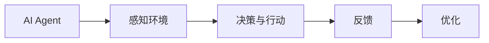
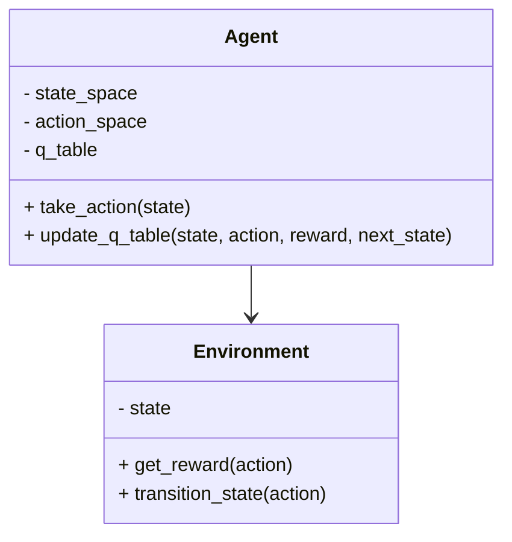

                 


# AI Agent在金融行业的应用与挑战

> 关键词：AI Agent，人工智能，金融行业，风险管理，智能投顾，自动化交易

> 摘要：随着人工智能技术的快速发展，AI Agent在金融行业的应用日益广泛。本文将深入探讨AI Agent的核心概念、算法原理、系统架构设计以及在金融行业中的具体应用场景。同时，分析其面临的挑战，如技术限制、监管问题和伦理道德等，为读者提供全面的了解。

---

# 第一部分：AI Agent的背景与应用

## 第1章：AI Agent的基本概念与核心特征

### 1.1 AI Agent的定义

AI Agent（人工智能代理）是指能够感知环境并采取行动以实现目标的智能体。与传统程序不同，AI Agent具有主动性，能够自主决策和适应环境变化。其核心特征包括自主性、反应性、目标导向性和学习能力。

### 1.2 金融行业中的AI Agent应用背景

#### 1.2.1 问题背景

金融行业数据量庞大，且具有高度动态性，传统的依赖人工的交易和决策方式已难以满足市场需求。AI Agent通过自动化处理和实时分析，能够显著提升交易效率和风险管理能力。

#### 1.2.2 问题解决

AI Agent在金融行业中的应用，主要解决以下问题：
1. 提高交易效率和准确性。
2. 优化风险管理模型，降低投资风险。
3. 提供个性化客户服务，提升客户体验。

#### 1.2.3 边界与外延

AI Agent的应用范围主要集中在金融交易、客户服务和数据管理等领域，但其边界也受到数据质量和模型准确性等限制。

---

## 第2章：AI Agent的核心概念与原理

### 2.1 核心概念术语说明

| 概念       | 描述                                                                 |
|------------|--------------------------------------------------------------------|
| 自动化交易   | 利用算法自动执行交易指令，减少人为干预                                       |
| 风险评估    | 利用AI技术分析市场风险，预测潜在风险事件                                     |
| 智能投顾    | 根据客户需求提供个性化投资建议                                               |

### 2.2 核心概念的联系



---

# 第二部分：AI Agent的算法原理

## 第3章：AI Agent的算法与数学模型

### 3.1 强化学习

强化学习是一种通过试错机制优化决策的算法。其数学模型如下：

$$ Q(s, a) = r + \gamma \max_{a'} Q(s', a') $$

其中：
- \( Q(s, a) \) 表示状态 \( s \) 下采取行动 \( a \) 的期望奖励。
- \( r \) 是当前步的奖励。
- \( \gamma \) 是折扣因子，通常在0到1之间。

### 3.2 算法实现

```python
class Agent:
    def __init__(self, state_space, action_space):
        self.state_space = state_space
        self.action_space = action_space
        self.q_table = np.zeros((state_space, action_space))
    
    def take_action(self, state):
        if np.random.random() < 0.9:
            return np.argmax(self.q_table[state])
        else:
            return np.random.randint(self.action_space)
    
    def update_q_table(self, state, action, reward, next_state):
        self.q_table[state][action] = reward + 0.9 * np.max(self.q_table[next_state])
```

---

# 第三部分：AI Agent的系统架构设计

## 第4章：系统分析与架构设计

### 4.1 系统功能设计



### 4.2 系统架构设计


---

# 第四部分：AI Agent的项目实战

## 第5章：智能投顾系统开发

### 5.1 环境搭建

安装所需的库：

```bash
pip install numpy pandas scikit-learn matplotlib
```

### 5.2 核心代码实现

```python
import numpy as np
import pandas as pd

class TradingAgent:
    def __init__(self, data):
        self.data = data
        self.position = 0
        self.profits = []
    
    def get_signal(self, current_price, prev_price):
        if current_price > prev_price * 1.02:
            return 1  # 买入信号
        elif current_price < prev_price * 0.98:
            return -1  # 卖出信号
        else:
            return 0  # 无操作
    
    def backtest(self):
        for i in range(1, len(self.data)):
            prev_price = self.data[i-1]
            current_price = self.data[i]
            signal = self.get_signal(current_price, prev_price)
            if signal == 1:
                self.position = 1
                self.profits.append((current_price - prev_price)/prev_price)
            elif signal == -1:
                self.position = -1
                self.profits.append((prev_price - current_price)/prev_price)
            else:
                self.profits.append(0)
        return sum(self.profits)
```

### 5.3 案例分析

使用股票数据进行回测：

```python
data = pd.read_csv('stock_data.csv')['Close']
agent = TradingAgent(data)
profit = agent.backtest()
print(f'总利润: {profit}%')
```

---

# 第五部分：总结与展望

## 第6章：总结与展望

### 6.1 最佳实践

1. **技术选型**：选择适合业务场景的AI算法。
2. **数据处理**：确保数据的准确性和完整性。
3. **模型优化**：定期更新模型以适应市场变化。

### 6.2 展望

随着AI技术的不断进步，AI Agent在金融行业的应用将更加广泛，但仍需解决技术瓶颈和监管问题。

---

作者：AI天才研究院 & 禅与计算机程序设计艺术

