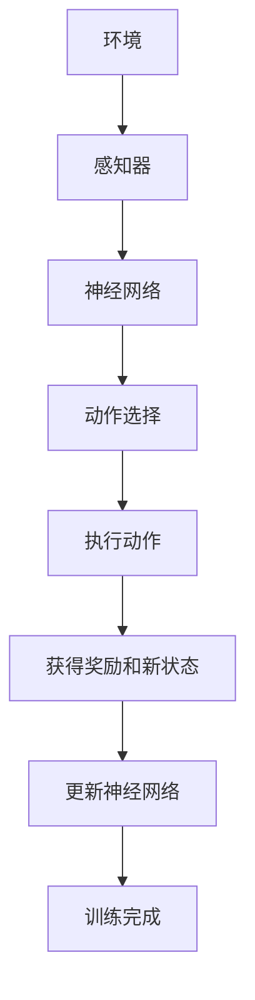
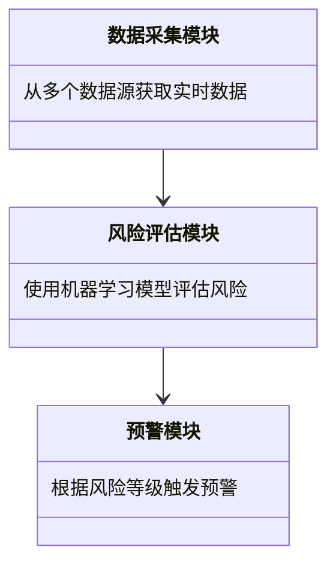
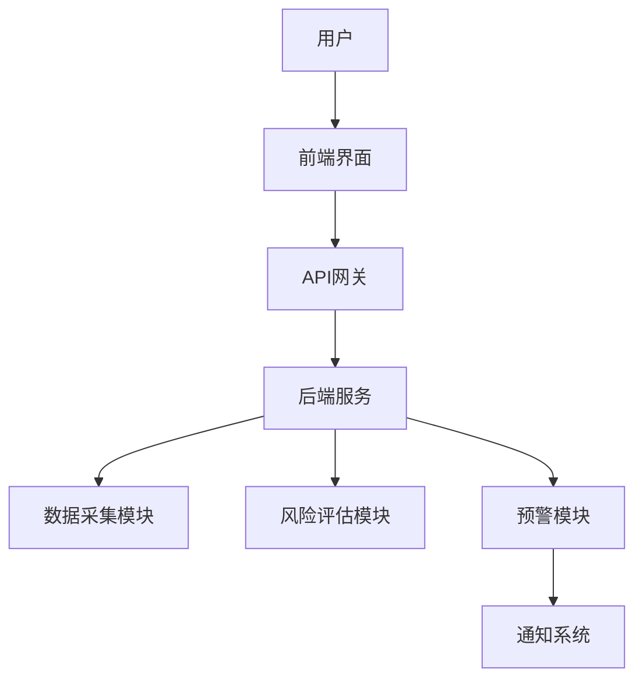

                 


# AI Agent在金融风险分析中的应用

## 关键词：AI Agent，金融风险分析，机器学习，强化学习，自然语言处理，风险管理

## 摘要：  
本文详细探讨了AI Agent在金融风险分析中的应用，从技术基础、算法实现、系统架构到实际项目案例，全面分析了AI Agent如何通过机器学习、强化学习和自然语言处理等技术提升金融风险分析的效率和准确性。文章首先介绍了AI Agent的基本概念及其在金融领域的应用现状，接着深入讲解了金融风险分析的核心技术基础，包括自然语言处理和强化学习。随后，文章详细阐述了AI Agent在金融风险分析中的模型构建、算法实现与优化，并通过实际案例展示了系统的架构设计与项目实战。最后，本文总结了AI Agent在金融风险分析中的最佳实践，并展望了未来的发展方向。

---

# 第1章: AI Agent与金融风险分析概述

## 1.1 AI Agent的基本概念

### 1.1.1 AI Agent的定义与类型  
AI Agent（人工智能代理）是指能够感知环境、自主决策并执行任务的智能实体。它可以分为以下几类：  
- **反应式Agent**：基于当前感知做出反应，适用于实时任务。  
- **基于模型的Agent**：利用内部模型进行规划和决策，适用于复杂环境。  
- **学习型Agent**：通过经验改进性能，适用于动态环境。  

### 1.1.2 AI Agent的核心特征  
- **自主性**：能够在没有外部干预的情况下执行任务。  
- **反应性**：能够实时感知环境并做出响应。  
- **学习能力**：通过数据和经验优化决策策略。  
- **可解释性**：决策过程需要透明，以便人类理解和信任。  

### 1.1.3 金融领域中的AI Agent应用现状  
AI Agent在金融领域的应用主要集中在智能投顾、风险预警和交易自动化等方面。例如，智能投顾Agent可以根据市场变化为投资者提供个性化建议，风险预警Agent可以实时监控市场动态并发出预警信号。

## 1.2 金融风险分析的基本概念

### 1.2.1 金融风险的定义与分类  
金融风险是指由于市场波动、经济变化或其他不确定性因素导致的财务损失。常见的金融风险类型包括：  
- **市场风险**：资产价格波动导致的损失。  
- **信用风险**：债务人违约导致的损失。  
- **流动性风险**：资产难以快速变现导致的损失。  
- **操作风险**：内部流程或人为错误导致的损失。  

### 1.2.2 传统金融风险分析方法的局限性  
传统方法依赖于统计模型和历史数据，但存在以下问题：  
- 数据量有限，难以捕捉复杂市场动态。  
- 预测精度低，尤其是在极端市场条件下。  
- 需要大量人工干预，效率较低。  

### 1.2.3 AI Agent在金融风险分析中的优势  
AI Agent通过机器学习、自然语言处理和强化学习等技术，能够实时处理海量数据，发现潜在风险，并动态调整策略。例如，AI Agent可以实时监控社交媒体上的情绪变化，预测市场波动。

## 1.3 本章小结  
本章介绍了AI Agent的基本概念及其在金融领域的应用现状，分析了传统金融风险分析方法的局限性，并强调了AI Agent在提升风险分析效率和准确性方面的优势。

---

# 第2章: AI Agent在金融领域的技术基础

## 2.1 自然语言处理技术

### 2.1.1 NLP的基本概念与技术  
自然语言处理（NLP）是让计算机理解和生成人类语言的技术。常用技术包括分词、实体识别、情感分析和文本摘要。

### 2.1.2 NLP在金融文本分析中的应用  
在金融领域，NLP可以用于分析新闻、财报和社交媒体文本。例如，通过情感分析可以判断市场情绪对股价的影响。

### 2.1.3 基于NLP的风险信号识别  
AI Agent可以通过分析新闻标题和社交媒体评论，识别潜在的市场风险信号。例如，当负面新闻增多时，AI Agent可以触发风险预警。

## 2.2 强化学习与决策树

### 2.2.1 强化学习的基本原理  
强化学习是一种通过试错学习的方法，Agent通过与环境交互，学习最优策略。常用的算法包括Q-learning和Deep Q-Network（DQN）。

### 2.2.2 决策树在金融风险分析中的应用  
决策树是一种用于分类和回归的机器学习模型。在金融风险分析中，决策树可以用于客户信用评分和市场趋势预测。

### 2.2.3 基于强化学习的动态风险评估  
强化学习可以用于动态调整风险评估策略。例如，AI Agent可以根据市场变化实时调整风险权重。

## 2.3 本章小结  
本章介绍了NLP和强化学习在金融领域的应用，强调了AI Agent如何通过这些技术实现风险信号识别和动态风险评估。

---

# 第3章: 金融风险分析中的AI Agent模型构建

## 3.1 风险识别模型

### 3.1.1 数据预处理与特征提取  
数据预处理包括清洗、标准化和特征选择。特征提取可以利用主成分分析（PCA）等技术。

### 3.1.2 基于机器学习的风险分类模型  
常用算法包括随机森林和逻辑回归。例如，随机森林可以用于客户信用评分。

### 3.1.3 模型评估与优化  
通过交叉验证和超参数调优优化模型性能。例如，使用网格搜索调优随机森林的超参数。

## 3.2 风险预测模型

### 3.2.1 时间序列分析与预测  
时间序列分析可以用于市场趋势预测。常用模型包括ARIMA和LSTM。

### 3.2.2 基于深度学习的风险预测模型  
深度学习模型如LSTM可以捕捉时间序列中的复杂模式。例如，LSTM可以用于预测股票价格波动。

### 3.2.3 模型的可解释性与稳定性  
通过特征重要性分析提高模型可解释性。稳定性可以通过交叉验证和模型鲁棒性测试来评估。

## 3.3 本章小结  
本章详细介绍了风险识别和预测模型的构建过程，强调了数据预处理、特征提取和模型选择的重要性。

---

# 第4章: AI Agent的算法实现与优化

## 4.1 强化学习算法实现

### 4.1.1 Q-learning算法实现  
Q-learning算法通过更新Q值表学习最优策略。以下是Q-learning的伪代码示例：

```python
初始化Q表为零
while True:
    状态s = 环境观察
    动作a = 选择动作（探索或利用）
    执行动作a，获得奖励r和新状态s'
    Q[s][a] = Q[s][a] + α*(r + γ*max(Q[s'][a']))
更新策略
```

### 4.1.2 DQN算法在金融风险中的应用  
DQN（Deep Q-Network）将Q值表替换为深度神经网络。以下是DQN的流程图：



### 4.1.3 算法优化与调优  
通过经验回放和目标网络优化DQN性能。经验回放可以减少策略偏差，目标网络可以稳定训练过程。

## 4.2 本章小结  
本章详细讲解了Q-learning和DQN算法的实现，展示了如何通过强化学习优化AI Agent的决策策略。

---

# 第5章: 系统架构设计与项目实战

## 5.1 系统架构设计

### 5.1.1 问题场景介绍  
系统需要实时监控金融市场数据，识别风险信号并发出预警。

### 5.1.2 系统功能设计  
系统功能包括数据采集、风险评估和预警模块。以下是领域模型类图：



### 5.1.3 系统架构图  
以下是系统架构图：



## 5.2 项目实战

### 5.2.1 环境安装与配置  
安装Python、TensorFlow和Scikit-learn等库。

### 5.2.2 核心代码实现  
以下是风险评估模型的核心代码：

```python
import numpy as np
from sklearn.ensemble import RandomForestClassifier

# 数据预处理
X = ...  # 特征矩阵
y = ...  # 标签向量

# 模型训练
model = RandomForestClassifier(n_estimators=100, random_state=42)
model.fit(X, y)

# 预测
new_X = ...  # 新数据
预测结果 = model.predict(new_X)
```

### 5.2.3 实际案例分析  
以股票市场为例，分析AI Agent如何预测市场波动并触发预警。

### 5.2.4 项目总结  
项目展示了AI Agent在金融风险分析中的实际应用，验证了模型的有效性。

## 5.3 本章小结  
本章通过系统架构设计和项目实战，展示了AI Agent在金融风险分析中的具体实现。

---

# 第6章: 最佳实践与未来展望

## 6.1 最佳实践

### 6.1.1 数据质量管理  
确保数据的准确性和完整性，避免偏差。

### 6.1.2 模型调优与优化  
通过交叉验证和超参数调优提高模型性能。

### 6.1.3 模型可解释性  
通过特征重要性分析和可视化工具提高模型透明度。

## 6.2 小结与展望  
本文全面探讨了AI Agent在金融风险分析中的应用，未来可以进一步研究可解释性AI和多模态数据融合技术。

## 6.3 注意事项  
在实际应用中，需注意数据隐私和模型鲁棒性问题。

## 6.4 拓展阅读  
推荐阅读《机器学习实战》和《强化学习入门》。

---

# 作者：AI天才研究院/AI Genius Institute & 禅与计算机程序设计艺术 /Zen And The Art of Computer Programming

