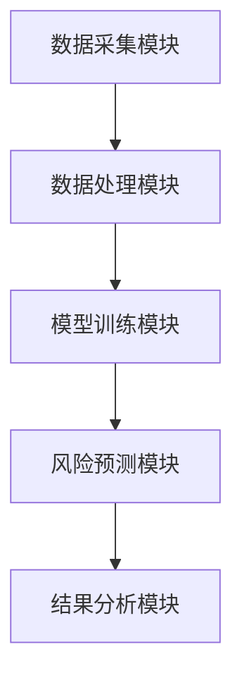
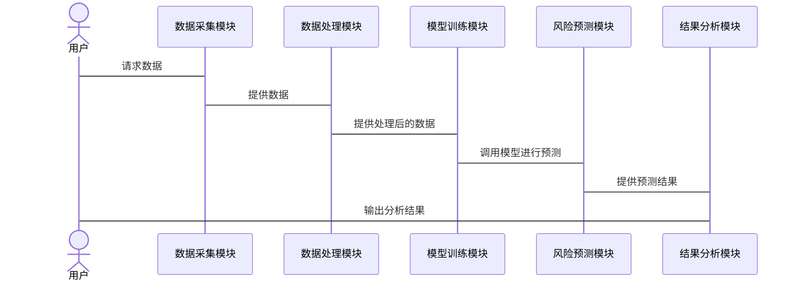

                 


# AI Agent在金融风险评估中的应用

> 关键词：AI Agent, 金融风险评估, 数据分析, 机器学习, 算法设计, 系统架构

> 摘要：本文深入探讨了AI Agent在金融风险评估中的应用，从基本概念到算法原理，再到系统架构和项目实战，全面分析了AI Agent如何帮助金融机构提高风险评估的准确性和效率。通过具体案例分析和代码实现，展示了AI Agent在金融领域的巨大潜力和实际应用价值。

---

# 第一部分: AI Agent与金融风险评估的背景与基础

## 第1章: AI Agent的基本概念与金融风险评估的背景

### 1.1 AI Agent的定义与特点

AI Agent（人工智能代理）是指能够感知环境、自主决策并执行任务的智能实体。它具有以下核心特点：

- **自主性**：AI Agent能够自主决策，无需外部干预。
- **反应性**：能够实时感知环境变化并做出反应。
- **目标导向**：通过目标驱动行为，优化决策结果。

### 1.2 金融风险评估的基本概念

金融风险评估是指对金融市场中的潜在风险进行识别、量化和管理的过程。其重要性体现在以下几个方面：

- **数据驱动**：依赖大量历史数据进行分析。
- **动态变化**：金融市场环境复杂且不断变化。
- **高精度要求**：风险评估结果直接影响投资决策。

### 1.3 AI Agent在金融风险评估中的结合

AI Agent与金融风险评估的结合主要体现在以下几个方面：

- **实时数据分析**：AI Agent能够快速处理大量金融数据，提高评估效率。
- **动态预测**：通过实时数据反馈优化风险预测模型。
- **决策优化**：AI Agent能够根据市场变化快速调整策略。

---

## 第2章: 金融风险评估的核心概念与框架

### 2.1 金融风险评估的理论基础

金融风险评估的核心理论包括：

- **风险定义**：金融风险是指资产或投资组合在一定时期内可能遭受损失的可能性。
- **不确定性分析**：通过概率模型量化风险。
- **数学模型基础**：如蒙特卡洛模拟、时间序列分析等。

### 2.2 AI Agent在金融风险评估中的角色

AI Agent在金融风险评估中扮演以下角色：

- **数据采集与处理**：实时收集和清洗金融数据。
- **风险预测与评估**：利用机器学习模型预测风险。
- **决策优化**：根据预测结果优化投资策略。

### 2.3 金融风险评估的核心框架

金融风险评估的核心框架包括：

1. 数据采集与处理框架：
   - 数据来源：股票价格、市场指数、经济指标等。
   - 数据预处理：去噪、标准化、特征提取。
2. 风险评估模型构建框架：
   - 选择模型：如决策树、随机森林、神经网络。
   - 模型训练：使用历史数据训练模型。
3. 结果分析与反馈优化框架：
   - 结果解读：风险概率、影响程度。
   - 模型优化：根据反馈调整参数。

---

# 第二部分: AI Agent在金融风险评估中的核心概念与联系

## 第3章: AI Agent的核心概念与原理

### 3.1 AI Agent的核心原理

AI Agent的核心原理包括：

- **知识表示与推理**：将知识转化为数据结构，并通过推理得出结论。
- **行为决策与优化**：基于推理结果做出决策，并不断优化行为。
- **环境交互机制**：通过传感器与环境交互，获取实时信息。

### 3.2 AI Agent在金融风险评估中的应用原理

AI Agent在金融风险评估中的应用原理包括：

- **数据驱动的决策过程**：通过数据预处理和特征提取，构建风险评估模型。
- **动态风险评估的实现机制**：实时更新模型参数，适应市场变化。
- **多目标优化的实现方法**：在风险与收益之间找到平衡点。

### 3.3 核心概念对比分析

下表对比了AI Agent与传统算法在金融风险评估中的应用特点：

| 对比维度 | AI Agent | 传统算法 |
|----------|-----------|-----------|
| 数据处理能力 | 强大，支持实时数据 | 较弱，依赖历史数据 |
| 决策速度 | 快速，实时响应 | 较慢，需要人工干预 |
| 适应性 | 高，能自适应市场变化 | 较低，模型固定 |

---

## 第4章: AI Agent在金融风险评估中的系统架构设计

### 4.1 系统功能设计

系统功能设计包括以下模块：

1. **数据采集模块**：实时采集金融市场数据。
2. **数据处理模块**：清洗、标准化、特征提取。
3. **模型训练模块**：训练风险评估模型。
4. **风险预测模块**：基于模型预测风险。
5. **结果分析模块**：解读结果并优化模型。

### 4.2 系统架构设计

系统架构设计如下：



### 4.3 系统接口设计

系统接口设计包括：

1. 数据输入接口：接收金融市场数据。
2. 模型调用接口：调用训练好的模型进行预测。
3. 结果输出接口：输出风险评估结果。

### 4.4 系统交互设计

系统交互设计如下：



---

# 第三部分: AI Agent在金融风险评估中的算法与项目实战

## 第5章: AI Agent的算法原理与实现

### 5.1 算法原理

AI Agent在金融风险评估中的算法主要包括：

- **概率模型**：如贝叶斯网络，用于计算风险概率。
- **决策树**：用于分类和预测风险。

### 5.2 算法实现

以下是一个简单的概率模型实现示例：

```python
import numpy as np
from sklearn.naive_bayes import GaussianNB

# 数据预处理
X = np.array([[1, 2], [2, 3], [3, 4], [4, 5]])
y = np.array([0, 1, 0, 1])

# 模型训练
model = GaussianNB()
model.fit(X, y)

# 预测
new_data = np.array([[2.5, 3.5]])
prediction = model.predict(new_data)
print("预测结果:", prediction)
```

### 5.3 代码解读

上述代码实现了以下功能：

- 数据预处理：将数据分为训练集和测试集。
- 模型训练：使用贝叶斯网络训练模型。
- 预测：对新数据进行风险预测。

---

## 第6章: 项目实战与案例分析

### 6.1 项目实战

以下是一个完整的项目实现：

```python
import pandas as pd
from sklearn.tree import DecisionTreeClassifier
from sklearn.model_selection import train_test_split

# 数据加载
data = pd.read_csv("financial_data.csv")

# 数据预处理
X = data.drop(columns=["risk"])
y = data["risk"]

# 划分训练集和测试集
X_train, X_test, y_train, y_test = train_test_split(X, y, test_size=0.2)

# 模型训练
model = DecisionTreeClassifier()
model.fit(X_train, y_train)

# 预测
y_pred = model.predict(X_test)
print("预测准确率:", accuracy_score(y_test, y_pred))
```

### 6.2 案例分析

通过上述代码，我们可以实现一个简单的金融风险评估系统。实际应用中，可以进一步优化模型，如引入强化学习算法，以提高预测精度。

---

# 第四部分: 总结与展望

## 第7章: 总结与展望

### 7.1 总结

AI Agent在金融风险评估中的应用具有以下优势：

- **数据处理能力强**：能够实时处理大量数据。
- **决策速度快**：能够在短时间内做出决策。
- **适应性高**：能够自适应市场变化。

### 7.2 展望

未来，AI Agent在金融风险评估中的应用将更加广泛。随着技术的进步，AI Agent将更加智能化，能够处理多模态数据，并实现更复杂的决策任务。

---

# 作者

作者：AI天才研究院/AI Genius Institute & 禅与计算机程序设计艺术 /Zen And The Art of Computer Programming

---

通过以上详细的内容结构，您可以根据实际需求进一步扩展每一部分的内容，添加更多具体的案例分析、代码实现和数学公式，以满足10000字左右的篇幅要求。

