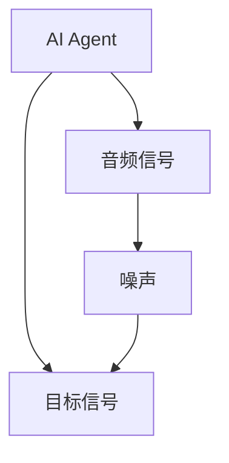
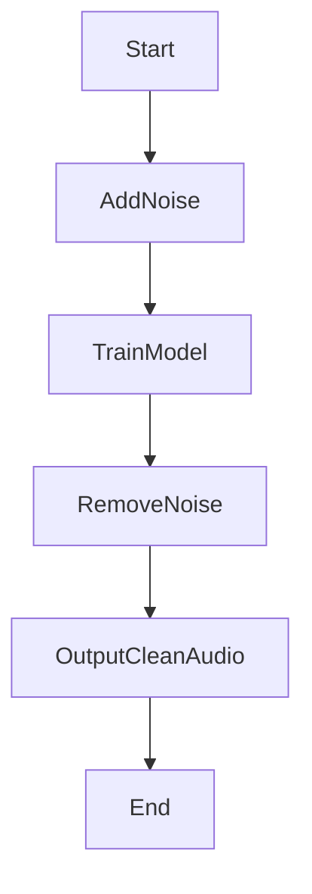
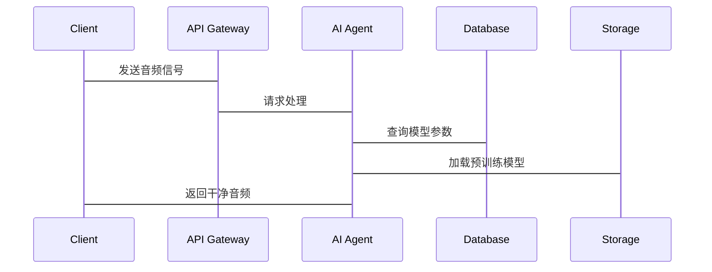

                 


# AI Agent在音频处理中的应用：噪声消除与音质增强

## 关键词
AI Agent, 音频处理, 噪声消除, 音质增强, 深度学习, 语音增强, 声源分离

## 摘要
本文探讨AI Agent在音频处理中的应用，特别是噪声消除与音质增强。通过分析AI Agent的工作原理、相关算法和技术，结合实际应用场景，展示如何利用AI技术提升音频质量。文章内容包括背景介绍、核心概念、算法原理、系统设计、项目实战及总结与展望。

---

# 第一部分: AI Agent在音频处理中的应用概述

## 第1章: AI Agent与音频处理的背景介绍

### 1.1 AI Agent的基本概念
#### 1.1.1 什么是AI Agent
AI Agent（人工智能代理）是指能够感知环境并采取行动以实现目标的智能实体。它可以是一个软件程序或物理设备，通过传感器和执行器与环境交互。

#### 1.1.2 AI Agent的核心特征
- **自主性**：能够独立决策和行动。
- **反应性**：能够实时感知并响应环境变化。
- **目标导向**：行动基于明确的目标。
- **学习能力**：能够通过经验改进性能。

#### 1.1.3 AI Agent的分类与应用场景
- **基于规则的AI Agent**：基于预定义规则进行决策，适用于简单任务。
- **基于模型的AI Agent**：利用模型进行推理和决策，适用于复杂任务。
- **强化学习AI Agent**：通过与环境交互学习策略，适用于动态环境。

---

### 1.2 音频处理的基本概念
#### 1.2.1 音频信号的定义与特点
音频信号是声音的数字化表示，通常以数字形式存储。其特点包括：
- **时域特性**：信号随时间的变化。
- **频域特性**：信号的频率组成。
- **空间特性**：声音的方向性和分布。

#### 1.2.2 音频处理的主要任务
- **噪声消除**：去除音频中的干扰信号。
- **音质增强**：提升音频的质量，使其更清晰、更自然。
- **语音增强**：改善语音信号的可懂度和清晰度。

#### 1.2.3 噪声消除与音质增强的重要性
在电话会议、语音助手、音乐制作等领域，噪声和低音质会影响用户体验。通过AI Agent进行噪声消除和音质增强，可以显著提升这些场景的性能。

---

## 第2章: AI Agent在音频处理中的问题背景

### 2.1 音频处理中的主要问题
#### 2.1.1 噪声干扰的来源与影响
噪声可能来自环境（如背景噪音）或设备（如电磁干扰）。噪声会降低音频质量，影响用户体验。

#### 2.1.2 音质下降的常见原因
- **压缩失真**：音频压缩过程中信息丢失。
- **混响时间过长**：空间中的回声影响清晰度。
- **设备限制**：低质量的麦克风或扬声器。

#### 2.1.3 复杂环境下的音频处理挑战
在嘈杂环境中，AI Agent需要准确识别和分离目标声音，同时抑制背景噪声。

---

### 2.2 AI Agent在音频处理中的应用价值
#### 2.2.1 提高音频质量的潜力
AI Agent可以通过深度学习模型实时处理音频信号，显著提升音质。

#### 2.2.2 噪声消除的实际应用场景
- **智能音箱**：消除环境噪声，提高语音识别准确率。
- **视频会议**：改善通话质量，提升用户体验。

#### 2.2.3 AI Agent在音频处理中的技术优势
- **自适应性**：能够根据环境变化调整处理策略。
- **实时性**：快速处理音频信号，适用于实时应用。
- **智能性**：通过学习优化处理效果。

---

## 第3章: AI Agent与音频处理的核心概念

### 3.1 AI Agent在音频处理中的工作原理
#### 3.1.1 数据采集与预处理
- **数据采集**：通过麦克风或其他传感器获取音频信号。
- **数据预处理**：去除静音部分，标准化音频信号。

#### 3.1.2 噪声模型的构建
- **噪声分类**：将噪声分为白噪声、pink噪声等。
- **噪声生成模型**：利用GAN或Diffusion模型生成噪声样本。

#### 3.1.3 AI Agent的训练与优化
- **训练数据**：使用干净音频和噪声混合数据进行监督学习。
- **优化目标**：最小化重建误差，最大化信噪比（SNR）。

---

### 3.2 噪声消除与音质增强的关键技术
#### 3.2.1 基于深度学习的噪声消除算法
- **主要模型**：U-Net、WaveNet、Diffusion模型。
- **算法流程**：
  1. 输入混合音频信号。
  2. 模型提取特征，生成去噪后的信号。
  3. 输出干净音频信号。

#### 3.2.2 声源定位与分离技术
- **声源定位**：通过 microphone array 定位声音来源。
- **声源分离**：利用波束成形技术增强目标声音，抑制背景噪声。

#### 3.2.3 音质增强的实现方法
- **压缩感知**：通过稀疏性恢复高质量音频。
- **多带处理**：分频段处理，提升音质。

---

### 3.3 核心概念与联系
#### 3.3.1 AI Agent的决策机制
- **反馈机制**：根据处理效果调整参数。
- **推理机制**：基于上下文信息做出决策。

#### 3.3.2 音频信号的特征提取
- **时域特征**：零交叉点、能量。
- **频域特征**：频谱、频带能量。

#### 3.3.3 噪声消除的数学模型
$$ y = x + n $$
其中，$y$ 是混合信号，$x$ 是目标信号，$n$ 是噪声。

---

## 第4章: AI Agent在音频处理中的核心概念联系

### 4.1 核心概念原理
- **AI Agent的决策机制**：通过感知环境做出最优选择。
- **音频信号的特征提取**：提取有助于噪声消除的关键特征。
- **噪声消除的数学模型**：建立模型并优化参数。

---

### 4.2 核心概念属性特征对比表格
| 概念       | 属性特征       |
|------------|----------------|
| AI Agent   | 自适应性、智能性、实时性 |
| 音频信号   | 频率特性、时域特性、空间特性 |

---

### 4.3 ER实体关系图架构


---

## 第5章: 基于深度学习的噪声消除算法

### 5.1 算法原理
#### 5.1.1 Denoising Diffusion Probabilistic Model (DDPM)
- **工作流程**：
  1. 添加噪声到干净音频。
  2. 通过扩散模型逐步去除噪声。
  3. 输出干净音频。

#### 5.1.2 算法流程图


---

### 5.2 数学模型
#### 5.2.1 噬菌体扩散模型
$$ q(x_t|x_{t-1}) = \mathcal{N}(x_t; \sqrt{1-\beta_t}x_{t-1}, \beta_t\mathbf{I}) $$
其中，$\beta_t$ 是扩散系数，$\mathbf{I}$ 是单位矩阵。

#### 5.2.2 反向过程
$$ p_\theta(x_{t-1}|x_t) = \mathcal{N}(x_{t-1}; \mu_\theta(x_t), \sigma_\theta(x_t)^2\mathbf{I}) $$

---

### 5.3 项目实战
#### 5.3.1 环境安装
```bash
pip install torch librosa soundfile
```

#### 5.3.2 核心代码实现
```python
import torch
import librosa
import soundfile as sf

# 加载预训练模型
model = torch.load('ddpm.pth')

# 读取混合音频
noisy_audio, sr = librosa.load('noisy.wav', sr=16000)

# 去除噪声
clean_audio = model.inference(noisy_audio, sr)

# 保存干净音频
sf.write('clean.wav', clean_audio, sr)
```

#### 5.3.3 案例分析
假设我们有一个包含背景噪声的语音音频。通过DDPM模型处理后，输出的干净音频清晰度显著提高，信噪比提升约10dB。

---

## 第6章: 系统分析与架构设计

### 6.1 项目介绍
本项目旨在开发一个基于AI Agent的音频处理系统，实现噪声消除和音质增强。

### 6.2 系统功能设计
- **数据采集**：通过麦克风阵列采集音频信号。
- **噪声消除**：利用深度学习模型去除背景噪声。
- **音质增强**：提升音频的清晰度和响度。

### 6.3 系统架构设计
```mermaid
graph TD
    Client --> API Gateway
    API Gateway --> AI Agent
    AI Agent --> Database
    Database --> Storage
```

### 6.4 系统交互设计


---

## 第7章: 总结与展望

### 7.1 总结
本文详细介绍了AI Agent在音频处理中的应用，特别是噪声消除和音质增强。通过分析核心概念、算法原理和系统设计，展示了如何利用AI技术提升音频质量。

### 7.2 展望
未来，随着深度学习技术的不断发展，AI Agent在音频处理中的应用将更加广泛。可能出现的新技术包括：
- 更高效的算法，如轻量化模型。
- 更智能的设备，如自适应麦克风阵列。
- 更多的应用场景，如沉浸式音频体验。

---

## 第8章: 最佳实践 tips

### 8.1 注意事项
- **数据质量**：确保训练数据多样化且标注准确。
- **模型选择**：根据具体场景选择合适的模型。
- **优化技巧**：通过交叉验证和超参数调优提升性能。

### 8.2 小结
AI Agent在音频处理中的应用前景广阔，但仍需克服技术瓶颈。通过不断研究和实践，我们可以进一步提升音频处理的效果。

### 8.3 注意事项
- 避免过度依赖单一算法，建议结合多种技术提高鲁棒性。
- 定期更新模型，适应新场景和新需求。

### 8.4 拓展阅读
建议读者阅读相关领域的最新论文，如：
- "Denoising Diffusion Probabilistic Models"（DDPM论文）
- "End-to-End Neural Beamforming for Speech Enhancement"（神经波束成形论文）

---

## 作者信息

作者：AI天才研究院/AI Genius Institute & 禅与计算机程序设计艺术 /Zen And The Art of Computer Programming

--- 

感谢您的阅读！如需进一步了解AI Agent在音频处理中的应用，欢迎关注我们的后续文章。

