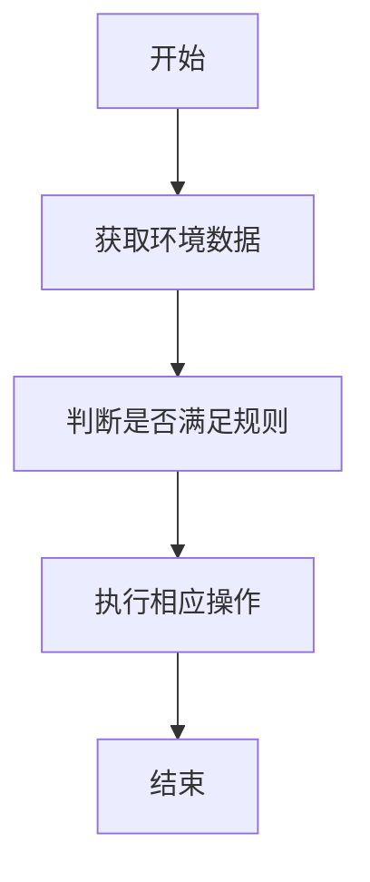
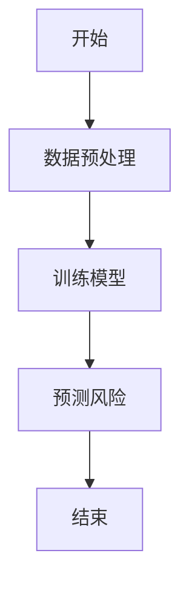
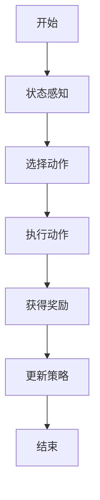
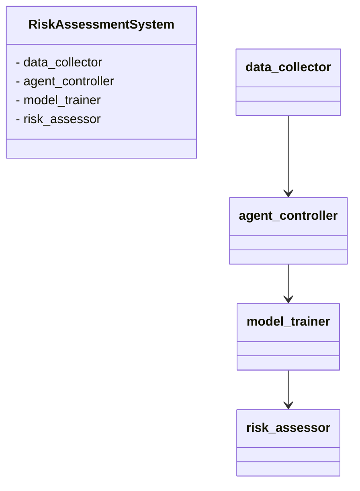
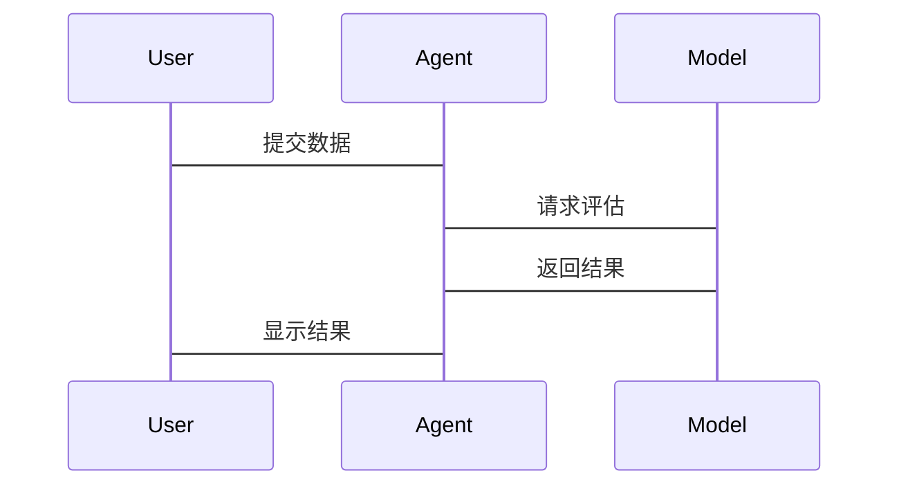

                 


# AI Agent在风险评估中的应用

> 关键词：AI Agent, 风险评估, 人工智能, 系统架构, 项目实战

> 摘要：本文详细探讨了AI Agent在风险评估中的应用，从基本概念、核心原理到算法实现、系统架构，再到实际案例分析，全面解析了AI Agent如何助力风险评估的智能化与高效化。

---

## 第一部分: AI Agent与风险评估的背景介绍

### 第1章: AI Agent的基本概念

#### 1.1 AI Agent的定义
AI Agent（人工智能代理）是指能够感知环境、自主决策并执行任务的智能实体。它通过传感器获取信息，利用推理能力分析数据，并通过执行器与环境交互。AI Agent的核心目标是通过智能算法优化决策过程。

#### 1.2 AI Agent的核心特征
- **自主性**：能够自主决策，无需外部干预。
- **反应性**：实时感知环境并快速响应。
- **学习能力**：通过数据反馈不断优化自身行为。
- **社交能力**：与其他系统或人类进行有效交互。

#### 1.3 AI Agent与传统算法的区别
传统的算法（如决策树、随机森林）依赖于预定义的规则和数据模式，而AI Agent具有自主性和学习能力，能够根据环境动态调整策略。

---

### 第2章: 风险评估的背景与重要性

#### 2.1 风险评估的基本概念
风险评估是对潜在威胁或不确定性进行识别、量化和分析的过程，旨在降低可能带来的损失。

#### 2.2 风险评估在不同领域的应用
- **金融领域**：评估投资风险、信用风险。
- **企业领域**：评估项目风险、运营风险。
- **网络安全**：评估系统漏洞风险。

#### 2.3 风险评估的挑战与机遇
- **挑战**：数据复杂性高、不确定性多。
- **机遇**：AI Agent能够通过实时数据处理和智能决策提升风险评估的效率和准确性。

---

### 第3章: AI Agent与风险评估的结合

#### 3.1 AI Agent在风险评估中的优势
- **实时性**：快速处理实时数据，及时发现潜在风险。
- **智能性**：通过机器学习模型识别复杂模式。
- **适应性**：根据环境变化自适应调整评估策略。

#### 3.2 风险评估中AI Agent的应用场景
- **金融欺诈检测**：实时监控交易数据，识别异常交易。
- **网络安全威胁预测**：通过日志分析预测潜在攻击。
- **信用风险评估**：基于多维度数据评估客户信用风险。

#### 3.3 AI Agent与风险评估的未来发展趋势
随着AI技术的不断发展，AI Agent在风险评估中的应用将更加智能化、自动化和个性化。

---

## 第二部分: AI Agent在风险评估中的核心概念与联系

### 第4章: 核心概念原理

#### 4.1 AI Agent的核心算法原理
- **基于规则的AI Agent**：通过预定义规则进行决策。
- **基于机器学习的AI Agent**：利用监督学习、无监督学习等方法训练模型。
- **基于强化学习的AI Agent**：通过奖励机制优化决策策略。

#### 4.2 风险评估的基本原理
- **数据收集**：获取相关风险数据。
- **特征提取**：提取关键风险特征。
- **模型训练**：构建风险评估模型。
- **风险预测**：基于模型预测潜在风险。

#### 4.3 AI Agent与风险评估的结合原理
- AI Agent通过感知环境获取数据，利用机器学习模型分析数据，生成风险评估结果，并根据结果采取相应的行动。

---

### 第5章: 核心概念属性特征对比

#### 5.1 AI Agent的属性特征
| 属性 | 描述 |
|------|------|
| 自主性 | 能够自主决策 |
| 反应性 | 能够实时感知并响应环境 |
| 学习能力 | 能够通过数据反馈优化行为 |

#### 5.2 风险评估的属性特征
| 属性 | 描述 |
|------|------|
| 数据驱动 | 基于数据进行分析和预测 |
| 多维度 | 涉及多个风险因素 |
| 实时性 | 需要快速响应和处理 |

#### 5.3 两者属性特征对比
通过对比表格可以看出，AI Agent和风险评估在自主性、实时性等方面有相似之处，但在具体实现和目标上有所不同。

---

## 第三部分: AI Agent在风险评估中的算法原理讲解

### 第6章: 基于规则的AI Agent算法

#### 6.1 算法原理
基于规则的AI Agent通过预定义的规则进行决策，适用于规则明确的场景。

#### 6.2 算法流程图（Mermaid）


#### 6.3 Python实现代码
```python
def rule_based_agent(data):
    if data['特征1'] > threshold:
        return '高风险'
    elif data['特征2'] > threshold:
        return '中风险'
    else:
        return '低风险'
```

#### 6.4 数学模型与公式
$$ P(risk) = \sum_{i=1}^{n} w_i \cdot x_i $$

---

### 第7章: 基于机器学习的AI Agent算法

#### 7.1 算法原理
基于机器学习的AI Agent通过训练模型从数据中学习风险特征。

#### 7.2 算法流程图（Mermaid）


#### 7.3 Python实现代码
```python
from sklearn import model

model = model.train(train_data)
prediction = model.predict(test_data)
```

#### 7.4 数学模型与公式
$$ y = \beta_0 + \beta_1 x_1 + \beta_2 x_2 + \ldots + \beta_n x_n $$

---

### 第8章: 基于强化学习的AI Agent算法

#### 8.1 算法原理
基于强化学习的AI Agent通过与环境交互获得奖励，优化决策策略。

#### 8.2 算法流程图（Mermaid）


#### 8.3 Python实现代码
```python
import gym

env = gym.make('RiskAssessmentEnv')
agent = Agent(env.observation_space, env.action_space)
while not done:
    action = agent.act(state)
    next_state, reward, done, _ = env.step(action)
    agent.remember(state, action, reward, next_state)
    agent.replay()
```

#### 8.4 数学模型与公式
$$ Q(s, a) = Q(s, a) + \alpha (r + \gamma \max_a Q(s', a) - Q(s, a)) $$

---

## 第四部分: AI Agent在风险评估中的系统架构设计方案

### 第9章: 问题场景介绍

#### 9.1 系统目标
构建一个基于AI Agent的风险评估系统，实现智能化的风险识别和预警。

#### 9.2 项目介绍
本项目旨在利用AI Agent技术提升风险评估的效率和准确性，适用于金融、企业等领域。

---

### 第10章: 系统功能设计

#### 10.1 领域模型（Mermaid类图）


#### 10.2 系统架构设计（Mermaid架构图）
```mermaid
docker
    service RiskAssessmentSystem {
        publish 80 to $IP:80
    }
    service DataCollector {
        publish 8080 to $IP:8080
    }
```

#### 10.3 系统接口设计
- **数据接口**：负责数据的采集和传输。
- **模型接口**：负责模型的训练和部署。
- **评估接口**：负责风险评估结果的输出。

#### 10.4 系统交互流程图（Mermaid序列图）


---

## 第五部分: 项目实战

### 第11章: 环境安装与核心功能实现

#### 11.1 环境安装
```bash
pip install numpy
pip install scikit-learn
pip install gym
```

#### 11.2 核心功能实现
```python
def assess_risk(data):
    model = load_model('risk_model.h5')
    prediction = model.predict(data)
    return prediction
```

#### 11.3 代码解读
- `load_model`：加载预训练模型。
- `predict`：利用模型进行风险预测。
- 返回结果：根据预测结果输出风险等级。

---

### 第12章: 实际案例分析

#### 12.1 案例背景
某金融机构希望通过AI Agent技术提升信用风险评估效率。

#### 12.2 数据准备
- 数据来源：客户信用记录、交易历史等。
- 数据预处理：清洗、特征提取。

#### 12.3 模型训练
使用随机森林算法训练信用风险评估模型。

#### 12.4 结果分析
通过混淆矩阵和ROC曲线评估模型性能。

---

## 第六部分: 最佳实践、小结与拓展阅读

### 第13章: 最佳实践

#### 13.1 实践建议
- 数据质量是关键，确保数据的完整性和准确性。
- 模型选择要根据具体场景，选择合适的算法。
- 系统设计要注重可扩展性和可维护性。

#### 13.2 注意事项
- 避免过度依赖AI Agent，结合人工审核。
- 定期更新模型，适应环境变化。

### 第14章: 小结

通过本文的详细讲解，我们了解了AI Agent在风险评估中的应用，从基本概念到算法实现，再到系统设计和项目实战，全面掌握了AI Agent在风险评估中的核心技术和实际应用。

### 第15章: 拓展阅读

#### 15.1 推荐书籍
- 《机器学习实战》
- 《强化学习导论》

#### 15.2 推荐博客
- [AI Agent技术博客](https://example.com)

---

## 作者：AI天才研究院 & 禅与计算机程序设计艺术

---

通过本文的系统介绍，读者可以深入了解AI Agent在风险评估中的应用，并掌握实际开发中的关键技术和方法。希望本文能为相关领域的从业者提供有价值的参考和启发。

