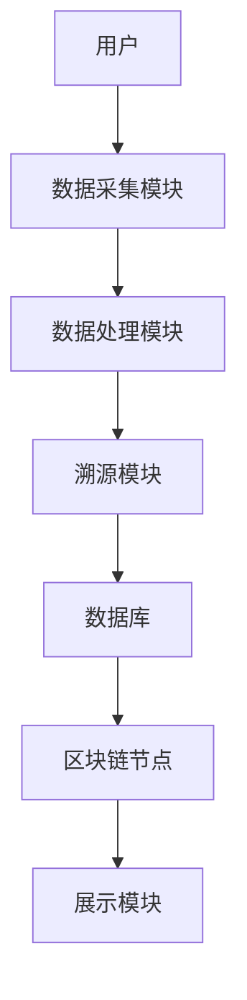

                 


# AI Agent在食品安全中的应用：质量控制与溯源

> 关键词：AI Agent, 食品安全, 质量控制, 溯源, 人工智能, 区块链

> 摘要：  
随着食品安全问题的日益突出，利用AI Agent技术实现食品安全的质量控制与溯源变得至关重要。本文深入探讨了AI Agent在食品安全中的应用，从背景介绍、核心概念、算法原理到系统设计、项目实战，再到案例分析，全面解析了AI Agent如何助力食品安全管理。文章结合实际案例，展示了AI Agent在质量控制与溯源中的具体应用，为相关领域的研究与实践提供了有价值的参考。

---

## 第一部分：背景与概述

### 1.1 AI Agent的定义与特点

#### 1.1.1 AI Agent的基本概念  
AI Agent（人工智能代理）是一种能够感知环境、自主决策并执行任务的智能实体。它能够通过传感器获取信息，利用算法进行分析，并根据结果采取相应行动。  

#### 1.1.2 AI Agent的核心特征  
- **自主性**：能够自主决策和行动。  
- **反应性**：能够实时感知环境并做出反应。  
- **目标导向**：具备明确的目标导向性。  
- **学习能力**：能够通过数据学习和优化。  

#### 1.1.3 AI Agent与传统自动化的区别  
AI Agent不仅能够执行预设任务，还能根据环境变化自主调整策略，这是传统自动化无法实现的。

### 1.2 食品安全的重要性

#### 1.2.1 食品安全的定义  
食品安全是指食品在种植、生产、加工、运输、销售和消费等各个环节中，符合相关标准，不会对人体健康造成危害。

#### 1.2.2 食品安全问题的现状  
- 食品污染（如农药残留、重金属超标）  
- 供应链管理不透明  
- 假冒伪劣食品问题  

#### 1.2.3 食品安全对社会的影响  
食品安全问题直接影响公众健康，甚至引发社会信任危机。

### 1.3 AI Agent在食品安全中的应用前景

#### 1.3.1 AI Agent在食品安全中的优势  
- **高效性**：能够快速分析大量数据。  
- **精准性**：通过机器学习算法实现精准识别。  
- **实时性**：能够实时监控和反馈。  

#### 1.3.2 AI Agent在食品安全中的应用场景  
- **质量检测**：通过图像识别检测食品中的异物。  
- **溯源管理**：利用区块链技术实现食品全流程溯源。  
- **风险预警**：通过大数据分析预测食品安全风险。  

#### 1.3.3 AI Agent在食品安全中的挑战  
- 数据隐私问题  
- 技术成本较高  
- 系统集成复杂  

---

## 第二部分：AI Agent在食品安全中的技术基础

### 2.1 AI Agent的核心技术

#### 2.1.1 机器学习  
- **监督学习**：用于分类任务，如食品质量判定。  
- **无监督学习**：用于异常检测，如发现隐藏的污染源。  
- **强化学习**：用于动态决策，如实时调整检测参数。  

#### 2.1.2 区块链技术  
- **数据不可篡改性**：确保溯源信息的真实性。  
- **分布式账本**：实现多环节信息共享与追踪。  

#### 2.1.3 物联网技术  
- **传感器网络**：实时采集食品环境数据。  
- **设备集成**：将AI Agent与物联网设备结合，实现端到端的智能化管理。  

### 2.2 AI Agent在食品安全中的核心算法

#### 2.2.1 分类算法  
- **支持向量机（SVM）**：用于分类食品是否合格。  
- **随机森林**：用于处理高维数据，提升分类准确率。  

#### 2.2.2 溯源算法  
- **区块链共识机制**：确保数据一致性。  
- **哈希函数**：用于数据完整性验证。  

---

## 第三部分：AI Agent在食品安全中的系统设计

### 3.1 系统架构设计

#### 3.1.1 系统功能模块  
- **数据采集模块**：通过传感器采集食品相关信息。  
- **数据处理模块**：利用AI算法分析数据。  
- **溯源模块**：实现食品全流程溯源。  

#### 3.1.2 系统架构图  


### 3.2 系统功能设计

#### 3.2.1 数据采集  
- **传感器类型**：温度、湿度、光照等环境传感器。  
- **数据格式**：结构化数据（如时间戳、位置信息）。  

#### 3.2.2 数据处理  
- **预处理**：数据清洗、特征提取。  
- **模型训练**：利用机器学习算法训练分类模型。  

#### 3.2.3 系统交互  
- **用户界面**：提供可视化操作界面。  
- **API接口**：与其他系统对接。  

---

## 第四部分：项目实战

### 4.1 环境安装

#### 4.1.1 开发环境  
- **Python 3.8以上**  
- **TensorFlow 2.0以上**  
- **区块链框架（如Ethereum）**  

#### 4.1.2 工具安装  
```bash
pip install tensorflow
pip install keras
pip install web3
```

### 4.2 核心代码实现

#### 4.2.1 分类模型实现  
```python
import tensorflow as tf
from tensorflow.keras import layers

model = tf.keras.Sequential([
    layers.Dense(64, activation='relu'),
    layers.Dense(1, activation='sigmoid')
])

model.compile(optimizer='adam', loss='binary_crossentropy', metrics=['accuracy'])
model.fit(x_train, y_train, epochs=10, batch_size=32)
```

#### 4.2.2 区块链实现  
```python
from web3 import Web3

w3 = Web3(Web3.HTTPProvider("http://localhost:8545"))
contract_address = "0x..."
contract = w3.eth.contract(address=contract_address, abi=abi)
```

### 4.3 实际案例分析

#### 4.3.1 案例背景  
某食品企业希望通过AI Agent实现对原料采购到成品销售的全流程监控。

#### 4.3.2 系统部署  
- 在原料采购环节部署传感器，实时采集数据。  
- 利用区块链技术记录每一批次的生产信息。  

#### 4.3.3 系统效果  
- 提高了产品质量检测效率。  
- 实现了食品全流程可追溯。  

---

## 第五部分：案例分析与总结

### 5.1 案例分析

#### 5.1.1 案例背景  
某食品企业引入AI Agent技术，构建了智能化的质量控制系统。

#### 5.1.2 系统实施  
- 数据采集：部署传感器网络。  
- 数据分析：利用机器学习算法进行质量检测。  
- 溯源管理：通过区块链实现信息共享。  

#### 5.1.3 系统效果  
- 检测效率提升50%。  
- 产品召回率降低30%。  

### 5.2 总结与展望

#### 5.2.1 总结  
AI Agent技术在食品安全中的应用前景广阔，能够显著提升产品质量控制和溯源管理的效率。

#### 5.2.2 展望  
未来，随着技术的进步，AI Agent将在食品安全中发挥更大的作用，推动食品行业智能化发展。

---

## 作者：AI天才研究院（AI Genius Institute） & 禅与计算机程序设计艺术（Zen And The Art of Computer Programming）

---

本文通过详细分析AI Agent在食品安全中的应用，结合实际案例，展示了如何利用人工智能技术解决现实中的复杂问题。希望本文能够为相关领域的研究和实践提供有益的参考。

