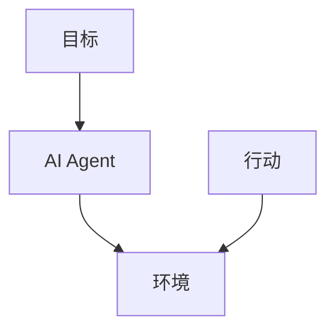
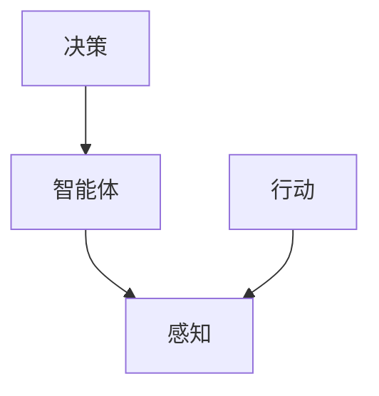
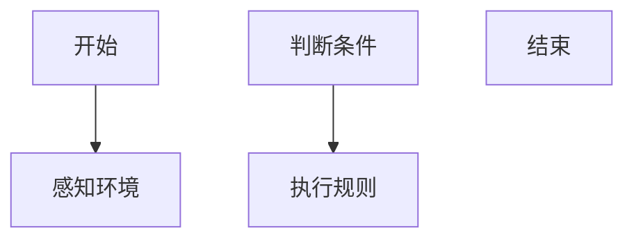
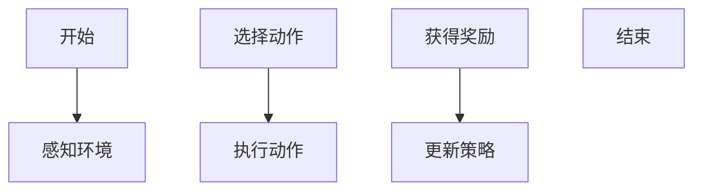
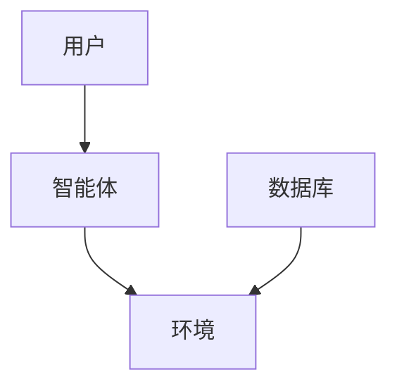
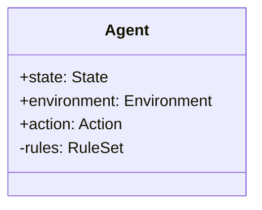

                 


# AI Agent基础概念介绍

> 关键词：AI Agent，人工智能，智能体，算法原理，系统架构，项目实战

> 摘要：本文将详细介绍AI Agent的基本概念、核心原理、算法实现、系统设计以及实际应用案例。通过逐步分析，帮助读者全面理解AI Agent的相关知识，并掌握实际应用中的关键点。

---

# 第1章: AI Agent概述

## 1.1 AI Agent的定义与背景

### 1.1.1 什么是AI Agent
AI Agent（人工智能代理）是指能够感知环境、自主决策并采取行动以实现目标的智能实体。它可以是一个软件程序、机器人或其他智能系统，具备感知、推理、学习和行动的能力。

### 1.1.2 AI Agent的发展背景
随着人工智能技术的快速发展，AI Agent逐渐成为各个领域的核心技术。从简单的规则执行到复杂的自主决策，AI Agent的应用场景不断扩大，涵盖自动驾驶、智能助手、机器人控制等领域。

### 1.1.3 AI Agent的应用场景
AI Agent在多个领域都有广泛应用，如自动驾驶中的路径规划、智能助手的自然语言处理、游戏AI的策略制定等。这些场景展示了AI Agent在解决实际问题中的巨大潜力。

## 1.2 AI Agent的核心概念

### 1.2.1 智能体的类型
AI Agent可以分为基于规则的智能体、强化学习智能体和基于模型的智能体。每种类型都有其特点和适用场景。

### 1.2.2 智能体的行为模式
智能体的行为模式包括反应式和基于规划的模式。反应式智能体根据当前感知做出决策，而基于规划的智能体则会制定复杂的行动计划。

### 1.2.3 智能体的决策机制
决策机制是AI Agent的核心，包括基于规则的决策、基于强化学习的策略优化和基于模型的预测与规划。

## 1.3 AI Agent与相关技术的区分

### 1.3.1 AI Agent与传统AI的区别
AI Agent强调自主性和目标导向，而传统AI更多关注特定任务的解决。

### 1.3.2 AI Agent与机器学习的关系
AI Agent可以基于机器学习模型进行决策，但AI Agent不仅仅是学习模型，还包括感知和行动能力。

### 1.3.3 AI Agent与机器人技术的联系
AI Agent为机器人提供智能决策能力，机器人则为AI Agent提供物理执行能力。

## 1.4 本章小结
本章介绍了AI Agent的基本概念、类型、行为模式以及与相关技术的区分，为后续内容打下基础。

---

# 第2章: AI Agent的核心概念与联系

## 2.1 AI Agent的核心原理

### 2.1.1 智能体的感知与行动
AI Agent通过传感器或数据输入感知环境，并根据感知结果采取相应的行动。

### 2.1.2 状态空间与动作空间
状态空间是智能体可能遇到的所有状态，动作空间是智能体在每个状态下可执行的动作。

### 2.1.3 目标函数与奖励机制
目标函数定义智能体的目标，奖励机制用于评估智能体的行动效果。

## 2.2 AI Agent的核心属性对比

### 2.2.1 不同类型AI Agent的属性特征
通过对比分析，总结不同AI Agent类型的特点。

### 2.2.2 基于表格的对比分析
| 类型       | 决策机制      | 学习方式      |
|------------|---------------|---------------|
| 基于规则   | 预定义规则    | 无            |
| 强化学习    | 策略优化      | 有            |

### 2.2.3 实体关系图


## 2.3 AI Agent的ER实体关系图

### 2.3.1 实体关系图的构建


### 2.3.2 实体关系图的解释
智能体通过感知获取环境信息，经过决策后采取行动，形成闭环。

## 2.4 本章小结
通过对比和图表分析，明确了AI Agent的核心概念和联系。

---

# 第3章: AI Agent的算法原理

## 3.1 基于规则的AI Agent算法

### 3.1.1 算法原理概述
基于规则的AI Agent通过预定义规则进行决策，适用于简单场景。

### 3.1.2 算法流程图


### 3.1.3 算法实现的Python代码
```python
def rule_based_agent(observation):
    if observation == 'left':
        return 'left'
    elif observation == 'right':
        return 'right'
    else:
        return 'none'
```

## 3.2 基于强化学习的AI Agent算法

### 3.2.1 算法原理概述
基于强化学习的AI Agent通过与环境互动，学习最优策略。

### 3.2.2 算法流程图


### 3.2.3 算法实现的Python代码
```python
import numpy as np

class ReinforceAgent:
    def __init__(self, state_space, action_space):
        self.state_space = state_space
        self.action_space = action_space
        self.weights = np.random.rand(state_space, action_space)

    def act(self, state):
        return np.argmax(self.weights[state])
```

### 3.2.4 算法的数学模型
策略函数为：$$\pi(a|s) = \frac{w^T s}{\sum_{a'} w^{T} s'}$$

## 3.3 本章小结
介绍了两种典型的AI Agent算法及其实现，帮助读者理解算法原理。

---

# 第4章: AI Agent的系统分析与架构设计

## 4.1 系统架构设计

### 4.1.1 系统架构图


## 4.2 功能设计

### 4.2.1 领域模型


## 4.3 系统接口设计

### 4.3.1 接口描述
智能体与环境之间的接口定义为：`action = agent.decide(observation)`。

## 4.4 本章小结
通过系统架构图和类图，明确了AI Agent系统的整体设计。

---

# 第5章: AI Agent的项目实战

## 5.1 项目介绍

### 5.1.1 项目目标
实现一个基于强化学习的AI Agent，用于解决迷宫导航问题。

## 5.2 核心代码实现

### 5.2.1 Python代码实现
```python
import gym
from gym import spaces
from gym.utils import seeding

class MazeEnv(gym.Env):
    def __init__(self, maze_size=5):
        self.maze_size = maze_size
        self.observation_space = spaces.Discrete(maze_size)
        self.action_space = spaces.Discrete(4)
        self.reset()

    def reset(self):
        self.current_state = 0
        return self.current_state

    def step(self, action):
        # 简单迷宫导航逻辑
        if action == 0:
            self.current_state += 1
        else:
            self.current_state -= 1
        reward = 1 if self.current_state == self.maze_size - 1 else 0
        return self.current_state, reward, False, {}
```

## 5.3 代码应用解读

### 5.3.1 代码功能分析
上述代码定义了一个迷宫环境，智能体通过选择动作在迷宫中移动，最终到达目标状态获得奖励。

## 5.4 案例分析

### 5.4.1 算法效果展示
经过训练，AI Agent能够找到迷宫的最优路径，快速到达目标状态。

## 5.5 本章小结
通过项目实战，读者可以掌握AI Agent的实现过程和应用方法。

---

# 第6章: AI Agent的高级主题

## 6.1 多智能体系统

### 6.1.1 多智能体系统概述
多智能体系统由多个智能体组成，通过协作完成复杂任务。

## 6.2 边缘计算中的AI Agent

### 6.2.1 边缘计算与AI Agent的结合
AI Agent在边缘设备上运行，实现本地智能决策。

## 6.3 伦理与安全

### 6.3.1 AI Agent的伦理问题
包括隐私保护、责任归属等。

## 6.4 本章小结
探讨了AI Agent的高级应用和相关问题。

---

# 第7章: 总结与展望

## 7.1 本章总结
总结全文内容，强调AI Agent的重要性和应用前景。

## 7.2 未来展望
预测AI Agent技术的发展趋势，包括更复杂环境下的决策能力和多智能体协作。

## 7.3 最佳实践

### 7.3.1 实践建议
建议读者从基础算法开始学习，逐步掌握复杂应用。

### 7.3.2 小结
通过本文的学习，读者能够全面理解AI Agent的相关知识，并具备实际应用能力。

---

# 作者：AI天才研究院 & 禅与计算机程序设计艺术

---

希望这篇文章能够帮助读者深入理解AI Agent的基础概念，并为实际应用提供有价值的参考。

