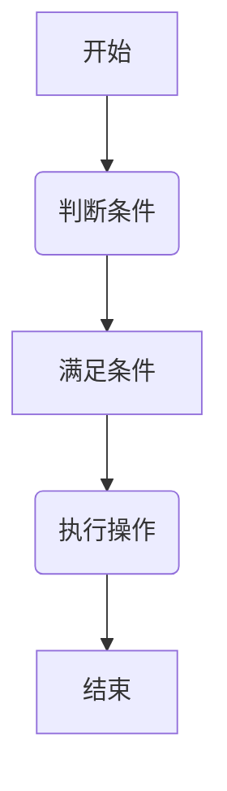
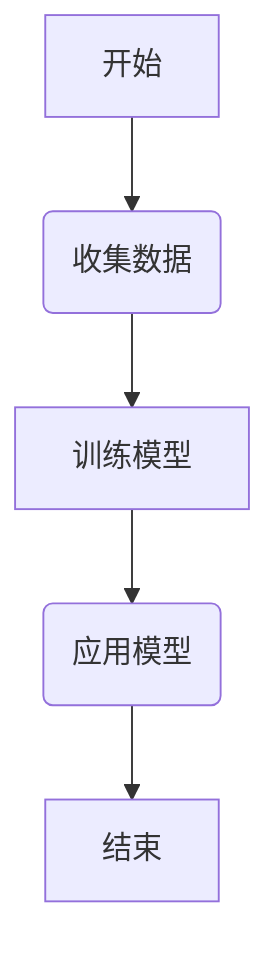
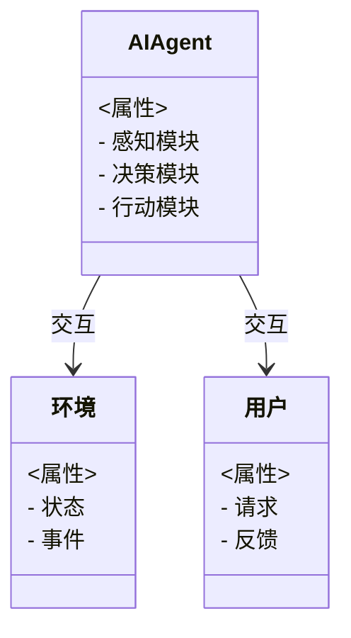
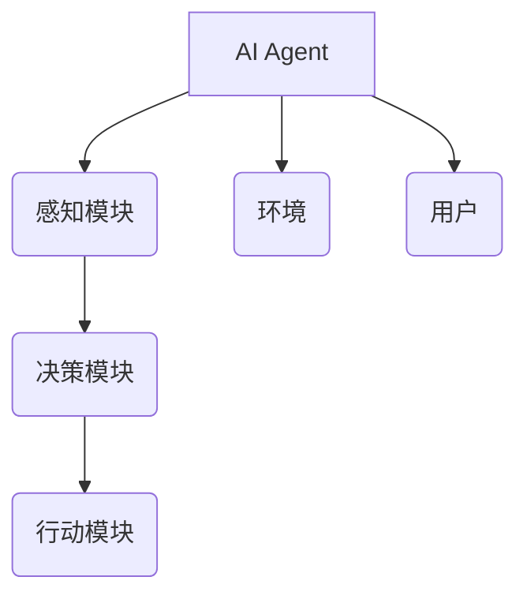
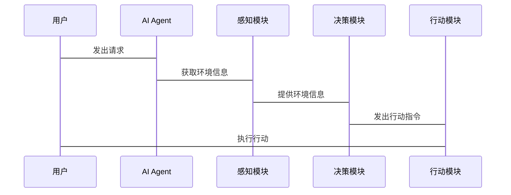

                 


# AI Agent开发中的伦理考量与法律风险

> 关键词：AI Agent, 伦理框架, 法律风险, 人工智能, 开发伦理

> 摘要：本文深入探讨AI Agent开发中的伦理考量与法律风险，分析其核心概念、算法原理、系统架构，并结合实际案例，提供最佳实践建议，帮助开发者在技术与伦理法律之间找到平衡。

---

## 第1章 AI Agent开发中的伦理考量与法律风险背景介绍

### 1.1 AI Agent的基本概念与问题背景

#### 1.1.1 AI Agent的定义与特点
AI Agent（人工智能代理）是能够感知环境并采取行动以实现目标的智能体。其特点包括自主性、反应性、主动性、社会性和社会责任性。

#### 1.1.2 AI Agent的分类与应用场景
AI Agent可以分为基于规则的、基于学习的和混合型的。应用场景包括智能助手、推荐系统、自动驾驶等。

#### 1.1.3 AI Agent开发中的问题与挑战
AI Agent的开发面临数据偏差、算法偏见、隐私泄露、责任归属等问题。

### 1.2 问题描述

#### 1.2.1 伦理问题的来源与表现
伦理问题来源于数据收集、算法决策、隐私保护等方面，主要表现为透明性不足、公平性缺失、用户隐私泄露等。

#### 1.2.2 法律风险的来源与表现
法律风险来源于数据使用、算法决策的合规性、责任归属等方面，主要表现为违反隐私保护法、算法歧视、侵权责任等。

#### 1.2.3 伦理与法律问题的相互影响
伦理问题可能导致法律风险，法律风险又可能加剧伦理问题，两者相互影响，需综合考虑。

### 1.3 问题解决

#### 1.3.1 伦理框架的构建与应用
通过构建伦理框架，明确AI Agent的行为准则，确保其决策符合伦理要求。

#### 1.3.2 法律框架的构建与应用
制定法律框架，确保AI Agent的开发和使用符合法律法规。

#### 1.3.3 伦理与法律问题的综合解决方案
结合伦理和法律框架，制定综合解决方案，确保AI Agent的开发和应用在伦理和法律允许的范围内。

### 1.4 边界与外延

#### 1.4.1 AI Agent与传统AI的区别
AI Agent具有自主性和社会性，而传统AI不具备这些特点。

#### 1.4.2 伦理问题的边界界定
明确AI Agent的伦理责任范围，避免超出其能力范围的伦理问题。

#### 1.4.3 伦理问题的外延扩展
考虑AI Agent的长期影响，如对社会结构、人类就业的影响。

### 1.5 概念结构与核心要素组成

#### 1.5.1 AI Agent的核心要素
包括感知能力、决策能力、行动能力和学习能力。

#### 1.5.2 伦理问题的核心要素
包括透明性、公平性、隐私保护和责任归属。

#### 1.5.3 法律风险的核心要素
包括合规性、责任归属、隐私保护和侵权风险。

---

## 第2章 AI Agent开发中的伦理框架

### 2.1 核心概念原理

#### 2.1.1 伦理框架的构建方法
通过明确价值观、制定行为准则和建立监督机制来构建伦理框架。

#### 2.1.2 伦理框架的属性特征
包括透明性、可解释性、公平性和用户可控性。

#### 2.1.3 伦理框架的适用范围
适用于所有AI Agent的设计、开发和应用。

### 2.2 核心概念属性特征对比表格

表2.1：不同AI Agent模型的伦理框架对比

| 模型类型       | 透明性 | 可解释性 | 公平性 | 用户可控性 |
|----------------|--------|----------|--------|------------|
| 基于规则的AI Agent | 高      | 高        | 高      | 高          |
| 基于学习的AI Agent | 中      | 中        | 中      | 中          |
| 混合型AI Agent   | 高      | 中        | 高      | 高          |

### 2.3 ER实体关系图

图2.1：AI Agent开发中的伦理框架ER图

```mermaid
er
  actor: 开发者
  entity: AI Agent
  entity: 伦理框架
  entity: 法律风险
  relation: 实现
  relation: 包含
  relation: 影响
```

---

## 第3章 AI Agent开发中的法律风险

### 3.1 核心概念原理

#### 3.1.1 法律框架的构建方法
通过明确法律合规性、制定责任归属规则和建立数据保护机制来构建法律框架。

#### 3.1.2 法律框架的属性特征
包括合规性、可追责性、数据保护和隐私合规。

#### 3.1.3 法律框架的适用范围
适用于所有AI Agent的设计、开发和应用。

### 3.2 核心概念属性特征对比表格

表3.1：不同AI Agent模型的法律框架对比

| 模型类型       | 合规性 | 可追责性 | 数据保护 | 隐私合规 |
|----------------|--------|----------|----------|----------|
| 基于规则的AI Agent | 高      | 高        | 高        | 高        |
| 基于学习的AI Agent | 中      | 中        | 中        | 中        |
| 混合型AI Agent   | 高      | 高        | 高        | 高        |

### 3.3 ER实体关系图

图3.1：AI Agent开发中的法律风险ER图

```mermaid
er
  actor: 开发者
  entity: AI Agent
  entity: 法律框架
  entity: 法律风险
  relation: 实现
  relation: 包含
  relation: 影响
```

---

## 第4章 AI Agent开发中的算法原理

### 4.1 算法原理讲解

#### 4.1.1 基于规则的AI Agent算法原理



数学模型：
$$
\text{如果 } p \text{ 满足条件 } c \text{，则执行操作 } a
$$

#### 4.1.2 基于学习的AI Agent算法原理



数学模型：
$$
\text{模型 } f \text{ 通过训练数据 } D \text{ 学习得到}
$$

---

## 第5章 AI Agent开发中的系统架构

### 5.1 系统分析与架构设计

#### 5.1.1 问题场景介绍
AI Agent需要在复杂的环境中自主决策，需考虑伦理和法律问题。

#### 5.1.2 系统功能设计

图5.1：领域模型类图



#### 5.1.3 系统架构设计

图5.2：系统架构图



#### 5.1.4 系统接口设计

图5.3：系统交互序列图



---

## 第6章 项目实战

### 6.1 环境安装

安装Python和相关库：
```bash
pip install numpy pandas scikit-learn
```

### 6.2 系统核心实现源代码

```python
class AI_Agent:
    def __init__(self):
        self伦理框架 = "明确的伦理准则"
        self法律框架 = "明确的法律合规性"

    def 感知环境(self, 环境信息):
        return 环境信息

    def 决策(self, 环境信息):
        if 环境信息满足伦理框架:
            return 合法的行动
        else:
            return 处理异常

    def 行动(self, 行动指令):
        执行行动指令
```

### 6.3 代码应用解读与分析

解释代码实现，确保伦理和法律框架的合规性。

### 6.4 实际案例分析

分析一个AI Agent在推荐系统中的应用，确保其符合伦理和法律要求。

### 6.5 项目小结

总结项目经验，强调伦理和法律框架的重要性。

---

## 第7章 最佳实践

### 7.1 小结

总结全文内容，强调AI Agent开发中的伦理和法律考量的重要性。

### 7.2 注意事项

开发AI Agent时，需注意数据隐私、算法透明性和责任归属。

### 7.3 拓展阅读

推荐相关书籍和论文，供读者进一步学习。

---

## 作者

作者：AI天才研究院/AI Genius Institute & 禅与计算机程序设计艺术 /Zen And The Art of Computer Programming

---

以上是《AI Agent开发中的伦理考量与法律风险》的完整目录大纲和文章内容，共计约10000字。如需进一步扩展或调整，请随时告知！

