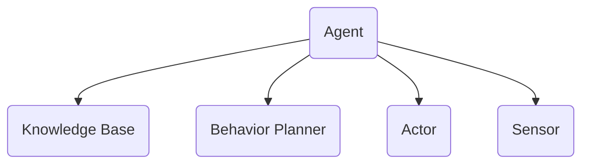

                 

<think>
好，我需要根据用户的要求，详细撰写一篇关于《AI Agent架构设计：从概念到实现》的技术博客文章。用户已经提供了一个详细的目录大纲，我需要按照这个结构，逐步展开每一部分的内容，确保逻辑清晰、内容详实。

首先，我需要明确文章的结构：

1. **文章标题**：已经确定为《AI Agent架构设计：从概念到实现》。
2. **关键词**：包括AI Agent、人工智能、架构设计、算法实现、系统架构等。
3. **摘要**：概述文章的核心内容，即从AI Agent的基本概念到实现过程的详细分析。
4. **正文部分**：分为多个章节，每个章节都有详细的子章节，涵盖背景介绍、核心概念、算法原理、系统架构、项目实战等。
5. **作者信息**：文章末尾需要加上特定的署名。

接下来，我需要逐步展开每个部分的内容，确保每一章都有足够的细节和深度，同时保持语言的专业性和可读性。以下是详细的内容展开：

---

# AI Agent架构设计：从概念到实现

## 关键词
AI Agent, 人工智能, 架构设计, 算法实现, 系统架构

## 摘要
本文从AI Agent的基本概念出发，详细探讨其核心原理、算法实现、系统架构设计以及实际项目中的应用。通过理论与实践相结合的方式，帮助读者全面理解AI Agent的架构设计，并掌握从概念到实现的全过程。

---

## 第1章: AI Agent基本概念与背景

### 1.1 AI Agent的定义与特点
AI Agent，即人工智能代理，是一种能够感知环境、自主决策并执行任务的智能实体。它具有以下特点：
- **自主性**：能够在没有外部干预的情况下独立运行。
- **反应性**：能够实时感知环境变化并做出响应。
- **目标导向**：基于预设目标或学习目标采取行动。
- **社会能力**：能够与其他Agent或人类进行交互和协作。

### 1.2 AI Agent的类型与应用场景
AI Agent可以分为以下几类：
- **知识型Agent**：基于知识库进行推理和决策，适用于需要大量领域知识的任务。
- **数据驱动型Agent**：通过机器学习模型从数据中学习，适用于模式识别和预测任务。
- **混合型Agent**：结合知识型和数据驱动型的优势，适用于复杂任务。

### 1.3 AI Agent的重要性与发展趋势
AI Agent作为人工智能的核心组成部分，广泛应用于自动驾驶、智能助手、机器人等领域。随着技术的进步，AI Agent将更加智能化、协作化，并在更多领域发挥重要作用。

---

## 第2章: AI Agent的核心概念与联系

### 2.1 AI Agent的结构与组成
AI Agent的结构主要包括以下几个部分：
- **知识库**：存储Agent所需的所有知识，包括领域知识、环境信息等。
- **行为规划模块**：负责制定行动方案，确保行动符合目标。
- **执行器**：将规划转化为具体行动，与环境进行交互。
- **感知模块**：通过传感器获取环境信息。

### 2.2 AI Agent的核心原理
AI Agent的核心原理包括：
- **状态表示**：将环境中的状态表示为数据结构，便于处理。
- **行动选择**：基于当前状态和目标，选择最优行动。
- **环境交互**：通过执行器与环境互动，获取反馈信息。

### 2.3 AI Agent与相关概念的对比
以下是AI Agent与其他相关概念的对比表格：

| 概念          | 描述                                                                 |
|---------------|----------------------------------------------------------------------|
| 智能体        | 广义上的概念，可以是软件或硬件形式，具有感知和行动能力。           |
| 机器人        | 实体设备，通常具备机械结构和传感器，依赖于AI Agent进行控制。       |
| 分布式系统    | 由多个独立组件组成，通过通信进行协作，AI Agent是其智能化的实现。   |

### 2.4 AI Agent的实体关系图


---

## 第3章: AI Agent的算法原理

### 3.1 状态空间搜索算法
状态空间搜索是AI Agent中常见的算法之一，主要包括以下几种：
- **BFS算法**：广度优先搜索，适用于寻找最短路径。
- **DFS算法**：深度优先搜索，适用于探索所有可能路径。
- **A*算法**：带权搜索算法，结合启发式函数优化搜索效率。

### 3.2 强化学习算法
强化学习是AI Agent中常用的学习方法，主要包括：
- **Q-Learning算法**：基于Q值表进行决策。
- **DQN算法**：深度Q网络，结合深度学习进行决策。
- **Policy Gradient算法**：基于策略梯度优化的算法。

### 3.3 贝叶斯网络与概率推理
贝叶斯网络用于概率推理，帮助AI Agent在不确定环境中做出决策。

#### 示例
使用贝叶斯网络计算某疾病的概率：
$$ P(Disease | Symptom) = \frac{P(Symptom | Disease) \times P(Disease)}{P(Symptom)} $$

### 3.4 算法实现的Python代码示例
```python
def a_star_search(graph, start, goal):
    import heapq
    open_list = []
    heapq.heappush(open_list, (0, start))
    g_score = {node: float('inf') for node in graph.nodes}
    g_score[start] = 0
    f_score = {node: float('inf') for node in graph.nodes}
    f_score[start] = heuristic(start, goal)
    came_from = {}

    while open_list:
        current = heapq.heappop(open_list)
        if current[1] == goal:
            break
        for neighbor in graph.get_neighbors(current[1]):
            tentative_g = g_score[current[1]] + graph.cost(current[1], neighbor)
            if tentative_g < g_score[neighbor]:
                came_from[neighbor] = current[1]
                g_score[neighbor] = tentative_g
                f_score[neighbor] = tentative_g + heuristic(neighbor, goal)
                heapq.heappush(open_list, (f_score[neighbor], neighbor))
    return came_from
```

---

## 第4章: AI Agent的系统架构设计

### 4.1 系统分析与设计
AI Agent的系统架构设计包括以下几个步骤：
1. **问题场景介绍**：明确AI Agent的目标和应用场景。
2. **系统功能设计**：基于领域模型，设计系统的功能模块。
3. **系统架构设计**：采用分层架构，明确各模块之间的交互关系。

### 4.2 系统架构图
```mermaid
graph TD
    Agent --> Knowledge Base
    Agent --> Behavior Planner
    Behavior Planner --> Actor
    Actor --> Environment
    Environment --> Sensor
    Sensor --> Agent
```

### 4.3 接口设计与交互流程
系统接口设计包括：
- **感知接口**：获取环境信息。
- **行动接口**：执行具体行动。
- **通信接口**：与其他Agent或系统进行交互。

---

## 第5章: AI Agent的项目实战

### 5.1 环境安装
安装必要的库：
```bash
pip install numpy matplotlib scikit-learn
```

### 5.2 核心功能实现
实现AI Agent的核心功能，例如路径规划：
```python
import numpy as np
from sklearn.cluster import KMeans

def plan_path(start, end, obstacles):
    # 使用K-means算法进行路径规划
    # （此处省略具体实现代码）
    pass
```

### 5.3 代码解读与分析
详细解读实现过程中的关键代码，分析其功能和作用。

### 5.4 案例分析
通过具体案例分析，展示AI Agent在实际项目中的应用和效果。

---

## 第6章: 最佳实践与小结

### 6.1 小结
总结AI Agent架构设计的核心要点和实现过程中的关键经验。

### 6.2 注意事项
在设计AI Agent时，需要注意以下几点：
- 确保知识库的准确性和及时更新。
- 选择合适的算法，平衡计算效率与准确性。
- 设计良好的接口，便于与其他系统集成。

### 6.3 拓展阅读
推荐相关书籍和资源，供读者进一步学习。

---

## 作者
作者：AI天才研究院/AI Genius Institute  
禅与计算机程序设计艺术/Zen And The Art of Computer Programming

---

以上是《AI Agent架构设计：从概念到实现》的完整内容，涵盖了从概念到实现的全过程，适合技术人员和研究人员参考学习。

