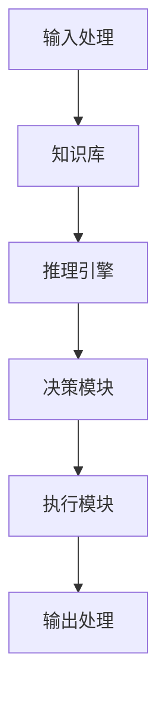

                 


# AI Agent架构设计：从概念到实现

> 关键词：AI Agent, 智能代理, 人工智能, 算法原理, 系统架构

> 摘要：本文从AI Agent的基本概念出发，详细探讨了其核心概念、算法原理、系统架构设计、项目实战以及未来发展方向。通过逐步分析和实例讲解，帮助读者全面理解AI Agent的实现过程。

---

# 第一部分: AI Agent概述

# 第1章: AI Agent的基本概念

## 1.1 AI Agent的定义与特点

AI Agent（智能代理）是一种能够感知环境、自主决策并采取行动以实现目标的实体。与传统程序不同，AI Agent具备以下特点：

- **自主性**：能够在没有外部干预的情况下独立运行。
- **反应性**：能够实时感知环境并做出响应。
- **目标导向性**：通过目标驱动行为，优化决策过程。
- **学习能力**：能够通过经验改进自身性能。

## 1.2 AI Agent的应用场景

AI Agent广泛应用于多个领域，以下是几个典型场景：

- **自动化任务处理**：如自动邮件分类、智能日历管理等。
- **智能交互**：如智能客服、虚拟助手（Siri、Alexa）等。
- **游戏开发**：如自动驾驶、智能棋类（AlphaGo）等。

## 1.3 AI Agent的发展历程

AI Agent的发展经历了多个阶段，从简单的规则驱动到复杂的自主学习，体现了技术的进步：

- **第一代：基于规则的Agent**：通过预定义规则进行简单决策。
- **第二代：基于模型的Agent**：引入知识表示和推理机制。
- **第三代：基于学习的Agent**：结合机器学习技术，实现自适应决策。
- **第四代：人-AI协作Agent**：与人类协同工作，结合人类智慧和AI能力。

---

# 第二部分: AI Agent的核心概念

# 第2章: AI Agent的核心概念

## 2.1 智能体的类型

AI Agent可以根据不同标准进行分类，以下是常见的分类方式：

- **按智能水平**：
  - 简单反射型Agent：基于当前感知做出反应。
  - 基于模型的反射型Agent：利用内部模型进行决策。
  - 目标驱动型Agent：以目标为导向进行行动。
  - 增量学习型Agent：通过经验逐步优化性能。

- **按环境类型**：
  - 知识环境：具备完整且确定的知识。
  - 不完全知识环境：存在不确定性。
  - 动态环境：环境状态随时间变化。

## 2.2 AI Agent的任务模型

任务模型是AI Agent实现目标的核心框架，主要包括以下几个方面：

- **任务分解**：将复杂任务分解为子任务。
- **行为选择**：在多个可能行为中选择最优行动。
- **状态空间**：描述环境的所有可能状态。
- **动作空间**：描述智能体可以执行的所有动作。

---

# 第三部分: AI Agent的算法原理

# 第3章: AI Agent的搜索算法

## 3.1 广度优先搜索（BFS）

广度优先搜索是一种常见的搜索算法，适用于寻找最短路径问题。其核心思想是按层遍历，确保找到的路径是最短的。

- **算法步骤**：
  1. 初始化队列，并将起始节点加入队列。
  2. 取出队列中的节点，访问其所有邻居节点。
  3. 将未访问的邻居节点加入队列，直到找到目标节点。

- **优缺点**：
  - 优点：保证找到最短路径。
  - 缺点：空间复杂度较高，不适合大规模问题。

---

# 第四部分: AI Agent的系统架构设计

# 第4章: AI Agent的系统架构

## 4.1 系统功能设计

AI Agent的系统架构设计需要考虑以下几个方面：

- **输入输出接口**：定义与外部环境的交互方式。
- **核心算法模块**：实现决策和行为选择的算法。
- **知识库**：存储和管理智能体的知识和经验。
- **执行模块**：负责将决策转化为具体行动。

## 4.2 系统架构图

以下是AI Agent系统的架构图：



---

# 第五部分: AI Agent的项目实战

# 第5章: AI Agent的实现

## 5.1 环境安装

以下是实现AI Agent所需的环境和工具：

- **编程语言**：Python
- **库与框架**：NumPy、TensorFlow、PyTorch
- **开发工具**：VS Code、PyCharm

## 5.2 核心代码实现

以下是基于强化学习的AI Agent实现代码示例：

```python
import numpy as np

class AI_Agent:
    def __init__(self, state_space, action_space):
        self.state_space = state_space
        self.action_space = action_space
        self.q_table = np.zeros((state_space, action_space))
    
    def感知环境(self, state):
        return state
    
    def选择动作(self, state, epsilon=0.1):
        if np.random.random() < epsilon:
            return np.random.randint(self.action_space)
        else:
            return np.argmax(self.q_table[state])
    
    def更新Q表(self, state, action, reward, next_state):
        self.q_table[state, action] += 0.1 * (reward + np.max(self.q_table[next_state]))
```

---

# 第六部分: 总结与展望

# 第6章: 总结与未来展望

## 6.1 本章总结

本文从AI Agent的基本概念出发，详细探讨了其核心概念、算法原理、系统架构设计和项目实现过程。通过理论与实践的结合，帮助读者全面理解AI Agent的实现过程。

## 6.2 未来展望

随着人工智能技术的不断发展，AI Agent将具备更强的自主性和学习能力。未来的研究方向包括：

- **多智能体协作**：研究多个AI Agent之间的协作与通信。
- **人机协作**：探索AI Agent与人类协同工作的新模式。
- **强化学习优化**：进一步提升AI Agent的决策和学习能力。

---

作者：AI天才研究院/AI Genius Institute & 禅与计算机程序设计艺术 /Zen And The Art of Computer Programming

