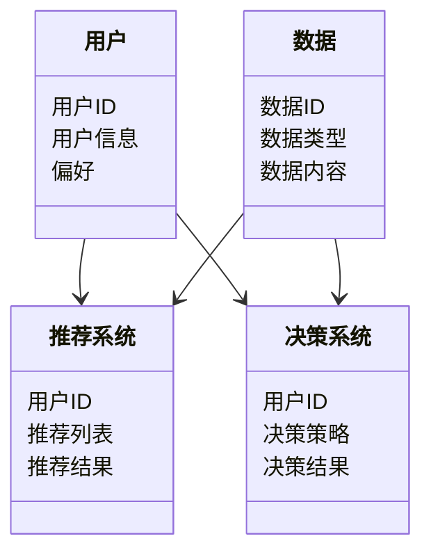
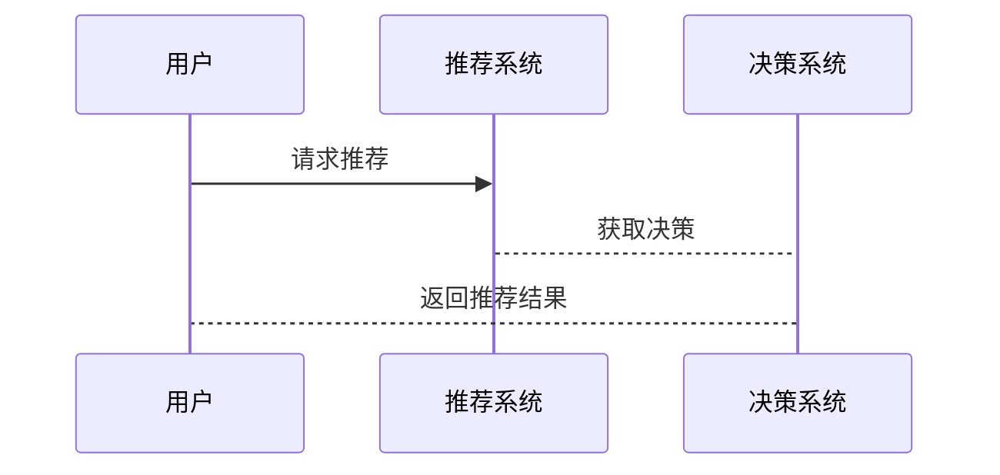

                 


# AI Agent的个性化与定制化实现

## 关键词
AI Agent，个性化推荐，定制化决策，机器学习模型，动态调整机制

## 摘要
AI Agent作为人工智能领域的核心组件，近年来在各个行业中得到了广泛应用。个性化与定制化是提升AI Agent性能和用户体验的关键，本文将详细探讨AI Agent的个性化与定制化实现，涵盖其核心概念、算法原理、系统架构设计、项目实战及最佳实践等方面，为读者提供全面的技术指导。

---

# 第一章: AI Agent 的基本概念与背景

## 1.1 AI Agent 的基本概念
### 1.1.1 AI Agent 的定义与特点
AI Agent（人工智能代理）是指能够感知环境、做出决策并执行行动的智能实体。其特点包括：
- **自主性**：能够在没有外部干预的情况下自主运行。
- **反应性**：能够根据环境反馈实时调整行为。
- **目标导向性**：通过明确的目标来驱动决策和行动。
- **学习能力**：能够通过经验优化自身的性能。

AI Agent与传统程序的主要区别在于其智能性和适应性，能够处理动态变化的环境并做出灵活的决策。

### 1.1.2 AI Agent 的发展历程
AI Agent的发展经历了多个阶段：
1. **规则驱动阶段**：基于预定义的规则进行简单的决策。
2. **知识驱动阶段**：引入知识库和推理引擎，实现更复杂的逻辑推理。
3. **数据驱动阶段**：利用机器学习和大数据技术，实现基于数据的智能决策。
4. **混合驱动阶段**：结合规则、知识和数据，形成多模态的决策能力。

当前，AI Agent技术正朝着更加智能化、个性化和动态调整的方向发展。

### 1.1.3 个性化与定制化的需求背景
个性化与定制化是用户需求多样化的直接体现，AI Agent通过个性化定制能够更好地满足用户的特定需求。例如，在推荐系统中，个性化推荐能够显著提高用户体验和业务转化率。

---

## 1.2 个性化与定制化的核心概念
### 1.2.1 个性化与定制化的定义
- **个性化**：根据用户的特定需求或行为，提供量身定制的服务或内容。
- **定制化**：根据特定场景或目标，对AI Agent的功能、行为或决策机制进行调整。

### 1.2.2 个性化与定制化的实现方式
- **基于规则的实现**：通过预定义的规则来实现个性化，适用于简单场景。
- **基于模型的实现**：利用机器学习模型进行个性化预测和推荐。
- **基于数据驱动的实现**：通过实时数据反馈动态调整AI Agent的行为。

### 1.2.3 个性化与定制化的应用场景
- **个性化推荐**：在电商、媒体等领域提供个性化的商品或内容推荐。
- **个性化对话**：在智能客服、虚拟助手等领域提供个性化的对话体验。
- **个性化决策**：在金融、医疗等领域提供个性化的决策支持。

---

# 第二章: AI Agent 的核心模块与功能

## 2.1 AI Agent 的核心模块
### 2.1.1 感知模块
#### 2.1.1.1 感知模块的功能与实现
感知模块负责接收和处理环境中的各种输入数据，包括文本、图像、语音等。常见的实现方式包括：
- **文本处理**：使用自然语言处理技术（NLP）对文本进行理解和分析。
- **图像处理**：利用计算机视觉技术（CV）对图像进行识别和分析。
- **语音处理**：通过语音识别和语音合成技术实现语音交互。

#### 2.1.1.2 常见的感知方法
- **关键词提取**：从文本中提取关键信息。
- **情感分析**：分析文本中的情感倾向。
- **图像识别**：识别图像中的物体或场景。

#### 2.1.1.3 感知模块的优化策略
- **数据增强**：通过数据增强技术提高模型的泛化能力。
- **模型优化**：使用更高效的模型结构和训练方法。

### 2.1.2 决策模块
#### 2.1.2.1 决策模块的功能与实现
决策模块负责根据感知到的信息做出决策。常见的实现方式包括：
- **基于规则的决策**：通过预定义的规则进行决策。
- **基于模型的决策**：利用机器学习模型进行预测和决策。

#### 2.1.2.2 常见的决策算法
- **决策树**：通过构建树状结构进行分类和回归。
- **随机森林**：通过集成多个决策树提高准确率。
- **支持向量机（SVM）**：用于分类和回归任务。

#### 2.1.2.3 决策模块的优化策略
- **算法优化**：通过调整模型参数和优化算法提高准确率。
- **动态调整**：根据实时反馈动态调整决策策略。

### 2.1.3 执行模块
#### 2.1.3.1 执行模块的功能与实现
执行模块负责根据决策结果执行具体的行动，包括发送指令、调用API等。

#### 2.1.3.2 执行模块的实现方式
- **API调用**：通过调用外部API实现特定功能。
- **流程控制**：通过程序逻辑控制执行流程。

#### 2.1.3.3 执行模块的优化策略
- **效率优化**：通过优化执行流程提高效率。
- **容错机制**：通过添加容错机制保证执行的稳定性。

### 2.2 AI Agent 的核心功能
#### 2.2.1 个性化推荐功能
个性化推荐是通过分析用户的行为和偏好，为其推荐相关的内容或产品。其实现原理包括：
- **协同过滤**：基于用户相似性进行推荐。
- **基于内容的推荐**：基于内容特征进行推荐。
- **混合推荐**：结合协同过滤和内容推荐的优点。

#### 2.2.2 个性化对话
个性化对话是通过自然语言处理技术实现的智能对话系统。其实现方式包括：
- **意图识别**：识别用户的意图。
- **实体识别**：识别对话中的实体信息。
- **对话生成**：根据意图和实体生成回复。

#### 2.2.3 个性化决策
个性化决策是根据用户的特定需求和场景，提供个性化的决策支持。其实现方式包括：
- **风险评估**：评估决策的风险。
- **收益分析**：分析决策的收益。
- **动态调整**：根据实时反馈动态调整决策策略。

---

# 第三章: AI Agent 的个性化与定制化实现

## 3.1 个性化推荐的实现
个性化推荐是AI Agent实现个性化与定制化的重要组成部分。其实现步骤如下：
1. **数据采集**：采集用户的交互数据。
2. **特征提取**：从数据中提取特征。
3. **模型训练**：训练推荐模型。
4. **推荐生成**：根据模型生成推荐结果。

### 3.1.1 基于协同过滤的推荐算法
协同过滤是一种常用的推荐算法，其基本思想是基于用户相似性进行推荐。其实现步骤如下：
1. **构建用户相似度矩阵**：计算用户之间的相似度。
2. **生成推荐列表**：根据相似用户的偏好生成推荐列表。

### 3.1.2 基于内容的推荐算法
基于内容的推荐算法是基于物品的特征进行推荐。其实现步骤如下：
1. **提取物品特征**：从物品中提取特征。
2. **计算相似度**：计算物品之间的相似度。
3. **生成推荐列表**：根据相似度生成推荐列表。

### 3.1.3 混合推荐算法
混合推荐算法是结合协同过滤和基于内容的推荐算法的优点，实现更准确的推荐。其实现步骤如下：
1. **协同过滤推荐**：生成基于协同过滤的推荐列表。
2. **内容推荐**：生成基于内容的推荐列表。
3. **融合推荐**：将两个推荐列表进行融合，生成最终的推荐列表。

## 3.2 定制化决策的实现
定制化决策是根据特定场景和目标，对AI Agent的决策机制进行调整。其实现步骤如下：
1. **需求分析**：明确定制化的需求。
2. **模型训练**：根据需求训练定制化的模型。
3. **决策生成**：根据模型生成定制化的决策。

### 3.2.1 强化学习算法
强化学习是一种常用的定制化决策算法，其基本思想是通过与环境的交互来学习最优策略。其实现步骤如下：
1. **定义状态空间**：定义环境的状态。
2. **定义动作空间**：定义可能的动作。
3. **定义奖励函数**：定义奖励函数。
4. **学习策略**：通过强化学习算法学习最优策略。

### 3.2.2 动态调整算法
动态调整算法是根据实时反馈动态调整决策策略。其实现步骤如下：
1. **实时反馈采集**：采集实时反馈。
2. **策略调整**：根据反馈调整策略。
3. **持续优化**：通过持续优化提高决策的准确性。

---

# 第四章: 系统分析与架构设计

## 4.1 系统功能设计
系统功能设计是实现AI Agent个性化与定制化的重要部分。系统功能包括：
- **用户管理**：管理用户的信息。
- **数据管理**：管理用户数据和模型数据。
- **推荐系统**：实现个性化推荐功能。
- **决策系统**：实现定制化决策功能。

### 4.1.1 领域模型
领域模型是系统功能设计的重要部分，用于描述系统的功能和交互关系。领域模型可以通过Mermaid类图表示。



### 4.1.2 系统架构设计
系统架构设计是实现AI Agent个性化与定制化的重要部分。系统架构可以通过Mermaid架构图表示。


### 4.1.3 系统接口设计
系统接口设计是实现AI Agent个性化与定制化的重要部分。系统接口可以通过Mermaid序列图表示。



---

# 第五章: 项目实战

## 5.1 电商推荐系统
电商推荐系统是一个典型的AI Agent个性化与定制化实现案例。其实现步骤如下：
1. **环境安装**：安装必要的开发工具和库。
2. **系统设计**：设计系统的功能和架构。
3. **核心代码实现**：实现推荐系统的核心功能。
4. **测试与优化**：测试系统并进行优化。

### 5.1.1 核心代码实现
以下是电商推荐系统的Python实现代码：

```python
import numpy as np
from sklearn.metrics.pairwise import cosine_similarity

class AI-Agent:
    def __init__(self, user_data):
        self.user_data = user_data
        self.item_data = item_data

    def get_recommendations(self, user_id, top_n=5):
        # 计算用户相似度
        user_vector = self.user_data[user_id]
        similarity = cosine_similarity([user_vector], self.all_user_vectors)
        # 根据相似度排序
        similar_users = np.argsort(similarity, axis=0)[::-1]
        # 生成推荐列表
        recommendations = []
        for user in similar_users:
            recommendations.extend(self.user_data[user_id])
        # 取top_n个推荐
        return recommendations[:top_n]
```

### 5.1.2 测试与优化
测试推荐系统的准确性和召回率，根据测试结果进行优化。

---

# 第六章: 最佳实践

## 6.1 小结
本文详细探讨了AI Agent的个性化与定制化实现，涵盖了其核心概念、算法原理、系统架构设计、项目实战及最佳实践等方面。

## 6.2 注意事项
- **数据隐私**：在处理用户数据时，需要注意数据隐私和安全。
- **模型优化**：在模型优化时，需要注意模型的泛化能力和过拟合问题。

## 6.3 拓展阅读
- **强化学习**：进一步学习强化学习的相关知识。
- **混合推荐算法**：进一步研究混合推荐算法的实现和优化。

---

# 作者
作者：AI天才研究院（AI Genius Institute）  
联系方式：[contact@ai-genius.com](mailto:contact@ai-genius.com)

