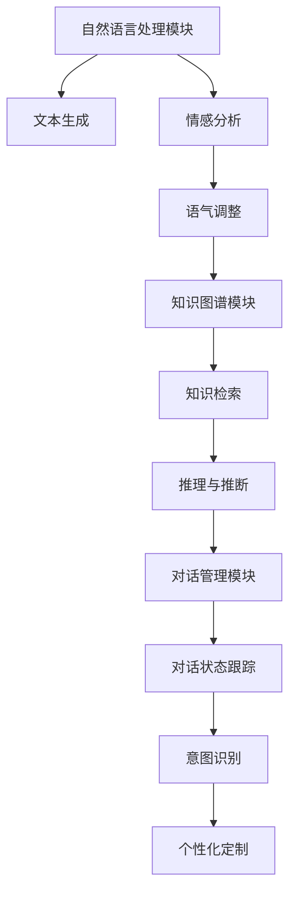

                 


# AI Agent的个性化定制：从语气到知识背景

**关键词**：AI Agent、个性化定制、语气、知识背景、自然语言处理、机器学习、人机交互

**摘要**：  
AI Agent的个性化定制是实现智能化人机交互的核心技术之一。本文从AI Agent的基本概念出发，详细探讨了个性化定制的核心要素，包括语气与知识背景的关联性，以及如何通过自然语言处理技术实现个性化定制。文章进一步分析了知识图谱与个性化定制的关系，并结合实际案例，深入讲解了生成式模型和检索式模型的实现原理。最后，本文总结了系统架构设计的关键点，并提出了未来的发展方向。

---

## 第一部分：AI Agent的背景与基础

### 第1章：AI Agent的基本概念

#### 1.1 AI Agent的定义与特点
AI Agent（人工智能代理）是指能够感知环境、自主决策并执行任务的智能实体。AI Agent的特点包括：
1. **自主性**：能够在没有外部干预的情况下独立运作。
2. **反应性**：能够根据环境变化实时调整行为。
3. **目标导向性**：通过目标驱动来优化决策和行动。

#### 1.2 AI Agent的类型与应用场景
AI Agent可以分为以下几种类型：
1. **简单反射型Agent**：基于预定义规则执行任务，适用于简单场景。
2. **基于模型的反射型Agent**：结合内部状态和外部环境信息进行决策。
3. **目标驱动型Agent**：通过目标驱动行为，适用于复杂任务。
4. **效用驱动型Agent**：通过最大化效用函数来优化决策。

#### 1.3 个性化定制的必要性
个性化定制是提升AI Agent用户体验的核心手段。通过定制化，AI Agent能够更好地适应不同用户的需求，提供更精准的服务。个性化定制主要体现在语气和知识背景两个方面。

---

## 第二部分：AI Agent的个性化定制核心概念

### 第2章：个性化定制的核心要素

#### 2.1 定制的目标与范围
个性化定制的目标是通过调整AI Agent的行为模式和知识储备，使其更符合用户的个性化需求。定制的范围包括：
1. **语气调整**：通过自然语言处理技术实现语气的个性化。
2. **知识背景适配**：通过知识图谱构建技术实现知识的个性化。

#### 2.2 语气与知识背景的关联性
语气和知识背景是个性化定制的两大核心要素，它们相互关联：
1. **语气对行为的影响**：不同的语气（如正式、亲切、幽默）会影响AI Agent的回应方式。
2. **知识背景对决策的影响**：不同的知识背景会影响AI Agent的回答内容和深度。

#### 2.3 定制的实现流程
个性化定制的实现流程包括：
1. **需求分析**：收集用户需求，明确定制目标。
2. **数据收集**：收集用户相关数据，用于模型训练。
3. **模型训练**：基于数据训练个性化模型。
4. **系统集成**：将个性化模型集成到AI Agent系统中。
5. **测试与优化**：通过测试优化模型性能。

---

## 第三部分：自然语言处理技术在AI Agent中的应用

### 第3章：自然语言处理技术的核心原理

#### 3.1 文本生成与个性化定制
文本生成是AI Agent实现个性化定制的重要技术。生成式模型（如GPT）和检索式模型（如BERT）是两种主要的文本生成方法：
1. **生成式模型**：基于概率分布生成文本，适用于创意写作。
2. **检索式模型**：基于语义相似度从已有文本中检索结果，适用于信息查询。

#### 3.2 情感分析与语气定制
情感分析是实现语气定制的关键技术。通过分析文本的情感倾向，AI Agent可以调整回应的语气。例如：
1. **情感分析模型**：使用深度学习模型（如LSTM）进行情感分类。
2. **语气识别**：基于情感分析结果，调整AI Agent的回应语气。

#### 3.3 对话管理与个性化
对话管理是实现个性化交互的重要环节。通过对话状态跟踪和意图识别，AI Agent可以更好地理解用户需求，提供个性化的对话体验。

---

## 第四部分：知识图谱与个性化定制

### 第4章：知识图谱的核心原理

#### 4.1 知识图谱的构建
知识图谱是个性化定制的重要基础。构建知识图谱的过程包括：
1. **数据收集**：从多种数据源收集知识。
2. **实体识别**：识别知识图谱中的实体。
3. **关系抽取**：抽取实体之间的关系。

#### 4.2 知识图谱的表示学习
表示学习是将知识图谱中的实体和关系映射到低维向量空间的技术。常用的表示学习方法包括：
1. **Word2Vec**：用于词语嵌入。
2. **Graph Neural Networks (GNN)**：用于图结构数据的表示学习。

#### 4.3 知识图谱在AI Agent中的应用
知识图谱可以应用于AI Agent的多个方面：
1. **知识检索**：基于知识图谱快速检索相关信息。
2. **推理与推断**：通过知识图谱进行推理，提供更准确的回应。

---

## 第五部分：算法与实现

### 第5章：生成式模型的实现

#### 5.1 生成式模型的数学模型
生成式模型的核心是概率分布建模。例如，变分自编码器（VAE）的数学模型如下：
$$ p(x) = \int p(x|z) p(z) dz $$
其中，$z$是潜在变量，$p(x|z)$是生成模型，$p(z)$是先验分布。

#### 5.2 生成式模型的实现代码
以下是基于Python的生成式模型实现示例：
```python
import tensorflow as tf
from tensorflow.keras import layers

class Generator(tf.keras.Model):
    def __init__(self, latent_dim, output_dim):
        super(Generator, self).__init__()
        self.latent_dim = latent_dim
        self.dense = layers.Dense(256, activation='relu')
        self.output = layers.Dense(output_dim, activation='sigmoid')

    def call(self, inputs):
        x = self.dense(inputs)
        return self.output(x)
```

### 第6章：检索式模型的实现

#### 6.1 检索式模型的数学模型
检索式模型的核心是计算文本的相似度。例如，余弦相似度的计算公式如下：
$$ \text{similarity}(x, y) = \frac{x \cdot y}{\|x\| \|y\|} $$

#### 6.2 检索式模型的实现代码
以下是基于Python的检索式模型实现示例：
```python
import numpy as np

def cosine_similarity(a, b):
    return np.dot(a, b) / (np.linalg.norm(a) * np.linalg.norm(b))
```

---

## 第六部分：系统架构与设计

### 第7章：系统架构设计

#### 7.1 系统模块划分
AI Agent系统主要模块包括：
1. **自然语言处理模块**：负责文本生成和情感分析。
2. **知识图谱模块**：负责知识检索和推理。
3. **对话管理模块**：负责对话状态跟踪和意图识别。

#### 7.2 系统架构图


---

## 第七部分：项目实战

### 第8章：个性化教育辅导AI Agent的实现

#### 8.1 项目背景
个性化教育辅导AI Agent的目标是根据学生的学习情况，提供个性化的学习建议。

#### 8.2 核心代码实现
以下是AI Agent的核心代码实现：
```python
class AIAgent:
    def __init__(self, knowledge_base):
        self.knowledge_base = knowledge_base

    def generate_response(self, input_text):
        # 分析输入文本的情感倾向
        sentiment = self.analyze_sentiment(input_text)
        # 根据情感倾向调整语气
        response = self.generate_reply(sentiment)
        return response

    def analyze_sentiment(self, text):
        # 简单实现情感分析，返回积极、消极或中性
        pass

    def generate_reply(self, sentiment):
        # 根据情感倾向生成不同的回应
        pass
```

---

## 第八部分：最佳实践与未来展望

### 第9章：最佳实践与未来展望

#### 9.1 最佳实践
1. **数据质量**：确保训练数据的多样性和代表性。
2. **模型优化**：定期更新模型，提升性能。
3. **用户体验**：注重交互设计，提升用户体验。

#### 9.2 未来展望
1. **多模态交互**：结合视觉、听觉等多种交互方式。
2. **伦理问题**：关注AI Agent的伦理问题，确保安全可靠。

---

**作者**：AI天才研究院  
**总结**：本文详细探讨了AI Agent的个性化定制技术，从理论到实践，为开发者提供了全面的指导。通过结合自然语言处理和知识图谱技术，我们可以实现更智能、更个性化的AI Agent，推动人机交互技术的发展。

