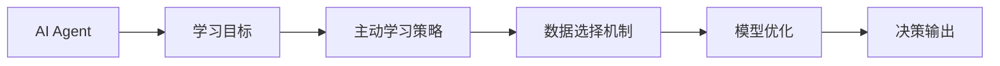
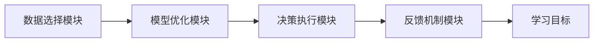

                 


# AI Agent的主动学习策略

> 关键词：AI Agent, 主动学习, 策略优化, 强化学习, 实践案例

> 摘要：AI Agent的主动学习策略是一种通过智能体主动选择信息和优化学习过程来提升决策能力和适应性的方法。本文从AI Agent的基本概念出发，深入探讨主动学习策略的核心原理、算法实现、系统设计及实际应用案例，结合理论与实践，为AI Agent的主动学习策略提供全面的分析与指导。

---

## 第一部分: AI Agent与主动学习的背景与基础

### 第1章: AI Agent的基本概念与功能

#### 1.1 AI Agent的定义与特点
- **1.1.1 AI Agent的定义**  
  AI Agent（人工智能代理）是指能够感知环境、自主决策并执行任务的智能实体。它具备主动性、目标导向性和适应性等核心特征。

- **1.1.2 AI Agent的特点**  
  - 主动性：能够主动采取行动以实现目标。  
  - 目标导向性：所有行为均围绕实现特定目标展开。  
  - 适应性：能够根据环境变化调整策略和行为。  
  - 社会性：能够与其他Agent或人类进行交互与协作。

- **1.1.3 AI Agent的功能模块**  
  - 感知模块：接收外部环境信息并进行处理。  
  - 决策模块：基于感知信息生成决策策略。  
  - 执行模块：根据决策结果执行具体操作。  
  - 学习模块：通过经验优化自身行为和策略。

#### 1.2 主动学习的基本概念与分类
- **1.2.1 主动学习的定义**  
  主动学习是一种机器学习方法，其中模型能够主动选择对学习最有帮助的数据样本，以提升自身的性能。

- **1.2.2 主动学习的核心思想**  
  主动学习的核心思想在于“选择性样本查询”，即模型不是被动接收数据，而是主动探索和选择对学习目标最有价值的数据。

- **1.2.3 主动学习的分类**  
  - 基于查询的主动学习：根据当前模型的不确定性或错误性选择样本。  
  - 基于风险的主动学习：根据潜在风险或损失选择样本。  
  - 基于密度的主动学习：根据数据分布密度选择样本。

### 第2章: AI Agent主动学习的背景与意义

#### 2.1 当前AI Agent的发展现状
- AI Agent在各个领域的广泛应用，如自动驾驶、智能客服、机器人控制等。  
- 随着任务复杂度的增加，AI Agent需要更强的学习能力和适应性。

#### 2.2 主动学习在AI Agent中的作用
- 提高AI Agent的学习效率。  
- 增强AI Agent的决策能力。  
- 降低AI Agent对大量标注数据的依赖。

#### 2.3 研究AI Agent主动学习策略的意义
- 推动AI Agent在复杂环境下的自主决策能力。  
- 提升AI Agent在实际应用中的泛化能力和适应性。  
- 为AI Agent的设计与优化提供理论依据。

---

## 第二部分: AI Agent主动学习的核心概念与联系

### 第3章: AI Agent主动学习的核心原理

#### 3.1 AI Agent的主动学习机制
- **3.1.1 感知与决策的结合**  
  AI Agent通过感知环境信息，结合内部状态和目标，生成最优决策。  
  - 输入：环境信息、内部状态、目标。  
  - 输出：决策动作。

- **3.1.2 决策的不确定性与学习目标**  
  AI Agent的决策过程需要考虑环境的不确定性，并通过主动学习来降低不确定性，提升决策的准确性。

#### 3.2 主动学习策略的核心要素
- **3.2.1 数据选择机制**  
  AI Agent需要根据当前模型的性能和环境信息，主动选择对学习最有帮助的数据样本。

- **3.2.2 模型优化方法**  
  AI Agent通过不断优化模型参数，提升对环境的适应能力和决策能力。

- **3.2.3 反馈机制**  
  AI Agent通过接收环境的反馈（奖励或惩罚），调整自身行为和策略。

### 第4章: AI Agent主动学习的实体关系与流程

#### 4.1 实体关系图


#### 4.2 主动学习的流程
1. **初始化**：设定学习目标和初始模型。  
2. **感知环境**：获取当前环境信息。  
3. **选择样本**：根据当前模型的不确定性或风险，选择最有价值的数据样本。  
4. **优化模型**：基于选择的样本，优化模型参数。  
5. **执行决策**：根据优化后的模型生成决策动作。  
6. **接收反馈**：根据环境反馈，调整学习策略。  
7. **循环迭代**：重复上述步骤，直到达到学习目标。

---

## 第三部分: AI Agent主动学习的算法与实现

### 第5章: 基于贪心策略的主动学习算法

#### 5.1 贪心策略的基本原理
- **5.1.1 贪心策略的核心思想**  
  贪心策略基于当前模型的不确定性，选择当前最需要学习的样本。

#### 5.2 贪心策略的实现步骤
1. **计算样本的不确定性**：使用模型预测概率的熵值衡量样本的不确定性。  
2. **选择不确定性最高的样本**：将不确定性最高的样本加入训练集。  
3. **优化模型**：基于新的训练集重新训练模型。  
4. **评估模型性能**：通过验证集评估模型的性能提升情况。

#### 5.3 贪心策略的优缺点
- 优点：简单高效，能够在短时间内选择最有价值的样本。  
- 缺点：可能无法覆盖所有重要的样本，存在局部最优的风险。

### 第6章: 基于强化学习的主动学习算法

#### 6.1 强化学习的基本原理
- **6.1.1 强化学习的核心思想**  
  通过与环境的交互，AI Agent通过试错学习，获得最大化的累计奖励。

#### 6.2 基于策略梯度的主动学习算法
- **6.2.1 策略梯度的基本原理**  
  策略梯度方法通过优化策略函数，直接优化动作的策略，而不是值函数。

#### 6.3 算法实现步骤
1. **初始化策略参数**：设定初始策略参数θ。  
2. **与环境交互**：根据当前策略生成动作，与环境交互并获得奖励。  
3. **计算策略梯度**：通过梯度上升法，优化策略参数θ。  
4. **更新策略**：基于优化后的策略参数，更新策略。  
5. **循环迭代**：重复上述步骤，直到达到收敛条件。

#### 6.4 算法的数学公式
$$ J(\theta) = \mathbb{E}_{\tau \sim \pi_\theta} [\log \pi_\theta(a|s) Q(s,a)] $$

---

## 第四部分: AI Agent主动学习的系统设计与实践

### 第7章: 系统分析与架构设计

#### 7.1 系统功能设计
- **数据选择模块**：负责选择最有价值的样本。  
- **模型优化模块**：负责优化模型参数。  
- **决策执行模块**：负责生成决策动作。  
- **反馈机制模块**：负责接收环境反馈并调整学习策略。

#### 7.2 系统架构设计


#### 7.3 系统接口设计
- 输入接口：接收环境信息和用户指令。  
- 输出接口：输出决策动作和学习反馈。

### 第8章: 项目实战与案例分析

#### 8.1 项目背景与需求
- 项目目标：设计一个基于主动学习的AI Agent，实现对复杂环境的自主决策与优化。  
- 项目需求：提升AI Agent的学习效率和决策能力。

#### 8.2 环境安装与配置
- 安装Python环境：Python 3.8及以上版本。  
- 安装依赖库：numpy、scikit-learn、tensorflow等。

#### 8.3 核心代码实现
```python
import numpy as np
from sklearn.metrics import entropy

def select_samples(X, y, model):
    # 计算样本的不确定性
    prob = model.predict_proba(X)
    uncertainty = entropy(prob)
    # 选择不确定性最高的样本
    selected_idx = np.argsort(-uncertainty)[:10]
    return selected_idx

def train_model(X, y, model):
    model.fit(X, y)
    return model

def main():
    # 初始化数据集
    X_train, y_train, X_val, y_val = load_data()
    # 初始化模型
    model = SomeModel()
    # 迭代优化
    for _ in range(10):
        selected_idx = select_samples(X_val, y_val, model)
        X_selected = X_val[selected_idx]
        y_selected = y_val[selected_idx]
        model = train_model(X_selected, y_selected, model)
    # 评估模型性能
    print(model.score(X_test, y_test))

if __name__ == "__main__":
    main()
```

#### 8.4 案例分析与总结
- 通过实际案例分析，验证算法的有效性和可行性。  
- 总结项目中的经验与教训，提出改进建议。

---

## 第五部分: 总结与展望

### 第9章: 总结与展望

#### 9.1 本章总结
- 本文系统地介绍了AI Agent的主动学习策略，从理论到实践，详细探讨了其核心原理、算法实现和系统设计。  
- 通过实际案例分析，验证了主动学习策略在提升AI Agent性能方面的有效性。

#### 9.2 未来展望
- 探讨AI Agent主动学习策略的未来发展方向。  
- 提出进一步优化算法和提升性能的可能途径。  
- 展望AI Agent在更多领域的应用前景。

---

## 作者：AI天才研究院/AI Genius Institute & 禅与计算机程序设计艺术 /Zen And The Art of Computer Programming

