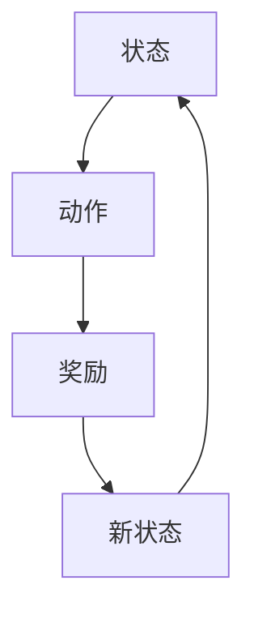
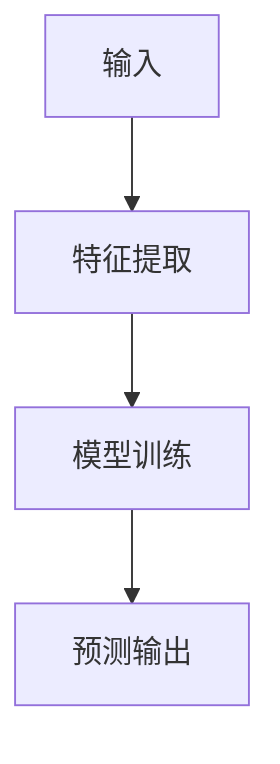
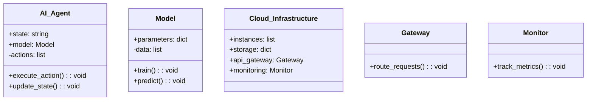
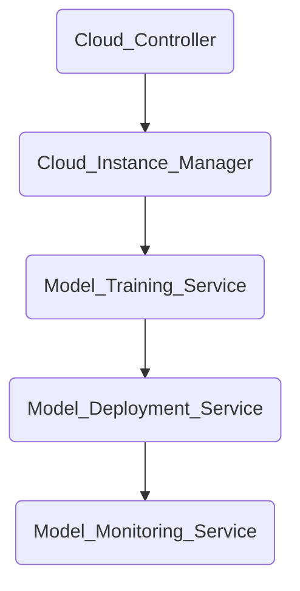

                 


# AI Agent的云端部署与管理

---

## 关键词：
AI Agent, 云端部署, 管理, 云计算, 强化学习, 算法原理, 系统架构

---

## 摘要：
本文将深入探讨AI Agent在云端部署与管理的关键技术，涵盖从基础概念到实际应用的全生命周期。通过分析AI Agent的核心算法、数学模型、系统架构及项目实战，本文为读者提供全面的技术指导，帮助读者掌握AI Agent在云端部署的最佳实践和管理策略。

---

# 第二章: AI Agent的核心算法与数学模型

## 2.1 AI Agent的决策算法

### 2.1.1 强化学习算法


#### 强化学习的Python代码示例：
```python
import gym
import numpy as np

env = gym.make('CartPole-v1')
env.seed(42)

class Agent:
    def __init__(self, env):
        self.env = env
        self.gamma = 0.99
        self.lr = 0.01
        self.epsilon = 1.0

    def epsilon_greedy_policy(self, q_values):
        if np.random.random() < self.epsilon:
            return np.random.randint(0, len(q_values))
        else:
            return np.argmax(q_values)

    def update_q_values(self, q_values, state, action, reward, next_state):
        next_q_values = self.get_q_values(q_values, next_state)
        q_values[state][action] = reward + self.gamma * np.max(next_q_values)
        return q_values

    def get_q_values(self, q_values, state):
        return q_values[state]

agent = Agent(env)
q_values = np.zeros([env.observation_space.shape[0], env.action_space.n])

for episode in range(100):
    state = env.reset()
    total_reward = 0
    while True:
        action = agent.epsilon_greedy_policy(q_values[state])
        next_state, reward, done, info = env.step(action)
        q_values = agent.update_q_values(q_values, state, action, reward, next_state)
        total_reward += reward
        state = next_state
        if done:
            break
env.close()
```

### 2.1.2 监督学习算法


#### 监督学习的Python代码示例：
```python
from sklearn import tree

# 数据集
X = [[0, 0], [1, 1], [0, 1], [1, 0]]
y = [0, 1, 1, 0]

# 训练模型
model = tree.DecisionTreeClassifier()
model.fit(X, y)

# 预测
print(model.predict([[1, 1]]))  # 输出: [1]
```

## 2.2 AI Agent的数学模型

### 2.2.1 强化学习的数学模型
$$ Q(s, a) = Q(s, a) + \alpha [r + \gamma Q(s', a') - Q(s, a)] $$
其中：
- \( Q(s, a) \)：当前状态下动作 \( a \) 的价值
- \( \alpha \)：学习率
- \( r \)：奖励
- \( \gamma \)：折扣因子
- \( Q(s', a') \)：下一状态下的最大价值

### 2.2.2 监督学习的数学模型
$$ y = w^T x + b $$
其中：
- \( w \)：权重向量
- \( x \)：输入特征
- \( b \)：偏置项
- \( y \)：输出

---

# 第三章: 系统分析与架构设计

## 3.1 问题场景介绍

### 3.1.1 问题背景
随着AI Agent的应用越来越广泛，如何在云端高效部署和管理AI Agent成为一个重要挑战。

### 3.1.2 问题描述
在云端部署AI Agent时，需要考虑计算资源分配、数据存储、实时响应等问题。

## 3.2 系统功能设计

### 3.2.1 领域模型类图


### 3.2.2 系统架构设计


## 3.3 系统接口设计

### 3.3.1 接口列表
| 接口名称       | 描述                     |
|----------------|--------------------------|
| create_agent   | 创建AI Agent             |
| deploy_model   | 部署模型                 |
| update_policy  | 更新策略                |
| get_metrics    | 获取性能指标             |

---

# 第四章: 项目实战

## 4.1 环境安装

### 4.1.1 安装依赖
```bash
pip install gym
pip install scikit-learn
pip install matplotlib
```

## 4.2 系统核心实现

### 4.2.1 核心代码
```python
import gym
import numpy as np
import matplotlib.pyplot as plt

# 初始化环境
env = gym.make('CartPole-v1')

# 定义AI Agent类
class AI-Agent:
    def __init__(self, env):
        self.env = env
        self.gamma = 0.99
        self.lr = 0.01
        self.epsilon = 1.0

    def epsilon_greedy_policy(self, q_values):
        if np.random.random() < self.epsilon:
            return np.random.randint(0, len(q_values))
        else:
            return np.argmax(q_values)

    def update_q_values(self, q_values, state, action, reward, next_state):
        next_q_values = self.get_q_values(q_values, next_state)
        q_values[state][action] = reward + self.gamma * np.max(next_q_values)
        return q_values

    def get_q_values(self, q_values, state):
        return q_values[state]

# 训练AI Agent
agent = AI-Agent(env)
q_values = np.zeros([env.observation_space.shape[0], env.action_space.n])

for episode in range(100):
    state = env.reset()
    total_reward = 0
    while True:
        action = agent.epsilon_greedy_policy(q_values[state])
        next_state, reward, done, info = env.step(action)
        q_values = agent.update_q_values(q_values, state, action, reward, next_state)
        total_reward += reward
        state = next_state
        if done:
            break
env.close()
```

---

# 总结与展望

## 5.1 本章小结
本文详细介绍了AI Agent的云端部署与管理，涵盖了从基础概念到实际应用的全生命周期。

## 5.2 最佳实践
1. 确保计算资源充足。
2. 定期监控系统性能。
3. 使用容器化部署提高灵活性。

## 5.3 展望
未来，AI Agent的云端部署与管理将更加智能化和自动化。

---

作者：AI天才研究院/AI Genius Institute & 禅与计算机程序设计艺术 /Zen And The Art of Computer Programming

