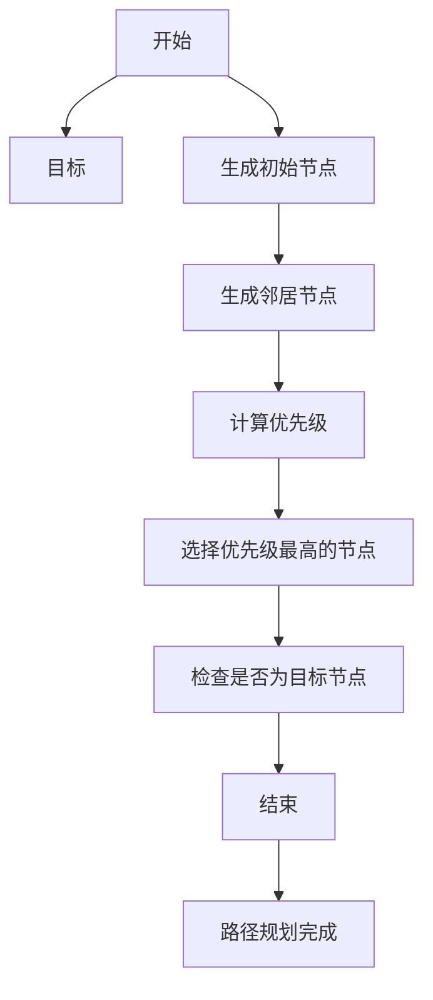
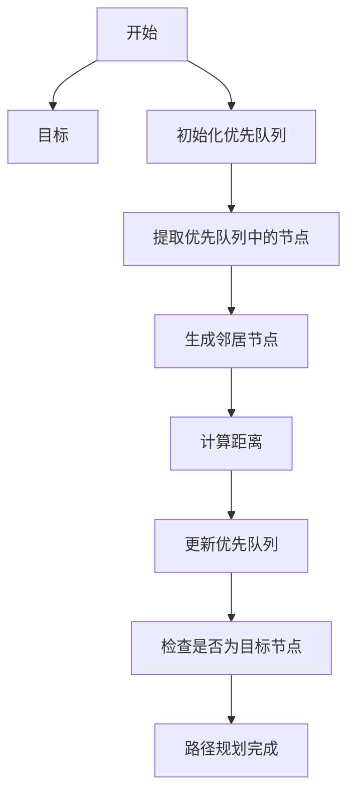
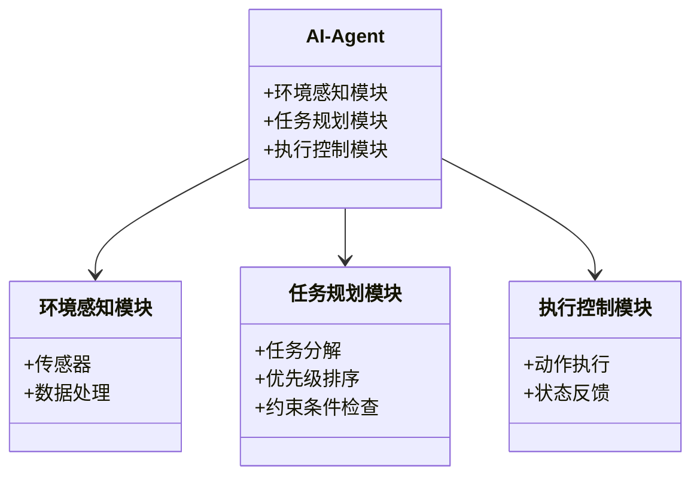

                 


# 《AI Agent的任务规划与执行框架》

## 关键词：AI Agent, 任务规划, 执行框架, 算法原理, 系统架构

## 摘要：  
AI Agent（人工智能代理）的任务规划与执行框架是实现智能系统的核心技术之一。本文将从任务规划的背景、核心概念、算法原理、系统架构到实际应用进行全面解析，深入探讨AI Agent如何通过任务规划与执行框架实现智能决策和行动。文章结合理论与实践，提供详细的算法实现和系统设计案例，帮助读者全面理解并掌握AI Agent的任务规划与执行框架的设计与优化方法。

---

## 第1章: AI Agent的任务规划与执行框架概述

### 1.1 AI Agent的基本概念与特点

AI Agent是一种能够感知环境、自主决策并执行任务的智能实体。它具有以下特点：
- **自主性**：能够在没有外部干预的情况下独立运行。
- **反应性**：能够实时感知环境并做出反应。
- **目标导向**：具有明确的目标，通过行动实现目标。
- **学习能力**：能够通过经验优化自身的决策和执行能力。

### 1.2 任务规划的背景与意义

任务规划是AI Agent实现目标的核心过程，其背景与意义如下：
- **背景**：随着人工智能技术的快速发展，AI Agent被广泛应用于自动驾驶、智能助手、机器人等领域。任务规划是这些应用中的关键环节，决定了AI Agent如何高效地完成任务。
- **意义**：任务规划能够帮助AI Agent在复杂环境中做出最优决策，提高任务执行效率，降低资源消耗。

### 1.3 任务规划的核心要素

任务规划的核心要素包括：
- **任务分解**：将复杂任务分解为简单子任务。
- **优先级排序**：根据任务的重要性和紧急性进行排序。
- **约束条件**：考虑时间、资源、环境等限制条件。
- **动态调整**：根据环境变化实时调整任务计划。

---

## 第2章: 任务规划的原理与算法

### 2.1 任务分解与优先级排序

任务分解是将复杂任务拆解为多个简单任务，常见的任务分解方法包括：
- **层次分解法**：将任务分解为子任务、子子任务，形成层次结构。
- **贪心分解法**：每次选择当前最优的子任务进行分解。

优先级排序是根据任务的重要性和紧急性进行排序，常用的算法包括：
- **优先级队列（Priority Queue）**：基于优先级的队列结构，快速获取优先级最高的任务。
- **Dijkstra算法**：用于计算任务之间的最优路径。

### 2.2 任务规划中的约束条件

约束条件是任务规划的重要组成部分，常见的约束条件包括：
- **时间约束**：任务必须在特定时间内完成。
- **资源约束**：任务需要特定的资源，如计算能力、传感器等。
- **环境约束**：任务执行受到环境条件的限制。

### 2.3 任务规划的数学模型

任务规划的数学模型可以表示为：
- **状态空间**：所有可能的状态集合。
- **动作空间**：AI Agent可以执行的所有动作。
- **转移模型**：从一个状态转移到另一个状态的动作。

优化目标可以表示为：
$$ \text{目标函数} = \sum_{i=1}^{n} w_i x_i $$
其中，$w_i$是权重，$x_i$是任务的优先级。

---

## 第3章: 常见任务规划算法的实现与对比

### 3.1 A*算法

A*算法是一种常用的路径规划算法，其流程如下：



### 3.2 Dijkstra算法

Dijkstra算法用于计算最短路径，其流程如下：



### 3.3 算法对比

| 算法 | 优点 | 缺点 |
|------|------|------|
| A* | 适合路径规划，效率高 | 不适合复杂任务分解 |
| Dijkstra | 计算最短路径，结果最优 | 适用于静态环境 |

---

## 第4章: 系统架构与设计

### 4.1 系统架构设计

AI Agent的任务规划系统架构如下：



### 4.2 系统功能设计

系统功能设计包括：
- **环境感知**：通过传感器获取环境信息。
- **任务规划**：分解任务并生成执行计划。
- **执行控制**：根据计划执行任务并实时调整。

---

## 第5章: 项目实战

### 5.1 智能助手的任务规划系统

#### 5.1.1 环境安装

安装Python和相关库：
```bash
pip install numpy
pip install matplotlib
pip install networkx
```

#### 5.1.2 核心代码实现

任务规划算法实现：
```python
import heapq

def a_star(start, goal, graph):
    open_set = set([start])
    came_from = {}
    g_score = {node: float('inf') for node in graph.nodes}
    g_score[start] = 0
    f_score = {node: float('inf') for node in graph.nodes}
    f_score[start] = 0

    while open_set:
        current = heapq.heappop(open_set)
        if current == goal:
            return reconstruct_path(came_from, start, goal)
        for neighbor in graph.neighbors(current):
            tentative_g_score = g_score[current] + graph.weight(current, neighbor)
            if tentative_g_score < g_score[neighbor]:
                came_from[neighbor] = current
                g_score[neighbor] = tentative_g_score
                f_score[neighbor] = g_score[neighbor] + heuristic(neighbor, goal)
                heapq.heappush(open_set, neighbor)
    return None

def reconstruct_path(came_from, start, goal):
    path = []
    current = goal
    while current != start:
        path.append(current)
        current = came_from[current]
    path.append(start)
    return path[::-1]
```

#### 5.1.3 系统功能设计

系统功能设计包括：
- **用户输入**：用户输入任务需求。
- **任务分解**：系统将任务分解为子任务。
- **优先级排序**：系统根据优先级排序任务。
- **执行控制**：系统执行任务并实时反馈。

---

## 第6章: 总结与展望

### 6.1 总结

本文详细探讨了AI Agent的任务规划与执行框架，从任务分解、优先级排序到系统架构设计，提供了全面的理论与实践指导。

### 6.2 展望

未来，随着人工智能技术的不断发展，任务规划与执行框架将更加智能化和高效化。AI Agent将在更多领域得到广泛应用。

---

## 作者：AI天才研究院 & 禅与计算机程序设计艺术

作者信息：AI天才研究院（AI Genius Institute）专注于人工智能领域的研究与实践，致力于推动AI技术的创新与应用。

