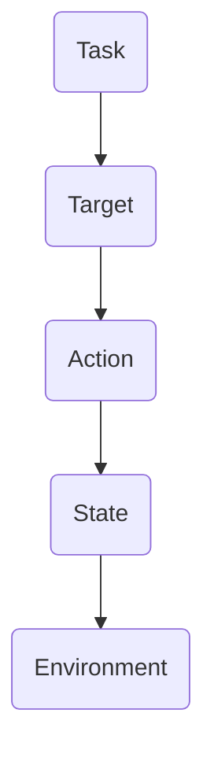
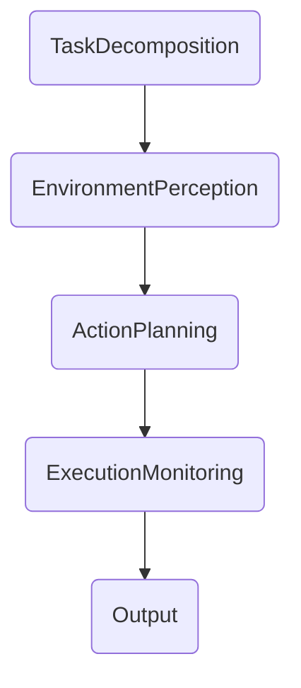

                 


# AI Agent的任务规划与执行模块开发

> 关键词：AI Agent，任务规划，执行模块，算法原理，系统架构

> 摘要：本文详细探讨了AI Agent的任务规划与执行模块的开发过程，从核心概念、算法原理、系统架构到项目实战，全面解析了任务规划与执行模块的设计与实现。通过具体案例分析和代码实现，帮助读者深入理解AI Agent任务规划与执行的原理和应用。

---

# 第一部分: AI Agent的任务规划与执行模块概述

## 第1章: AI Agent的基本概念

### 1.1 AI Agent的定义与分类
AI Agent（人工智能代理）是指能够感知环境、自主决策并执行任务的智能实体。根据功能和应用场景的不同，AI Agent可以分为以下几类：

1. **简单反射型Agent**：基于当前输入做出反应，不依赖历史信息。
2. **基于模型的反射型Agent**：利用内部模型和历史信息进行决策。
3. **目标驱动型Agent**：基于预设目标进行规划和执行。
4. **效用驱动型Agent**：通过最大化效用函数来实现目标。
5. **学习型Agent**：通过机器学习算法不断优化自身的决策能力。

### 1.2 任务规划与执行模块的核心作用
任务规划与执行模块是AI Agent实现智能化的关键部分，负责将模糊的目标转化为具体的行动步骤，并确保这些步骤在动态环境中得以正确执行。其核心作用包括：

1. **目标分解**：将复杂任务分解为可执行的子任务。
2. **环境感知**：通过传感器或数据源获取环境状态。
3. **行动规划**：基于当前状态和目标，生成最优行动方案。
4. **执行监控**：实时监控执行过程，调整计划以应对突发情况。

### 1.3 任务规划与执行模块的背景与意义
随着AI技术的快速发展，任务规划与执行模块在自动驾驶、机器人、智能助手等领域得到了广泛应用。其意义在于：

1. **提高效率**：通过自动化规划减少人工干预，提升任务执行效率。
2. **增强适应性**：在动态环境中快速调整计划，确保任务顺利完成。
3. **降低开发成本**：通过模块化设计，减少重复开发工作，降低开发成本。

---

## 第2章: 任务规划与执行模块的核心概念与联系

### 2.1 核心概念原理
任务规划与执行模块涉及多个核心概念，包括任务分解、状态感知、行动规划等。这些概念之间相互关联，共同构成了任务规划与执行的完整流程。

1. **任务分解**：将复杂任务分解为多个子任务，每个子任务具有明确的目标和约束条件。
2. **状态感知**：通过传感器或数据源获取环境状态，为任务规划提供依据。
3. **行动规划**：基于当前状态和任务目标，生成最优行动方案，并通过执行模块实现。

### 2.2 核心概念属性特征对比

| 概念 | 属性 | 特征 |
|------|------|------|
| 任务分解 | 粒度 | 细粒度分解提高执行效率，粗粒度分解降低计算复杂度 |
| 状态感知 | 精度 | 高精度感知提升规划准确性，低精度感知降低计算资源消耗 |
| 行动规划 | 效率 | 高效算法减少规划时间，低效算法可能导致规划失败 |

### 2.3 ER实体关系图架构
以下是一个简单的ER实体关系图，展示了任务规划与执行模块的核心实体及其关系：



---

## 第3章: 任务规划算法原理与实现

### 3.1 任务规划算法概述
任务规划算法是任务规划与执行模块的核心，常用的算法包括A*算法、Dijkstra算法和蒙特卡洛树搜索（MCTS）。

1. **A*算法**：一种基于启发式搜索的最短路径算法，常用于任务规划中的路径优化问题。
2. **Dijkstra算法**：用于在无权图中寻找最短路径，适用于任务分解中的子任务顺序规划。
3. **MCTS**：一种基于采样的优化算法，适用于动态环境下的在线任务规划。

### 3.2 A*算法的详细实现
以下是A*算法的Python实现示例：

```python
import heapq

def a_star(start, goal, heuristic):
    open_set = {start}
    came_from = {}
    g_score = {start: 0}
    f_score = {start: heuristic(start, goal)}
    
    while open_set:
        current = heapq.heappop(open_set)
        if current == goal:
            break
        neighbors = get_neighbors(current)
        for neighbor in neighbors:
            tentative_g_score = g_score[current] + cost(current, neighbor)
            if neighbor not in g_score or tentative_g_score < g_score[neighbor]:
                came_from[neighbor] = current
                g_score[neighbor] = tentative_g_score
                f_score[neighbor] = g_score[neighbor] + heuristic(neighbor, goal)
                heapq.heappush(open_set, neighbor)
    return came_from, g_score
```

### 3.3 算法原理的数学模型和公式
A*算法的核心是平衡路径长度和启发式评估。其数学模型如下：

$$ f(n) = g(n) + h(n) $$

其中，$g(n)$ 表示从起点到节点n的实际成本，$h(n)$ 表示从节点n到目标的估计成本。A*算法通过优先队列选择具有最小f(n)的节点进行扩展。

---

## 第4章: 系统分析与架构设计方案

### 4.1 问题场景介绍
以智能助手为例，用户希望AI Agent能够根据当前状态和目标，生成最优行动方案并执行。

### 4.2 系统功能设计
系统功能模块包括：

1. **任务分解模块**：将用户需求分解为可执行的子任务。
2. **环境感知模块**：获取当前环境状态。
3. **行动规划模块**：基于当前状态和任务目标，生成行动方案。
4. **执行监控模块**：实时监控行动执行情况，调整计划。

### 4.3 系统架构设计
以下是系统的架构图：



---

## 第5章: 项目实战

### 5.1 环境安装
需要安装以下工具和库：

1. Python 3.8+
2. Mermaid CLI
3. matplotlib
4. numpy

### 5.2 核心代码实现
以下是任务规划模块的核心代码：

```python
import heapq

def heuristic(start, goal):
    return abs(start[0] - goal[0]) + abs(start[1] - goal[1])

def a_star_search(grid, start, goal):
    open_set = []
    heapq.heappush(open_set, (0, start))
    came_from = {}
    g_score = {start: 0}
    f_score = {start: heuristic(start, goal)}
    
    while open_set:
        current = heapq.heappop(open_set)
        if current[1] == goal:
            return came_from
        for neighbor in grid.get_neighbors(current[1]):
            tentative_g_score = g_score[current[1]] + 1
            if neighbor not in g_score or tentative_g_score < g_score[neighbor]:
                came_from[neighbor] = current[1]
                g_score[neighbor] = tentative_g_score
                f_score[neighbor] = tentative_g_score + heuristic(neighbor, goal)
                heapq.heappush(open_set, (f_score[neighbor], neighbor))
    return came_from
```

### 5.3 实际案例分析
以路径规划为例，假设起点为(0,0)，目标为(3,3)，网格障碍物为(1,1)、(2,2)。A*算法会优先选择右下方的路径，避开障碍物，最终找到最优路径。

---

## 第6章: 总结与展望

### 6.1 总结
任务规划与执行模块是AI Agent实现智能化的核心部分，本文从核心概念、算法原理、系统架构到项目实战，全面解析了任务规划与执行模块的设计与实现。

### 6.2 展望
未来，随着AI技术的不断发展，任务规划与执行模块将更加智能化和高效化。通过结合强化学习和多智能体协作，任务规划与执行模块将在复杂环境中表现出更强的适应性和决策能力。

---

作者：AI天才研究院 & 禅与计算机程序设计艺术

