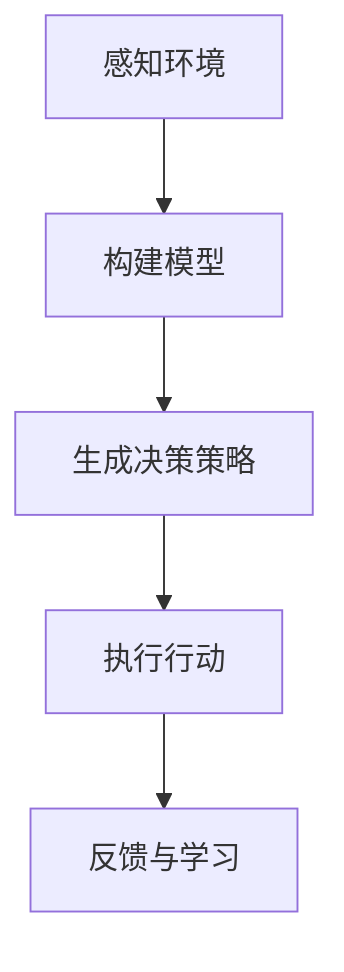
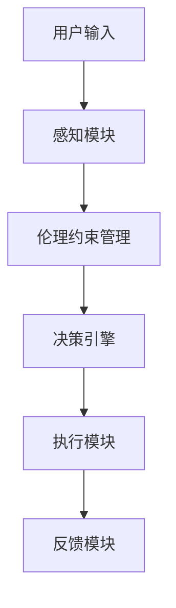

                 


# AI Agent的伦理设计：原则与实践

## 关键词：
AI Agent, 伦理设计, 决策机制, 技术实现, 系统设计, 项目实战, 最佳实践

## 摘要：
AI Agent作为人工智能领域的重要组成部分，其伦理设计直接关系到技术的可信度和对人类社会的影响。本文从AI Agent的基本概念出发，探讨伦理设计的核心原则，分析其在决策机制、技术实现和系统设计中的应用，通过项目实战和最佳实践，为读者提供全面的伦理设计指导。

---

# 第一部分: AI Agent的伦理设计基础

## 第1章: AI Agent的基本概念与伦理问题概述

### 1.1 AI Agent的定义与核心概念

AI Agent（人工智能代理）是指能够感知环境、自主决策并执行任务的智能实体。其核心概念包括：

- **自主性**：AI Agent能够在没有外部干预的情况下独立执行任务。
- **反应性**：能够实时感知环境变化并做出响应。
- **目标导向性**：基于预设目标或学习目标进行决策和行动。

AI Agent与人类的关系在于，它通过模拟人类的决策过程来完成任务，但其行为可能对人类社会产生重大影响，尤其是在医疗、金融、交通等领域。

### 1.2 伦理设计的背景与重要性

当前AI技术的快速发展使得AI Agent广泛应用于各个领域，但随之而来的是伦理问题的突出表现，例如算法偏见、隐私泄露和责任归属等。伦理设计的重要性体现在：

1. **确保技术的可信性**：通过伦理设计，AI Agent的行为更加符合人类社会的道德规范。
2. **减少潜在风险**：在AI Agent的设计阶段引入伦理约束，可以有效降低其对人类社会的负面影响。
3. **促进技术的广泛应用**：伦理设计是AI技术被社会接受和推广的前提条件。

---

## 第2章: AI Agent的伦理框架与原则

### 2.1 伦理设计的核心原则

AI Agent的伦理设计需要遵循以下核心原则：

1. **尊重人权与尊严**：AI Agent的设计和行为不得侵犯人类的基本权利。
2. **公正与公平**：AI Agent的决策应避免偏见，确保所有利益相关者的公平对待。
3. **自主性与知情同意**：在与人类交互过程中，AI Agent应尊重用户的自主权，并在必要时获得用户的知情同意。
4. **最小化伤害与风险**：在设计AI Agent时，应优先考虑最小化可能对人类或社会造成的伤害和风险。

### 2.2 伦理框架的构建

伦理框架的构建需要考虑以下要素：

- **伦理目标**：明确AI Agent的行为目标应符合伦理规范。
- **伦理约束**：在设计AI Agent的算法时，引入伦理约束条件。
- **动态调整**：根据实际应用场景的变化，动态调整伦理框架。

以下是一个简单的伦理框架对比表格：

| 伦理原则         | 应用场景示例                          |
|------------------|---------------------------------------|
| 尊重人权与尊严    | 医疗辅助决策                          |
| 公正与公平        | 招聘系统中的无偏见筛选                |
| 自主性与知情同意  | 智能音箱的隐私数据收集                |
| 最小化伤害与风险  | 自动驾驶系统中的紧急情况决策          |

---

## 第3章: AI Agent的决策机制与伦理影响

### 3.1 AI Agent的决策过程

AI Agent的决策过程通常包括以下步骤：

1. **感知环境**：通过传感器或数据输入获取环境信息。
2. **构建模型**：基于感知信息构建环境模型。
3. **制定策略**：根据模型和目标生成决策策略。
4. **执行行动**：根据策略执行具体行动。
5. **反馈与学习**：根据反馈调整模型和策略。

在决策过程中，伦理影响主要体现在以下方面：

- **决策的透明性**：用户需要了解AI Agent的决策依据。
- **决策的公平性**：避免因数据偏见导致的不公平决策。
- **决策的可解释性**：用户能够理解AI Agent的决策过程。

### 3.2 伦理影响的评估方法

伦理影响的评估方法包括：

1. **伦理风险的识别与评估**：通过分析可能的风险点，评估其对伦理的影响。
2. **伦理影响的量化分析**：将伦理影响转化为可量化的指标。
3. **伦理影响的持续监测**：在实际应用中动态监测伦理影响的变化。

---

# 第二部分: AI Agent的伦理设计技术实现

## 第4章: AI Agent的伦理设计算法

### 4.1 基于伦理原则的优化算法

AI Agent的伦理设计需要在算法层面引入伦理约束条件。以下是一个优化算法的数学模型示例：

$$
\text{目标函数} = f(x) + \lambda \cdot g(x)
$$

其中，$f(x)$ 是原始目标函数，$\lambda$ 是伦理约束的权重，$g(x)$ 是伦理约束函数。

### 4.2 伦理决策的数学模型

伦理决策的数学模型可以表示为：

$$
\text{决策} = \arg\min_{x} \left( f(x) + \lambda \cdot g(x) \right)
$$

其中，$f(x)$ 是决策目标函数，$\lambda$ 是伦理约束的权重，$g(x)$ 是伦理约束函数。

以下是一个简单的伦理决策流程图：



---

## 第5章: AI Agent的伦理设计与人机协作

### 5.1 人机协作的伦理设计

在人机协作中，伦理设计需要考虑以下方面：

1. **协作过程中的伦理问题**：例如，AI Agent是否在协作中过度干预人类决策。
2. **伦理设计对协作效率的影响**：伦理设计可能会影响协作的效率，但能够提升协作的可信度。
3. **伦理决策机制**：在协作中，AI Agent需要根据伦理原则进行决策。

### 5.2 伦理设计的实现技术

伦理设计的实现技术包括：

1. **伦理约束的编码实现**：在算法中引入伦理约束条件。
2. **伦理决策的算法优化**：通过优化算法提升伦理决策的效率和准确性。
3. **伦理设计的可扩展性**：确保伦理设计能够适应不同应用场景的需求。

---

## 第6章: AI Agent的伦理设计与技术挑战

### 6.1 技术实现中的伦理问题

AI Agent的伦理设计面临以下技术挑战：

1. **数据偏见的消除**：需要通过技术手段消除数据中的偏见。
2. **算法的透明性与可解释性**：需要提升算法的透明度和可解释性，以便更好地理解和监管AI Agent的行为。

---

# 第三部分: AI Agent的伦理设计系统实现

## 第7章: AI Agent的伦理设计系统分析

### 7.1 系统功能设计

AI Agent的伦理设计系统需要实现以下功能：

1. **伦理约束管理**：管理AI Agent的伦理约束条件。
2. **伦理决策引擎**：基于伦理约束进行决策。
3. **伦理影响评估**：评估AI Agent行为的伦理影响。

### 7.2 系统架构设计

以下是AI Agent伦理设计系统的架构图：



---

## 第8章: AI Agent的伦理设计项目实战

### 8.1 项目环境与工具安装

- **Python环境**：安装Python 3.8以上版本。
- **深度学习框架**：安装TensorFlow或PyTorch。
- **可视化工具**：安装Graphviz和Mermaid CLI。

### 8.2 核心代码实现

以下是一个简单的伦理决策算法的Python代码示例：

```python
import numpy as np

def ethical_decision-making(data, constraints):
    # 数据预处理
    processed_data = data预处理(data)
    # 伦理约束
    for constraint in constraints:
        processed_data = 应用约束(processed_data, constraint)
    # 决策
    decision = 决策算法(processed_data)
    return decision

# 示例调用
data = 输入数据
constraints = ['尊重人权', '公平性', '最小化伤害']
result = ethical_decision-making(data, constraints)
print(result)
```

### 8.3 案例分析

以下是一个AI Agent在医疗领域中的伦理设计案例：

- **问题描述**：AI Agent需要为患者提供治疗建议。
- **伦理约束**：尊重患者自主权、确保治疗建议的公平性。
- **决策过程**：AI Agent根据患者的病情和伦理约束生成治疗建议，并与患者沟通确认。

---

## 第9章: AI Agent的伦理设计最佳实践

### 9.1 最佳实践Tips

1. **明确伦理目标**：在设计AI Agent时，明确其伦理目标。
2. **动态调整伦理框架**：根据实际应用场景的变化，动态调整伦理框架。
3. **注重透明性与可解释性**：确保AI Agent的行为是透明且可解释的。
4. **持续监测与优化**：定期监测AI Agent的伦理影响，并进行优化。

### 9.2 小结

AI Agent的伦理设计是一个复杂但重要的任务。通过遵循伦理原则、技术实现和系统设计，可以确保AI Agent的行为符合道德规范，对人类社会产生积极影响。

---

## 作者信息

作者：AI天才研究院/AI Genius Institute & 禅与计算机程序设计艺术 /Zen And The Art of Computer Programming

---

这篇文章全面探讨了AI Agent的伦理设计，从基础概念到技术实现，再到系统设计和项目实战，为读者提供了丰富的知识和实践指导。

