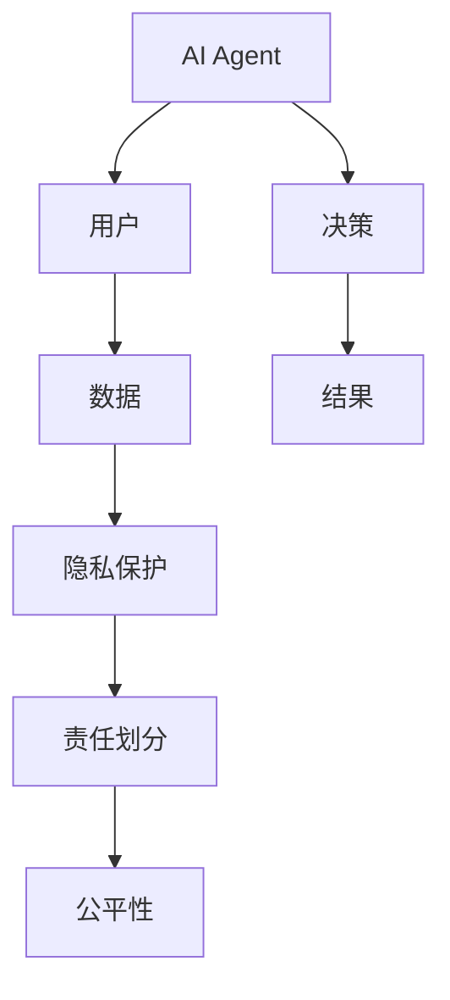
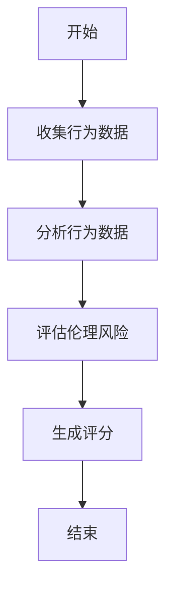
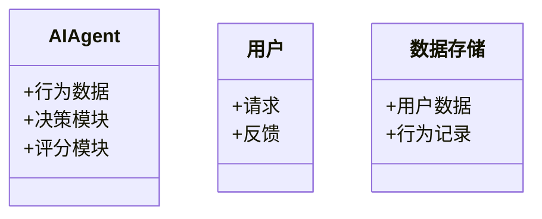
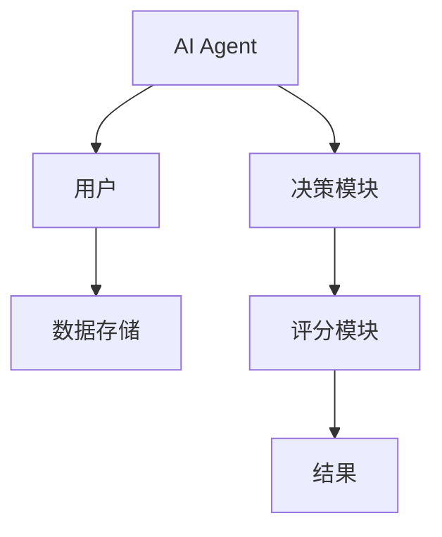

                 


# AI Agent的伦理设计：遵循AI伦理准则

---

## 关键词：AI Agent, 伦理设计, AI伦理准则, 责任归属, 透明性, 公平性

---

## 摘要

随着人工智能技术的快速发展，AI Agent（智能体）在各个领域的应用越来越广泛。然而，AI Agent的行为可能会对人类社会产生深远的影响，包括隐私泄露、责任划分不明确、算法偏见等问题。本文从AI Agent的伦理设计出发，详细探讨了如何在AI Agent的设计和开发过程中遵循伦理准则，包括透明性、责任归属、公平性和隐私保护等方面。通过分析核心概念、算法原理、系统架构设计和实际案例，本文为AI Agent的伦理设计提供了理论支持和实践指导。

---

## 第一部分：AI Agent的背景与核心概念

### 第1章：AI Agent的基本概念与伦理背景

#### 1.1 AI Agent的定义与特点

**1.1.1 AI Agent的定义**

AI Agent是一种能够感知环境、自主决策并执行任务的智能实体。它可以是一个软件程序、机器人或其他任何形式的智能系统，其核心目标是通过与环境的交互来实现特定的目标。

**1.1.2 AI Agent的核心特点**

- **自主性**：AI Agent能够自主决策，无需外部干预。
- **反应性**：能够实时感知环境并做出反应。
- **目标导向**：所有行为都围绕实现特定目标展开。
- **学习能力**：通过数据和经验不断优化自身行为。

**1.1.3 AI Agent与传统AI的区别**

与传统AI相比，AI Agent更强调自主性和实时性，能够独立完成任务并适应动态变化的环境。

---

#### 1.2 AI Agent的伦理问题背景

**1.2.1 伦理问题的来源**

AI Agent的广泛应用带来了许多伦理问题，例如隐私泄露、算法偏见、责任划分不明确等。这些问题源于AI Agent的设计、数据和算法本身。

**1.2.2 伦理问题的现状与挑战**

当前，AI Agent的伦理问题主要集中在以下几个方面：

1. **隐私保护**：AI Agent可能收集大量用户数据，存在隐私泄露的风险。
2. **责任归属**：当AI Agent的行为引发问题时，责任划分存在模糊性。
3. **算法偏见**：AI Agent的决策可能受到训练数据的影响，导致不公平的结果。

**1.2.3 伦理问题的解决思路**

为了应对上述问题，我们需要在AI Agent的设计阶段就引入伦理准则，确保其行为符合社会伦理规范。

---

## 第二部分：AI Agent的伦理设计核心概念

### 第2章：AI Agent的伦理设计原则

#### 2.1 伦理设计的核心原则

**2.1.1 透明性原则**

AI Agent的行为必须透明，用户需要清楚了解AI Agent的决策过程和依据。

**2.1.2 责任归属原则**

当AI Agent的行为引发问题时，必须明确责任归属，确保责任人能够及时处理问题。

**2.1.3 公平性原则**

AI Agent的决策必须公平，避免因算法偏见导致不公平的结果。

**2.1.4 隐私保护原则**

AI Agent在收集和使用数据时，必须严格遵守隐私保护原则，防止用户隐私泄露。

#### 2.2 伦理设计的核心要素对比

**2.2.1 对比表格：伦理设计核心要素属性特征**

| 核心要素   | 特性描述                       |
|------------|----------------------------|
| 透明性     | 决策过程可解释，用户可理解    |
| 责任归属   | 明确责任主体，可追溯         |
| 公平性     | 决策公平，避免算法偏见       |
| 隐私保护   | 数据使用符合隐私法规         |

#### 2.3 伦理设计的ER实体关系图

**2.3.1 Mermaid流程图：伦理设计的实体关系架构**



---

## 第三部分：AI Agent的伦理设计算法原理

### 第3章：基于伦理准则的AI Agent设计算法

#### 3.1 伦理评分模型的设计

**3.1.1 伦理评分模型的定义**

伦理评分模型是一种用于评估AI Agent行为是否符合伦理准则的算法。通过评分，我们可以量化AI Agent的伦理风险，并据此优化其行为。

**3.1.2 伦理评分模型的流程**



**3.1.3 伦理评分模型的数学公式**

伦理评分模型可以通过以下公式计算：

$$ \text{伦理评分} = \sum_{i=1}^{n} w_i \cdot r_i $$

其中，$w_i$ 是第$i$项的权重，$r_i$ 是第$i$项的伦理风险值。

---

#### 3.2 基于伦理准则的AI Agent算法实现

**3.2.1 Python源代码实现**

```python
def伦理评分模型(行为数据):
    评分 = 0
    for i in range(len(行为数据)):
        评分 += 行为数据[i] * 权重[i]
    return 评分
```

**3.2.2 伦理评分模型的优化**

为了提高评分的准确性，我们可以引入机器学习算法，如随机森林或神经网络，对模型进行优化。

---

## 第四部分：AI Agent的系统分析与架构设计

### 第4章：AI Agent的系统架构设计

#### 4.1 问题场景介绍

我们以一个智能客服系统为例，探讨AI Agent的伦理设计。智能客服需要处理用户的咨询，同时遵守隐私保护和公平性原则。

#### 4.2 系统功能设计

**4.2.1 领域模型设计**



**4.2.2 系统架构设计**



---

## 第五部分：AI Agent的项目实战

### 第5章：基于伦理准则的AI Agent设计与实现

#### 5.1 项目实战：智能客服系统的伦理设计

**5.1.1 环境安装**

需要安装Python、机器学习库（如Scikit-learn）和Mermaid工具。

**5.1.2 核心代码实现**

```python
def伦理评分模型(行为数据):
    评分 = 0
    for i in range(len(行为数据)):
        评分 += 行为数据[i] * 权重[i]
    return 评分
```

**5.1.3 案例分析**

通过具体案例分析，验证伦理评分模型的有效性，并优化模型。

---

## 第六部分：总结与展望

### 第6章：总结与最佳实践

#### 6.1 总结

本文详细探讨了AI Agent的伦理设计，从核心概念到算法实现，再到系统架构设计，为AI Agent的伦理设计提供了全面的指导。

#### 6.2 最佳实践

- 在设计AI Agent时，始终将伦理准则放在首位。
- 定期对AI Agent的行为进行伦理评估，及时发现问题并优化。
- 加强跨学科合作，确保AI Agent的设计符合社会伦理规范。

#### 6.3 注意事项

- 伦理设计需要结合具体场景，避免一刀切。
- 在数据收集和使用过程中，严格遵守隐私保护法规。

#### 6.4 拓展阅读

建议进一步阅读相关文献，深入了解AI伦理学和机器学习算法的最新进展。

---

## 作者：AI天才研究院/AI Genius Institute & 禅与计算机程序设计艺术 /Zen And The Art of Computer Programming

---

通过以上思考过程，我们逐步构建了《AI Agent的伦理设计：遵循AI伦理准则》的技术博客文章。从背景介绍到算法实现，从系统设计到项目实战，每一步都力求详细且易于理解，确保读者能够全面掌握AI Agent的伦理设计方法。

