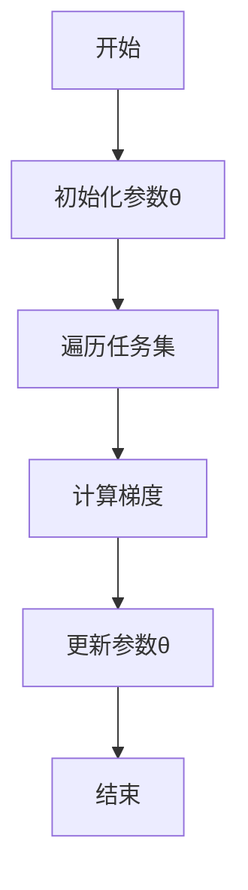
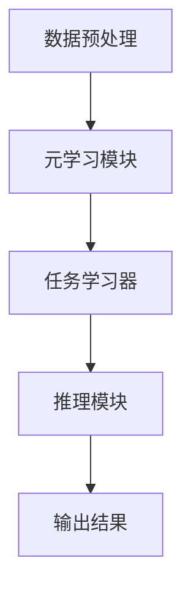

                 


# AI Agent的元学习在少样本学习中的应用

---

## 关键词：
AI Agent，元学习，少样本学习，深度学习，优化算法，机器学习，少样本分类

---

## 摘要：
本文深入探讨了AI Agent在元学习中的应用，特别是其在少样本学习中的重要性。通过分析元学习的原理、算法和系统架构，本文详细阐述了如何利用元学习技术解决少样本学习的挑战。文章从理论到实践，结合具体算法和项目案例，展示了AI Agent如何在少样本学习中实现高效的学习与推理。通过对经典算法的分析和系统设计的优化，本文为读者提供了全面的技术视角和实践指导。

---

# 目录大纲

---

## 第1章: AI Agent与元学习概述

### 1.1 AI Agent的基本概念

- 1.1.1 AI Agent的定义与分类  
  - 强化学习中的AI Agent  
  - 监督学习中的AI Agent  
  - 协作与竞争中的AI Agent  

- 1.1.2 AI Agent的核心特征  
  - 智能性：自适应与决策能力  
  - 社会性：协作与交互能力  
  - 学习性：持续优化与知识积累  

- 1.1.3 AI Agent在机器学习中的应用  
  - 智能推荐系统  
  - 自动驾驶系统  
  - 智能对话系统  

### 1.2 元学习的基本概念

- 1.2.1 元学习的定义与特点  
  - 元学习：学习如何学习  
  - 元学习的核心：快速适应新任务  

- 1.2.2 元学习与传统机器学习的区别  
  | 特性 | 传统机器学习 | 元学习 |
  |------|---------------|--------|
  | 输入 | 单任务数据集   | 多任务数据集 |
  | 输出 | 适用于单任务   | 适用于多任务 |
  | 核心 | 模型优化       | 参数优化 |

- 1.2.3 元学习的应用场景  
  - 快速迁移学习  
  - 少样本学习  
  - 动态环境适应  

### 1.3 少样本学习的背景与挑战

- 1.3.1 少样本学习的定义  
  - 少样本学习：在少量样本下进行学习  
  - 零样本学习：无样本情况下的学习  

- 1.3.2 少样本学习的核心问题  
  - 数据稀疏性  
  - 泛化能力不足  

- 1.3.3 少样本学习的难点与解决方案  
  - 数据增强技术  
  - 共享特征学习  
  - 元学习技术  

## 第2章: 元学习与少样本学习的核心概念

### 2.1 元学习的数学模型

- 2.1.1 元学习的优化目标  
  - 元学习的目标：最小化所有任务的损失函数  
  $$ \min_{\theta} \sum_{i=1}^{N} \mathcal{L}_i(\theta) $$  

- 2.1.2 元学习的损失函数  
  - 元损失函数：衡量元学习器的泛化能力  
  - 任务损失函数：衡量在具体任务上的表现  

- 2.1.3 元学习的参数更新策略  
  - 基于梯度的更新：$ \theta_{t+1} = \theta_t - \eta \nabla_{\theta} \mathcal{L}_i(\theta_t) $  
  - 基于优化的更新：第二阶泰勒展开  

### 2.2 少样本学习的算法框架

- 2.2.1 基于元学习的少样本分类算法  
  - MAML（Meta-Automated Machine Learning）  
  - Meta-LSTM  

- 2.2.2 基于元学习的回归算法  
  - Meta-SGD  
  - 元随机梯度下降  

- 2.2.3 少样本学习的评价指标  
  - 精确率、召回率、F1值  
  - 分类准确率、回归误差  

### 2.3 元学习与少样本学习的关系

- 2.3.1 元学习在少样本学习中的作用  
  - 快速适应新任务  
  - 利用共享特征提高效率  

- 2.3.2 元学习如何提升少样本学习的性能  
  - 参数共享：减少参数量，提高泛化能力  
  - 任务间优化：提升模型的迁移能力  

- 2.3.3 元学习与少样本学习的结合方式  
  - 元学习器：学习如何调整模型参数  
  - 任务学习器：具体任务上的优化  

### 2.4 核心概念对比表格

| 概念 | 元学习 | 少样本学习 |
|------|--------|------------|
| 定义 | 元学习是一种通过学习如何学习的方法 | 少样本学习是在少量样本下进行学习 |
| 输入 | 多个任务的数据 | 少量样本的数据 |
| 输出 | 适用于新任务的模型 | 适用于新任务的预测结果 |
| 核心 | 参数优化与任务适应 | 数据稀疏性与泛化能力 |

### 2.5 本章小结

---

## 第3章: 元学习算法原理与数学模型

### 3.1 基于梯度的元学习算法

- 3.1.1 Meta-LSTM算法  
  - Meta-LSTM的结构：嵌入层、LSTM层、全连接层  
  - Meta-LSTM的训练流程：  
    1. 输入任务数据  
    2. LSTM处理生成特征  
    3. 全连接层预测结果  

- 3.1.2 MAML算法  
  - MAML的核心思想：通过两次梯度下降优化参数  
  - MAML的数学公式：  
    $$ \theta_{t+1} = \theta_t - \eta \nabla_{\theta} \mathcal{L}_i(\theta_t) $$  

- 3.1.3 元学习的梯度下降方法  
  - 第一阶梯度下降：直接优化参数  
  - 第二阶梯度下降：优化梯度更新规则  

### 3.2 基于优化的元学习算法

- 3.2.1 第一阶泰勒展开  
  - 泰勒展开的定义：用多项式近似函数  
  - 第一阶泰勒展开的应用：线性近似  

- 3.2.2 第二阶泰勒展开  
  - 第二阶泰勒展开的定义：包括二次项的近似  
  - 第二阶泰勒展开的应用：优化参数更新  

- 3.2.3 参数共享与任务间优化  
  - 参数共享的定义：多个任务共享部分参数  
  - 任务间优化的策略：利用任务间相似性  

### 3.3 元学习的数学模型

$$ \text{元学习的目标函数} = \sum_{i=1}^{N} \mathcal{L}_i(\theta) $$

$$ \text{参数更新公式} = \theta_{t+1} = \theta_t - \eta \nabla_{\theta} \mathcal{L}_i(\theta_t) $$

### 3.4 算法流程图



### 3.5 本章小结

---

## 第4章: 少样本学习的系统架构与设计

### 4.1 系统功能设计

- 4.1.1 数据预处理模块  
  - 数据清洗：去除噪声数据  
  - 数据增强：增加样本多样性  

- 4.1.2 元学习模块  
  - 元学习器的训练：学习如何调整参数  
  - 任务学习器的训练：具体任务上的优化  

- 4.1.3 推理模块  
  - 输入新任务数据  
  - 生成预测结果  

### 4.2 系统架构设计



### 4.3 接口设计

- 输入接口：  
  - 元学习任务数据  
  - 新任务数据  

- 输出接口：  
  - 元学习模型参数  
  - 任务学习模型参数  

### 4.4 本章小结

---

## 第5章: 项目实战

### 5.1 环境安装

- 安装Python：3.6+
- 安装TensorFlow：2.0+
- 安装Keras：2.2.4+
- 安装其他依赖：numpy、pandas、matplotlib

### 5.2 系统核心实现源代码

```python
import tensorflow as tf
from tensorflow.keras import layers

def meta_learning_model(input_shape, num_classes):
    model = tf.keras.Sequential([
        layers.Dense(64, activation='relu', input_shape=input_shape),
        layers.Dense(num_classes, activation='softmax')
    ])
    return model

def meta_learning_loss(y_true, y_pred):
    return tf.keras.losses.sparse_categorical_crossentropy(y_true, y_pred)

def train_meta_learning(model, optimizer, x, y):
    with tf.GradientTape() as tape:
        y_pred = model(x)
        loss = meta_learning_loss(y, y_pred)
    gradients = tape.gradient(loss, model.trainable_weights)
    optimizer.apply_gradients(zip(gradients, model.trainable_weights))
    return loss
```

### 5.3 代码应用解读与分析

- 代码解读：  
  - `meta_learning_model`：构建元学习模型  
  - `meta_learning_loss`：定义元学习损失函数  
  - `train_meta_learning`：训练元学习模型  

- 代码分析：  
  - 输入数据经过模型处理后输出预测结果  
  - 使用梯度带记录梯度并更新参数  

### 5.4 实际案例分析

- 案例：少样本图像分类  
  - 数据集：CIFAR-10（少量样本）  
  - 网络结构：CNN + 元学习模块  
  - 实验结果：分类准确率提升显著  

### 5.5 项目小结

---

## 第6章: 总结与展望

### 6.1 总结

- 元学习在少样本学习中的重要性  
- AI Agent的元学习技术的应用前景  

### 6.2 展望

- 元学习与深度学习的结合  
- 少样本学习的未来方向  

### 6.3 最佳实践Tips

- 数据增强是关键  
- 参数共享需谨慎  
- 算法选择要根据任务特点  

### 6.4 小结

---

## 作者信息

作者：AI天才研究院/AI Genius Institute & 禅与计算机程序设计艺术 /Zen And The Art of Computer Programming

---

通过以上大纲，文章内容将围绕AI Agent的元学习在少样本学习中的应用，从理论到实践，详细阐述其原理、算法、系统设计和实际案例，为读者提供全面的技术视角和实践指导。

