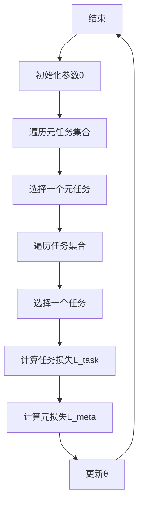
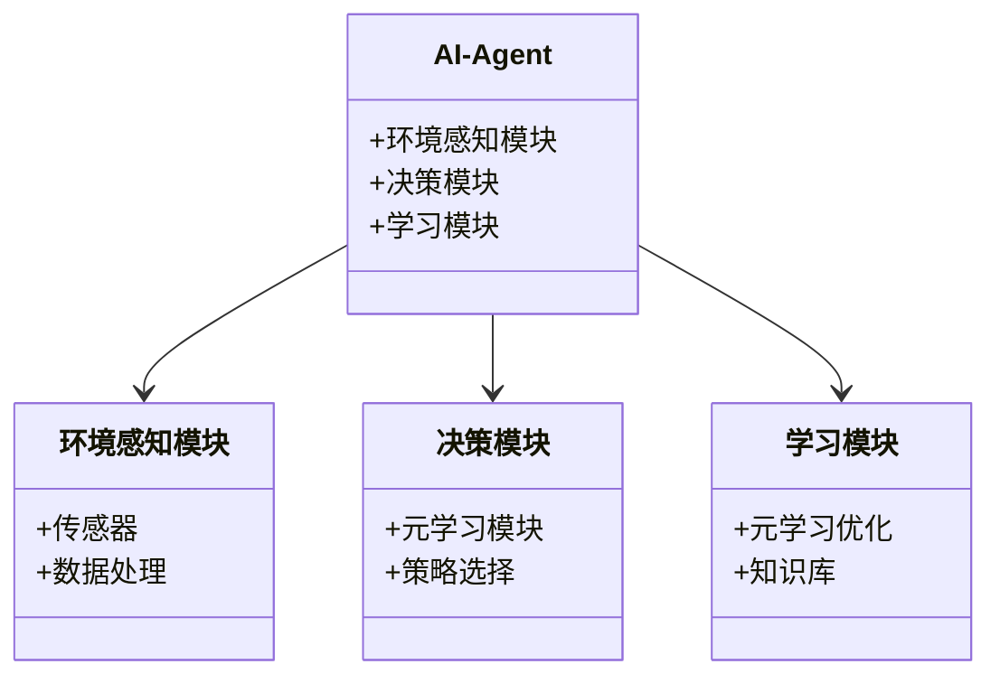

                 


# AI Agent的元学习能力开发实践

---

## 关键词

AI Agent, 元学习, Meta-Learning, 机器学习, 人工智能, 智能代理

---

## 摘要

本文深入探讨了AI Agent的元学习能力开发实践，从基础概念到算法实现，再到系统架构设计和项目实战，全面解析了元学习在AI Agent中的应用。通过详细的技术分析和案例研究，本文为开发者提供了从理论到实践的完整指南，帮助他们构建具备快速适应新任务能力的智能代理系统。

---

## 正文

### 第一部分：AI Agent与元学习基础

#### 第1章：AI Agent概述

##### 1.1 AI Agent的基本概念

###### 1.1.1 AI Agent的定义与分类

AI Agent（人工智能代理）是指能够感知环境、做出决策并采取行动的智能实体。它可以分为以下几类：

- **简单反射型AI Agent**：基于预定义规则执行任务。
- **基于模型的反应型AI Agent**：通过内部模型分析环境并做出决策。
- **目标驱动型AI Agent**：根据目标选择最优行动。
- **实用驱动型AI Agent**：追求效用函数的最大化。

AI Agent的特点包括自主性、反应性、目标导向性和社交能力。

###### 1.1.2 AI Agent的核心特点与优势

- **自主性**：能够在没有外部干预的情况下独立运行。
- **反应性**：能够实时感知环境并调整行为。
- **目标导向性**：根据目标优化决策过程。
- **学习能力**：通过经验改进性能。

###### 1.1.3 AI Agent的应用场景与挑战

AI Agent广泛应用于自动驾驶、智能客服、机器人等领域。其挑战包括环境复杂性、数据稀缺性和实时性要求。

##### 1.2 元学习的基本概念

###### 1.2.1 元学习的定义与目标

元学习（Meta-Learning）是指学习如何学习，旨在使模型能够快速适应新任务。其目标是通过少量数据训练出泛化能力强的模型。

###### 1.2.2 元学习与传统机器学习的区别

| 特性 | 元学习 | 传统机器学习 |
|------|--------|--------------|
| 数据需求 | 少量 | 大量         |
| 适应性 | 强     | 弱           |
| 任务多样性 | 高   | 中           |

###### 1.2.3 元学习在AI Agent中的作用

元学习使AI Agent能够快速适应新任务，提升其在动态环境中的表现。

---

#### 第2章：元学习的核心概念

##### 2.1 元学习的定义与目标

元学习通过优化元损失函数，使模型在多个任务间共享参数，提升泛化能力。

##### 2.2 元学习的原理

元学习的层次结构包括元任务和任务，通过任务间梯度共享实现参数更新。

---

### 第二部分：元学习的核心概念与原理

#### 第3章：主流元学习算法

##### 3.1 基于模型无关的方法

- **MAML**：元学习的主流算法，适用于图像分类任务。
- **ReMAML**：改进的MAML，引入关系归纳偏置。
- **Meta-SGD**：通用优化器，适用于多种任务。

---

### 第三部分：元学习算法原理

#### 第4章：元学习的算法实现

##### 4.1 元学习算法的核心步骤



##### 4.2 模型无关方法的数学模型

$$L_{\text{meta}} = \sum_{i=1}^{N} L_{\text{task}}(x_i, y_i; \theta)$$

---

### 第四部分：AI Agent的系统架构设计

#### 第5章：系统架构设计

##### 5.1 系统功能设计



---

### 第五部分：项目实战

#### 第6章：开发具备元学习能力的AI Agent

##### 6.1 项目背景与目标

选择智能客服场景，目标是通过元学习提升意图识别的泛化能力。

##### 6.2 项目实现

- **环境配置**：安装TensorFlow、Keras等库。
- **数据准备**：使用多领域数据集。
- **模型训练**：基于MAML算法进行训练。
- **模型评估**：在测试集上评估性能。
- **模型部署**：集成到智能客服系统。

##### 6.3 代码实现

```python
import tensorflow as tf

def meta_learning_model():
    # 定义模型
    model = tf.keras.Sequential([
        tf.keras.layers.Dense(64, activation='relu'),
        tf.keras.layers.Dense(10, activation='softmax')
    ])
    return model

# 初始化模型
model = meta_learning_model()
# 编译模型
model.compile(optimizer='adam', loss='sparse_categorical_crossentropy', metrics=['accuracy'])
```

---

### 第六部分：总结与展望

#### 第7章：开发经验总结

##### 7.1 最佳实践

- **数据质量**：确保数据多样性。
- **任务选择**：选择具有代表性的任务。
- **算法选择**：根据场景选择合适的元学习算法。

##### 7.2 未来展望

- **多模态学习**：结合文本、图像等多种数据类型。
- **在线学习**：实现在线更新模型。

---

## 作者

作者：AI天才研究院 & 禅与计算机程序设计艺术

---

### END

