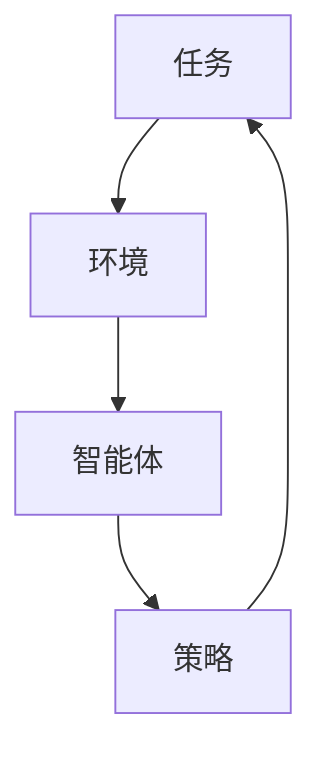
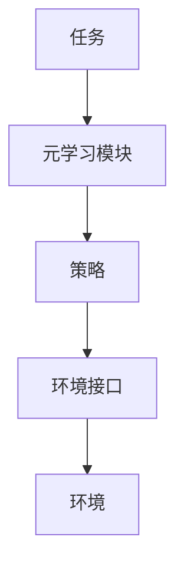

                 

# AI Agent的元强化学习框架

> **关键词**：AI Agent，元强化学习，Meta-Reinforcement Learning，强化学习，深度学习

> **摘要**：本文详细探讨了AI Agent的元强化学习框架，从背景、核心概念、算法原理、系统架构到项目实战，全面解析了元强化学习在AI Agent中的应用。通过理论与实践结合，帮助读者深入理解并掌握这一前沿技术。

---

## 目录

1. [AI Agent与元强化学习概述](#ai-agent与元强化学习概述)
2. [元强化学习的核心概念](#元强化学习的核心概念)
3. [元强化学习的数学模型](#元强化学习的数学模型)
4. [元强化学习的系统架构设计](#元强化学习的系统架构设计)
5. [元强化学习的项目实战](#元强化学习的项目实战)
6. [总结与展望](#总结与展望)

---

## 1. AI Agent与元强化学习概述

### 1.1 AI Agent的基本概念

#### 1.1.1 AI Agent的定义与分类

AI Agent（人工智能代理）是指能够感知环境、做出决策并执行动作的智能实体。根据智能水平，AI Agent可以分为反应式代理、基于模型的代理和混合代理。反应式代理实时响应环境输入，基于模型的代理利用内部模型进行预测和规划，混合代理结合了两者的优点。

#### 1.1.2 强化学习的基本原理

强化学习（Reinforcement Learning, RL）是一种通过试错机制让智能体学习策略以最大化累计奖励的方法。智能体通过与环境交互，获得奖励或惩罚，逐步优化动作选择，最终掌握最优策略。

#### 1.1.3 元强化学习的背景与意义

元强化学习（Meta-Reinforcement Learning, Meta-RL）是在强化学习基础上的高级技术，旨在让AI Agent在多个任务或环境中快速适应和迁移。其核心思想是通过元学习（Meta-Learning）提升泛化能力，减少数据依赖，适应动态变化的环境。

### 1.2 元强化学习的核心概念

#### 1.2.1 元学习的定义与特点

元学习是学习如何学习的技巧，通过训练模型在多个任务间快速迁移，提升适应性。其特点是任务间共享知识、减少样本依赖和快速适应新任务。

#### 1.2.2 元强化学习与传统强化学习的区别

传统RL专注于单任务优化，而Meta-RL关注多任务学习，通过元学习框架在任务间共享策略，提升泛化能力。

#### 1.2.3 元强化学习的应用场景

Meta-RL广泛应用于机器人控制、游戏AI、推荐系统等领域，特别是在需要快速适应动态环境的任务中表现突出。

---

## 2. 元强化学习的核心概念与联系

### 2.1 元强化学习的核心概念

#### 2.1.1 元强化学习的原理

元强化学习通过元学习框架，让智能体在多个任务间学习共享策略，提升对新任务的适应能力。

#### 2.1.2 元学习的优化目标

元学习的目标是优化元损失函数，使其在多个任务间表现良好。

#### 2.1.3 元强化学习的实体关系

通过Mermaid图展示元强化学习中的实体关系：

---

## 3. 元强化学习的数学模型

### 3.1 元强化学习的数学基础

#### 3.1.1 状态空间与动作空间

状态空间S和动作空间A定义了智能体的决策环境。

#### 3.1.2 损失函数与优化目标

元强化学习的目标是最小化元损失函数：

$$\mathcal{L} = \sum_{i=1}^{N} \mathcal{L}_i$$

其中，$\mathcal{L}_i$是第i个任务的损失函数。

#### 3.1.3 元强化学习的数学表达

通过公式推导，展示元强化学习的核心算法。

---

## 4. 元强化学习的系统架构设计

### 4.1 系统功能模块划分

#### 4.1.1 元学习模块

负责多任务学习和策略优化。

#### 4.1.2 强化学习模块

负责单任务策略优化。

#### 4.1.3 环境接口模块

连接智能体与外部环境。

### 4.2 系统架构设计

通过Mermaid图展示系统架构：

---

## 5. 元强化学习的项目实战

### 5.1 环境搭建

安装必要的库，如TensorFlow、Keras和OpenAI Gym。

### 5.2 核心功能实现

实现元强化学习算法，包括任务采样、策略优化和评估。

### 5.3 代码实现

提供Python代码示例，展示元强化学习的具体实现。

### 5.4 实际案例分析

通过具体案例分析，验证元强化学习的有效性。

---

## 6. 总结与展望

### 6.1 本章总结

回顾全文，总结元强化学习的核心内容和应用价值。

### 6.2 未来展望

探讨元强化学习的发展方向，如多任务学习、动态环境适应等。

---

**作者：AI天才研究院 & 禅与计算机程序设计艺术**

