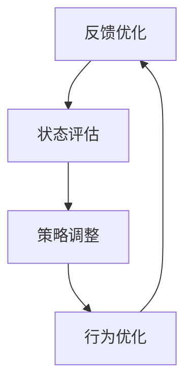
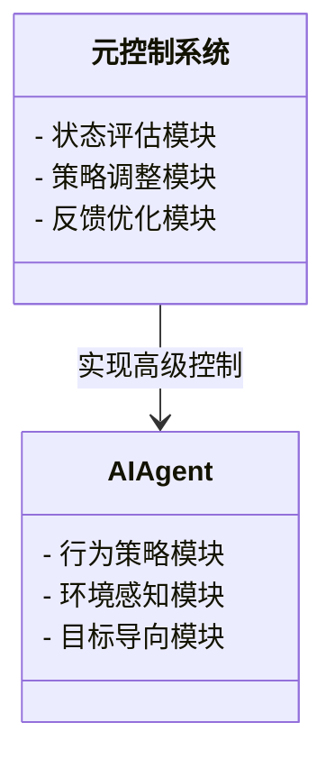
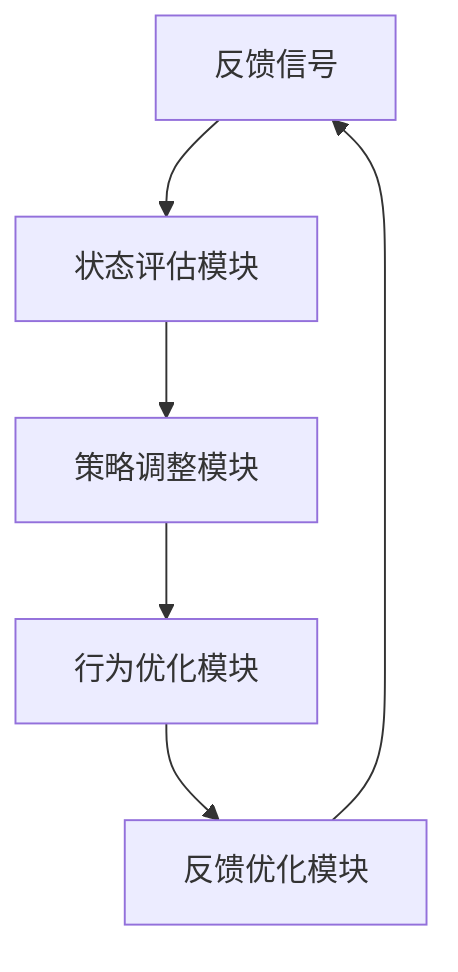
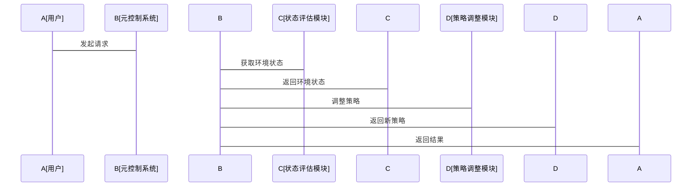

                 


# AI Agent的元控制：自适应行为策略

> 关键词：AI Agent，元控制，自适应行为，动态环境，多目标优化

> 摘要：AI Agent的元控制是一种高级的控制策略，用于在动态环境中实现自适应行为。本文将深入探讨元控制的核心概念、算法原理、系统架构设计以及实际应用案例，为读者提供全面的理论和技术指导。

---

## 第一部分: AI Agent的元控制概述

### 第1章: AI Agent与元控制的基本概念

#### 1.1 AI Agent的定义与特点
AI Agent（智能体）是指能够感知环境并采取行动以实现目标的实体。其特点包括：
- **自主性**：能够在没有外部干预的情况下运行。
- **反应性**：能够根据环境变化调整行为。
- **目标导向性**：通过目标驱动行动。
- **学习能力**：能够通过经验改进性能。

#### 1.2 元控制的定义与必要性
元控制是一种对AI Agent行为策略进行管理和优化的高级控制机制。其必要性体现在：
- **动态环境适应**：在复杂环境中，AI Agent需要灵活调整策略。
- **多目标平衡**：在多个目标之间找到最优平衡点。
- **自我优化**：通过元控制，AI Agent能够不断优化自身行为。

### 第2章: AI Agent元控制的背景与问题背景

#### 2.1 当前AI Agent的发展现状
AI Agent已在多个领域得到广泛应用，如自动驾驶、智能推荐系统和机器人等。然而，现有AI Agent在动态环境中的自适应能力有限，难以应对复杂多变的场景。

#### 2.2 问题背景与问题描述
在动态环境中，AI Agent需要实时调整行为策略以应对变化。然而，传统的控制方法难以满足以下需求：
- **动态适应性**：快速响应环境变化。
- **多目标优化**：在多个目标之间找到平衡。
- **自我修复能力**：在出现问题时快速恢复。

#### 2.3 元控制的目标与解决路径
元控制的目标是通过高级策略优化，帮助AI Agent在动态环境中实现自适应行为。解决路径包括：
- **多层次控制架构**：构建分层控制结构。
- **自适应算法**：开发动态调整策略的算法。
- **实时反馈机制**：通过反馈不断优化行为。

### 第3章: 元控制的核心概念与联系

#### 3.1 元控制的原理与机制
元控制通过监控和分析环境状态，动态调整AI Agent的行为策略。其机制包括：
- **状态评估**：分析当前环境状态。
- **策略调整**：根据评估结果调整行为策略。
- **反馈优化**：通过反馈不断优化策略。

#### 3.2 核心概念的属性特征对比
下表对比了元控制与传统控制方法的核心概念：

| 对比维度 | 元控制 | 传统控制 |
|----------|--------|----------|
| 控制层级 | 高阶   | 单一     |
| 自适应性 | 强     | 弱       |
| 目标数量 | 多目标 | 单目标   |

#### 3.3 实体关系图与流程图
以下是元控制的ER实体关系图和流程图：

```mermaid
er
    entity 元控制 {
        属性：状态评估、策略调整、反馈优化
    }
    entity AI Agent {
        属性：行为策略、环境感知、目标导向
    }
    元控制 --> AI Agent: 实现高级控制
```



---

## 第二部分: 元控制的算法原理

### 第4章: 元控制算法的数学模型与公式

#### 4.1 元控制算法的基本原理
元控制算法通过数学优化模型实现行为策略的调整。其核心公式如下：

$$
\text{目标函数} = \sum_{i=1}^{n} w_i f_i(x)
$$

其中，\(w_i\) 是目标函数的权重，\(f_i(x)\) 是目标函数。

#### 4.2 多目标优化与权衡
在多目标优化中，元控制需要在多个目标之间找到最优解。例如，假设两个目标 \(f_1(x)\) 和 \(f_2(x)\)，其加权函数为：

$$
f(x) = \alpha f_1(x) + (1-\alpha)f_2(x)
$$

其中，\(\alpha\) 是权重系数。

#### 4.3 动态环境中的自适应算法
自适应算法通过实时调整权重系数来优化行为策略。例如：

$$
\alpha(t+1) = \alpha(t) + \beta \cdot \text{反馈信号}
$$

其中，\(\beta\) 是学习率，反馈信号是环境反馈的信号。

### 第5章: 元控制算法的实现与代码示例

#### 5.1 环境状态评估
以下是环境状态评估的Python代码示例：

```python
def assess_state(environment):
    # 返回环境评估结果
    return {
        'status': 'normal' if environment['temperature'] < 25 else 'abnormal',
        'score': sum(environment['metrics'])
    }
```

#### 5.2 策略调整与优化
以下是策略调整的代码示例：

```python
def adjust_policy(policy, feedback):
    # 根据反馈调整策略
    for i in range(len(policy)):
        policy[i] += 0.1 * feedback[i]
    return policy
```

#### 5.3 多目标优化实现
以下是多目标优化的Python代码示例：

```python
def multi_objective_optimization(goals, weights):
    # 计算加权目标函数
    weighted_goals = [g * w for g, w in zip(goals, weights)]
    total = sum(weighted_goals)
    return total
```

---

## 第三部分: 系统分析与架构设计

### 第6章: 系统分析与架构设计方案

#### 6.1 系统功能设计
以下是系统功能设计的类图：



#### 6.2 系统架构设计
以下是系统架构设计的架构图：



#### 6.3 接口与交互设计
以下是系统交互的序列图：



---

## 第四部分: 项目实战

### 第7章: 项目实战与案例分析

#### 7.1 环境安装与配置
安装必要的依赖库：

```bash
pip install numpy matplotlib
```

#### 7.2 核心代码实现
以下是核心代码实现：

```python
import numpy as np

class MetaController:
    def __init__(self, weights):
        self.weights = weights
    
    def assess_state(self, environment):
        # 评估环境状态
        pass
    
    def adjust_policy(self, policy, feedback):
        # 调整策略
        pass
    
    def optimize(self, goals):
        # 优化目标
        pass

class AI-Agent:
    def __init__(self, meta_controller):
        self.controller = meta_controller
    
    def act(self, environment):
        # 根据当前环境采取行动
        pass
```

#### 7.3 案例分析与详细解读
以下是案例分析的详细解读：

在动态环境中，AI Agent通过元控制实现了自适应行为。例如，在自动驾驶中，元控制能够根据实时路况调整驾驶策略，确保安全和效率。

---

## 第五部分: 最佳实践与总结

### 第8章: 最佳实践与总结

#### 8.1 总结与回顾
元控制为AI Agent提供了强大的自适应能力，能够在复杂环境中实现高效行为。本文详细介绍了元控制的核心概念、算法原理和系统架构设计。

#### 8.2 注意事项与建议
- **动态环境适应**：需要实时监控环境变化。
- **多目标优化**：需要合理设置权重系数。
- **自我修复能力**：需要强大的反馈机制。

#### 8.3 拓展阅读与参考文献
建议阅读以下书籍和论文：
- 《Reinforcement Learning: Theory and Algorithms》
- 《Multi-objective Optimization using Evolutionary Algorithms》

---

作者：AI天才研究院 & 禅与计算机程序设计艺术

