                 


# AI Agent的分布式训练与部署策略

> 关键词：AI Agent，分布式训练，部署策略，系统架构，算法原理，项目实战

> 摘要：本文系统地探讨了AI Agent的分布式训练与部署策略，从背景介绍到算法原理，再到系统架构和项目实战，详细分析了AI Agent在分布式环境下的训练方法和部署策略。通过实际案例分析，本文提出了最佳实践和优化建议，为读者提供了全面的技术指导。

---

## 第1章 AI Agent的基本概念与背景

### 1.1 AI Agent的定义与核心概念

AI Agent（人工智能代理）是指能够感知环境、执行任务并做出决策的智能实体。它具备以下核心特征：
- **自主性**：能够在没有外部干预的情况下自主运行。
- **反应性**：能够实时感知环境并做出反应。
- **学习能力**：通过数据和经验不断优化自身行为。

AI Agent的应用场景广泛，包括自动驾驶、智能助手、机器人控制等。

### 1.2 分布式训练与部署的必要性

随着AI Agent的应用需求增长，单机训练和部署已难以满足性能和扩展性的要求。分布式训练和部署成为必然趋势，其优势包括：
- **提升计算效率**：通过并行计算加速模型训练。
- **扩展性强**：能够处理更大规模的数据和任务。
- **实时性要求**：在分布式环境中实现低延迟响应。

---

## 第2章 分布式训练的核心原理

### 2.1 分布式训练的基本方法

#### 2.1.1 数据并行

数据并行将数据集分成多个部分，每个部分在不同的计算节点上进行训练。算法如下：

1. 每个节点加载一部分数据。
2. 每个节点独立计算梯度。
3. 将所有节点的梯度汇总，更新模型参数。

公式表示：
$$
\theta_{new} = \theta_{old} + \sum_{i=1}^{n} \nabla L_i
$$

#### 2.1.2 模型并行

模型并行将模型的不同部分分布在多个计算节点上，每个节点处理模型的不同部分。流程图如下：

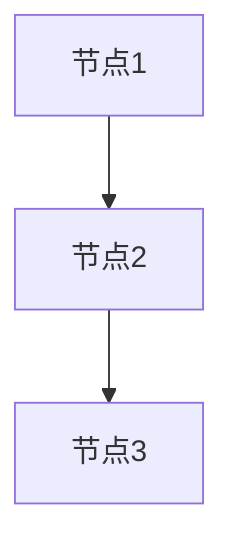

### 2.2 分布式训练中的通信机制

#### 2.2.1 参数服务器模式

参数服务器模式通过中心服务器管理模型参数，节点向服务器请求参数更新。序列图如下：

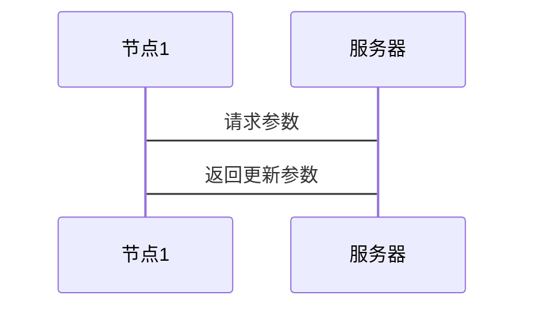

---

## 第3章 分布式部署的策略与架构

### 3.1 分布式部署的策略选择

#### 3.1.1 基于云计算的部署

云计算提供了弹性计算资源，适合大规模部署。流程图如下：

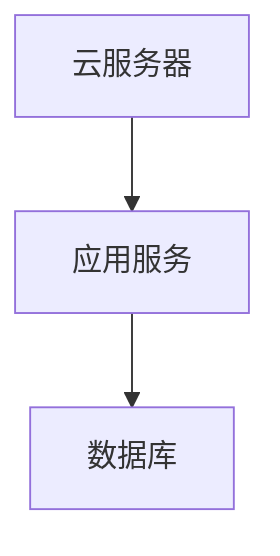

#### 3.1.2 基于边缘计算的部署

边缘计算将计算能力推送到数据源附近，减少延迟。架构图如下：

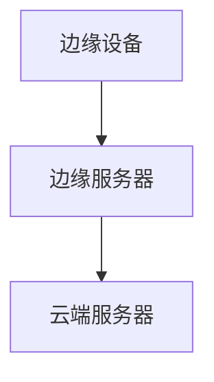

### 3.2 分布式架构的设计原则

#### 3.2.1 微服务架构

微服务架构将系统拆分为多个小型服务，每个服务独立运行。类图如下：

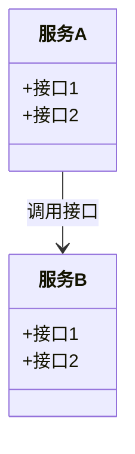

---

## 第4章 分布式训练与部署的算法原理

### 4.1 分布式训练算法

#### 4.1.1 同步 SGD 算法

同步 SGD 算法通过多个节点同时计算梯度，然后同步更新模型参数。流程图如下：

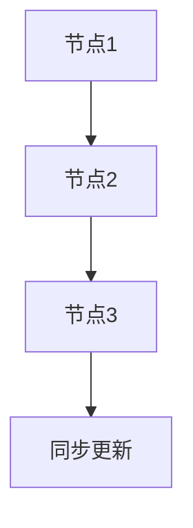

#### 4.1.2 异步 SGD 算法

异步 SGD 算法允许节点独立计算并更新参数，减少通信开销。流程图如下：

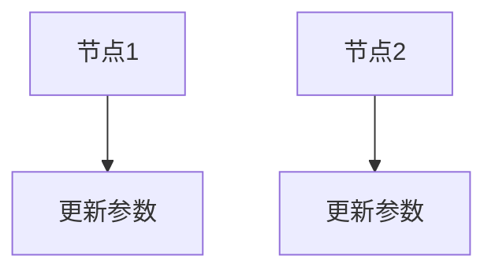

### 4.2 分布式部署中的负载均衡算法

#### 4.2.1 基于轮询的负载均衡

轮询算法按顺序将请求分配到不同的节点。流程图如下：

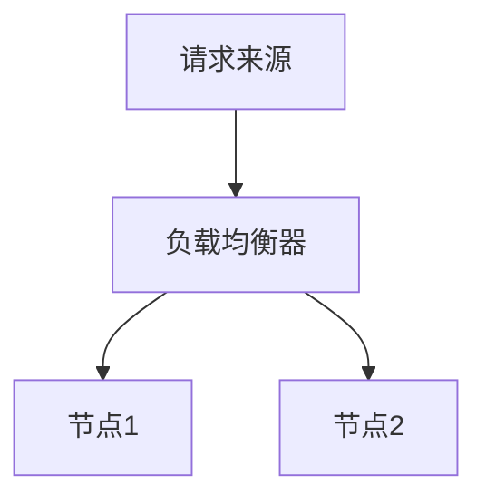

---

## 第5章 系统架构与设计

### 5.1 系统功能设计

#### 5.1.1 领域模型设计

领域模型设计包括用户、AI Agent、任务等实体。类图如下：

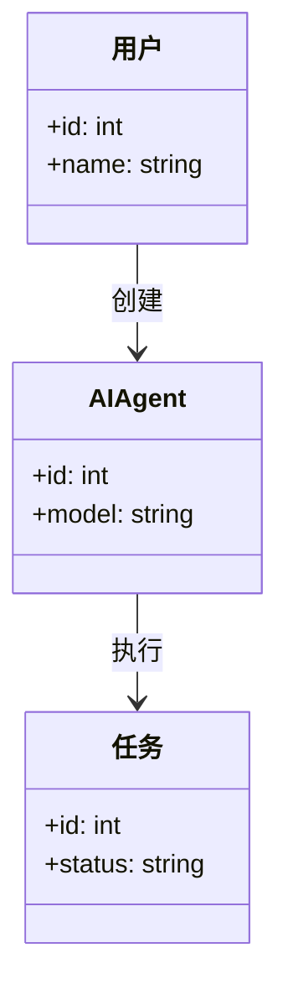

#### 5.1.2 系统功能模块划分

系统功能模块包括训练模块、部署模块、监控模块。架构图如下：

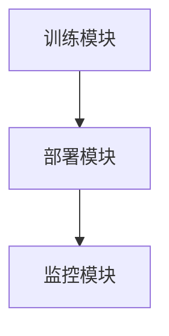

### 5.2 系统架构设计

#### 5.2.1 分层架构设计

分层架构包括数据层、业务逻辑层和表现层。流程图如下：

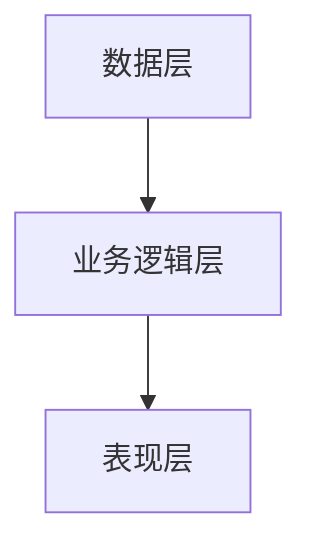

---

## 第6章 项目实战与案例分析

### 6.1 项目环境搭建

#### 6.1.1 开发环境配置

安装必要的依赖：
```bash
pip install tensorflow-distribute
pip install flask
```

### 6.2 核心代码实现

#### 6.2.1 分布式训练代码实现

使用TensorFlow进行分布式训练：
```python
import tensorflow as tf
from tensorflow.distribute import Strategy

strategy = Strategy()
with strategy.scope():
    model = build_model()
    model.compile(optimizer='adam', loss='binary_crossentropy')
```

#### 6.2.2 分布式部署代码实现

使用Flask进行微服务部署：
```python
from flask import Flask
app = Flask(__name__)

@app.route('/')
def home():
    return "AI Agent Service"
```

### 6.3 项目小结

通过项目实战，我们验证了分布式训练和部署的可行性，并总结了优化经验，如负载均衡和资源分配策略。

---

## 第7章 最佳实践与小结

### 7.1 最佳实践

#### 7.1.1 性能优化

优化通信开销和资源分配，提升系统效率。

#### 7.1.2 安全性保障

采用加密通信和权限控制，确保数据安全。

### 7.2 项目小结

本文全面探讨了AI Agent的分布式训练与部署策略，通过理论分析和项目实战，提出了可行的解决方案和优化建议。

---

作者：AI天才研究院 & 禅与计算机程序设计艺术

---

通过以上结构，文章详细讲解了AI Agent的分布式训练与部署策略，从理论到实践，为读者提供了全面的技术指导。

