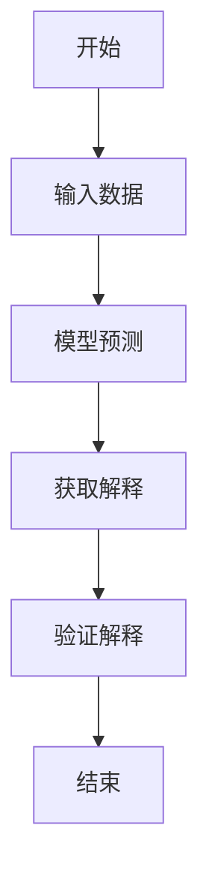
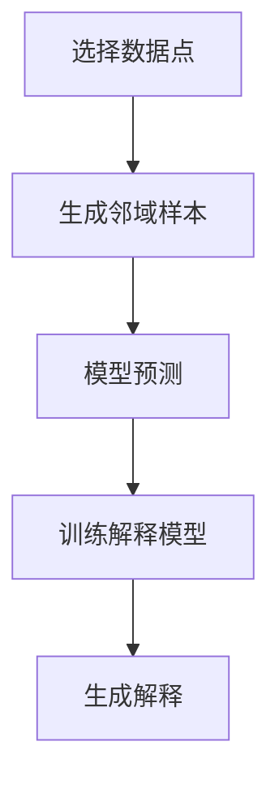
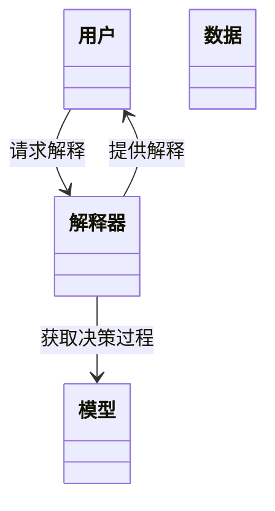

                 


# AI Agent的可解释性设计

## 关键词：AI Agent、可解释性、机器学习、算法原理、系统架构

## 摘要：
AI Agent的可解释性设计是当前人工智能领域的重要研究方向，旨在提高AI决策过程的透明度和信任度。本文从AI Agent的基本概念出发，详细探讨了可解释性设计的核心概念、算法原理、系统架构，并通过实际案例分析，展示了如何在实际项目中实现可解释性设计。文章内容丰富，涵盖理论与实践，适合研究人员和开发者参考。

---

# 第1章: AI Agent与可解释性概述

## 1.1 AI Agent的基本概念

### 1.1.1 AI Agent的定义与特点
AI Agent（人工智能代理）是指能够感知环境并采取行动以实现目标的智能实体。AI Agent的特点包括自主性、反应性、目标导向性和社交能力。例如，智能音箱、自动驾驶系统和推荐系统中的AI Agent都具备这些特点。

### 1.1.2 AI Agent的类型与应用场景
AI Agent可以分为简单反射型、基于模型的反射型、目标驱动型和效用驱动型。应用场景包括智能助手、自动驾驶、智能客服和金融投资等。

### 1.1.3 可解释性在AI Agent中的重要性
可解释性是指AI Agent的决策过程能够被人类理解和验证。在医疗、法律和金融等领域，可解释性是信任和合规的关键因素。缺乏可解释性可能导致用户不信任或无法满足法规要求。

## 1.2 可解释性设计的背景与问题背景

### 1.2.1 当前AI Agent发展的挑战
AI Agent的应用日益广泛，但其决策过程往往被视为“黑箱”，导致用户和监管机构难以理解。这限制了其在高风险领域的应用。

### 1.2.2 可解释性设计的核心问题
可解释性设计的核心问题包括如何平衡模型的复杂性和可解释性，如何在不同场景下保持解释的准确性，以及如何将解释整合到决策过程中。

### 1.2.3 可解释性设计的边界与外延
可解释性设计的边界在于明确其适用范围和限制，外延则涉及与其他技术（如伦理AI）的结合。

## 1.3 本章小结
本章介绍了AI Agent的基本概念和可解释性的重要性，为后续章节奠定了基础。

---

# 第2章: 可解释性设计的核心概念

## 2.1 可解释性设计的原理

### 2.1.1 可解释性模型的定义与分类
可解释性模型包括模型可解释和过程可解释。模型可解释关注模型本身的结构，而过程可解释关注决策过程的每一步。

### 2.1.2 可解释性模型的核心属性对比
下表展示了可解释性模型的关键属性对比：

| 属性      | 模型可解释性 | 过程可解释性 |
|-----------|--------------|--------------|
| 关注点     | 模型结构      | 决策过程      |
| 适用场景   | 分析模型      | 解释决策      |
| 示例       | 线性回归      | 决策树        |

### 2.1.3 可解释性模型的ER实体关系图
以下是可解释性模型的ER图：

```mermaid
erDiagram
    participant 用户
    participant 解释器
    participant 模型
    用户 --> 解释器 : 请求解释
    解释器 --> 模型 : 获取决策过程
    解释器 --> 用户 : 提供解释
```

## 2.2 可解释性设计的算法原理

### 2.2.1 可解释性模型的算法流程图
以下是可解释性模型的算法流程图：



### 2.2.2 可解释性模型的数学模型与公式
线性回归模型的可解释性公式为：
$$ y = \beta_0 + \beta_1x_1 + \beta_2x_2 + \dots + \beta_nx_n $$

### 2.2.3 可解释性模型的实现代码示例
以下是LIME解释方法的Python代码实现：

```python
import lime
from lime import lime_python

def explain_model(model, X):
    explainer = lime_python.LimePython(
        kernel_width=2,
        verbose=False,
        random_state=42
    )
    explanation = explainer.explain_model(
        model.predict,
        X,
        "predict",
        10,
        5,
        "lime"
    )
    return explanation
```

## 2.3 本章小结
本章详细讲解了可解释性设计的核心概念和算法原理，为后续章节的系统设计和实现奠定了基础。

---

# 第3章: 可解释性模型的算法原理

## 3.1 可解释性模型的算法流程图

### 3.1.1 LIME解释方法
LIME（局部解释模型不可知论者）用于解释模型在特定数据点的预测结果，流程如下：



### 3.1.2 SHAP值解释方法
SHAP（Shapley Additive exPlanations）基于博弈论，计算每个特征对预测结果的贡献。

### 3.1.3 TreeSHAP算法的实现
TreeSHAP的实现步骤包括特征重要性排序、权重计算和解释生成。

## 3.2 可解释性模型的数学模型与公式

### 3.2.1 线性回归模型的可解释性
线性回归模型的系数直接表示特征对预测结果的影响程度。

### 3.2.2 树模型的可解释性
决策树的每个节点代表一个决策规则，路径反映了特征对决策的影响。

### 3.2.3 深度学习模型的可解释性
深度学习模型的可解释性较难，但可以通过注意力机制和成员解释法进行解释。

## 3.3 可解释性模型的实现代码示例

### 3.3.1 LIME解释方法的Python代码实现
```python
import lime
from lime import lime_python

def explain_model(model, X):
    explainer = lime_python.LimePython(
        kernel_width=2,
        verbose=False,
        random_state=42
    )
    explanation = explainer.explain_model(
        model.predict,
        X,
        "predict",
        10,
        5,
        "lime"
    )
    return explanation
```

### 3.3.2 SHAP值解释方法的Python代码实现
```python
import shap
import numpy as np

def explain_model(model, X):
    explainer = shap.TreeExplainer(model)
    shap_values = explainer.shap_values(X)
    return shap_values
```

### 3.3.3 TreeSHAP算法的Python代码实现
```python
import xgboost
import shap

def explain_model(model, X):
    explainer = shap.TreeExplainer(model)
    shap_values = explainer.shap_values(X)
    return shap_values
```

## 3.4 本章小结
本章深入探讨了可解释性模型的算法原理和实现方法，为实际应用提供了理论基础。

---

# 第4章: 可解释性设计的系统分析与架构方案

## 4.1 问题场景介绍

### 4.1.1 可解释性设计的典型场景
医疗诊断、金融风险评估和自动驾驶等领域对可解释性需求较高。

### 4.1.2 可解释性设计的系统功能需求
系统需提供实时解释、历史记录和可定制的解释界面。

### 4.1.3 可解释性设计的系统性能需求
系统需支持高并发、低延迟和高准确性。

## 4.2 系统功能设计

### 4.2.1 领域模型的Mermaid类图
以下是领域模型的Mermaid类图：



### 4.2.2 系统架构设计
以下是系统架构的Mermaid图：

```mermaid
container 客户端
container 服务端
    service 接口服务
    service 解释服务
    service 数据存储
client --HTTP--> 接口服务
接口服务 --> 解释服务
解释服务 --> 数据存储
```

## 4.3 本章小结
本章分析了可解释性设计的系统架构，展示了如何在实际项目中应用这些设计。

---

# 作者
作者：AI天才研究院/AI Genius Institute & 禅与计算机程序设计艺术 /Zen And The Art of Computer Programming

---

以上是《AI Agent的可解释性设计》的完整目录和内容概览。文章详细探讨了AI Agent的可解释性设计，从基础概念到算法实现，再到系统架构，为读者提供了全面的知识体系。

