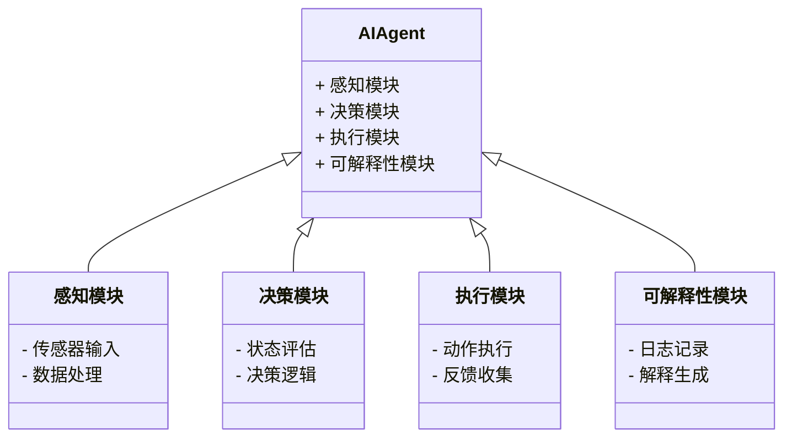

                 


# AI Agent的可解释性设计原则

## 关键词：AI Agent，可解释性，人工智能，算法原理，系统架构，项目实战

## 摘要：本文详细探讨了AI Agent的可解释性设计原则，从基础概念到系统架构，再到实际项目应用，全面解析如何构建可解释的AI Agent系统。文章首先介绍可解释性的定义和背景，然后分析核心概念和算法原理，最后通过项目实战和最佳实践提供实用的设计指南。

---

## 第1章：AI Agent与可解释性概述

### 1.1 AI Agent的基本概念

#### 1.1.1 AI Agent的定义与分类
AI Agent（人工智能代理）是指能够感知环境、自主决策并采取行动的智能实体。根据功能和智能水平，AI Agent可以分为以下几类：
- **反应式代理**：基于当前感知做出反应，如简单的行为决策。
- **认知式代理**：具备复杂推理和规划能力，如自动驾驶系统。
- **学习式代理**：通过经验改进性能，如强化学习模型。
- **混合式代理**：结合多种代理类型的特点。

#### 1.1.2 可解释性的定义与内涵
可解释性指AI Agent的行为、决策和结果能够被人类理解和验证的程度。高可解释性意味着系统决策过程透明，便于分析和验证。

#### 1.1.3 可解释性在AI Agent中的重要性
- 提高用户信任，尤其是在医疗和金融等高风险领域。
- 便于调试和优化，确保系统可靠性和稳定性。
- 符合监管要求，尤其是在涉及个人隐私和法律合规的场景。

#### 1.1.4 可解释性设计的边界与外延
- 边界：不涉及AI Agent的性能优化和功能扩展。
- 外延：涵盖决策过程的透明度和结果的可追溯性。

#### 1.1.5 AI Agent的核心要素与概念结构
AI Agent的核心要素包括感知能力、决策逻辑、执行机制和可解释性模块。概念结构通过类图展示：



---

### 1.2 可解释性设计的背景与问题

#### 1.2.1 当前AI Agent发展的挑战
随着AI Agent在各个领域的广泛应用，其复杂性和不可预测性增加，导致可解释性问题日益突出。

#### 1.2.2 可解释性设计的必要性
- 提高用户信任，增强系统接受度。
- 便于问题排查，优化系统性能。
- 满足法律法规要求，确保合规性。

#### 1.2.3 可解释性设计的核心问题
- 如何确保决策过程透明。
- 如何平衡可解释性与系统性能。
- 如何处理复杂场景下的解释需求。

#### 1.2.4 可解释性设计的边界与范围
- 范围：涵盖决策过程、结果和潜在影响。
- 边界：不涉及系统性能优化和功能扩展。

#### 1.2.5 AI Agent的核心要素与概念结构
通过以下对比表分析可解释性设计的关键要素：

| 关键要素 | 描述 |
|----------|------|
| 感知能力 | 系统对外界信息的获取能力 |
| 决策逻辑 | 决策过程的规则和算法 |
| 可解释性 | 决策过程的透明度和可理解性 |

---

## 第2章：可解释性设计的核心概念与联系

### 2.1 可解释性设计的理论基础

#### 2.1.1 可解释性设计的哲学基础
- 哲学基础：解释性是人类理解世界的基本需求。
- 认知科学：人类如何处理和理解信息。

#### 2.1.2 可解释性设计的认知科学基础
- 认知负荷：信息处理的复杂性影响理解。
- 可解释性层次：从简单到复杂递进。

#### 2.1.3 可解释性设计的逻辑推理基础
- 形式化逻辑：用于推理和验证。
- 解释性模型：描述系统行为的逻辑框架。

#### 2.1.4 可解释性设计的形式化方法
- 解释性框架：构建可解释性的数学模型。
- 验证方法：通过形式化验证确保可解释性。

---

### 2.2 可解释性设计的关键属性

#### 2.2.1 可解释性的维度与层次
- 维度：透明度、可理解性和可验证性。
- 层次：从简单到复杂递进。

#### 2.2.2 可解释性设计的核心属性
通过以下对比表分析关键属性：

| 属性 | 描述 |
|------|------|
| 透明度 | 决策过程的可观察性 |
| 可理解性 | 决策逻辑的易解释性 |
| 可验证性 | 决策结果的可核验性 |

---

## 第3章：可解释性设计的算法原理

### 3.1 可解释性算法的分类与原理

#### 3.1.1 透明模型与黑箱模型
- 透明模型：如决策树，易于解释。
- 黑箱模型：如深度神经网络，难以解释。

#### 3.1.2 解释性算法的实现步骤
1. 数据预处理：清洗和特征选择。
2. 模型训练：使用可解释性模型。
3. 解释性分析：提取特征重要性。

---

### 3.2 可解释性算法的实现代码

```python
import numpy as np
from sklearn.tree import DecisionTreeClassifier
from sklearn.inspection import permutation_importances

# 示例数据集
X = np.array([[2, 3], [5, 6], [7, 8], [1, 2]])
y = np.array([0, 1, 1, 0])

# 训练决策树模型
model = DecisionTreeClassifier()
model.fit(X, y)

# 计算特征重要性
importances = permutation_importances(model, X, y, scoring_func=lambda y_true, y_pred: accuracy_score(y_true, y_pred))
print(importances)
```

---

## 第4章：AI Agent的可解释性系统架构设计

### 4.1 系统架构设计概述

#### 4.1.1 系统功能模块划分
- 感知模块：处理输入数据。
- 决策模块：执行推理和决策。
- 可解释性模块：生成解释信息。

#### 4.1.2 系统功能流程
1. 数据输入：感知模块接收输入。
2. 数据处理：进行预处理。
3. 决策推理：决策模块生成决策。
4. 解释生成：可解释性模块提供解释。

---

## 4.2 系统架构设计的详细分析

#### 4.2.1 领域模型设计
通过类图展示系统结构：


---

## 第5章：可解释性设计的最佳实践

### 5.1 项目实战

#### 5.1.1 环境搭建
- 安装必要的库：`pip install scikit-learn`

#### 5.1.2 核心代码实现
```python
from sklearn.tree import DecisionTreeClassifier
from sklearn.metrics import accuracy_score

# 示例数据集
X = np.array([[2, 3], [5, 6], [7, 8], [1, 2]])
y = np.array([0, 1, 1, 0])

# 训练决策树模型
model = DecisionTreeClassifier()
model.fit(X, y)

# 预测并评估
y_pred = model.predict(X)
print(accuracy_score(y, y_pred))
```

---

### 5.2 实际案例分析

#### 5.2.1 案例分析
通过决策树模型分析特征重要性，解释模型决策过程。

---

## 第6章：总结与展望

### 6.1 全文总结
- 可解释性设计是构建可信AI Agent的核心。
- 透明模型和解释性算法是实现可解释性的关键。

### 6.2 未来展望
- 更复杂的模型可解释性研究。
- 结合领域知识优化解释过程。

---

## 附录

### 附录A：术语表

| 术语 | 定义 |
|------|------|
| AI Agent | 人工智能代理 |
| 可解释性 | 决策过程的透明性 |
| 决策树 | 用于分类的树状模型 |

### 附录B：工具推荐

| 工具 | 描述 |
|------|------|
| SHAP | 解释模型决策的工具 |
| LIME | 局部解释的工具 |

### 附录C：参考文献

- Goodfellow, I. (2016). *Deep Learning*. MIT Press.
- Miller, T. (2019). *Explainable AI: The Model-Agnostic Method*.

### 附录D：索引

按字母顺序排列文章中的术语和概念。

---

## 作者：AI天才研究院 & 禅与计算机程序设计艺术

