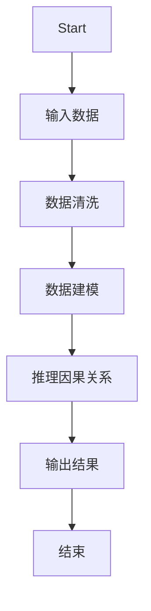
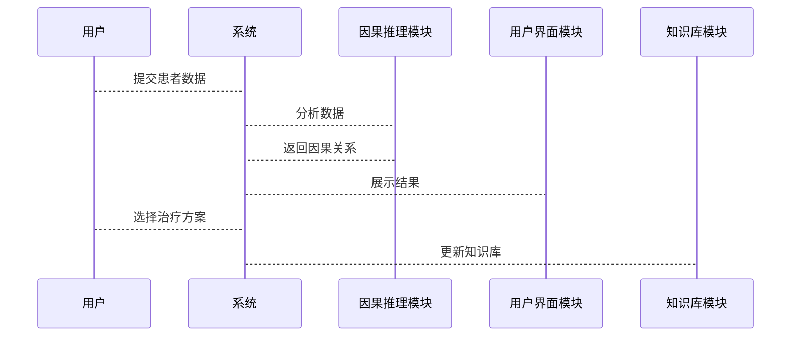

                 


# AI Agent的因果推理能力开发

> 关键词：因果推理，AI Agent，因果图，潜在结果，反事实推理，强化学习，知识图谱

> 摘要：本文深入探讨了AI Agent的因果推理能力开发，从基础概念到算法原理，再到系统实现，结合实际案例分析，全面剖析因果推理在AI Agent中的应用。文章旨在为开发者提供理论与实践相结合的指导，帮助其构建具备因果推理能力的智能系统。

---

# 目录

1. **AI Agent与因果推理基础**
   - 1.1 因果推理的基本概念
   - 1.2 AI Agent的定义与特点
   - 1.3 本章小结

2. **因果推理的核心概念与联系**
   - 2.1 因果图与潜在结果
   - 2.2 因果推理的核心原理
   - 2.3 因果推理与AI Agent的结合
   - 2.4 核心概念对比表
   - 2.5 因果图示例

3. **因果推理算法原理**
   - 3.1 潜在结果框架
   - 3.2 因果发现算法
   - 3.3 反事实推理与因果权重
   - 3.4 算法流程图

4. **系统分析与架构设计**
   - 4.1 问题场景介绍
   - 4.2 系统功能设计
   - 4.3 系统架构设计
   - 4.4 接口设计与交互流程
   - 4.5 核心代码实现

5. **项目实战：基于因果推理的医疗AI Agent**
   - 5.1 项目背景与目标
   - 5.2 环境安装与依赖
   - 5.3 核心代码实现
   - 5.4 代码解读与分析
   - 5.5 实际案例分析

6. **最佳实践与小结**
   - 6.1 开发注意事项
   - 6.2 本章小结
   - 6.3 拓展阅读推荐

---

### 第1章: AI Agent与因果推理基础

#### 1.1 因果推理的基本概念
- **问题背景**：传统统计学关注相关性，但无法解释因果关系。例如，冰激凌销量与 drownings 的相关性并不意味着前者导致后者。
- **定义**：因果推理研究变量间的因果关系，通过干预或观察数据推断因果效应。
- **AI Agent中的作用**：帮助AI Agent在复杂环境中做出因果关系推理，提升决策能力。

#### 1.2 AI Agent的定义与特点
- **定义**：AI Agent是一个智能实体，能够感知环境、自主决策并采取行动。
- **特点**：具备自主性、反应性、目标导向性和社交能力。
- **因果推理的重要性**：通过理解因果关系，AI Agent能够更好地进行预测、决策和解释。

#### 1.3 本章小结
- 本章介绍了因果推理的基本概念和AI Agent的定义特点，强调了因果推理在AI Agent中的重要性。

---

### 第2章: 因果推理的核心概念与联系

#### 2.1 因果图与潜在结果
- **因果图的定义**：通过有向图表示变量间的因果关系。
- **潜在结果**：每个单位在不同处理下的结果。
- **示例**：因果图展示了变量间的因果路径。

#### 2.2 因果推理的核心原理
- **随机化**：通过随机分配处理来消除混杂变量。
- **反事实推理**：推断在不同处理下的结果。
- **因果关系的传递性**：因果关系可以通过传递链进行推断。

#### 2.3 因果推理与AI Agent的结合
- **决策应用**：AI Agent通过因果推理优化决策。
- **知识图谱**：因果推理与知识图谱的结合增强推理能力。
- **强化学习**：因果推理为强化学习提供因果信息。

#### 2.4 核心概念对比表
| 概念 | 特征 | 示例 |
|------|------|------|
| 相关性 | 数据分布的关联性 | 烟雨相关性：下雨天人们打伞 |
| 因果性 | 变量间的因果关系 | 雨伞因果性：打伞导致下雨减少 |

#### 2.5 因果图示例


---

### 第3章: 因果推理算法原理

#### 3.1 潜在结果框架
- **定义**：每个单位在不同处理下的结果。
- **因果效应计算**：通过比较处理组和对照组的结果。

#### 3.2 因果发现算法
- **基于规则的算法**：通过逻辑推理发现因果关系。
- **基于数据驱动的算法**：通过观察数据学习因果图。

#### 3.3 反事实推理与因果权重
- **反事实推理**：推断在不同处理下的结果。
- **因果权重**：量化因果关系的强度。

#### 3.4 算法流程图


---

### 第4章: 系统分析与架构设计

#### 4.1 问题场景介绍
- **医疗领域**：分析不同治疗方案对患者康复的影响。

#### 4.2 系统功能设计
- **因果推理模块**：实现因果图构建和潜在结果计算。
- **知识库模块**：存储医疗知识和患者数据。
- **用户界面模块**：展示推理结果和决策建议。

#### 4.3 系统架构设计


#### 4.4 接口设计与交互流程


#### 4.5 核心代码实现
- **因果图构建**：使用Python库`networkx`绘制因果图。
- **潜在结果计算**：基于因果权重进行反事实推理。

---

### 第5章: 项目实战：基于因果推理的医疗AI Agent

#### 5.1 项目背景与目标
- **背景**：医疗领域需要通过因果推理优化治疗方案。
- **目标**：构建一个医疗AI Agent，分析不同治疗方案的因果效应。

#### 5.2 环境安装与依赖
- **Python环境**：安装`networkx`、`pandas`、`scikit-learn`等库。

#### 5.3 核心代码实现
```python
import networkx as nx
import pandas as pd

# 构建因果图
G = nx.DiGraph()
G.add_edges_from([('A', 'B'), ('A', 'C'), ('B', 'C')])

# 计算潜在结果
def calculate_potential_outcome(data):
    # 假设数据格式为 DataFrame
    outcome = data['outcome']
    treatment = data['treatment']
    effect = []
    for i in range(len(data)):
        if treatment[i] == 1:
            effect.append(outcome[i])
        else:
            effect.append(0)
    return pd.Series(effect)
```

#### 5.4 代码解读与分析
- **因果图构建**：使用`networkx`绘制因果关系图。
- **潜在结果计算**：通过反事实推理计算因果效应。

#### 5.5 实际案例分析
- **案例**：分析两种治疗方案对患者康复的影响。
- **结果**：因果推理帮助选择最优治疗方案。

---

### 第6章: 最佳实践与小结

#### 6.1 开发注意事项
- **数据质量**：因果推理依赖高质量数据。
- **模型选择**：根据场景选择合适的因果推理算法。
- **解释性**：因果推理结果需要可解释。

#### 6.2 本章小结
- 本文详细介绍了AI Agent的因果推理能力开发，从基础概念到系统实现，结合实际案例，展示了因果推理在AI Agent中的应用。

#### 6.3 拓展阅读推荐
- 建议阅读《Causal Inference in Statistics》和《The Book of Why》深入理解因果推理。

---

作者：AI天才研究院/AI Genius Institute & 禅与计算机程序设计艺术/Zen And The Art of Computer Programming

