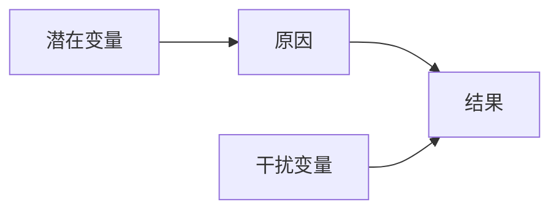
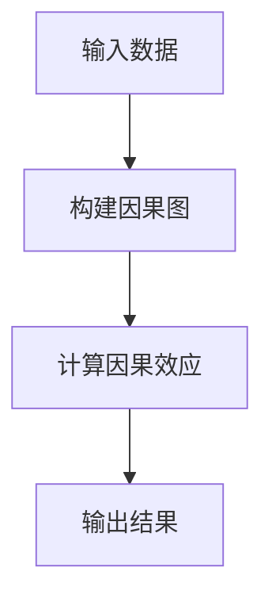
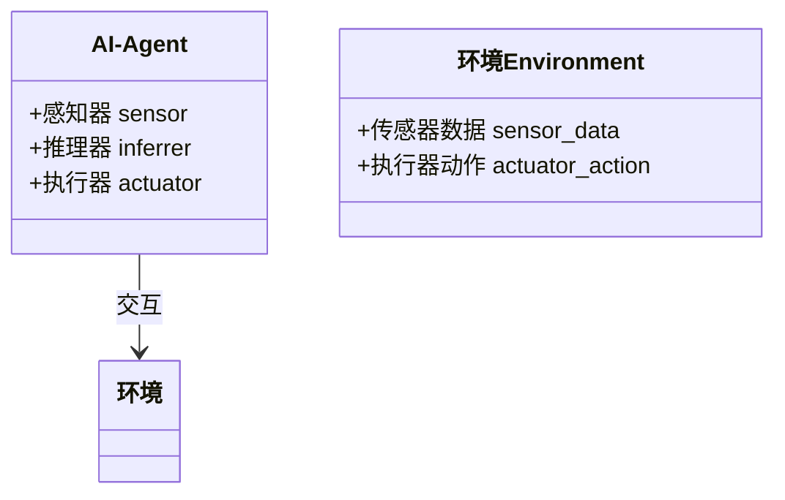
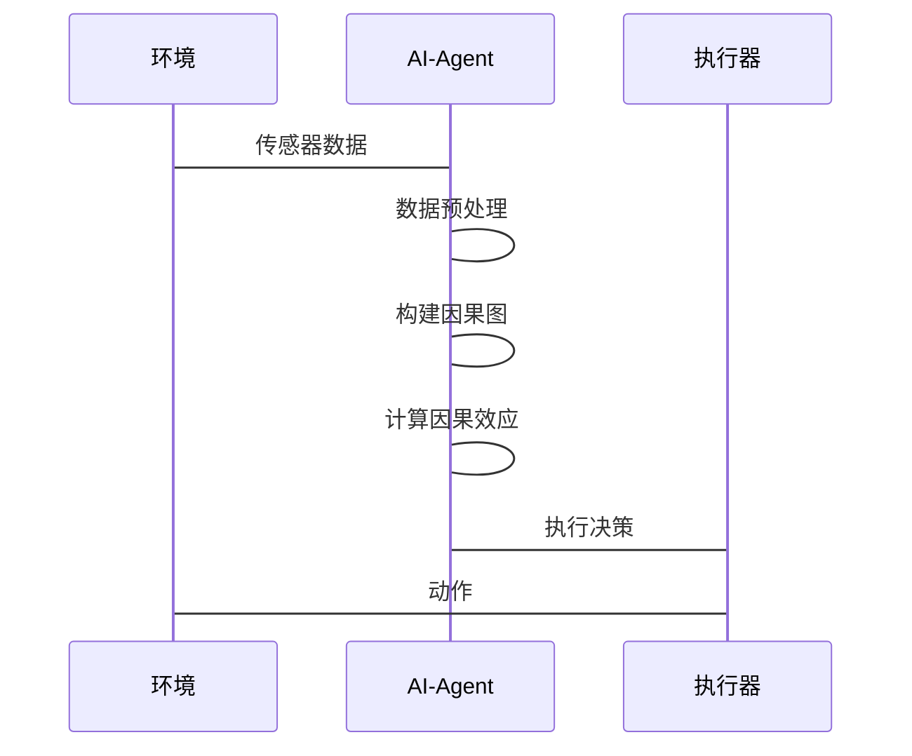

                 


# AI Agent的因果推理：增强决策能力

## 关键词：AI Agent, 因果推理, 决策能力, 强化学习, 机器学习, 人工智能

## 摘要：  
本文深入探讨AI Agent在因果推理中的应用，分析因果推理如何增强AI Agent的决策能力。通过理论与实践结合的方式，从因果关系的数学模型、算法实现、系统设计到实际案例，全面解析AI Agent如何通过因果推理在复杂环境中做出更优决策。

---

# 第一部分: AI Agent与因果推理基础

## 第1章: AI Agent与因果推理概述

### 1.1 AI Agent的基本概念  
- **1.1.1 AI Agent的定义**  
  AI Agent（人工智能代理）是一种能够感知环境、自主决策并执行任务的智能实体。它能够通过传感器获取信息，利用推理能力做出决策，并通过执行器与环境交互。  

- **1.1.2 AI Agent的核心特征**  
  - **自主性**：无需外部干预，自主决策。  
  - **反应性**：能够实时感知环境并做出反应。  
  - **目标导向**：基于目标驱动行为。  
  - **学习能力**：通过经验改进性能。  

- **1.1.3 AI Agent的分类与应用场景**  
  - **简单反射型Agent**：基于当前感知直接反应，适用于简单任务。  
  - **基于模型的反射型Agent**：利用内部模型进行决策，适用于复杂任务。  
  - **目标驱动型Agent**：基于目标进行规划和决策，适用于复杂场景。  
  - **学习驱动型Agent**：通过机器学习不断优化决策策略，适用于动态环境。  

### 1.2 因果推理的基本概念  
- **1.2.1 因果关系的定义**  
  因果关系是指一个事件（原因）导致另一个事件（结果）发生的确定性关系。  

- **1.2.2 因果推理的特征与挑战**  
  - **特征**：因果关系具有方向性、可传递性和可干预性。  
  - **挑战**：复杂环境下的因果关系难以建模，存在不确定性。  

- **1.2.3 因果推理在AI Agent中的作用**  
  因果推理帮助AI Agent理解行动与结果之间的关系，增强其在复杂环境中的决策能力。  

### 1.3 AI Agent因果推理的背景与意义  
- **1.3.1 传统推理的局限性**  
  传统推理（如关联推理）无法区分因果关系，容易导致错误决策。  

- **1.3.2 因果推理的优势**  
  因果推理能够揭示变量之间的因果关系，帮助AI Agent做出更可靠的决策。  

- **1.3.3 因果推理在AI Agent决策中的重要性**  
  在复杂动态环境中，因果推理是提升AI Agent决策能力的关键技术。  

---

# 第二部分: 因果推理的理论基础

## 第2章: 因果关系的数学模型  

### 2.1 因果图的构建与分析  
- **2.1.1 因果图的基本结构**  
  因果图（DAG，Directed Acyclic Graph）由节点（变量）和边（因果关系）组成。  

- **2.1.2 因果图的类型与特点**  
  - **简单因果图**：仅有单一因果关系。  
  - **复杂因果图**：包含多个因果关系和潜在变量。  

- **2.1.3 因果图的构建方法**  
  - **基于领域知识**：通过专家经验构建因果图。  
  - **基于数据学习**：利用统计方法从数据中学习因果关系。  



### 2.2 调度干预与因果效应  
- **2.2.1 调度干预的定义**  
  调度干预是指在因果图中对某些变量进行干预，以观察结果的变化。  

- **2.2.2 因果效应的计算公式**  
  因果效应（ACE）表示干预某变量对结果变量的影响程度。  
  $$ ACE = P(Y|do(X = x)) - P(Y|do(X = x')) $$  

- **2.2.3 调度干预对AI Agent决策的影响**  
  调度干预帮助AI Agent理解因果关系，从而做出更准确的决策。  

### 2.3 因果推理的数学公式  
- **2.3.1 因果关系的公式化表示**  
  $$ Y = f(X, U) $$  
  其中，$X$ 是原因变量，$U$ 是潜在变量。  

- **2.3.2 调度干预的公式化分析**  
  $$ Y = f(X', U) $$  
  其中，$X'$ 是被干预后的变量。  

- **2.3.3 因果效应的计算公式**  
  $$ P(Y|do(X = x)) = \sum_{u} P(Y|X = x, U = u) P(U = u) $$  

---

# 第三部分: AI Agent因果推理的算法实现

## 第3章: 因果推断算法  

### 3.1 因果推断的基本算法  
- **3.1.1 贝叶斯网络与因果推断**  
  贝叶斯网络通过概率推理计算因果效应。  

- **3.1.2 结构因果模型**  
  结构因果模型通过构建因果图进行推理。  

- **3.1.3 随机森林与因果推断**  
  随机森林通过特征重要性分析因果关系。  

### 3.2 基于模型的因果推理算法  



#### 3.2.1 贝叶斯网络算法  

```python
import numpy as np
from sklearn.tree import DecisionTreeClassifier
from causal_inference import CausalModel

# 示例数据
X = np.random.rand(100, 3)
Y = X[:, 0] * X[:, 1] + np.random.randn(100)

# 构建贝叶斯网络模型
model = CausalModel(n_features=3, random_state=42)
model.fit(X, Y)

# 计算因果效应
treatment_effect = model.treatment_effect(X, Y)
print(treatment_effect)
```

---

# 第四部分: 系统设计与实现

## 第4章: 系统架构与交互流程  

### 4.1 系统架构设计  
- **4.1.1 系统功能模块**  
  - 数据采集模块：收集环境数据。  
  - 因果推理模块：构建因果图并计算因果效应。  
  - 决策模块：基于因果效应做出决策。  



### 4.2 系统交互流程  
- **4.2.1 交互流程设计**  
  1. AI Agent感知环境数据。  
  2. 数据预处理并构建因果图。  
  3. 计算因果效应，做出决策。  
  4. 执行器执行决策动作。  



---

# 第五部分: 实战项目与案例分析

## 第5章: 实战项目实现  

### 5.1 项目环境安装  
- **安装Python环境**：使用Anaconda或virtualenv。  
- **安装依赖库**：`numpy`, `scipy`, `causal_inference`。  

### 5.2 项目核心实现  

```python
import numpy as np
from causal_inference import RandomizedCausalEffect

# 示例数据
X = np.random.rand(100, 3)
Y = X[:, 0] * X[:, 1] + np.random.randn(100)

# 初始化因果推断模型
model = RandomizedCausalEffect(X, Y)

# 计算因果效应
effect = model.estimate_causal_effect(X, Y)
print(f"因果效应：{effect}")
```

### 5.3 项目案例分析  
- **案例背景**：模拟一个AI Agent在动态环境中的决策问题。  
- **数据准备**：生成包含因果关系的模拟数据。  
- **因果推理**：构建因果图并计算因果效应。  
- **决策分析**：基于因果效应做出最优决策。  

### 5.4 项目总结与优化  
- **项目总结**：因果推理在AI Agent决策中的有效性。  
- **优化建议**：结合领域知识优化因果图构建。  

---

# 第六部分: 总结与展望

## 第6章: 总结与展望  

### 6.1 本章总结  
本文系统性地探讨了AI Agent的因果推理技术，从理论到实践，深入分析了因果推理如何增强AI Agent的决策能力。  

### 6.2 未来展望  
未来，因果推理在AI Agent中的应用将更加广泛，尤其是在复杂动态环境中。结合强化学习和图神经网络，因果推理将推动AI Agent决策技术的进一步发展。  

---

# 作者：AI天才研究院/AI Genius Institute & 禅与计算机程序设计艺术 /Zen And The Art of Computer Programming

---

感谢您的阅读！如需进一步探讨或合作，请随时联系。

