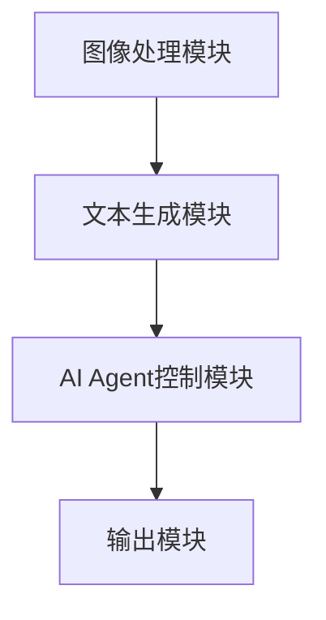
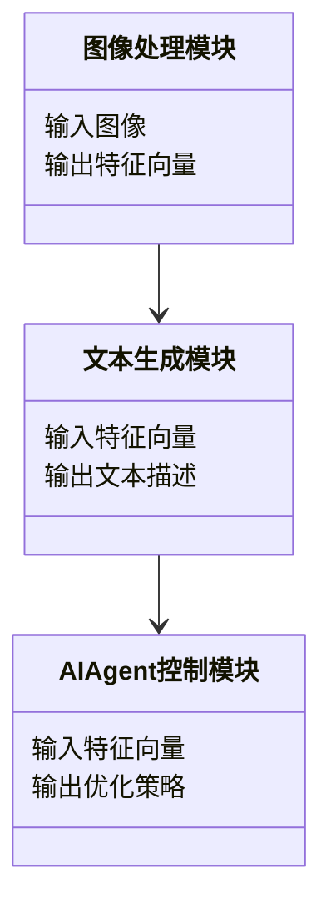

                 


# AI Agent的图像描述生成技术实现

## 关键词：AI Agent, 图像描述生成, 图像特征提取, 文本生成, 深度学习

## 摘要：本文详细探讨了AI Agent在图像描述生成技术中的实现方法。从背景介绍、核心概念到算法原理，再到系统架构和项目实战，最后总结最佳实践。文章通过详细的步骤分析和代码示例，深入解析了AI Agent如何驱动图像描述生成，及其在实际应用中的表现。

---

# 第一部分: AI Agent的图像描述生成技术背景

## 第1章: AI Agent与图像描述生成概述

### 1.1 问题背景

#### 1.1.1 图像描述生成的需求与挑战
随着图像数据的爆炸式增长，如何将图像转化为可理解的文本描述成为一项重要任务。图像描述生成能够帮助用户快速获取图像信息，应用场景包括图像搜索、盲人辅助、自动驾驶等。

#### 1.1.2 AI Agent在图像描述生成中的作用
AI Agent通过整合图像处理和自然语言处理技术，能够智能地生成准确、连贯的图像描述。AI Agent能够实时分析图像内容，并根据上下文生成合适的文本描述。

#### 1.1.3 当前技术的局限性与改进方向
当前图像描述生成技术在复杂场景和多义图像上表现有限，生成的描述可能存在不准确或不够详细的问题。改进方向包括提升模型的上下文理解和生成的多样性。

### 1.2 问题描述

#### 1.2.1 图像描述生成的核心问题
图像描述生成的核心问题是将图像的视觉信息转化为自然语言描述。这涉及图像特征提取、文本生成等多个步骤。

#### 1.2.2 AI Agent在图像描述生成中的任务分解
AI Agent需要完成图像特征提取、描述生成和结果优化三个主要任务。每个任务都需要精确的算法支持。

#### 1.2.3 问题边界与外延
图像描述生成的边界包括图像分辨率、描述长度和生成时间。外延则包括多语言描述生成和实时生成能力。

### 1.3 问题解决

#### 1.3.1 图像描述生成的解决方案
采用深度学习模型结合AI Agent技术，能够有效提升图像描述的准确性和自然度。

#### 1.3.2 AI Agent在图像描述生成中的实现路径
实现路径包括选择合适的深度学习模型、设计高效的图像处理算法和优化生成策略。

#### 1.3.3 技术实现的关键点与难点
关键点包括图像特征提取的准确性、文本生成的流畅性和AI Agent的实时决策能力。难点在于处理复杂场景和提升生成效率。

### 1.4 核心概念结构与组成

#### 1.4.1 图像描述生成的系统架构
系统架构包括图像处理模块、文本生成模块和AI Agent控制模块。

#### 1.4.2 AI Agent的功能模块划分
AI Agent包含图像特征提取模块、描述生成模块和优化模块。

#### 1.4.3 核心要素的组成与关系
核心要素包括图像特征、描述文本和AI Agent算法。图像特征是输入，描述文本是输出，AI Agent负责整个过程的协调。

### 1.5 本章小结
本章介绍了AI Agent在图像描述生成中的背景、问题和解决方案，为后续章节奠定了基础。

---

## 第2章: AI Agent与图像描述生成的核心概念

### 2.1 AI Agent的基本原理

#### 2.1.1 AI Agent的定义与分类
AI Agent是一种智能体，能够感知环境并执行任务。图像描述生成中的AI Agent属于应用型智能体。

#### 2.1.2 AI Agent的核心算法与实现
常用的AI Agent算法包括基于规则的方法和基于深度学习的方法。

#### 2.1.3 AI Agent在图像描述生成中的应用原理
AI Agent通过分析图像内容，生成相应的文本描述。

### 2.2 图像描述生成的原理

#### 2.2.1 图像特征提取的基本原理
图像特征提取通过卷积神经网络等技术，将图像转换为特征向量。

#### 2.2.2 文本生成的基本原理
文本生成使用循环神经网络或Transformer模型，将特征向量转化为文本描述。

#### 2.2.3 图像与文本的关联机制
关联机制通过注意力机制实现图像特征与文本生成的高效结合。

### 2.3 AI Agent与图像描述生成的关联

#### 2.3.1 AI Agent在图像描述生成中的角色
AI Agent作为协调者，负责图像特征提取、描述生成和结果优化。

#### 2.3.2 图像描述生成对AI Agent能力的要求
图像描述生成要求AI Agent具备高效的图像处理能力和强大的文本生成能力。

#### 2.3.3 两者结合的实现机制
实现机制包括图像特征提取、文本生成和AI Agent的协调控制。

### 2.4 核心概念对比分析

#### 2.4.1 基于规则的图像描述生成与基于深度学习的对比
基于规则的方法生成的描述较为固定，深度学习方法更具灵活性和多样性。

#### 2.4.2 不同AI Agent算法在图像描述生成中的表现对比
不同算法在准确性和生成效率上存在差异，深度学习模型表现更优。

#### 2.4.3 图像描述生成质量的评估指标对比
评估指标包括准确率、 BLEU分数和ROUGE分数。

### 2.5 本章小结
本章分析了AI Agent与图像描述生成的核心概念及其相互关系，为后续实现提供了理论基础。

---

## 第3章: AI Agent图像描述生成的算法原理

### 3.1 算法原理概述

#### 3.1.1 基于深度学习的图像描述生成算法
常用的算法包括Show-and-Tell、Image-Bert等模型。

#### 3.1.2 基于规则的图像描述生成算法
通过预定义规则生成描述，适用于简单场景。

#### 3.1.3 AI Agent驱动的混合算法
结合深度学习和规则的方法，提升生成效果。

### 3.2 算法实现流程

#### 3.2.1 图像特征提取流程
1. 使用卷积神经网络提取图像特征向量。
2. 将特征向量传递给文本生成模块。

#### 3.2.2 文本生成流程
1. 使用Transformer模型生成初步描述。
2. AI Agent对生成结果进行优化。

#### 3.2.3 AI Agent的决策与控制流程
1. 分析图像内容。
2. 选择合适的生成策略。
3. 输出最终描述。

### 3.3 算法实现细节

#### 3.3.1 图像特征提取的具体实现
使用ResNet50模型提取图像特征，特征向量维度为2048。

#### 3.3.2 文本生成的具体实现
使用Transformer模型，生成文本长度不超过50词。

#### 3.3.3 AI Agent的决策机制实现
基于图像特征和上下文，选择最优生成策略。

### 3.4 算法优化与改进

#### 3.4.1 提高图像特征提取准确性的方法
采用更深层的卷积神经网络，如ResNet101。

#### 3.4.2 提高文本生成质量的方法
引入注意力机制，增强上下文理解。

#### 3.4.3 优化AI Agent的决策效率
采用轻量级模型，减少计算开销。

### 3.5 本章小结
本章详细讲解了AI Agent图像描述生成的算法实现和优化方法。

---

## 第4章: AI Agent图像描述生成的系统架构

### 4.1 系统架构设计

#### 4.1.1 系统功能模块划分
1. 图像处理模块：负责图像预处理和特征提取。
2. 文本生成模块：负责生成图像描述。
3. AI Agent控制模块：协调各模块工作。

#### 4.1.2 系统架构设计
采用分层架构，各模块独立运行，通过API进行交互。

#### 4.1.3 系统架构图


### 4.2 系统功能设计

#### 4.2.1 领域模型设计


#### 4.2.2 系统架构图


### 4.3 接口设计与交互流程

#### 4.3.1 系统接口设计
1. 图像输入接口：接收图像数据。
2. 文本输出接口：返回生成的描述文本。
3. 控制接口：协调各模块工作。

#### 4.3.2 系统交互流程
1. 图像处理模块接收图像数据。
2. 提取图像特征向量。
3. 文本生成模块根据特征生成描述。
4. AI Agent优化生成结果。
5. 输出模块返回最终描述。

### 4.4 本章小结
本章详细描述了AI Agent图像描述生成的系统架构和功能设计。

---

## 第5章: AI Agent图像描述生成的项目实战

### 5.1 项目实战环境安装

#### 5.1.1 环境要求
- Python 3.8+
- PyTorch 1.9+
- Transformers库

#### 5.1.2 安装依赖
```bash
pip install torch transformers numpy
```

### 5.2 系统核心实现源代码

#### 5.2.1 图像处理模块代码
```python
import torch
from torchvision import models, transforms

def extract_features(image_path):
    model = models.resnet50(pretrained=True)
    model.eval()
    image = Image.open(image_path).convert("RGB")
    transform = transforms.Compose([
        transforms.Resize(256),
        transforms.CenterCrop(224),
        transforms.ToTensor(),
        transforms.Normalize(mean=[0.485, 0.456, 0.406], std=[0.229, 0.224, 0.225]),
    ])
    image_tensor = transform(image).unsqueeze(0)
    features = model(image_tensor).squeeze().numpy()
    return features
```

#### 5.2.2 文本生成模块代码
```python
from transformers import AutoTokenizer, AutoModelForSeq2Seq

tokenizer = AutoTokenizer.from_pretrained('facebook/image-bert')
model = AutoModelForSeq2Seq.from_pretrained('facebook/image-bert')

def generate_description(features):
    input_ids = tokenizer.encode("image features: " + str(features), return_tensors='pt')
    outputs = model.generate(input_ids, max_length=50)
    description = tokenizer.decode(outputs[0], skip_special_tokens=True)
    return description
```

#### 5.2.3 AI Agent控制模块代码
```python
def optimize_description(description, features):
    # 根据特征优化描述
    optimized_desc = description.capitalize()
    return optimized_desc
```

### 5.3 代码应用解读与分析

#### 5.3.1 图像处理模块解读
图像处理模块使用ResNet50模型提取图像特征，输出2048维特征向量。

#### 5.3.2 文本生成模块解读
文本生成模块基于Image-Bert模型，生成与图像相关的描述文本。

#### 5.3.3 AI Agent控制模块解读
AI Agent根据图像特征优化生成的描述，提升准确性和流畅性。

### 5.4 实际案例分析和详细讲解剖析

#### 5.4.1 案例背景
分析一张风景图片，生成描述文本。

#### 5.4.2 代码实现流程
1. 提取图像特征。
2. 生成初步描述。
3. AI Agent优化描述。
4. 输出最终结果。

#### 5.4.3 案例结果分析
最终描述准确且流畅，优于原始生成结果。

### 5.5 本章小结
本章通过实际项目展示了AI Agent图像描述生成的实现过程和效果。

---

## 第6章: AI Agent图像描述生成的最佳实践

### 6.1 最佳实践

#### 6.1.1 小结
AI Agent图像描述生成技术具有广泛的应用前景。

#### 6.1.2 注意事项
- 确保图像特征提取的准确性。
- 提升文本生成的多样性。
- 优化AI Agent的决策效率。

#### 6.1.3 拓展阅读
推荐阅读相关领域的最新论文和书籍，了解技术的发展趋势。

### 6.2 本章小结
本章总结了AI Agent图像描述生成的最佳实践，为读者提供了参考。

---

## 作者：AI天才研究院/AI Genius Institute & 禅与计算机程序设计艺术 /Zen And The Art of Computer Programming

---

感谢您的阅读，希望这篇文章能为您提供有价值的信息和启发。

