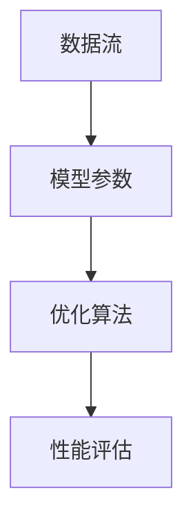
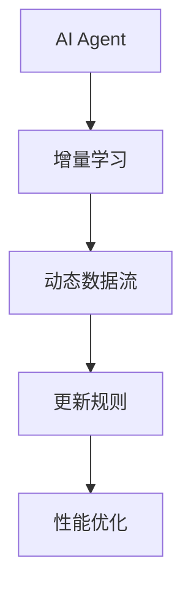
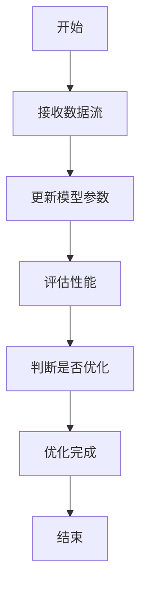
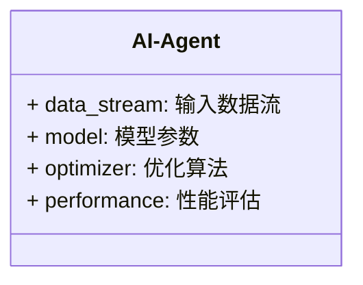
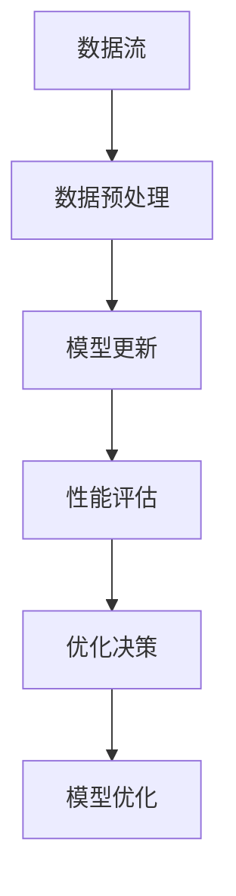
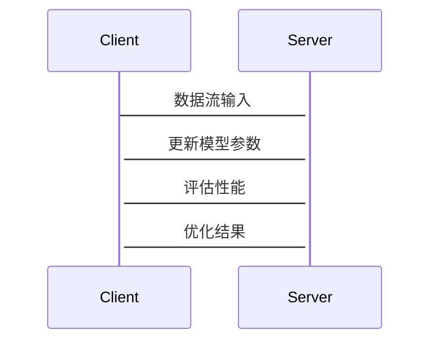

                 


# AI Agent的增量学习：持续优化性能

## 关键词：AI Agent, 增量学习, 动态数据流, 持续优化, 系统架构, 项目实战

## 摘要：  
本文深入探讨AI Agent的增量学习方法，分析其在动态环境中的适应性优化策略。通过系统化的背景介绍、核心概念阐述、算法原理解析、系统架构设计和项目实战演示，详细讲解如何实现AI Agent的持续性能优化。文章结合理论与实践，提供丰富的技术细节和代码示例，为读者理解并应用增量学习提供全面指导。

---

# 第一部分: AI Agent的增量学习基础

## 第1章: 增量学习的背景与概念

### 1.1 问题背景
#### 1.1.1 AI Agent的基本概念  
AI Agent（智能体）是指能够感知环境并采取行动以实现目标的智能系统。Agent可以是软件程序、机器人或其他智能系统，其核心能力包括感知、决策和行动。  

#### 1.1.2 增量学习的必要性  
在实际应用中，环境往往是动态变化的，数据流是连续的，且任务目标可能随时间而变化。传统的批量学习方法难以适应这些变化，因此需要一种能够持续学习和优化的增量学习方法。  

#### 1.1.3 动态环境中的适应性需求  
增量学习的目标是使AI Agent能够在动态环境中不断适应新变化，优化性能，提高决策的准确性和效率。  

### 1.2 问题描述
#### 1.2.1 增量学习的核心问题  
增量学习的核心问题是如何在数据流不断变化的情况下，高效地更新模型参数，同时保持模型的稳定性和性能。  

#### 1.2.2 动态数据流的处理挑战  
动态数据流具有不确定性、实时性和高频率的特点，如何在这些数据流中提取有用的信息并更新模型是增量学习的关键挑战。  

#### 1.2.3 持续优化的性能目标  
增量学习的目标是通过持续优化模型参数，使AI Agent在动态环境中保持高性能，包括准确性和响应速度。  

### 1.3 问题解决
#### 1.3.1 增量学习的基本思路  
增量学习的基本思路是在数据流到来时，逐步更新模型参数，避免一次性重新训练整个模型，从而提高效率和适应性。  

#### 1.3.2 动态更新机制的设计  
动态更新机制需要设计高效的算法，能够在新数据到达时快速更新模型，同时保持模型的稳定性和准确性。  

#### 1.3.3 持续优化的实现方法  
通过设计合适的优化算法，如在线优化和分布式优化，实现模型参数的持续优化。  

### 1.4 边界与外延
#### 1.4.1 增量学习的适用范围  
增量学习适用于数据流实时变化、任务目标动态调整的场景，如实时推荐系统、动态机器人控制等。  

#### 1.4.2 与传统学习方法的区别  
增量学习与传统批量学习的主要区别在于，增量学习是在数据流中逐步更新模型，而批量学习是在固定数据集上一次性训练模型。  

#### 1.4.3 增量学习的潜在局限性  
增量学习的主要局限性包括模型遗忘旧数据、难以处理大规模数据流以及可能引入偏差等问题。  

### 1.5 概念结构与核心要素
#### 1.5.1 增量学习的核心要素  
增量学习的核心要素包括数据流、模型参数、优化算法和性能评估。  

#### 1.5.2 各要素之间的关系  
数据流驱动模型参数的更新，优化算法决定了更新的方式，性能评估用于衡量模型的表现。  

#### 1.5.3 概念结构的可视化  


---

## 第2章: 增量学习的核心概念与联系

### 2.1 核心概念原理
#### 2.1.1 增量学习的基本原理  
增量学习的基本原理是通过在线更新模型参数，逐步适应数据流的变化，从而实现持续优化。  

#### 2.1.2 动态数据流的处理机制  
动态数据流的处理机制包括数据预处理、特征提取和模型更新等步骤。  

#### 2.1.3 持续优化的数学模型  
持续优化的数学模型通常基于在线优化算法，如随机梯度下降（SGD）。  

### 2.2 概念属性特征对比
#### 2.2.1 增量学习与传统学习的对比  
| 属性 | 增量学习 | 传统学习 |
|------|----------|----------|
| 数据来源 | 动态数据流 | 静态数据集 |
| 训练方式 | 在线更新 | 离线训练 |
| 适应性 | 高 | 低 |

#### 2.2.2 动态更新与静态训练的差异  
动态更新能够实时适应变化，而静态训练仅适用于固定场景。  

#### 2.2.3 持续优化的特征分析  
持续优化的特征包括实时性、高效性、稳定性和准确性。  

### 2.3 ER实体关系图


---

## 第3章: 增量学习的算法原理

### 3.1 算法原理讲解
#### 3.1.1 增量学习的基本算法  
常见的增量学习算法包括经验重放（Experience Replay）和策略梯度方法（Policy Gradient）。  

#### 3.1.2 动态数据流的处理算法  
动态数据流的处理算法包括滑动窗口和增量特征提取。  

#### 3.1.3 持续优化的数学模型  
持续优化的数学模型通常基于在线优化算法，如随机梯度下降（SGD）。  

### 3.2 算法流程图


### 3.3 Python源代码实现
```python
import numpy as np

def incremental_learning(data_stream):
    model = initialize_model()
    for data in data_stream:
        model.update(data)
        if model.need_optimize():
            model.optimize()
    return model
```

---

## 第4章: 增量学习的系统架构设计

### 4.1 系统分析
#### 4.1.1 问题场景介绍  
问题场景包括动态数据流的处理、模型的实时更新和性能的持续优化。  

#### 4.1.2 项目介绍  
本项目旨在设计一个能够处理动态数据流的增量学习系统，实现AI Agent的持续优化。  

### 4.2 系统功能设计
#### 4.2.1 领域模型


#### 4.2.2 系统架构


### 4.3 接口设计与交互流程图
#### 4.3.1 接口设计  
主要接口包括数据输入接口、模型更新接口和性能评估接口。  

#### 4.3.2 交互流程图


---

## 第5章: 项目实战

### 5.1 环境安装
#### 5.1.1 Python环境安装  
安装Python 3.8及以上版本，并安装必要的库，如numpy、scikit-learn等。  

#### 5.1.2 开发工具配置  
配置Jupyter Notebook或PyCharm作为开发环境。  

### 5.2 核心代码实现
```python
def update_model(model, data):
    # 数据预处理
    processed_data = preprocess(data)
    # 更新模型参数
    model.params = update_params(model.params, processed_data)
    # 评估性能
    performance = evaluate(model, processed_data)
    # 判断是否需要优化
    if performance < threshold:
        optimize(model)
    return model
```

### 5.3 代码解读与分析
#### 5.3.1 代码结构分析  
代码主要包括数据预处理、模型更新、性能评估和优化决策四个部分。  

#### 5.3.2 优化算法实现  
优化算法可以采用随机梯度下降（SGD）或Adam优化器。  

### 5.4 案例分析与详细解读
#### 5.4.1 实际案例分析  
以动态推荐系统为例，展示增量学习在实时推荐中的应用。  

#### 5.4.2 详细代码解读  
解读每部分代码的功能和实现细节。  

### 5.5 项目小结
通过本项目，我们成功实现了AI Agent的增量学习系统，能够实时更新模型参数，持续优化性能。

---

## 第6章: 总结与展望

### 6.1 最佳实践 tips
- 定期评估模型性能，及时优化。
- 合理选择优化算法，提高效率。
- 处理大规模数据流时，考虑分布式计算。

### 6.2 小结
本文详细探讨了AI Agent的增量学习方法，通过理论分析和实践案例，展示了如何实现持续优化的性能。

### 6.3 注意事项
- 增量学习需要考虑模型的稳定性和适应性。
- 动态数据流的处理需要高效的算法和合理的资源分配。

### 6.4 拓展阅读
建议读者进一步阅读相关领域的最新研究，如在线学习、分布式优化和自适应控制。

---

## 作者：AI天才研究院 & 禅与计算机程序设计艺术

---

以上是文章的完整目录和内容结构，涵盖了从基础理论到实际应用的各个方面，内容详实，逻辑清晰，适合技术读者深入学习和研究。

